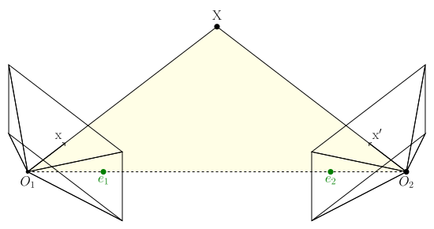
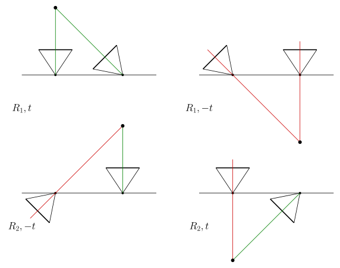

+++
date = 2025-01-08T16:06:03+09:00
lastmod = 2025-01-13T02:36:59+09:00
draft = false

title = "5-point algorithm(1) - Essential matrix brief recap"
summary = ""

isCJKLanguage = true

tags = ["5point algorithm", "chierality", "essential matrix", "mathematics", "multiple view geometry",]
categories = ["academic"]

+++

## Introduction

Essential matrix 는 비록 그 태생적인 약점(rotation only, small base-line, planar degeneracy)에도 불구하고 3차원의 구성과 위치 복원을 단순 point대응쌍을 이용해서 하는 마법같은 방법이다. 특히 SLAM Scenario에서는 calibrated camera가 제공되기에 Fundamental matrix보다 더 유용하다.

특히 Essential matrix의 최소해는 5쌍의 point대응인데, 6자유도에서 scale term이 빠지기 때문에 5dof이기 떄문이다. 이를 우리는 5-point algorithm이라 부른다. 어쩌다 인터넷에서 8-point가 느리지만 더 정확한 결과를 생성하는 장점이 있다는 글을 봤다. **아니다.** 경험적으로는 전혀 그렇지 않았다. 첫째, RANSAC을 돌려야 하는 이상, 8과 5는 큰 차이가 있다. 둘째, 5-point algorithm이 완벽하게 수학적으로 모델을 정의하는 이상, 8-point는 이미 내재적으로 오차가 있다. Redundant constraint이기 때문이다. 숫자를 많이 쓰는 것과 숫자를 잘 쓰는 것은 다르다. Redundant constraint라고 더 정확한가? 이미 여러 라이브러리들에선 5-point가 defacto standard다. 셋째, 살짝 의미없는 논의지만, 어차피 많은 포인트를 쓰는 관점이라면, 결과적으로 SVD 후 nullspace를 찾는 과정인데, 5-point algorithm에서도 똑같다. Point 8개는 마찬가지로 같이 쓸 수 있다. 그냥 안 써도 되니까 안 쓴다. 마지막으로, 앞서 말한 이유를 전부 제치고, **그냥 5-point algorithm이 확실하게 더 낫다.** 애초에 이에 대한 성능 비교 figure가 여러 논문에 있다. *Hongdong Li et.al* 의 5-point algorithm논문에도 있다.

이 5point algorithm은 - Hongdong li는 아주아주 쉽다고 claim하는 것과 다르게 - 상당히 어려워서 많이 쓰이는 빈도에 비해서 도저히 이해가 힘들었다. 그야 polynomial까지의 유도는 그렇게 어렵지 않은데, 그 식의 전개가 사람 손으로 하라고 있는게 아니다. 또 그 다음에 그 다항식의 해를 구하는 과정에서 정말 생소한 수학적 개념이 많이 나온다. 예전에 직접 구현하려 했으나, 기저에 깔린 생소한 개념에 박살난 채 도망갈 수 밖에 없었다. (대충 거의 구현이 된거 같았는데, 되는 척 하다가도 죽어라 안되었다.)

따라서 한 번 그 아래 깔려있는 개념을 다소 같이 간략하게 설명해가면서 5point algorithm에 대해 살펴보고자 한다. 다만 essential matrix를 개념적으로 알고 있는 사람들을 독자로 가정한다.

## Brief recap of essential matrix

간략히 Essential matrix에 대해 요약해보자.

### 기하적 유도

Epipolar constraint를 만족한다는 것은, 다음 그림에서 세 벡터가 같은 평면에 위치한다는 것이다.
1. $\mathrm{x'}$
2. $t$
3. $R\mathrm{x}$

가장 단순하게 기하적 성질을 이용하면 다음과 같이 표현 가능하다.

$$
\langle \mathrm{x'} , t \times R \mathrm{x} \rangle
\newline
= \mathrm{x'}^\mathsf{T} \lfloor t \rfloor _{\times} R \ \mathrm{x}
\newline
$$

여기서 모든 $\mathrm{x, x'}$에 대해 

$$
E = \lfloor t \rfloor _{\times} R
$$

단순하다.

### Essential matrix의 characteristic polynomial

Essential Matrix의 5-point algorithm을 유도하기 위해선, Essential Matrix의 대수적 성질을 어느정도 이해할 필요가 있다. 엄밀하게 증명 위주로 가지 않고, 적당히 직관적으로 가보자. Essential Matrix 는 $\lfloor t \rfloor _{\times} R ^\mathsf{T}$ 로 주어진다. Orthogonal Matrix는 신경쓰지 말자. 대다수특징은 skew-symmetric matrix에서 기인한다. skew-symmetric matrix라는 것은 무엇인가? 적어도 3차원에 적용한다고 생각을 해보면, 공간상의 벡터에 대해 전부 cross 곱을 한다는 점이다. cross곱을 하면 해당 축 방향의 성분은 완전히 제거당할 것이다. 즉, rank가 degenerate할 것이다. 그리고 또 공간이 압축된 평면에서 벡터들은 회전하게 될 것이다. 또 skew-symmetric matrix의 trace야 0이니까, determinant도 0이 되어야한다. 결과적으로 eigenvalue는 rank degeneracy, 총 합이 0이며, 회전한다는 성질로 인해 $ai, -ai, 0$ 이 될 것이다. ($a$ 는 임의의 scalar, 정확히는 skew-symmetric matrix를 구성한 벡터의 크기) svd를 했을 때, $\mathrm{diag(a,a,0)}$를 가진다는 것이다.

일단 이런 단순 성질들로 적당히 유도했지만, 수식을 조금 더 곁들여보자. 자, skew-symmetric matrix에 대해

$$
\lfloor t \rfloor _{\times} = kUZU ^\mathsf{T}, \ where \  Z \ =
\begin{bmatrix} 0&1&0 \newline -1&0&0 \newline 0&0&0 \end{bmatrix} \ and\ k\ is\ constant.
$$

여기서 $Z$는 block-diagonal matrix이고, $U$는 orthogonal이다. skew-symmetric matrix는 이와 같이 분해 가능하다.(분해에 관련된 자세한 내용은 생략한다.) 이제 $Z$에 orthogonal matrix하나를 곱해서, 단순하게 $\mathrm{diag}(1,1,0)$ 으로 표현 가능하다. 여기서 곱해주는 orthogonal matrix를 $W$라고 표현하자. 여기서 orthogonal matrix인 이유는 뒤에 곱해도 여전히 orthogonal이기 위해서이다. (참고로 mvg책에 $W$ 행렬은 여기서 쓴 $W$의 전치 행렬인데, 여기서는 그냥 깔끔하게 $Z=\mathrm{diag}(1,1,0)W$ 로 만들고 싶어서 $W$를 $W^\mathsf{T}$로 대체해서 바꿔서 유도했다.)

$$
W=\begin{bmatrix} 0&1&0 \newline -1&0&0 \newline 0&0&1 \end{bmatrix} , so\ that
\ Z=\mathrm{diag}(1,1,0)W
$$

$$
\lfloor t \rfloor _{\times} = k UZU^\mathsf{T} = k  U \mathrm{diag}(1,1,0) W U^\mathsf{T}
$$

여기서 만일 $W$를 $W^\mathsf{T}$ 로 대체한다 하면, 앞쪽 상수 부분의 부호가 뒤집힌다. 즉, translation 방향이 반대가 된다.

$$
\lfloor t \rfloor _{\times} R =k  U \mathrm{diag}(1,1,0) ( W U^\mathsf{T} R ) = k U \Sigma V ^ \mathsf{T}
$$

수식적으로도 어쨌던 rank가 2며, 같은 singular value를 가진다는 결과가 나온다. Rank가 2인 행렬은 전부 fundamental matrix일 수 있다. Rank가 2이며, 두 singular value가 같으면 essential matrix이다. 여기서 Essential matrix는 깔끔하게 SVD의 결과물로 정의가 되는 것을 볼 수 있다. 

사실 skew-symmetric matrix를 생각하지 않더라도 essential matrix의 rank는 degenerate해야하는데, $\mathrm{x}' E \mathrm{x} = 0$ 식을 모든 $\mathrm{x}'$ 에 대해 만족하는 $\mathrm{x}$(즉, epipole)가 존재해야한다는 것은 E의 영공간이 있다는거고, rank가 하나 새서 영공간으로 갔어야하기 때문이다.

하여튼, 이제 SVD결과물을 가지고 조금 식을 develop해보자.

$$
E = U \ \mathrm{diag} (a,a,0) \ V ^ \mathsf{T} \newline
\mathrm{trace}(E E ^ \mathsf{T}) = \mathrm{trace}(U \ \mathrm{diag} (a^2,a^2,0)\  U^ \mathsf{T} ) = 2a^2
$$

또,

$$
EE^ \mathsf{T} E = U \ \mathrm{diag} (a^3,a^3,0)\  V^ \mathsf{T} 
$$

여기서

$$
EE^ \mathsf{T} E - {1\over 2} \mathrm{trace}(E E ^ \mathsf{T}) E = 0
$$

가 성립한다. 또한 이것이 **essential matrix의 필요충분 조건이다.** 우선 여기까지 유도하고, 실제로 푸는건 다음 포스팅에 이어서 작성하겠다.

## Recovering R/T

### Finding candidates

이제 어떻게든 풀었다 가정하고, 구해진 Essential matrix로부터 Rotation과 translation을 복원해보자. 아까 

$$
\lfloor t \rfloor _{\times} R =k  U \mathrm{diag}(1,1,0) ( W U^\mathsf{T} R ) = k U \Sigma V ^ \mathsf{T}
$$

라고 정의 했는데, 당장 이 정의가 SVD의 결과물이 된다.

$$
\mathrm{SVD}(E) = k  U \mathrm{diag}(1,1,0) ( W U^\mathsf{T} R ) = U \mathrm{diag}(k,k,0)V ^ \mathsf{T}
$$

##### Finding R

$$
( W U^\mathsf{T} R ) = V ^ \mathsf{T} \newline
R = U W^\mathsf{T} V^\mathsf{T}
$$

상당히 자명한데, 여기서 아까 $W$를 $W^\mathsf{T}$ 로 대체해도 부호가 바뀔 뿐이라고 했다. 따라서 R에는 다음 두가지 선택지가 있다.

$$
\begin{align*}
R_1 &= U W^\mathsf{T} V^\mathsf{T} \newline
R_2 &= U W V^\mathsf{T}
\end{align*}
$$

##### Finding t

$t$는 조금 편한데, 직관적으로 봐서 애초에 singular value에 0이 생긴 이유가 translation방향으로 degenerate했기 때문이다. SVD의 결과물인 $U$에서 left singular vector중 singular value 0에 해당되는, diagonal matrix가 정렬되었다는 가정하에 세 번째 column이 바로 0에 해당하는 left singular vector가 된다. 또, degenerate할 때 축의 방향은 어느쪽이던 상관없다. 즉,

$$
U=
\begin{bmatrix}
|&|&| \newline \mathrm{u_1}&\mathrm{u_2}&\mathrm{u_3} \newline |&|&|
\end{bmatrix}
$$

일 때,

$$
t=\pm \mathrm{u}_3
$$

### Cheirality

이제 투영기하학의 cheirality와 싸워야한다. 언제나 직선에 대해 정의한 투영기하학은 내 앞인지 뒤인지 신경을 안쓰기 때문에, 앞서 $R$ $t$의 가능성이 각각 두개씩나왔다. 결과적으로 총 4개의 후보가 만들어진다. 비록 카메라의 뒤편이라고 하더라도, 모든 영상기하학의 가정은 직선을 기준으로 만들어졌기에 valid하다.

위 그림은 R t의 가능한 조합 네가지를 그린 것이다. 위 이미지에선 양수 depth를 초록색으로, 음수 depth를 빨간색으로 표현했다. 이 모호성을 딱히 기하적으로 풀 방법은 없고, point의 R T를 이용해서 삼각 측량 했을 때 양쪽 이미지에서 전부 depth가 양수가 되도록 하면 된다. 예를 들어 colmap같은 경우는 주어진 point를 전부 depth calculation해서, 양 쪽 이미지에서 depth가 모두 양수이며 `max_depth` 이하인 point가 있는지 없는지를 검사해서, 있으면 valid configuration이라고 본다.