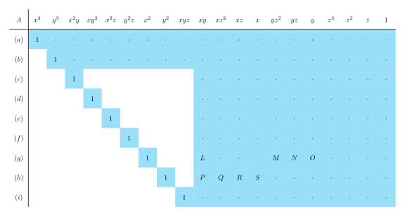
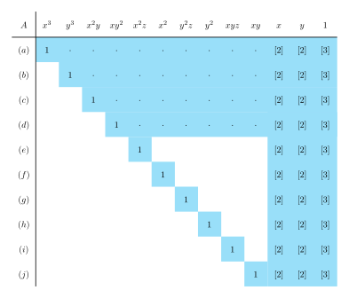

+++
date = 2025-01-12T17:21:23+09:00
lastmod = ""
draft = true

title = "5-point algorithm(2) - Nistér's algorithm과 그뢰브너 기저"
summary = ""

isCJKLanguage = true

tags = ["5point algorithm", "essential matrix", "Gröbner basis", "mathematics", "multiple view geometry", "Sturm's theorem",]
categories = ["academic"]

references = [
    {title = "USING STURM SEQUENCES TO BRACKET REAL ROOTS OF POLYNOMIAL EQUATIONS", authors = "D. G. Hook, P. R. McAree", doi = "10.1016/B978-0-08-050753-8.50089-9"},
]

+++

## Formulation of 5-point algorithm

### Making coefficient matrix

우선 Nistér의 방법 뿐만이 아니라, 5-point algorithm을 풀려면 기본적으로 필요한 부분까지 유도해보자. 이 뒤에 $x,y,z$ 등을 쓸일이 있어서, 대응되는 point를 $q$로 표현하겠다.

$$
q'^\mathsf{T} E q = 0
$$

$$
q'=\begin{bmatrix} q_1' \newline q_2' \newline q_3' \end{bmatrix} ,
q=\begin{bmatrix} q_1 \newline q_2 \newline q_3 \end{bmatrix}, 
E=\begin{bmatrix}
e_{11} & e_{12} & e_{13} \newline
e_{21} & e_{22} & e_{23} \newline
e_{31} & e_{32} & e_{33}
\end{bmatrix}
$$

일반적으로 CV쪽에서 말하는 DLT알고리즘을 위해 벡터화 가능하다.

$$
\begin{align*}
\tilde q &= \begin{bmatrix}
q_1q_1' & q_2q_1' & q_3q_1' & 
q_1q_2' & q_2q_2' & q_3q_2' & 
q_1q_3' & q_2q_3' & q_3q_3'
\end{bmatrix}^\mathsf{T}
\newline
\tilde E &= \begin{bmatrix}
e_{11} & e_{12} & e_{13} & 
e_{21} & e_{22} & e_{23} & 
e_{31} & e_{32} & e_{33}
\end{bmatrix}^\mathsf{T}
\end{align*}
$$

5개의 point쌍은 각각 하나의 $\tilde q$ 가 되며, 벡터를 stacking하면 다음 결과를 얻게 된다.

$$
M=\begin{bmatrix}
― & q_1 & ― \newline
― & q_2 & ― \newline
― & q_3 & ― \newline
― & q_4 & ― \newline
― & q_5 & ―
\end{bmatrix}_{5\times 9}
$$

$$
M_{5\times 9} \tilde E_{9\times 1} = 0_{5 \times 1}
$$

여기서 계수 행렬 $M$은 당연히 rank가 5이며, 남는 right singular vector 4개의 span이 right nullspace가 된다. 이 벡터를 각 $\tilde X, \tilde Y, \tilde Z, \tilde W$라고 부르자. 그러면 다음 관계가 완성된다.

$$
\tilde E = x \tilde X + y \tilde Y + z \tilde Z + w \tilde W
$$

다만 scale factor로 인해서 $w=1$ 로 두어도 무방하다. 

### Handling polynomials

이 영공간에서 앞서 살펴본 Essential matrix 의 필요 충분조건,

$$
EE^ \mathsf{T} E - {1\over 2} \mathrm{trace}(E E ^ \mathsf{T}) E = 0
$$

를 만족하는 Essential Matrix를 찾아가는 것이 우리의 일이다. 위의 벡터화된 form을 다시 $E$로 되돌리자.

$$
E = x X + y Y + z Z + W
$$

이렇게 표현하면 point쌍의 계수 행렬 분해로 얻어진 $X,Y,Z,W$의 span 중, essential matrix의 필요 충분 조건 구속을 이용하여 $x, y, z$ 의 해를 찾는것, 이것이 5-point 문제라고 볼 수 있다.

위의 식들로 E=0을 전개하자면 아래와 같아진다.

$$
(xX+yY+zZ+W)
\cdot
(xX^ \mathsf{T}+yY^ \mathsf{T}+zZ^ \mathsf{T}+W^ \mathsf{T})
\cdot
(xX+yY+zZ+W)
\newline
-{1\over 2} \mathrm{trace} (
(xX+yY+zZ+W)
\cdot
(xX^ \mathsf{T}+yY^ \mathsf{T}+zZ^ \mathsf{T}+W^ \mathsf{T})
)
\cdot
\newline
(xX+yY+zZ+W) = 0
$$

이 식은 사람이 직접 전개하긴 어려운데, 아래와 같은 모습이 되기 때문이다.

$$
z_{11} y_{22} w_{33} - z_{11} w_{23} y_{32} + z_{11} w_{22} y_{33} -
z_{11} y_{23} w_{32} + w_{11} y_{22} z_{33} + w_{11} z_{22} y_{33} - \newline
w_{11} y_{23} z_{32} - w_{11} z_{23} y_{32} - y_{11} w_{23} z_{32} +
y_{11} z_{22} w_{33} - y_{11} z_{23} w_{32} + y_{11} w_{22} z_{33} + \newline
y_{31} z_{12} w_{23} + y_{31} w_{12} z_{23} - y_{31} z_{22} w_{13} -
y_{31} w_{22} z_{13} + z_{31} y_{12} w_{23} + z_{31} w_{12} y_{23} - \newline
z_{31} y_{22} w_{13} - z_{31} w_{22} y_{13} + w_{31} y_{12} z_{23} +
w_{31} z_{12} y_{23} - w_{31} y_{22} z_{13} - w_{31} z_{22} y_{13} + \newline
z_{21} y_{32} w_{13} - z_{21} y_{12} w_{33} - z_{21} w_{12} y_{33} +
w_{21} y_{32} z_{13} + w_{21} z_{32} y_{13} - w_{21} y_{12} z_{33} - \newline
w_{21} z_{12} y_{33} - y_{21} w_{12} z_{33} - y_{21} z_{12} w_{33} +
y_{21} w_{32} z_{13} + y_{21} z_{32} w_{13} + z_{21} w_{32} y_{13}
$$

블로그 글이 식 전개만으로 2000줄이 되기를 원하지 않으며, 애초에 사람이 직접 전개하기도 상당히 무리가 있기에 생략한다. 이 3개항의 3차식의 결과적인 모노미얼 기저를 Graded Lexical order로 나열해보자. (paper에서는 다른 ordering을 사용한다.)

$$
x^3, x^2y, x^2z, xy^2, xyz, xz^2,
y^3,y^2z,yz^2,z^3,
x^2,xy,xz,
y^2,yz,z^2,
x,y,z,1
$$

따라서 위 20개의 항으로 이루어진 9개의 수식이 나오며, $ 9 \times 20 $ 행렬을 만들 수 있다. 아까 대략적으로라도 전개한 위의 수식은 그런 행렬 성분중 하나였다. $ 9 \times 20 $ 행렬은 나중에 바뀌기도 하는데, 우선 여기서는 맨 처음의 Nistér's algorithm부터 살펴보자.

## Nistér's algorithm

Nistér's algorithm은 세 가지 변종이 있다. $9\times20$ 행렬을 사용하는 2003년 버전, $10\times20$ 행렬을 사용하는 2004년 버전, 그리고 상당히 손으로 푼 앞 두가지 방법과 달리, 추후 Gröbner basis를 사용하여 general하게 된 마지막 버전이 있다. 사실 2003년 버전에 비해 2004년 버전이 훨씬 논문이 더 풍성하다. 다만 일반적으로 구글링 했을때 나오는 버전이 03년 버전이며, 완전히 동일한 제목을 가지고 있다. 03년 버전은 *D.Nister, An efficient solution to the five-point relative pose problem, IEEE-CVPR-2003* 이며, 04년 버전은 *D.Nister, An efficient solution to the five-point relative pose problem, IEEE-T-PAMI* 이다. 

### 2003 Version

우선 2003년 버전에선, 다음과 같은 monomial ordering으로 matrix를 생성한다.

$$
x^3, y^3, x^2y, xy^2, x^2z, x^2, y^2z, y^2, xyz, xy, xz^2, xz, x, yz^2, yz, y, z^3, z^2, z, 1.
$$

이 계수 행렬을 $A$라고 하자. 여기서 Gauss-Jordan elimination을 통해, 다음 sparsity pattern이 된다. 여기서 두 행은 마저 eliminate하지 않아도 된다. 

이제 z 를 따로 묶은 이유가 드러나는데, z를 기준으로 나머지 항을 elimination하기 위함이다.

$$
\begin{align*}
(j) &\equiv (e)-z(g) \newline
(k) &\equiv (f)-z(h) \newline
(l) &\equiv (d)-x(h)+P(c)+zQ(e)+R(e)+S(g) \newline
(m) &\equiv (c)-y(g)+L(d)+zM(f)+N(f)+O(h)
\end{align*}
$$

자세히는 큰 의미가 없기 때문에 유도하지 않겠지만, 이렇게 하면 $(i), (j), (k), (l), (m)$ 다섯개의 항이 전부 $xyz$ 를 최고차항으로 묶이게 된다. 정확히는

$$
[n]=n\mathrm{th \ order \ polynomial \ of} \ z
$$

일 때,

$$
\begin{align*}
(i) &= xy[1] + x[2] + y[2] + [3] \newline
(j) &= xy[1] + x[3] + y[3] + [4] \newline
(k) &= xy[1] + x[3] + y[3] + [4] \newline
(l) &= xy[2] + x[3] + y[3] + [4] \newline
(m) &= xy[2] + x[3] + y[3] + [4]
\end{align*}
$$

으로 정의 가능하다. 이에 대해선 손으로 해보면 금방 보일 수 있다. 결과적으로 $(i)$ 는 차수가 가장 낮고, 조금 더 고차항으로 만들어진 $(l)$과 $(m)$은 조금 더 높은 차수의 항을 갖는다. 여기서 $(i) (j) (k) (l)$ 로 행렬 $B$를 만들고, $(i) (j) (k) (m)$ 으로 행렬 $C$를 만들자. (아래 수식에서 엄밀히는 $(i) (j) (k) (l)$이 아닌데, 적당히 계수를 분리한 term을 그냥 그대로 퉁쳤다.)

$$
B\cdot \begin{bmatrix}
xy \newline x \newline y \newline 1
\end{bmatrix}
=\begin{bmatrix}
―& (i) & ―  \newline
―& (j) & ―  \newline
―& (k) & ―  \newline
―& (l) & ―
\end{bmatrix}
\begin{bmatrix}
xy \newline x \newline y \newline 1
\end{bmatrix}
= 0_{4 \times 1}
$$

$$
C\cdot \begin{bmatrix}
xy \newline x \newline y \newline 1
\end{bmatrix}
=\begin{bmatrix}
―& (i) & ―  \newline
―& (j) & ―  \newline
―& (k) & ―  \newline
―& (m) & ―
\end{bmatrix}
\begin{bmatrix}
xy \newline x \newline y \newline 1
\end{bmatrix}
= 0_{4 \times 1}
$$

두 행렬 우측 영벡터가 존재한다. 결국 두 행렬 모두 degenerate case라서 determinant가 0이되며, 이 구속 조건에서 행렬 $B$와 $C$가 각각 $z$ term만으로 11차 다항식을 만들게 된다. 이 11차 다항식 두개를 각각 $(n)$,$(o)$ 라고 하자. 그리고 이 두 11차 다항식을 서로 빼면 10차 다항식 하나가 나온다. 이 다항식은 총 10개의 해를 가지며, 이 중 실근을 뽑으면 위의 $B$ 행렬을 재구성 할 수 있으며, 여기서 $x$와 $y$를 구할 수 있다. 이후 $x,y,z$를 구했으므로 $E$를 구할 수 있다. 즉, $E$는 10개까지의 가능한 해가 존재한다. 이 10차 다항식을 푸는 선택지에 대해선 조금 있다 다시 살펴보고, 이제 Nister의 2004년 버전 알고리즘을 보러 가자.

### 2004 Version

04년 버전은 $10\times 10$ 행렬을 사용한다. 정확히 왜 이렇게 된건지는 찾기가 좀 힘든데, $EE^ \mathsf{T} E - {1\over 2} \mathrm{trace}(E E ^ \mathsf{T}) E = 0$ 라는 constraint가 determinant가 0이라는 조건을 함의하기 때문에 명시적으로 determinant가 0인 조건을 추가할 필요가 없기 때문이다. 아마 수식 전개 상에서 이득이 있었어서 그러지 않나 싶기도 하다.

하여튼, 앞서 살펴본 다항식 조건에 다음 조건을 추가한다.

$$
\mathrm{det}(E)=0
$$

그리고 이번에도 elimination을 끝까지 할 필요는 없고, 4줄을 남기고 다음 sparsity pattern을 가져간다. 앞서 $[n]$ 이 $z$만으로 이루어진 n차 polynomial이란 점을 충분히 설명했으므로, 이번엔 원문에 있는대로 간략히 가져가본다.

우선 monomial ordering이 살짝 달라졌고, 수수식전개가 상당히 깔끔해졌다.

$$
\begin{align*}
(k) &\equiv (e)-z(f) \newline
(l) &\equiv (g)-z(h) \newline
(m) &\equiv (i)-z(j)
\end{align*}
$$

전개를 직접 해보면 상당히 깔끔하다. 우선 $(e)-(f), (g)-(h), (i)-(j)$ 의 구조로 알아보기도 쉽고, 곱하는 항이 $z$항 밖에 없기 때문에 z coefficient polynomial도 [3] [3] [4] 로 깔끔하다. 03년 수식은 손으로 해야만 했는데, 이번에는 머리로만 해도 된다. 여튼, 이번에는 B 행렬 하나만 만든다.

$$
B\cdot \begin{bmatrix}
x \newline y \newline 1
\end{bmatrix}
=\begin{bmatrix}
―& (k) & ―  \newline
―& (l) & ―  \newline
―& (m) & ―
\end{bmatrix}
\begin{bmatrix}
x \newline y \newline 1
\end{bmatrix}
= 0_{3 \times 1}
$$

마찬가지로 determinant가 0이라는 구속조건으로 식을 만들면 이번에는 polynomaial이 [3][3][4]이므로 행렬 하나만으로 10차 polynomial을 만들 수 있다.

## Solving 10th order polynomial of z

### Sturm's theorem

Sturm's theorem(슈툼 정리라고 부르겠다. 스트룸, 스툼, 등등. )은 일변수 다항식의 실근 개수를 정해진 영역에서 셀 수 있는 방법이다. 우선 **Sturm sequence**에 대해 정의하겠다. 일변수 다항식 $p(x)$ 에 대해,

$$
p_0(x)=p(x) \newline
p_1(x)=p'(x)
$$

그리고 이후

$$
p_{n+1}(x)=-\mathrm{mod}(p_{n-1}(x),p_n(x)) \newline
\text{i.e. }  p_{n-1}(x)=(ax+b)p_n(x)-p_{n+1}(x)
$$

이렇게 재귀적으로 항들을 생성 가능하며, 마지막 0항이 나왔을 때 생성을 종료한다.

이제 Sturm sequence에 대해,

