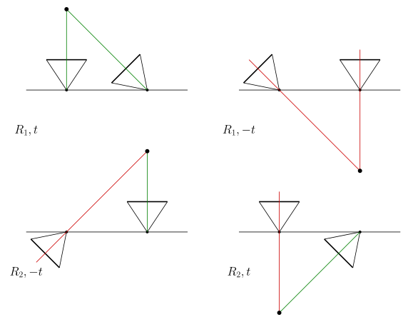

+++
date = 2025-01-08T16:06:03+09:00
lastmod = 2025-01-13T02:36:59+09:00
draft = true

title = "5-point algorithm"
summary = ""

isCJKLanguage = false

tags = ["5point algorithm", "chierality", "essential matrix", "mathematics", "multiple view geometry",]
categories = ["academic"]

+++

## Introduction

The Essential matrix, despite its inherent weaknesses (e.g., rotation-only motion, small baseline, planar degeneracy), is a kind of “magical” method for reconstructing 3D structure and camera pose using nothing more than simple point correspondences, for known cameras. In particular, in a SLAM scenario, a calibrated camera is usually given, which makes the Essential matrix even more useful compared to the Fundamental matrix.

An especially important fact is that the minimal solution for the Essential matrix can be obtained with 5 pairs of corresponding points. Out of the 6 degrees of freedom, the scale term is not included, so effectively we have 5 degrees of freedom. We call this the 5-point algorithm. At some point, I came across an internet reply claiming that the 8-point algorithm is slower but somehow yields more accurate results. **That’s simply not true.** Based on my experience, it’s not true at all. Here’s why. First, once you’re running RANSAC, the difference between using 8 points and 5 points can be quite significant. Second, since the 5-point algorithm mathematically defines the model perfectly, the 8-point algorithm inherently carries approximation errors. This is because it uses redundant constraints. Throwing more numbers at the problem isn’t necessarily better than using the right numbers. Is having redundant constraints truly more accurate? Not really. In fact, many libraries now treat the 5-point solution as the de facto standard. Third. It might be a somewhat trivial point, but if you’re using a large number of feature points anyway, both methods ultimately boil down to finding the nullspace via SVD. You can still use 8 points in the 5-point framework; it’s just not necessary, so we don’t do it. Finally, putting aside all the reasons above, **the 5-point algorithm is simply better.** Plenty of papers include performance comparisons to back this up, including the 5-point algorithm paper by *Hongdong Li et al.*

Now, regarding this 5-point algorithm—in contrast to Hongdong Li’s claim that it’s “very, very easy”—I personally found it to be quite difficult. Considering how widely it’s used, it’s surprisingly hard to grasp. Deriving the polynomial itself isn’t too bad, but the full expansion of that polynomial is not something you can just do by hand. And then, solving that polynomial involves some genuinely unfamiliar mathematical concepts. I tried implementing it once but ended up running away when those unfamiliar concepts began to wreck me. (I thought I’d almost gotten it to work, but it kept failing at the last minute.)

So, in this post, I want to take a quick look at the conceptual backgrounds of the 5-point algorithm, explaining some of the ideas that lie beneath. I’ll assume the reader already has a conceptual understanding of the Essential matrix.

## Brief recap of the Essential matrix

Let’s briefly summarize what the Essential matrix is. 

### Geometric derivation

Satisfying the epipolar constraint means that in the diagram below, the three vectors lie on the same plane.

1. $\mathrm{x'}$
2. $t$
3. $R\mathrm{x}$

Using the most basic geometric property, we can represent this relationship as follows:

$$
\langle \mathrm{x'} , t \times R \mathrm{x} \rangle
\newline
= \mathrm{x'}^\mathsf{T} \lfloor t \rfloor _{\times} R \ \mathrm{x}
\newline
$$

For all $\mathrm{x}$ and $\mathrm{x'}$ :

$$
E = \lfloor t \rfloor _{\times} R
$$

Fairly simple.

### Characteristic polynomial of the Essential matrix

To derive the 5-point algorithm for the Essential matrix, you first need to understand some of the algebraic properties of the Essential matrix. Let’s not focus on rigorous proofs; instead, we’ll proceed with a relatively intuitive approach. Recall that the Essential matrix is given as $\lfloor t \rfloor _{\times} R ^\mathsf{T}$. We won’t worry about the orthogonal matrix part; most of the key features come from the skew-symmetric matrix. 

What exactly is a skew-symmetric matrix? At least in 3D, you can think of it as performing a cross product with every vector in space. When you take the cross product, the component along that axis is completely eliminated. In other words, the rank becomes degenerate. Also, within the compressed plane, vectors undergo a rotation. Because the trace of a skew-symmetric matrix is zero, its determinant must also be zero. Consequently, due to rank degeneracy, the eigenvalues sum to zero and reflect a rotational property—so they become $ai, -ai, 0$, where $a$ is some scalar (specifically the magnitude of the vector that defines the skew-symmetric matrix). When you do an SVD, you end up with diagonal term, $\mathrm{diag(a,a,0)}$.

These basic properties give us a rough outline, but let’s add a bit more math. For a skew-symmetric matrix,

$$
\lfloor t \rfloor _{\times} = kUZU ^\mathsf{T}, \ where \  Z \ =
\begin{bmatrix} 0&1&0 \newline -1&0&0 \newline 0&0&0 \end{bmatrix} \ and\ k\ is\ constant.
$$

where $Z$ is a block-diagonal matrix and $U$ is orthogonal. A skew-symmetric matrix can be decomposed in this way, though we’ll skip the details. Then we multiply $Z$ by an orthogonal matrix to simplify it into $\mathrm{diag}(1,1,0)$. Let’s call that orthogonal matrix, $W$. It must be orthogonal so that the overall product remains orthogonal when multiplied. (Note that in the “mvg” book, the matrix $W$ is actually the transpose of what we call $W$ here. However, for neatness, we replaced $W$ with $W^\mathsf{T}$ so that we can directly write $Z=\mathrm{diag}(1,1,0)W$.)

$$
W=\begin{bmatrix} 0&1&0 \newline -1&0&0 \newline 0&0&1 \end{bmatrix} , so\ that
\ Z=\mathrm{diag}(1,1,0)W
$$

$$
\lfloor t \rfloor _{\times} = k UZU^\mathsf{T} = k  U \mathrm{diag}(1,1,0) W U^\mathsf{T}
$$

If we replace $W$ with $W^\mathsf{T}$, then the sign of the scalar factors in front gets flipped, meaning the translation direction is reversed.

$$
\lfloor t \rfloor _{\times} R =k  U \mathrm{diag}(1,1,0) ( W U^\mathsf{T} R ) = k U \Sigma V ^ \mathsf{T}
$$

Mathematically, we still get a result that the rank is 2 and that it has equal singular values. Any rank-2 matrix can be a Fundamental matrix. If it is rank-2 and has two identical singular values, then it’s an Essential matrix. Thus, we can see that an Essential matrix is neatly defined by the outcome of its SVD.

Even without considering the skew-symmetric matrix, you can deduce that the rank of an Essential matrix must be degenerate. In the equation $\mathrm{x}' E \mathrm{x} = 0$, there must exist some $\mathrm{x}$ (i.e., the epipole) that satisfies this for all $\mathrm{x}'$. This implies $E$ has a nontrivial null space—hence one dimension of rank “leaks” into that null space.

Anyway, let’s now use the SVD result to further develop the equations.

$$
E = U \ \mathrm{diag} (a,a,0) \ V ^ \mathsf{T} \newline
\mathrm{trace}(E E ^ \mathsf{T}) = \mathrm{trace}(U \ \mathrm{diag} (a^2,a^2,0)\  U^ \mathsf{T} ) = 2a^2
$$

Hence,

$$
EE^ \mathsf{T} E = U \ \mathrm{diag} (a^3,a^3,0)\  V^ \mathsf{T} 
$$

So that

$$
EE^ \mathsf{T} E - {1\over 2} \mathrm{trace}(E E ^ \mathsf{T}) E = 0
$$

Moreover, this is the **necessary and sufficient condition for the Essential matrix.** We’ll stop at this derivation for now, and in the next post, we’ll move on to actually solving it.

## Recovering R/T

### Finding candidates

Now, assuming we’ve somehow solved for the Essential matrix, let’s see how we can recover Rotation and Translation from it. Previously, we defined 

$$
\lfloor t \rfloor _{\times} R =k  U \mathrm{diag}(1,1,0) ( W U^\mathsf{T} R ) = k U \Sigma V ^ \mathsf{T}
$$

which directly corresponds to the result of the SVD.

$$
\mathrm{SVD}(E) = k  U \mathrm{diag}(1,1,0) ( W U^\mathsf{T} R ) = U \mathrm{diag}(k,k,0)V ^ \mathsf{T}
$$

##### Finding R

$$
( W U^\mathsf{T} R ) = V ^ \mathsf{T} \newline
R = U W^\mathsf{T} V^\mathsf{T}
$$

It’s fairly straightforward: earlier we noted that replacing $W$ with $W^\mathsf{T}$ merely flips the sign. Thus, for $R$, there are two possible choices.

$$
\begin{align*}
R_1 &= U W^\mathsf{T} V^\mathsf{T} \newline
R_2 &= U W V^\mathsf{T}
\end{align*}
$$

##### Finding t

When it comes to $t$, it’s a bit simpler. Intuitively, the reason we have a zero singular value in the first place is that the translation direction causes a degeneracy. In the left singular vectors of the SVD result $U$, if we assume the diagonal matrix is arranged accordingly, the third column (associated with the zero singular value) becomes the left singular vector corresponding to that degeneracy. Also, because it’s degenerate, it doesn’t matter which direction along that axis we take. In other words,

$$
U=
\begin{bmatrix}
|&|&| \newline \mathrm{u_1}&\mathrm{u_2}&\mathrm{u_3} \newline |&|&|
\end{bmatrix}
$$

$$
t=\pm \mathrm{u}_3
$$

### Cheirality

At this point, we have to deal with the cheirality problem in projective geometry. Because projective geometry (as defined with lines) doesn’t care whether something is in front of or behind the camera, there is two possible results for $R$ and $t$ each, creating four total candidates. Even if the camera ends up behind the scene, from a purely projective standpoint—where we only consider lines—it is still “valid.”

The figure below illustrates these four possible combinations of $R$ and $t$. In the image, positive depth is shown in green, and negative depth in red. There’s really no purely geometric way to resolve this ambiguity outright. Instead, you can perform triangulation using the points with each $R$, $t$ option and check whether the depths in both images are positive. For instance, in COLMAP, it computes depths for the given points and checks whether there’s at least one point whose depth is positive in both images and below some `max_depth`. If such a point exists, that configuration is considered valid.

[링크 테스트](../../cpp/be-cautious-when-creating-cpp-template-functions)