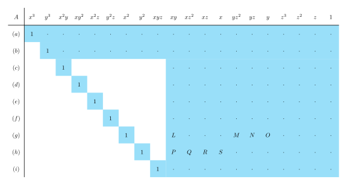

+++
date = 2025-01-19T20:54:26+09:00
lastmod = ''
draft = false

title = "5-point algorithm"
summary = ""

isCJKLanguage = false

tags = ["5point algorithm", "chierality", "essential matrix", "Gröbner basis", "mathematics", "multiple view geometry",]
categories = ["academic"]

references = [
    {title = "USING STURM SEQUENCES TO BRACKET REAL ROOTS OF POLYNOMIAL EQUATIONS", authors = "D. G. Hook, P. R. McAree", doi = "10.1016/B978-0-08-050753-8.50089-9"},
    {title = "Gröbner Basis Methods for Minimal Problems in Computer Vision", authors = "Henrik Stewénius"},
    {title = "Recent Developments on Direct Relative Orientation", authors = "H.Stewénius,  C.Engels, D.Nistér"}
]

+++

## Introduction

The Essential matrix, despite its inherent weaknesses (e.g., rotation-only motion, small baseline, planar degeneracy), is a kind of “magical” method for reconstructing 3D structure and camera pose using nothing more than simple point correspondences, for known cameras. In particular, in a SLAM scenario, a calibrated camera is usually given, which makes the Essential matrix even more useful compared to the Fundamental matrix.

An especially important fact is that the minimal solution for the Essential matrix can be obtained with 5 pairs of corresponding points. Out of the 6 degrees of freedom, the scale term is not included, so effectively we have 5 degrees of freedom. We call this the 5-point algorithm. At some point, I came across an internet reply claiming that the 8-point algorithm is slower but somehow yields more accurate results. **That’s simply not true.** Based on my experience, it’s not true at all. Here’s why. First, once you’re running RANSAC, the difference between using 8 points and 5 points can be quite significant. Second, since the 5-point algorithm mathematically defines the model perfectly, the 8-point algorithm inherently carries approximation errors. This is because it uses redundant constraints. Throwing more numbers at the problem isn’t necessarily better than using the right numbers. Is having redundant constraints truly more accurate? Not really. In fact, many libraries now treat the 5-point solution as the de facto standard. Third. It might be a somewhat trivial point, but if you’re using a large number of feature points anyway, both methods ultimately boil down to finding the nullspace via SVD. You can still use 8 points in the 5-point framework; it’s just not necessary, so we don’t do it. Finally, putting aside all the reasons above, **the 5-point algorithm is simply better.** Plenty of papers include performance comparisons to back this up, including the 5-point algorithm paper by *Hongdong Li et al.*

Now, regarding this 5-point algorithm—in contrast to Hongdong Li’s claim that it’s “very, very easy”—I personally found it to be quite difficult. Considering how widely it’s used, it’s surprisingly hard to grasp. Deriving the polynomial itself isn’t too bad, but the full expansion of that polynomial is not something you can just do by hand. And then, solving that polynomial involves some genuinely unfamiliar mathematical concepts. I tried implementing it once but ended up running away when those unfamiliar concepts began to wreck me. (I thought I’d almost gotten it to work, but it kept failing at the last minute.)

So, in this post, I want to take a quick look at the conceptual backgrounds of the 5-point algorithm, explaining some of the ideas that lie beneath. I’ll assume the reader already has a conceptual understanding of the Essential matrix.

## Brief recap of the Essential matrix

Let’s briefly summarize what the Essential matrix is. 

### Geometric derivation


Satisfying the epipolar constraint means that in the diagram below, the three vectors lie on the same plane.

1. $\mathrm{x'}$
2. $t$
3. $R\mathrm{x}$

Using the most basic geometric property, we can represent this relationship as follows:

$$
\langle \mathrm{x'} , t \times R \mathrm{x} \rangle
\newline
= \mathrm{x'}^\mathsf{T} \lfloor t \rfloor _{\times} R \ \mathrm{x}
\newline
$$

For all $\mathrm{x}$ and $\mathrm{x'}$ :

$$
E = \lfloor t \rfloor _{\times} R
$$

Fairly simple.

### Characteristic polynomial of the Essential matrix

To derive the 5-point algorithm for the Essential matrix, you first need to understand some of the algebraic properties of the Essential matrix. Let’s not focus on rigorous proofs; instead, we’ll proceed with a relatively intuitive approach. Recall that the Essential matrix is given as $\lfloor t \rfloor _{\times} R ^\mathsf{T}$. We won’t worry about the orthogonal matrix part; most of the key features come from the skew-symmetric matrix. 

What exactly is a skew-symmetric matrix? At least in 3D, you can think of it as performing a cross product with every vector in space. When you take the cross product, the component along that axis is completely eliminated. In other words, the rank becomes degenerate. Also, within the compressed plane, vectors undergo a rotation. Because the trace of a skew-symmetric matrix is zero, its determinant must also be zero. Consequently, due to rank degeneracy, the eigenvalues sum to zero and reflect a rotational property—so they become $ai, -ai, 0$, where $a$ is some scalar (specifically the magnitude of the vector that defines the skew-symmetric matrix). When you do an SVD, you end up with diagonal term, $\mathrm{diag(a,a,0)}$.

These basic properties give us a rough outline, but let’s add a bit more math. For a skew-symmetric matrix,

$$
\lfloor t \rfloor _{\times} = kUZU ^\mathsf{T}, \ where \  Z \ =
\begin{bmatrix} 0&1&0 \newline -1&0&0 \newline 0&0&0 \end{bmatrix} \ and\ k\ is\ constant.
$$

where $Z$ is a block-diagonal matrix and $U$ is orthogonal. A skew-symmetric matrix can be decomposed in this way, though we’ll skip the details. Then we multiply $Z$ by an orthogonal matrix to simplify it into $\mathrm{diag}(1,1,0)$. Let’s call that orthogonal matrix, $W$. It must be orthogonal so that the overall product remains orthogonal when multiplied. (Note that in the “mvg” book, the matrix $W$ is actually the transpose of what we call $W$ here. However, for neatness, we replaced $W$ with $W^\mathsf{T}$ so that we can directly write $Z=\mathrm{diag}(1,1,0)W$.)

$$
W=\begin{bmatrix} 0&1&0 \newline -1&0&0 \newline 0&0&1 \end{bmatrix} , so\ that
\ Z=\mathrm{diag}(1,1,0)W
$$

$$
\lfloor t \rfloor _{\times} = k UZU^\mathsf{T} = k  U \mathrm{diag}(1,1,0) W U^\mathsf{T}
$$

If we replace $W$ with $W^\mathsf{T}$, then the sign of the scalar factors in front gets flipped, meaning the translation direction is reversed.

$$
\lfloor t \rfloor _{\times} R =k  U \mathrm{diag}(1,1,0) ( W U^\mathsf{T} R ) = k U \Sigma V ^ \mathsf{T}
$$

Mathematically, we still get a result that the rank is 2 and that it has equal singular values. Any rank-2 matrix can be a Fundamental matrix. If it is rank-2 and has two identical singular values, then it’s an Essential matrix. Thus, we can see that an Essential matrix is neatly defined by the outcome of its SVD.

Even without considering the skew-symmetric matrix, you can deduce that the rank of an Essential matrix must be degenerate. In the equation $\mathrm{x}' E \mathrm{x} = 0$, there must exist some $\mathrm{x}$ (i.e., the epipole) that satisfies this for all $\mathrm{x}'$. This implies $E$ has a nontrivial null space—hence one dimension of rank “leaks” into that null space.

Anyway, let’s now use the SVD result to further develop the equations.

$$
E = U \ \mathrm{diag} (a,a,0) \ V ^ \mathsf{T} \newline
\mathrm{trace}(E E ^ \mathsf{T}) = \mathrm{trace}(U \ \mathrm{diag} (a^2,a^2,0)\  U^ \mathsf{T} ) = 2a^2
$$

Hence,

$$
EE^ \mathsf{T} E = U \ \mathrm{diag} (a^3,a^3,0)\  V^ \mathsf{T} 
$$

So that

$$
EE^ \mathsf{T} E - {1\over 2} \mathrm{trace}(E E ^ \mathsf{T}) E = 0
$$

Moreover, this is the **necessary and sufficient condition for the Essential matrix.** We’ll stop at this derivation for now, and in the next post, we’ll move on to actually solving it.

## Recovering R/T

### Finding candidates

Now, assuming we’ve somehow solved for the Essential matrix, let’s see how we can recover Rotation and Translation from it. Previously, we defined 

$$
\lfloor t \rfloor _{\times} R =k  U \mathrm{diag}(1,1,0) ( W U^\mathsf{T} R ) = k U \Sigma V ^ \mathsf{T}
$$

which directly corresponds to the result of the SVD.

$$
\mathrm{SVD}(E) = k  U \mathrm{diag}(1,1,0) ( W U^\mathsf{T} R ) = U \mathrm{diag}(k,k,0)V ^ \mathsf{T}
$$

##### Finding R

$$
( W U^\mathsf{T} R ) = V ^ \mathsf{T} \newline
R = U W^\mathsf{T} V^\mathsf{T}
$$

It’s fairly straightforward: earlier we noted that replacing $W$ with $W^\mathsf{T}$ merely flips the sign. Thus, for $R$, there are two possible choices.

$$
\begin{align*}
R_1 &= U W^\mathsf{T} V^\mathsf{T} \newline
R_2 &= U W V^\mathsf{T}
\end{align*}
$$

##### Finding t

When it comes to $t$, it’s a bit simpler. Intuitively, the reason we have a zero singular value in the first place is that the translation direction causes a degeneracy. In the left singular vectors of the SVD result $U$, if we assume the diagonal matrix is arranged accordingly, the third column (associated with the zero singular value) becomes the left singular vector corresponding to that degeneracy. Also, because it’s degenerate, it doesn’t matter which direction along that axis we take. In other words,

$$
U=
\begin{bmatrix}
|&|&| \newline \mathrm{u_1}&\mathrm{u_2}&\mathrm{u_3} \newline |&|&|
\end{bmatrix}
$$

$$
t=\pm \mathrm{u}_3
$$

### Cheirality

At this point, we have to deal with the cheirality problem in projective geometry. Because projective geometry (as defined with lines) doesn’t care whether something is in front of or behind the camera, there is two possible results for $R$ and $t$ each, creating four total candidates. Even if the camera ends up behind the scene, from a purely projective standpoint—where we only consider lines—it is still “valid.”


The figure below illustrates these four possible combinations of $R$ and $t$. In the image, positive depth is shown in green, and negative depth in red. There’s really no purely geometric way to resolve this ambiguity outright. Instead, you can perform triangulation using the points with each $R$, $t$ option and check whether the depths in both images are positive. For instance, in COLMAP, it computes depths for the given points and checks whether there’s at least one point whose depth is positive in both images and below some `max_depth`. If such a point exists, that configuration is considered valid.

## Formulation of 5-point algorithm

### Making coefficient matrix

Before diving into Nistér’s method specifically, let’s derive the core components needed to solve the 5-point algorithm in general. We will be using points $x,y,z$ later. So for clarity, let each pair of corresponding points be denoted by $q$.

$$
q'^\mathsf{T} E q = 0
$$

$$
q'=\begin{bmatrix} q_1' \newline q_2' \newline q_3' \end{bmatrix} ,
q=\begin{bmatrix} q_1 \newline q_2 \newline q_3 \end{bmatrix}, 
E=\begin{bmatrix}
e_{11} & e_{12} & e_{13} \newline
e_{21} & e_{22} & e_{23} \newline
e_{31} & e_{32} & e_{33}
\end{bmatrix}
$$

We can vectorize this matrix, refered as DLT algorithm which commonly mentioned in cv field. 

$$
\begin{align*}
\tilde q &= \begin{bmatrix}
q_1q_1' & q_2q_1' & q_3q_1' & 
q_1q_2' & q_2q_2' & q_3q_2' & 
q_1q_3' & q_2q_3' & q_3q_3'
\end{bmatrix}^\mathsf{T}
\newline
\tilde E &= \begin{bmatrix}
e_{11} & e_{12} & e_{13} & 
e_{21} & e_{22} & e_{23} & 
e_{31} & e_{32} & e_{33}
\end{bmatrix}^\mathsf{T}
\end{align*}
$$

Each of the five pairs of points becomes its own $\tilde q$​. By stacking these vectors, we obtain the following result.

$$
M=\begin{bmatrix}
― & q_1 & ― \newline
― & q_2 & ― \newline
― & q_3 & ― \newline
― & q_4 & ― \newline
― & q_5 & ―
\end{bmatrix}_{5\times 9}
$$

$$
M_{5\times 9} \tilde E_{9\times 1} = 0_{5 \times 1}
$$

Here, the coefficient matrix $M$ naturally has rank 5, and the remaining four right singular vectors span the right null space. Let us call these vectors $\tilde X, \tilde Y, \tilde Z, \tilde W$. Then the following relation is established.

$$
\tilde E = x \tilde X + y \tilde Y + z \tilde Z + w \tilde W
$$

Because of the scale factor, it is acceptable to set $w=1$. In fact, from this point onward, most expressions will be developed under the assumption $w=1$. However, note that if $w$ becomes too small, there can be numerical instability due to the scale factor. And if $w=0$, it will cause a problem. That said, we have not often encountered a situation where this becomes a major issue.

### Handling polynomials

Our objective is to find an Essential Matrix within this null space, that satisfies the necessary and sufficient conditions of the Essential matrix, which is 

$$
EE^ \mathsf{T} E - {1\over 2} \mathrm{trace}(E E ^ \mathsf{T}) E = 0
$$

Let us revert the above vectorized form back into $E$.

$$
E = x X + y Y + z Z + W
$$

By expressing it this way, one can view the 5-point problem as finding solutions for $x, y, z$ under the necessary and sufficient constraints of the Essential matrix, from among the span of $X,Y,Z,W$ obtained through the decomposition of the point-pair coefficient matrix.

Expanding $E=0$ from the above equations leads to what follows below.

$$
(xX+yY+zZ+W)
\cdot
(xX^ \mathsf{T}+yY^ \mathsf{T}+zZ^ \mathsf{T}+W^ \mathsf{T})
\cdot
(xX+yY+zZ+W)
\newline
-{1\over 2} \mathrm{trace} (
(xX+yY+zZ+W)
\cdot
(xX^ \mathsf{T}+yY^ \mathsf{T}+zZ^ \mathsf{T}+W^ \mathsf{T})
)
\cdot
\newline
(xX+yY+zZ+W) = 0
$$

It is quite difficult for us to manually expand these expressions, because they appear as follows.

$$
z_{11} y_{22} w_{33} - z_{11} w_{23} y_{32} + z_{11} w_{22} y_{33} -
z_{11} y_{23} w_{32} + w_{11} y_{22} z_{33} + w_{11} z_{22} y_{33} - \newline
w_{11} y_{23} z_{32} - w_{11} z_{23} y_{32} - y_{11} w_{23} z_{32} +
y_{11} z_{22} w_{33} - y_{11} z_{23} w_{32} + y_{11} w_{22} z_{33} + \newline
y_{31} z_{12} w_{23} + y_{31} w_{12} z_{23} - y_{31} z_{22} w_{13} -
y_{31} w_{22} z_{13} + z_{31} y_{12} w_{23} + z_{31} w_{12} y_{23} - \newline
z_{31} y_{22} w_{13} - z_{31} w_{22} y_{13} + w_{31} y_{12} z_{23} +
w_{31} z_{12} y_{23} - w_{31} y_{22} z_{13} - w_{31} z_{22} y_{13} + \newline
z_{21} y_{32} w_{13} - z_{21} y_{12} w_{33} - z_{21} w_{12} y_{33} +
w_{21} y_{32} z_{13} + w_{21} z_{32} y_{13} - w_{21} y_{12} z_{33} - \newline
w_{21} z_{12} y_{33} - y_{21} w_{12} z_{33} - y_{21} z_{12} w_{33} +
y_{21} w_{32} z_{13} + y_{21} z_{32} w_{13} + z_{21} w_{32} y_{13}
$$

I do not want this blog post to reach 2,000 lines merely from writing out polynomial expansions only, and in the first place, it is nearly impossible for a human to expand them all by hand, so I will omit them here. These three cubic terms produce a monomial basis; let us list them in graded lexical order. (In the paper, a different ordering is used.)

$$
x^3, x^2y, x^2z, xy^2, xyz, xz^2,
y^3,y^2z,yz^2,z^3,
x^2,xy,xz,
y^2,yz,z^2,
x,y,z,1
$$

We end up with nine equations, each composed of 20 terms above, and from them we can form a $ 9 \times 20 $ matrix. The partially expanded expression mentioned earlier was just one element of that matrix. Although the $ 9 \times 20 $ matrix can later change in some approaches, here we will begin by looking at Nistér’s original algorithm.

## Nistér's algorithm

Nistér’s algorithm has three variants. There is a 2003 version that uses a $9\times20$ matrix, a 2004 version that uses a $10\times20$ matrix, and—unlike the first two, which were essentially worked in ad hoc manner—a later version that employs Gröbner basis in a more general manner. Strictly speaking, this final version is often attributed to Stewénius, but we include it here in the same family for continuity. However, it does not directly employ Gröbner bases, and there are also slight differences between the 2005 and 2006 versions in this respect.

Among the first two, the 2004 version is much more detailed in its paper, but the 2003 version is typically the one you find when you do a quick Google search, since both share the same title. The 2003 version is *D.Nister, An efficient solution to the five-point relative pose problem, IEEE-CVPR-2003*, and the 2004 version is  *D.Nister, An efficient solution to the five-point relative pose problem, IEEE-T-PAMI*. The final version was never published as a standalone paper, but it can be found in conference materials, and additional information appears in Stewénius’s Ph.D. thesis.

### 2003 Version

In the 2003 version, the matrix is generated using the following monomial ordering:

$$
x^3, y^3, x^2y, xy^2, x^2z, x^2, y^2z, y^2, xyz, xy, xz^2, xz, x, yz^2, yz, y, z^3, z^2, z, 1.
$$

Let us call this coefficient matrix $A$. Through Gauss-Jordan elimination, one obtains a specific sparsity pattern; at that point, the last two rows need not be further eliminated. 



The reason we have singled out $z$ becomes clear here: we are using $z$ to help eliminate the other terms based on it.

$$
\begin{align*}
(j) &\equiv (e)-z(g) \newline
(k) &\equiv (f)-z(h) \newline
(l) &\equiv (d)-x(h)+P(c)+zQ(e)+R(e)+S(g) \newline
(m) &\equiv (c)-y(g)+L(d)+zM(f)+N(f)+O(h)
\end{align*}
$$

The details are not particularly meaningful, so we will not derive them here, but with this approach, the five terms $(i), (j), (k), (l), (m)$ all share $xyz$ as their highest-degree term. Concretely, with given definition

$$
[n]=n\mathrm{th \ order \ polynomial \ of} \ z
$$

then, we can define polynomials as follows :

$$
\begin{align*}
(i) &= xy[1] + x[2] + y[2] + [3] \newline
(j) &= xy[1] + x[3] + y[3] + [4] \newline
(k) &= xy[1] + x[3] + y[3] + [4] \newline
(l) &= xy[2] + x[3] + y[3] + [4] \newline
(m) &= xy[2] + x[3] + y[3] + [4]
\end{align*}
$$

It is easy to verify this by hand. As a result, $(i)$ is the lowest degree, and $(l)$ and $(m)$ involve terms of slightly higher degree has slight higher degree also. Next, we form matrix $B$ from $(i) (j) (k) (l)$ and matrix $C$ from $(i) (j) (k) (m)$. (Strictly speaking, in the expressions below, they are not exactly $(i) (j) (k) (l)$, but we are loosely grouping the relevant terms for convenience.)

$$
B\cdot \begin{bmatrix}
xy \newline x \newline y \newline 1
\end{bmatrix}
=\begin{bmatrix}
―& (i) & ―  \newline
―& (j) & ―  \newline
―& (k) & ―  \newline
―& (l) & ―
\end{bmatrix}
\begin{bmatrix}
xy \newline x \newline y \newline 1
\end{bmatrix}
= 0_{4 \times 1}
$$

$$
C\cdot \begin{bmatrix}
xy \newline x \newline y \newline 1
\end{bmatrix}
=\begin{bmatrix}
―& (i) & ―  \newline
―& (j) & ―  \newline
―& (k) & ―  \newline
―& (m) & ―
\end{bmatrix}
\begin{bmatrix}
xy \newline x \newline y \newline 1
\end{bmatrix}
= 0_{4 \times 1}
$$

Both matrices have a right null vector. In other words, they degenerate—each having a determinant of zero—and from these constraints, each one produces an 11th-degree polynomial in zz. Let us call these polynomials $(n)$ and $(o)$. Subtracting one 11th-degree polynomial from the other yields a single 10th-degree polynomial. This polynomial can have up to 10 solutions, and from its real roots we can reconstruct the matrix $B$, thus solving for $x$ and $y$. Then, having $x,y,z$, we can solve for the Essential matrix $E$. Hence, up to 10 candidate solutions for $E$ exist. We will revisit how to solve this 10th-degree polynomial shortly. Now, let us move on to Nistér’s 2004 version of the algorithm.

### 2004 Version

The 2004 version uses a $10\times 10$ matrix. It is somewhat unclear exactly why this was done, though of course, having a $10\times 10$ not only makes things easier to handle but also proves very convenient in other methods either. However, it is not obvious what specific motivation led to exploring this approach here. Aside from making it easier to handle, there is no need to explicitly add a zero determinant constraint, since the constraint $EE^ \mathsf{T} E - {1\over 2} \mathrm{trace}(E E ^ \mathsf{T}) E = 0$ already constrains zero determinant condition. In the version we will look at here, the importance of the $10\times 10$ matrix itself is somewhat minor, but it becomes far more crucial in subsequent variants.

Regardless, we add the following condition to the polynomial constraints we examined earlier:

$$
\mathrm{det}(E)=0
$$

Again, we do not need to perform elimination all the way. We stop with four rows left this time, giving us a certain sparsity pattern. Since we have already explained that $[n]$ denotes an n-degree polynomial in $z$, let us simply follow the original text’s structure here:


First, note that the monomial ordering has changed slightly, and the polynomial expansion has become much cleaner. 

$$
\begin{align*}
(k) &\equiv (e)-z(f) \newline
(l) &\equiv (g)-z(h) \newline
(m) &\equiv (i)-z(j)
\end{align*}
$$

Indeed, if you attempt the expansion by hand, you will find it quite tidy. The structure $(e)-(f), (g)-(h), (i)-(j)$ is straightforward to see, and since the only terms being multiplied involve $z$, the resulting z-coefficient polynomials also line up neatly as [3] [3] [4]. In contrast to the 2003 version, which had to be done largely by hand, this version can even be understood with a mental calculation. In any case, this time we form only one matrix which is $B$.

$$
B\cdot \begin{bmatrix}
x \newline y \newline 1
\end{bmatrix}
=\begin{bmatrix}
―& (k) & ―  \newline
―& (l) & ―  \newline
―& (m) & ―
\end{bmatrix}
\begin{bmatrix}
x \newline y \newline 1
\end{bmatrix}
= 0_{3 \times 1}
$$

Likewise, if we create an equation from the constraint which is zero determinant, we end up with polynomials of degrees [3][3][4]. Thus, we can obtain a single 10th-degree polynomial from just this one matrix.

### Solving 10th degree polynomial of z

#### Sturm's theorem

Sturm’s theorem is a method for counting the number of real roots of a univariate polynomial within a specified interval. First, let us define the Sturm sequence. For a univariate polynomial $p(x)$,

$$
p_0(x)=p(x) \newline
p_1(x)=p'(x)
$$

Then we recursively define followings.

$$
p_{n+1}(x)=-\mathrm{mod}(p_{n-1}(x),p_n(x)) \newline
\text{i.e. }  p_{n-1}(x)=(ax+b)p_n(x)-p_{n+1}(x)
$$

We generate these terms until one of them becomes zero, at which point we stop.

Next, for a given Sturm sequence, we define

$$
V(a) = \text{number of sign changes in the sequence } p_0(a),\cdots,p_{n}(a)
$$

Sturm’s theorem is as follows.

> #### Sturm's theorem
> The number of distinct real roots of $f(x)$ in the interval $[a,b]$ is given by $V(a)-V(b)$.

---

##### Example

For $f(x) = x^3 + 6x^2 + 12x + 9$,

$$
\begin{align*}
f_0(x) & = x^3 + 6x^2 + 15x + 6 \newline
f_1(x) & = 3x^2 + 12x + 15
\end{align*}
$$

$f_2(x)$:

$$
\begin{align*}
f_0(x) & = {1\over 3}(x+2)(3x^2 + 12x + 15) + (2x -4) \newline
f_2(x) & = -2x + 4
\end{align*}
$$

$f_3(x)$:

$$
\begin{align*}
f_1(x) & = (-{3\over 2}x - 9)(-2x + 4) + 51\newline
f_3(x) & = -51
\end{align*}
$$

Also, though the exact quotient is not specified here, $f_4(x)$ becomes 0.

$$
\begin{align*}
f_0(x) & = x^3 + 6x^2 + 15x + 6 \newline
f_1(x) & = 3x^2 + 12x + 15 \newline
f_2(x) & = -2x + 4 \newline
f_3(x) & = -51
\end{align*}
$$

Now, over the interval $(-\infty,+\infty)$,

$$
\begin{align*}
V(\infty) & \to (+\ +\ -\ -) \newline
V(-\infty) & \to (-\ +\ +\ -) \newline
\end{align*}
$$

$$
V(-\infty)-V(\infty) = 2-1 = 1
$$

Therefore, the polynomial has exactly one distinct real root.

---

In any case, one can numerically find the solution using Sturm’s theorem in conjunction with a form of root polishing. Nistér mentions using a simple 30-step bisection to find the root. One might ask how we get a rough idea of where the root is located—this is where the following theorem (Cauchy’s Bound) gets handy.

> #### Cauchy’s Bound
> Suppose $f(x) = a_nx^n + a_{n-1} x^{n-1} + \cdots + a_1x + a_0$ is a polynomial of degree $n$ with $n \ge 1$. Let $M$ be the largest of the numbers: ${\lvert{a_0 \over a_n}\rvert, \lvert{a_1 \over a_n}\rvert , \cdots, \lvert{a_{n-1} \over a_n}\rvert }$.Then all the real zeros of $f$ lie in in the interval $[−(M+1),M+1]$.

#### Companion matrix

On the other hand, a more convenient way to solve this 10th-degree polynomial is by using a companion matrix. For a monic polynomial(coefficient of leading monomial is 1) $p(x) = x_n + c_{n-1}x^{n-1} + \cdots + c_1x + c_0$​, the companion matrix can be defined as follows:

$$
C(p) = 
\begin{bmatrix}
0 & 0 & \cdots & 0 & -c_0 \newline
1 & 0 & \cdots & 0 & -c_1 \newline
\vdots & \vdots & \ddots & \vdots & \vdots \newline
0 & 0 & \cdots & 1 & -c_{n-1}
\end{bmatrix}
$$

A key property of this companion matrix is that the original polynomial $p(x)$ and the characteristic polynomial of the matrix are the same. In other words,

$$
\det(xI-C(p))=p(x)
$$

Since we want to find the roots of $p(x)=0$, and $p(x)$ is the characteristic polynomial of the companion matrix, the roots of $p(x)=0$ are exactly the eigenvalues of the companion matrix. In this way, we convert a polynomial-solving problem into one in linear algebra. Because there are many well-developed methods and implementations for solving linear systems and eigenvalue problems, using a companion matrix makes the task of finding the polynomial’s roots much easier.

### Gröbner basis

Now, let us explain the methods introduced in 2005 and 2006. From this point on, an understanding of Gröbner bases is practically essential. I have written a separate post on that topic, which you will need to read to fully understand this material.

[Solving polynomials using Gröbner basis](../../academic/solving-polynomials-using-grobner-basis)

##### 2005 Version


Unlike the previous two approaches, here we carry out complete elimination. Looking at the ten expressions from (a) through (j), none of them can divide any other with respect to the leading term; consequently, they form a perfect Gröbner basis. As a result, if we consider the quotient ring as a vector space, we can express the normal form using the monomial basis $\lbrace x^2,xy,xz,y^2,yz,z^2,x,y,z,1 \rbrace$.

Let us say that the coefficient matrix MM is completely reduced through this process, yielding

$$
M = [I_{10 \times 10} | B_{10 \times 10}] \\ \;\\
B=\begin{bmatrix}
―& \mathrm{b}_1 & ―  \\
―& \vdots & ―  \\
―& \mathrm{b}_{10} & ―
\end{bmatrix}
$$

Next, we construct the action matrix $M_x$​. The matrix above is arranged in a way that makes it convenient to build this action matrix. Assuming $\mathrm{x} = [x^2,xy,xz,y^2,yz,z^2,x,y,z,1]^\mathsf{T}$,

$$
\begin{align*}
x \cdot x^2 &= -\mathrm{b}_1  \mathrm{x} \\
x \cdot xy &= -\mathrm{b}_2  \mathrm{x} \\
x \cdot xz &= -\mathrm{b}_3  \mathrm{x} \\
x \cdot y^2 &= -\mathrm{b}_4  \mathrm{x} \\
x \cdot yz &= -\mathrm{b}_5  \mathrm{x} \\
x \cdot z^2 &= -\mathrm{b}_6  \mathrm{x} \\
x \cdot x &= x^2 \\
x \cdot y &= xy \\
x \cdot z &= xz \\
x \cdot 1 &= x
\end{align*}
$$

Therefore action matrix $M_x$ can be written as

$$
M_x[1:6,:] =-\begin{bmatrix}
―& \mathrm{b}_1 & ―  \\
―& \vdots & ―  \\
―& \mathrm{b}_{6} & ―
\end{bmatrix}
\\\;\\
M_x[7:10,:] = \begin{bmatrix}
1 & 0 & 0 & 0 & 0 & 0 & 0 & 0 & 0 & 0 \\
0 & 1 & 0 & 0 & 0 & 0 & 0 & 0 & 0 & 0 \\
0 & 0 & 1 & 0 & 0 & 0 & 0 & 0 & 0 & 0 \\
0 & 0 & 0 & 0 & 0 & 0 & 1 & 0 & 0 & 0
\end{bmatrix}
$$

The eigenvalues of this action matrix correspond to the various solutions for $x$.

##### 2006 Version

There are no major differences here compared to the previous method. The original text mentions the use of a GrLex (graded lexicographic) ordering, but in practice, it uses a graded reverse lexicographic ordering. This does not make a significant difference anyway. The expressions are arranged in the following order.

$$
x^3, x^2y,xy^2,y^3,x^2z, xyz, y^2z,xz^2, yz^2,z^3, x^2,xy,y^2,xz,yz,z^2,x,y,z,1
$$

As a result, the configuration of the action matrix is slightly different.

$$
M_x[1:6,:] =-\begin{bmatrix}
―& \mathrm{b}_1 & ―  \\
―& \mathrm{b}_2 & ―  \\
―& \mathrm{b}_3 & ―  \\
―& \mathrm{b}_5 & ―  \\
―& \mathrm{b}_6 & ―  \\
―& \mathrm{b}_8 & ― 
\end{bmatrix}
\\\;\\
M_x[7:10,:] = \begin{bmatrix}
1 & 0 & 0 & 0 & 0 & 0 & 0 & 0 & 0 & 0 \\
0 & 1 & 0 & 0 & 0 & 0 & 0 & 0 & 0 & 0 \\
0 & 0 & 0 & 1 & 0 & 0 & 0 & 0 & 0 & 0 \\
0 & 0 & 0 & 0 & 0 & 0 & 1 & 0 & 0 & 0
\end{bmatrix}
$$

In this version, the provided code is also slightly modified.

```matlab
[V,D] = eig(At);
SOLS = V(7:9,:)./(ones(3,1)*V(10,:));
```
It appears that the solutions for $x,y,z$ are obtained by normalizing the eigenvector with respect to the component corresponding to 1.

## Hongdong Li's Method

Let's just briefly look into Hongdong Li’s approach is based on the concept of resultants. This is because one can neatly define a $10\times 10$ resultant matrix, although the detailed steps are omitted. We will just outline the general idea.

Consider the following set of monomials:

$$
x^3,x^2y,x^2z,xy^2,xyz,xz^2,y^3,y^2z,yz^2,z^3,x^2,xy,xz,y^2,yz,z^2,x,y,z,1
$$

Let us treat $z$ as a constant. This is called the hidden variable method. An n-th degree polynomial consits of $z$ can be denoted by [n]. With respect to the above monomials, we can define a new vector space and a corresponding monomial basis. Although the original text uses a different ordering, it is not particularly crucial; we use a GrLex ordering here.

$$
f_i=
\begin{bmatrix}
[0] & [0] & [0] & [0] & [1] & [1] & [1] & [2] & [2] & [3]
\end{bmatrix}
\mathrm{x}\\\;\\
\text{where } \mathrm{x} = 
\begin{bmatrix}
x^3 & x^2y & xy^2 & y^3 & x^2 & xy & y^2 & x & y & 1
\end{bmatrix}^\mathsf{T}
$$

From the 10 polynomials in our system, we can form the coefficients for each of the 10 basis elements in the new vector space $\mathrm{x}$, giving rise to yet another $10\times 10$ matrix. Without going into detail, by the property of resultants, the determinant of this new matrix must be zero, and from this condition we obtain a 10th-degree polynomial in $z$.

Numerically, this method does not differ significantly from Nistér’s approach discussed earlier.