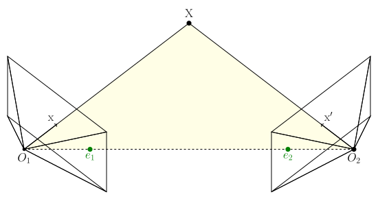

+++
date = 2025-01-19T20:54:26+09:00
lastmod = ''
draft = false

title = "5-point algorithm"
summary = ""

isCJKLanguage = true

tags = ["5point algorithm", "chierality", "essential matrix", "Gröbner basis", "mathematics", "multiple view geometry",]
categories = ["academic"]

references = [
    {title = "USING STURM SEQUENCES TO BRACKET REAL ROOTS OF POLYNOMIAL EQUATIONS", authors = "D. G. Hook, P. R. McAree", doi = "10.1016/B978-0-08-050753-8.50089-9"},
    {title = "Gröbner Basis Methods for Minimal Problems in Computer Vision", authors = "Henrik Stewénius"},
    {title = "Recent Developments on Direct Relative Orientation", authors = "H.Stewénius,  C.Engels, D.Nistér"}
]

+++

## Introduction

Essential matrix 는 비록 그 태생적인 약점(rotation only, small baseline, planar degeneracy)에도 불구하고 알려진 카메라에 대해 3차원의 구성과 위치 복원을 단순 point대응쌍을 이용해서 하는 마법같은 방법이다. 특히 SLAM Scenario에서는 calibrated camera가 제공되기에 Fundamental matrix보다 더 유용하다.

특히 Essential matrix의 최소해는 5쌍의 point대응인데, 6자유도에서 scale term이 빠지기 때문에 5dof이기 떄문이다. 이를 우리는 5-point algorithm이라 부른다. 어쩌다 인터넷에서 8-point가 느리지만 더 정확한 결과를 생성하는 장점이 있다는 글을 봤다. **아니다.** 경험적으로는 전혀 그렇지 않았다. 첫째, RANSAC을 돌려야 하는 이상, 8과 5는 큰 차이가 있다. 둘째, 5-point algorithm이 완벽하게 수학적으로 모델을 정의하는 이상, 8-point는 이미 내재적으로 오차가 있다. Redundant constraint이기 때문이다. 숫자를 많이 쓰는 것과 숫자를 잘 쓰는 것은 다르다. Redundant constraint라고 더 정확한가? 이미 여러 라이브러리들에선 5-point가 defacto standard다. 셋째, 살짝 의미없는 논의지만, 어차피 많은 포인트를 쓰는 관점이라면, 결과적으로 SVD 후 nullspace를 찾는 과정인데, 5-point algorithm에서도 똑같다. Point 8개는 마찬가지로 같이 쓸 수 있다. 그냥 안 써도 되니까 안 쓴다. 마지막으로, 앞서 말한 이유를 전부 제치고, **그냥 5-point algorithm이 확실하게 더 낫다.** 애초에 이에 대한 성능 비교 figure가 여러 논문에 있다. H.Stewénius의 박사 학위 논문에 충실한 비교가 있으며, 굳이 학위논문까지 뒤지진 않더라도 *Hongdong Li et.al* 의 5-point algorithm논문에도 간략한 비교가 실려있다.

이 5point algorithm은 - Hongdong li는 아주아주 쉽다고 claim하는 것과 다르게 - 상당히 어려워서 많이 쓰이는 빈도에 비해서 도저히 이해가 힘들었다. 그야 polynomial까지의 유도는 그렇게 어렵지 않은데, 그 식의 전개가 사람 손으로 하라고 있는게 아니다. 또 그 다음에 그 다항식의 해를 구하는 과정에서 정말 공돌이에겐 생소한 수학적 개념이 많이 나온다. 특히 polynomial의 symbolic solution에 대해서 구하는 부분에서 환과 Ideal 등의 개념을 배우지 않은 입장에선 기저에 깔린 생소한 개념에 박살난 채 도망갈 수 밖에 없었다. 결과적으로 직접 구현하는 데에는 영 실패하고 말았다.

따라서 한 번 그 아래 깔려있는 개념을 다소 같이 간략하게 설명해가면서 5point algorithm에 대해 살펴보고자 한다. 다만 **Essential matrix를 개념적으로 알고 있는 사람들을 독자로 가정한다.**

## Brief recap of the Essential matrix

간략히 Essential matrix에 대해 요약해보자.

### 기하적 유도



Epipolar constraint를 만족한다는 것은, 다음 그림에서 세 벡터가 같은 평면에 위치한다는 것이다.

1. $\mathrm{x'}$
2. $t$
3. $R\mathrm{x}$

가장 단순하게 기하적 성질을 이용하면 다음과 같이 표현 가능하다.

$$
\langle \mathrm{x'} , t \times R \mathrm{x} \rangle
\newline
\mathrm{x'}^\mathsf{T} \lfloor t \rfloor _{\times} R \ \mathrm{x}
\newline
=0
$$

여기서 모든 $\mathrm{x, x'}$에 대해 

$$
E = \lfloor t \rfloor _{\times} R \newline
\mathrm{x'}^\mathsf{T} E \mathrm{x}=0
$$

단순하다.

### Essential matrix의 characteristic polynomial

Essential Matrix의 5-point algorithm을 유도하기 위해선, Essential Matrix의 대수적 성질을 어느정도 이해할 필요가 있다. 엄밀하게 증명 위주로 가지 않고, 적당히 직관적으로 가보자. Essential Matrix 는 $\lfloor t \rfloor _{\times} R ^\mathsf{T}$ 로 주어진다. Orthogonal Matrix는 신경쓰지 말자. 대다수특징은 skew-symmetric matrix에서 기인한다. 

Skew-symmetric matrix라는 것은 무엇인가? 적어도 3차원에 적용한다고 생각을 해보면, 공간상의 벡터에 대해 전부 cross 곱을 한다는 점이다. cross곱을 하면 해당 축 방향의 성분은 완전히 제거당할 것이다. 즉, rank가 degenerate할 것이다. 그리고 또 공간이 압축된 평면에서 벡터들은 회전하게 될 것이다. 또 skew-symmetric matrix의 trace야 0이니까, determinant도 0이 되어야한다. 결과적으로 eigenvalue는 rank degeneracy, 총 합이 0이며, 회전한다는 성질로 인해 $ai, -ai, 0$ 이 될 것이다. ($a$ 는 임의의 scalar, 정확히는 skew-symmetric matrix를 구성한 벡터의 크기) svd를 했을 때, $\mathrm{diag(a,a,0)}$를 가진다는 것이다.

일단 이런 단순 성질들로 적당히 유도했지만, 수식을 조금 더 곁들여보자. 자, skew-symmetric matrix에 대해

$$
\lfloor t \rfloor _{\times} = kUZU ^\mathsf{T}, \ where \  Z \ =
\begin{bmatrix} 0&1&0 \newline -1&0&0 \newline 0&0&0 \end{bmatrix} \ and\ k\ is\ constant.
$$

여기서 $Z$는 block-diagonal matrix이고, $U$는 orthogonal이다. skew-symmetric matrix는 이와 같이 분해 가능하다.(분해에 관련된 자세한 내용은 생략한다.) 이제 $Z$에 orthogonal matrix하나를 곱해서, 단순하게 $\mathrm{diag}(1,1,0)$ 으로 표현 가능하다. 여기서 곱해주는 orthogonal matrix를 $W$라고 표현하자. 여기서 orthogonal matrix인 이유는 뒤에 곱해도 여전히 orthogonal이기 위해서이다. (참고로 mvg책에 $W$ 행렬은 여기서 쓴 $W$의 전치 행렬인데, 여기서는 그냥 깔끔하게 $Z=\mathrm{diag}(1,1,0)W$ 로 만들고 싶어서 $W$를 $W^\mathsf{T}$로 대체해서 바꿔서 유도했다.)

$$
W=\begin{bmatrix} 0&1&0 \newline -1&0&0 \newline 0&0&1 \end{bmatrix} , so\ that
\ Z=\mathrm{diag}(1,1,0)W
$$

$$
\lfloor t \rfloor _{\times} = k UZU^\mathsf{T} = k  U \mathrm{diag}(1,1,0) W U^\mathsf{T}
$$

여기서 만일 $W$를 $W^\mathsf{T}$ 로 대체한다 하면, 앞쪽 상수 부분의 부호가 뒤집힌다. 즉, translation 방향이 반대가 된다.

$$
\lfloor t \rfloor _{\times} R =k  U \mathrm{diag}(1,1,0) ( W U^\mathsf{T} R ) = k U \Sigma V ^ \mathsf{T}
$$

수식적으로도 어쨌던 rank가 2며, 같은 singular value를 가진다는 결과가 나온다. Rank가 2인 행렬은 전부 fundamental matrix일 수 있다. Rank가 2이며, 두 singular value가 같으면 Essential matrix이다. 여기서 Essential matrix는 깔끔하게 SVD의 결과물로 정의가 되는 것을 볼 수 있다. 

사실 skew-symmetric matrix를 생각하지 않더라도 Essential matrix의 rank는 degenerate해야하는데, $\mathrm{x}' E \mathrm{x} = 0$ 식을 모든 $\mathrm{x}'$ 에 대해 만족하는 $\mathrm{x}$(즉, epipole)가 존재해야한다는 것은 $E$의 영공간이 있다는거고, rank가 하나 새서 영공간으로 갔어야하기 때문이다.

하여튼, 이제 SVD결과물을 가지고 조금 식을 develop해보자.

$$
E = U \ \mathrm{diag} (a,a,0) \ V ^ \mathsf{T} \newline
\mathrm{trace}(E E ^ \mathsf{T}) = \mathrm{trace}(U \ \mathrm{diag} (a^2,a^2,0)\  U^ \mathsf{T} ) = 2a^2
$$

또,

$$
EE^ \mathsf{T} E = U \ \mathrm{diag} (a^3,a^3,0)\  V^ \mathsf{T} 
$$

여기서

$$
EE^ \mathsf{T} E - {1\over 2} \mathrm{trace}(E E ^ \mathsf{T}) E = 0
$$

가 성립한다. 또한 이것이 **Essential matrix의 필요충분 조건이다.** 우선 여기까지 유도하고, 실제로 푸는건 다음 포스팅에 이어서 작성하겠다.

### Recovering R/T

#### Finding candidates

이제 어떻게든 풀었다 가정하고, 구해진 Essential matrix로부터 Rotation과 translation을 복원해보자. 아까 

$$
\lfloor t \rfloor _{\times} R =k  U \mathrm{diag}(1,1,0) ( W U^\mathsf{T} R ) = k U \Sigma V ^ \mathsf{T}
$$

라고 정의 했는데, 당장 이 정의가 SVD의 결과물이 된다.

$$
\mathrm{SVD}(E) = k  U \mathrm{diag}(1,1,0) ( W U^\mathsf{T} R ) = U \mathrm{diag}(k,k,0)V ^ \mathsf{T}
$$

##### Finding R

$$
( W U^\mathsf{T} R ) = V ^ \mathsf{T} \newline
R = U W^\mathsf{T} V^\mathsf{T}
$$

상당히 자명한데, 여기서 아까 $W$를 $W^\mathsf{T}$ 로 대체해도 부호가 바뀔 뿐이라고 했다. 따라서 $R$ 에는 다음 두가지 선택지가 있다.

$$
\begin{align*}
R_1 &= U W^\mathsf{T} V^\mathsf{T} \newline
R_2 &= U W V^\mathsf{T}
\end{align*}
$$

##### Finding t

$t$는 조금 편한데, 직관적으로 봐서 애초에 singular value에 0이 생긴 이유가 translation방향으로 degenerate했기 때문이다. SVD의 결과물인 $U$에서 left singular vector중 singular value 0에 해당되는, diagonal matrix가 정렬되었다는 가정하에 세 번째 column이 바로 0에 해당하는 left singular vector가 된다. 또, degenerate할 때 축의 방향은 어느쪽이던 상관없다. 즉,

$$
U=
\begin{bmatrix}
|&|&| \newline \mathrm{u_1}&\mathrm{u_2}&\mathrm{u_3} \newline |&|&|
\end{bmatrix}
$$

일 때,

$$
t=\pm \mathrm{u}_3
$$

#### Cheirality

이제 투영기하학의 cheirality와 싸워야한다. 언제나 직선에 대해 정의한 투영기하학은 내 앞인지 뒤인지 신경을 안쓰기 때문에, 앞서 $R$ $t$의 가능성이 각각 두개씩나왔다. 결과적으로 총 4개의 후보가 만들어진다. 비록 카메라의 뒤편이라고 하더라도, 모든 영상기하학의 가정은 직선을 기준으로 만들어졌기에 valid하다.


위 그림은 $R$ $t$의 가능한 조합 네가지를 그린 것이다. 위 이미지에선 양수 depth를 초록색으로, 음수 depth를 빨간색으로 표현했다. 이 모호성을 딱히 기하적으로 풀 방법은 없고, point의 R T를 이용해서 삼각 측량 했을 때 양쪽 이미지에서 전부 depth가 양수가 되도록 하면 된다. 예를 들어 colmap같은 경우는 주어진 point를 전부 depth calculation해서, 양 쪽 이미지에서 depth가 모두 양수이며 `max_depth` 이하인 point가 있는지 없는지를 검사해서, 있으면 valid configuration이라고 본다.

## Formulation of 5-point algorithm

### Making coefficient matrix

우선 Nistér의 방법 뿐만이 아니라, 5-point algorithm을 풀려면 기본적으로 필요한 부분까지 유도해보자. 이 뒤에 $x,y,z$ 등을 쓸일이 있어서, 대응되는 point를 $q$로 표현하겠다.

$$
q'^\mathsf{T} E q = 0
$$

$$
q'=\begin{bmatrix} q_1' \newline q_2' \newline q_3' \end{bmatrix} ,
q=\begin{bmatrix} q_1 \newline q_2 \newline q_3 \end{bmatrix}, 
E=\begin{bmatrix}
e_{11} & e_{12} & e_{13} \newline
e_{21} & e_{22} & e_{23} \newline
e_{31} & e_{32} & e_{33}
\end{bmatrix}
$$

일반적으로 CV쪽에서 말하는 DLT알고리즘을 위해 벡터화 가능하다.

$$
\begin{align*}
\tilde q &= \begin{bmatrix}
q_1q_1' & q_2q_1' & q_3q_1' & 
q_1q_2' & q_2q_2' & q_3q_2' & 
q_1q_3' & q_2q_3' & q_3q_3'
\end{bmatrix}^\mathsf{T}
\newline
\tilde E &= \begin{bmatrix}
e_{11} & e_{12} & e_{13} & 
e_{21} & e_{22} & e_{23} & 
e_{31} & e_{32} & e_{33}
\end{bmatrix}^\mathsf{T}
\end{align*}
$$

5개의 point쌍은 각각 하나의 $\tilde q$ 가 되며, 벡터를 stacking하면 다음 결과를 얻게 된다.

$$
M=\begin{bmatrix}
― & q_1 & ― \newline
― & q_2 & ― \newline
― & q_3 & ― \newline
― & q_4 & ― \newline
― & q_5 & ―
\end{bmatrix}_{5\times 9}
$$

$$
M_{5\times 9} \tilde E_{9\times 1} = 0_{5 \times 1}
$$

여기서 계수 행렬 $M$은 당연히 rank가 5이며, 남는 right singular vector 4개의 span이 right nullspace가 된다. 이 벡터를 각 $\tilde X, \tilde Y, \tilde Z, \tilde W$라고 부르자. 그러면 다음 관계가 완성된다.

$$
\tilde E = x \tilde X + y \tilde Y + z \tilde Z + w \tilde W
$$

다만 scale factor로 인해서 $w=1$ 로 두어도 무방하다. 그리고 앞으로도 대부분 $w=1$로 수식을 전개하는데, 여기서 $w$가 너무 작아지면 scale term으로 인한 수치적 불안정이 존재한다는 것을 적어둔다. 심지어는 $w=0$이라면 문제가 생긴다. 다만 큰 문제가 되는 상황을 자주 보진 못했다.

### Handling polynomials

이 영공간에서 앞서 살펴본 Essential matrix 의 필요 충분조건,

$$
EE^ \mathsf{T} E - {1\over 2} \mathrm{trace}(E E ^ \mathsf{T}) E = 0
$$

를 만족하는 Essential Matrix를 찾아가는 것이 우리의 일이다. 위의 벡터화된 form을 다시 $E$로 되돌리자.

$$
E = x X + y Y + z Z + W
$$

이렇게 표현하면 point쌍의 계수 행렬 분해로 얻어진 $X,Y,Z,W$의 span 중, Essential matrix의 필요 충분 조건 구속을 이용하여 $x, y, z$ 의 해를 찾는것, 이것이 5-point 문제라고 볼 수 있다.

위의 식들로 $E=0$을 전개하자면 아래와 같아진다.

$$
(xX+yY+zZ+W)
\cdot
(xX^ \mathsf{T}+yY^ \mathsf{T}+zZ^ \mathsf{T}+W^ \mathsf{T})
\cdot
(xX+yY+zZ+W)
\newline
-{1\over 2} \mathrm{trace} (
(xX+yY+zZ+W)
\cdot
(xX^ \mathsf{T}+yY^ \mathsf{T}+zZ^ \mathsf{T}+W^ \mathsf{T})
)
\cdot
\newline
(xX+yY+zZ+W) = 0
$$

이 식은 사람이 직접 전개하긴 어려운데, 아래와 같은 모습이 되기 때문이다.

$$
z_{11} y_{22} w_{33} - z_{11} w_{23} y_{32} + z_{11} w_{22} y_{33} -
z_{11} y_{23} w_{32} + w_{11} y_{22} z_{33} + w_{11} z_{22} y_{33} - \newline
w_{11} y_{23} z_{32} - w_{11} z_{23} y_{32} - y_{11} w_{23} z_{32} +
y_{11} z_{22} w_{33} - y_{11} z_{23} w_{32} + y_{11} w_{22} z_{33} + \newline
y_{31} z_{12} w_{23} + y_{31} w_{12} z_{23} - y_{31} z_{22} w_{13} -
y_{31} w_{22} z_{13} + z_{31} y_{12} w_{23} + z_{31} w_{12} y_{23} - \newline
z_{31} y_{22} w_{13} - z_{31} w_{22} y_{13} + w_{31} y_{12} z_{23} +
w_{31} z_{12} y_{23} - w_{31} y_{22} z_{13} - w_{31} z_{22} y_{13} + \newline
z_{21} y_{32} w_{13} - z_{21} y_{12} w_{33} - z_{21} w_{12} y_{33} +
w_{21} y_{32} z_{13} + w_{21} z_{32} y_{13} - w_{21} y_{12} z_{33} - \newline
w_{21} z_{12} y_{33} - y_{21} w_{12} z_{33} - y_{21} z_{12} w_{33} +
y_{21} w_{32} z_{13} + y_{21} z_{32} w_{13} + z_{21} w_{32} y_{13}
$$

블로그 글이 식 전개만으로 2000줄이 되기를 원하지 않으며, 애초에 사람이 직접 전개하기도 상당히 무리가 있기에 생략한다. 이 3개항의 3차식의 결과적인 모노미얼 기저를 Graded Lexical order로 나열해보자. (paper에서는 다른 ordering을 사용한다.)

$$
x^3, x^2y, x^2z, xy^2, xyz, xz^2,
y^3,y^2z,yz^2,z^3,
x^2,xy,xz,
y^2,yz,z^2,
x,y,z,1
$$

따라서 위 20개의 항으로 이루어진 9개의 수식이 나오며, $ 9 \times 20 $ 행렬을 만들 수 있다. 아까 대략적으로라도 전개한 위의 수식은 그런 행렬 성분중 하나였다. $ 9 \times 20 $ 행렬은 나중에 바뀌기도 하는데, 우선 여기서는 맨 처음의 Nistér's algorithm부터 살펴보자.

## Nistér's algorithm

Nistér's algorithm은 세 가지 변종이 있다. $9\times20$ 행렬을 사용하는 2003년 버전, $10\times20$ 행렬을 사용하는 2004년 버전, 그리고 상당히 손으로 푼 앞 두가지 방법과 달리, 추후 Gröbner basis를 사용하여 general하게 된 마지막 버전이 있다. 이 마지막 버전은 Stewénius에 의해 소개되었다고 보는 것이 맞겠지만, 우선 연장선상에 있어서 여기에 묶었다. 다만 이 버전이 Gröbner basis를 직접 사용하는 것은 아니며, 이에 대해선 또 한번 05년 버전과 06년 버전이 살짝 다르다. 

우선 앞 두개에서 2003년 버전에 비해 2004년 버전이 훨씬 논문이 더 풍성한데, 구글링 했을 때 일반적으로 나오는 버전이 03년 버전이며, 03년 버전과 04년 버전은 완전히 동일한 제목을 가지고 있다. 03년 버전은 *D.Nister, An efficient solution to the five-point relative pose problem, IEEE-CVPR-2003* 이며, 04년 버전은 *D.Nister, An efficient solution to the five-point relative pose problem, IEEE-T-PAMI* 이다. 마지막 버전은 따로 논문 발표가 되진 않았으나, 학회 자료 등으로 남아있고, Stewénius의 Ph.D thesis에 조금 더 자료가 있다.

### 2003 Version

우선 2003년 버전에선, 다음과 같은 monomial ordering으로 matrix를 생성한다.

$$
x^3, y^3, x^2y, xy^2, x^2z, x^2, y^2z, y^2, xyz, xy, xz^2, xz, x, yz^2, yz, y, z^3, z^2, z, 1.
$$

이 계수 행렬을 $A$라고 하자. 여기서 Gauss-Jordan elimination을 통해, 다음 sparsity pattern이 된다. 여기서 두 행은 마저 eliminate하지 않아도 된다. 


이제 z 를 따로 묶은 이유가 드러나는데, z를 기준으로 나머지 항을 elimination하기 위함이다.

$$
\begin{align*}
(j) &\equiv (e)-z(g) \newline
(k) &\equiv (f)-z(h) \newline
(l) &\equiv (d)-x(h)+P(c)+zQ(e)+R(e)+S(g) \newline
(m) &\equiv (c)-y(g)+L(d)+zM(f)+N(f)+O(h)
\end{align*}
$$

자세히는 큰 의미가 없기 때문에 유도하지 않겠지만, 이렇게 하면 $(i), (j), (k), (l), (m)$ 다섯개의 항이 전부 $xyz$ 를 최고차항으로 묶이게 된다. 정확히는

$$
[n]=n\mathrm{th \ order \ polynomial \ of} \ z
$$

일 때,

$$
\begin{align*}
(i) &= xy[1] + x[2] + y[2] + [3] \newline
(j) &= xy[1] + x[3] + y[3] + [4] \newline
(k) &= xy[1] + x[3] + y[3] + [4] \newline
(l) &= xy[2] + x[3] + y[3] + [4] \newline
(m) &= xy[2] + x[3] + y[3] + [4]
\end{align*}
$$

으로 정의 가능하다. 이에 대해선 손으로 해보면 금방 보일 수 있다. 결과적으로 $(i)$ 는 차수가 가장 낮고, 조금 더 고차항으로 만들어진 $(l)$과 $(m)$은 조금 더 높은 차수의 항을 갖는다. 여기서 $(i) (j) (k) (l)$ 로 행렬 $B$를 만들고, $(i) (j) (k) (m)$ 으로 행렬 $C$를 만들자. (아래 수식에서 엄밀히는 $(i) (j) (k) (l)$이 아닌데, 적당히 계수를 분리한 term을 그냥 그대로 퉁쳤다.)

$$
B\cdot \begin{bmatrix}
xy \newline x \newline y \newline 1
\end{bmatrix}
=\begin{bmatrix}
―& (i) & ―  \newline
―& (j) & ―  \newline
―& (k) & ―  \newline
―& (l) & ―
\end{bmatrix}
\begin{bmatrix}
xy \newline x \newline y \newline 1
\end{bmatrix}
= 0_{4 \times 1}
$$

$$
C\cdot \begin{bmatrix}
xy \newline x \newline y \newline 1
\end{bmatrix}
=\begin{bmatrix}
―& (i) & ―  \newline
―& (j) & ―  \newline
―& (k) & ―  \newline
―& (m) & ―
\end{bmatrix}
\begin{bmatrix}
xy \newline x \newline y \newline 1
\end{bmatrix}
= 0_{4 \times 1}
$$

두 행렬 우측 영벡터가 존재한다. 결국 두 행렬 모두 degenerate case라서 determinant가 0이되며, 이 구속 조건에서 행렬 $B$와 $C$가 각각 $z$ term만으로 11차 다항식을 만들게 된다. 이 11차 다항식 두개를 각각 $(n)$,$(o)$ 라고 하자. 그리고 이 두 11차 다항식을 서로 빼면 10차 다항식 하나가 나온다. 이 다항식은 총 10개의 해를 가지며, 이 중 실근을 뽑으면 위의 $B$ 행렬을 재구성 할 수 있으며, 여기서 $x$와 $y$를 구할 수 있다. 이후 $x,y,z$를 구했으므로 $E$를 구할 수 있다. 즉, $E$는 10개까지의 가능한 해가 존재한다. 이 10차 다항식을 푸는 선택지에 대해선 조금 있다 다시 살펴보고, 이제 Nister의 2004년 버전 알고리즘을 보러 가자.

### 2004 Version

04년 버전은 $10\times 10$ 행렬을 사용한다. 정확히 왜 이렇게 된건지는 찾기가 좀 힘든데, 물론 $10\times 10$ 행렬이 이후에 살펴볼 다른 방식에서 훨씬 다루기 편하게 해주는건 차치하고서라도, 여기서는 어떤 동기로 이걸 이렇게 살펴봤는진 잘 모르겠다. 다루기 편하게 하는것 외엔, $EE^ \mathsf{T} E - {1\over 2} \mathrm{trace}(E E ^ \mathsf{T}) E = 0$ 라는 constraint가 determinant가 0이라는 조건을 함의하기 때문에 명시적으로 determinant가 0인 조건을 추가할 필요가 없다. 여기서 살펴볼 버전에서 $10\times 10$ 크기의 중요성보다, 추후의 버전들에서의 $10\times 10$ 크기의 중요성이 훨씬 커지게 된다.

하여튼, 앞서 살펴본 다항식 조건에 다음 조건을 추가한다.

$$
\mathrm{det}(E)=0
$$

그리고 이번에도 elimination을 끝까지 할 필요는 없고, 4줄을 남기고 다음 sparsity pattern을 가져간다. 앞서 $[n]$ 이 $z$만으로 이루어진 n차 polynomial이란 점을 충분히 설명했으므로, 이번엔 원문에 있는대로 간략히 가져가본다.


우선 monomial ordering이 살짝 달라졌고, 수식전개가 상당히 깔끔해졌다.

$$
\begin{align*}
(k) &\equiv (e)-z(f) \newline
(l) &\equiv (g)-z(h) \newline
(m) &\equiv (i)-z(j)
\end{align*}
$$

전개를 직접 해보면 상당히 깔끔하다. 우선 $(e)-(f), (g)-(h), (i)-(j)$ 의 구조로 알아보기도 쉽고, 곱하는 항이 $z$항 밖에 없기 때문에 z coefficient polynomial도 [3] [3] [4] 로 깔끔하다. 03년 수식은 손으로 해야만 했는데, 이번에는 머리로만 해도 된다. 여튼, 이번에는 $B$ 행렬 하나만 만든다.

$$
B\cdot \begin{bmatrix}
x \newline y \newline 1
\end{bmatrix}
=\begin{bmatrix}
―& (k) & ―  \newline
―& (l) & ―  \newline
―& (m) & ―
\end{bmatrix}
\begin{bmatrix}
x \newline y \newline 1
\end{bmatrix}
= 0_{3 \times 1}
$$

마찬가지로 determinant가 0이라는 구속조건으로 식을 만들면 이번에는 polynomaial이 [3][3][4]이므로 행렬 하나만으로 10차 polynomial을 만들 수 있다.

### Solving 10th degree polynomial of z

#### Sturm's theorem

Sturm's theorem(슈툼 정리라고 부르겠다. 스트룸, 스툼, 등등. )은 일변수 다항식의 실근 개수를 정해진 영역에서 셀 수 있는 방법이다. 우선 **Sturm sequence**에 대해 정의하겠다. 일변수 다항식 $p(x)$ 에 대해,

$$
p_0(x)=p(x) \newline
p_1(x)=p'(x)
$$

그리고 이후

$$
p_{n+1}(x)=-\mathrm{mod}(p_{n-1}(x),p_n(x)) \newline
\text{i.e. }  p_{n-1}(x)=(ax+b)p_n(x)-p_{n+1}(x)
$$

이렇게 재귀적으로 항들을 생성 가능하며, 마지막 0항이 나왔을 때 생성을 종료한다.

이제 Sturm sequence에 대해, 다음을 정의한다.

$$
V(a) = \text{number of sign changes in the sequence } p_0(a),\cdots,p_{n}(a)
$$

여기서 이제, **Sturm's theorem 은 다음과 같다.**

> #### Sturm's theorem
> The number of distinct real roots of $f(x)$ in the interval $[a,b]$ is given by $V(a)-V(b)$.

---

##### Example

$f(x) = x^3 + 6x^2 + 12x + 9$ 에 대해,

$$
\begin{align*}
f_0(x) & = x^3 + 6x^2 + 15x + 6 \newline
f_1(x) & = 3x^2 + 12x + 15
\end{align*}
$$

$f_2(x)$의 경우:

$$
\begin{align*}
f_0(x) & = {1\over 3}(x+2)(3x^2 + 12x + 15) + (2x -4) \newline
f_2(x) & = -2x + 4
\end{align*}
$$

$f_3(x)$의 경우:

$$
\begin{align*}
f_1(x) & = (-{3\over 2}x - 9)(-2x + 4) + 51\newline
f_3(x) & = -51
\end{align*}
$$

그리고, 정확한 몫은 모르겠으나 $f_4(x)=0$이 된다. 

$$
\begin{align*}
f_0(x) & = x^3 + 6x^2 + 15x + 6 \newline
f_1(x) & = 3x^2 + 12x + 15 \newline
f_2(x) & = -2x + 4 \newline
f_3(x) & = -51
\end{align*}
$$

이제 구간 $(-\infty,+\infty)$ 에 대해,

$$
\begin{align*}
V(\infty) & \to (+\ +\ -\ -) \newline
V(-\infty) & \to (-\ +\ +\ -) \newline
\end{align*}
$$

$$
V(-\infty)-V(\infty) = 2-1 = 1
$$

따라서 서로 다른 실근은 1개이다.

---

하여튼, 이 Strum's theorem을 이용하고, 일종의 root polishing을 이용하면 충분히 수치적으로 해를 구할 수 있다. Nistér는 단순하게 30번의 bisection으로 구한다고 서술하였다. 다만 여기서 근의 위치는 대략적으로 어떻게 아는지 궁금했는데, 다음 정리(Cauchy's Bound)가 도움이 된다. 

> #### Cauchy’s Bound
> Suppose $f(x) = a_nx^n + a_{n-1} x^{n-1} + \cdots + a_1x + a_0$ is a polynomial of degree $n$ with $n \ge 1$. Let $M$ be the largest of the numbers: ${\lvert{a_0 \over a_n}\rvert, \lvert{a_1 \over a_n}\rvert , \cdots, \lvert{a_{n-1} \over a_n}\rvert }$.Then all the real zeros of $f$ lie in in the interval $[−(M+1),M+1]$.

#### Companion matrix

반면 이 10차 다항식을 푸는 더 편리한 방법은 Companion matrix를 이용하는 것이다. Monic polynomial (Leading monomial의 계수가 1인 polynomial) $p(x) = x_n + c_{n-1}x^{n-1} + \cdots + c_1x + c_0$ 에 대해, Companion matrix는 다음과 같이 정의 가능하다.

$$
C(p) = 
\begin{bmatrix}
0 & 0 & \cdots & 0 & -c_0 \newline
1 & 0 & \cdots & 0 & -c_1 \newline
\vdots & \vdots & \ddots & \vdots & \vdots \newline
0 & 0 & \cdots & 1 & -c_{n-1}
\end{bmatrix}
$$

이 companion matrix의 중요한 특징은, 원본 $p(x)$ 와 이 행렬의 characteristic polynomial이 동일하다는 것이다. 즉,

$$
\det(xI-C(p))=p(x)
$$

라는 중요한 관계를 가진다. 여기서 우리는 $p(x)=0$ 을 만족하는 근을 찾고 싶은 것인데, $p(x)$가 companion matrix의 characteristic polynomial이기에 $p(x)=0$의 근은 companion matrix의 eigenvalue가 된다. 다항식 문제를 선형대수학의 문제로 치환해 버린 것인데, 선형 대수학의 경우 solve method들이 많이 개발되고 구현되어있으므로 상대적으로 이 방법을 이용하면 문제 해결이 아주 쉬워진다.

### Gröbner basis

이제 05년과 06년에 나온 방식에 대해 설명해보자. 이후로는 Gröbner basis에 대한 이해가 필수에 가깝다. 이에 대해선 글을 하나 써놨다. 이 내용을 읽고 와야 이해가 될 것이다.

[다항식 해법을 위한 그뢰브너 기저](../../academic/solving-polynomials-using-grobner-basis)

##### 2005 Version


전 두 방식과는 다르게, 완전히 elimination을 진행한다. 이 떄, (a)부터 (j) 까지 10개의 항을 보면 Leading term에 대해 서로가 서로를 나눌 수 없고, 완벽하게 Gröbner basis를 이룬 다는 것을 볼 수 있다. 결과적으로 이 몫환을 벡터 공간으로 살펴보면 monomial basis $\lbrace x^2,xy,xz,y^2,yz,z^2,x,y,z,1 \rbrace$ 로 Normal form을 나타낼 수 있다. 

이 계수행렬 $M$을 완벽히 소거한 결과가 

$$
M = [I_{10 \times 10} | B_{10 \times 10}] \\ \;\\
B=\begin{bmatrix}
―& \mathrm{b}_1 & ―  \\
―& \vdots & ―  \\
―& \mathrm{b}_{10} & ―
\end{bmatrix}
$$

로 주어진다고 하고, 이제 $x$에 대한 action matrix $M_x$를 만들어보자. 위 행렬은 action matrix를 만들기 좋은 순서로 이루어져있다. $\mathrm{x} = [x^2,xy,xz,y^2,yz,z^2,x,y,z,1]^\mathsf{T}$ 에 대해

$$
\begin{align*}
x \cdot x^2 &= -\mathrm{b}_1  \mathrm{x} \\
x \cdot xy &= -\mathrm{b}_2  \mathrm{x} \\
x \cdot xz &= -\mathrm{b}_3  \mathrm{x} \\
x \cdot y^2 &= -\mathrm{b}_4  \mathrm{x} \\
x \cdot yz &= -\mathrm{b}_5  \mathrm{x} \\
x \cdot z^2 &= -\mathrm{b}_6  \mathrm{x} \\
x \cdot x &= x^2 \\
x \cdot y &= xy \\
x \cdot z &= xz \\
x \cdot 1 &= x
\end{align*}
$$

따라서 action matrix는

$$
M_x[1:6,:] =-\begin{bmatrix}
―& \mathrm{b}_1 & ―  \\
―& \vdots & ―  \\
―& \mathrm{b}_{6} & ―
\end{bmatrix}
\\\;\\
M_x[7:10,:] = \begin{bmatrix}
1 & 0 & 0 & 0 & 0 & 0 & 0 & 0 & 0 & 0 \\
0 & 1 & 0 & 0 & 0 & 0 & 0 & 0 & 0 & 0 \\
0 & 0 & 1 & 0 & 0 & 0 & 0 & 0 & 0 & 0 \\
0 & 0 & 0 & 0 & 0 & 0 & 1 & 0 & 0 & 0
\end{bmatrix}
$$

로 표현 가능하다. 여기서 eigenvalue가 $x$의 여러 해가 된다.

##### 2006 Version

크게 차이는 나지 않는다. 원문에선 GrLex ordering을 사용한다고 해놓고, 실제로는 Graded reverse ordering을 사용했다는 차이가 있긴하다. 어차피 큰 차이는 없다. 여튼, 수식은 다음 순서대로 정렬된다.

$$
x^3, x^2y,xy^2,y^3,x^2z, xyz, y^2z,xz^2, yz^2,z^3, x^2,xy,y^2,xz,yz,z^2,x,y,z,1
$$

결과적으로 action matrix의 구성이 살짝 다르다.

$$
M_x[1:6,:] =-\begin{bmatrix}
―& \mathrm{b}_1 & ―  \\
―& \mathrm{b}_2 & ―  \\
―& \mathrm{b}_3 & ―  \\
―& \mathrm{b}_5 & ―  \\
―& \mathrm{b}_6 & ―  \\
―& \mathrm{b}_8 & ― 
\end{bmatrix}
\\\;\\
M_x[7:10,:] = \begin{bmatrix}
1 & 0 & 0 & 0 & 0 & 0 & 0 & 0 & 0 & 0 \\
0 & 1 & 0 & 0 & 0 & 0 & 0 & 0 & 0 & 0 \\
0 & 0 & 0 & 1 & 0 & 0 & 0 & 0 & 0 & 0 \\
0 & 0 & 0 & 0 & 0 & 0 & 1 & 0 & 0 & 0
\end{bmatrix}
$$

여기선 제공된 코드가 조금 바뀐다.

```matlab
[V,D] = eig(At);
SOLS = V(7:9,:)./(ones(3,1)*V(10,:));
```

Eigenvector의 1에 해당하는 성분을 기준으로 normalize한 $x,y,z$ 성분을 해로 사용하는 듯하다.

## Hongdong Li's Method

사실 여기서 이걸 그렇게 크게 다룰 필요까진 없을 것 같긴한데, Hongdong Li의 방법은 resultant 방법에 기반한다. 왜냐하면 resultant 행렬을 $10\times 10$으로 이쁘게 정의할 수 있기 때문인데, 자세한 내용은 생략하고 방법만 간략히 적어두도록 한다.

$$
x^3,x^2y,x^2z,xy^2,xyz,xz^2,y^3,y^2z,yz^2,z^3,x^2,xy,xz,y^2,yz,z^2,x,y,z,1
$$

에 대해, $z$를 상수취급해보자. 이를 Hidden variable method라고 부른다. $z$만으로 이루어진 n차 다항식을 $[n]$으로 표현하면, 위 다항식에 대해 새로운 vector space와 monomial basis를 정의 가능하다. 원문은 이런 ordering이 아니었지만, 큰 상관은 없어 GrLex order를 사용하였다.

$$
f_i=
\begin{bmatrix}
[0] & [0] & [0] & [0] & [1] & [1] & [1] & [2] & [2] & [3]
\end{bmatrix}
\mathrm{x}\\\;\\
\text{where } \mathrm{x} = 
\begin{bmatrix}
x^3 & x^2y & xy^2 & y^3 & x^2 & xy & y^2 & x & y & 1
\end{bmatrix}^\mathsf{T}
$$

그러면 다항식 10개를 이용하여 이 새로운 vector space의 기저 $\mathrm{x}$에 대해 각 10개의 계수를 만들어 줄 수 있으며, 따라서 이번에도 $10\times 10$ 행렬이 생긴다. 자세한 것은 생략하겠지만, resultant의 성질에 의해 이 새로운 행렬의 determinant가 0이 되어야 하며, 이 determinant로 $z$로 이루어진 10차 polynomial이 생긴다.

이 방법은 위에서 살펴본 Nistér의 방법과 수치적으로 큰 차이가 존재하지 않는다.