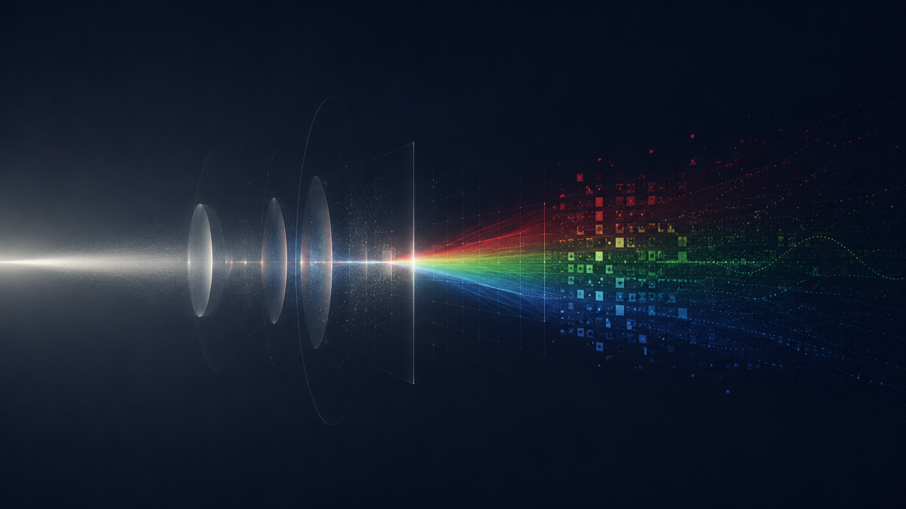

+++
date = 2026-06-25T20:54:26+09:00
lastmod = 2026-08-17T23:57:27+09:00
draft = false

title = "Digital Imaging from the Bottom Up - Introduction"
summary = ""
description = ""

isCJKLanguage = false

tags = ["digital imaging", "camera", "computer vision", "simulation",]
categories = ["academic"]

series = "Digital Imaging from the Bottom Up"
series_weight = 1

+++

The range of fields that involve digital imaging in one way or another is genuinely vast in the modern world. Photography, image processing, machine vision... even next-door neighbors like CG, rendering, and optical design fall into this territory. The field is that broad, and the people working in it are just as diverse. But as the whole pipeline grew, specialization deepened — and as specialization deepened, understanding of the full pipeline became increasingly superficial. What happens in between — how light leaving an object turns into RGB data — mostly remains a black box.

To be fair, this isn't much of a problem. "Superficial" is the uncharitable way to put it; the charitable way is that it isn't superficial at all — it's abstraction. Someone doing optical design has little need for image processing algorithms, and you don't need multiple view geometry to research object detection. Personally, I'd been harboring the somewhat curmudgeonly opinion that everyone ought to cultivate a better understanding, but strictly speaking, knowledge of the full pipeline was general literacy — nothing more, nothing less.

Then the era shifted toward physical AI, and this literacy found its excuse. Collecting massive amounts of training data in the real world is expensive, so making good use of synthetic data matters — and since physical AI requires physical interaction, simulators have become far more important than before. Consequently, the gap between simulation and reality needs to shrink (the so-called sim-to-real gap), and producing physically accurate images now requires reproducing this pipeline to some degree.

And although I disparaged it as a "curmudgeonly opinion" earlier, there always was meaning beyond general literacy. If you don't know whether RGB values live in a linear or nonlinear domain, you don't know where naive arithmetic breaks. If you habitually treat image noise as Gaussian, you run into trouble in low light. If you don't know that geometric error grows toward the image periphery, you can't analyze reprojection error. When indoor lighting causes flickering, you can't judge which parameter to change to fix it. Like a microphone and a speaker being the same data exchange run in opposite directions, knowing one side makes things obvious on the other. If you know moiré, you know why rendering needs mip-maps, and the essence of image acquisition can be expressed in the language of signal processing.

So this series walks through the whole journey, step by step: how light bouncing around physical space reaches a sensor and becomes a single image. Of course, textbook-level detail is omitted in places. Some omissions are honestly because I don't know enough, but more than that, the territory covered is already vast and overflowing with detail, so I ask your understanding that the resolution can only go so high. For each area, I tried to put the parts a layperson could follow... probably could follow, toward the front. The flow comes first, and then **details are quarantined behind a divider**, so skipping the details should leave the flow intact.

The first three chapters focus more on the camera itself, following light's journey in chronological order: how light reaches the sensor (Optics), how the arriving light is converted into an electrical signal (Sensor), and how the sampled data turns into an RGB image (Signal Processing).

The next four chapters lean more toward the robotics and 3D vision domain. What you need to know about space and time from the standpoint of sensor sampling (Spacetime), what characterizes 3D cameras (Depth Camera), and, building on those concepts, an understanding of LiDAR. Finally, for realistic simulation, we look at how the characteristics of each sensor come together — and although it isn't an optical system, the IMU gets a brief look at its noise model too, given how widely the sensor is used.

The final chapter covers rendering and inverse rendering. We retrace the entire pipeline backwards, closing out the journey of this series.

Obviously, not everyone needs to know everything in here. The useful portion may well be under half. Almost certainly under half, actually. So there will be plenty along the way that you can comfortably skip. Still, I hope this series provides enough coverage of the digital imaging field to serve as a rough map. I hope it becomes the kind of writing that sleeps in a corner of your memory, springs to mind one day out of nowhere, sends you digging deeper — and ends up helping you at work.
