+++
date = 2026-08-18T17:00:33+09:00
lastmod = ""
draft = false

title = "디지털 이미징의 총체적 이해 - 1. 광학"
summary = ""
description = ""

isCJKLanguage = true

tags = ["digital imaging", "camera", "optics", "lens", "aberration", "diffraction",]
categories = ["academic"]

series = "디지털 이미징의 총체적 이해"
series_weight = 2

[references.led_spectra]
title = "Caenorhabditis elegans as a model to study the impact of exposure to light emitting diode (LED) domestic lighting"
authors = "Abdel-Rahman F, Okeremgbo B, Alhamadah F, Jamadar S, Anthony K, Saleh MA."
doi = "10.1080/10934529.2016.1270676"

[references.macevoy_aberrations]
title = "Astronomical Optics, Part 4: Optical Aberrations"
authors = "Bruce MacEvoy"
link = "https://www.handprint.com/ASTRO/ae4.html"

+++

&nbsp;

광학계란 빛의 영역이다. 세상에 돌아다니는 빛이 어떻게 해서 센서까지 닿게 되는지, 그 사이 어떤 요소들을 지나는지에 대해 살펴보고, 광학적인 관점에서 '이상적'인 카메라란 무엇인지에 대해 살펴본다.

우선 빛에 대한 이해에서 출발하자. 여기서 미리 깔아두어야 이 챕터뿐만이 아니라 앞으로 계속해서 써먹게 된다.

## 빛에 대한 이해

### 직진성

**빛은 직진한다.** 이 명제는 단순하지만 단순하지 않다. 왜냐하면 우리는 눈으로 항상 빛을 받아들이고 있지만, 역설적으로 빛 자체를 순수히 관측하긴 어렵기 때문이다. 빛의 직진성은 그림자에서 관측된다. 빛의 진행 경로를 막고 있는 물체가 있다면, 빛은 닿을 수 없다. 

그런데 왜 직진성은 직관적이지 않을까? 공간상에서 빛은 직진하지만, 동시에 표면에서 다시 한번 흩어지기 때문이다. 어떤 공간에 빛이 있다면, 그 빛은 반사하여 공간을 가득 채우게 되고, 광원이 한 점이라고 해도 공간을 은은하게 채운다. 그럼에도 빛이 약하게 닿는 지점들이 생긴다. 이를 우리는 그림자라고 부른다. 우리는 빛의 부재에서 빛의 직진성을 발견할 수 있다. 

빛이 어떠한 물체에 닿을때, 물체의 표면의 특성에 따라 다음과 같은 현상이 이루어진다.

표면의 반사율에 따라 일부는 흡수되고 일부는 반사되며, 이렇게 반사된 빛이 다시 한 번 공간 전체로 퍼지며, 공간을 채워 나간다. 거울은 반사율이 아주 높으며, 들어온 각도대로만 빛을 반사하기 때문에 상이 유지된다. 반면 불투명하게 빛을 튕겨내면 우리 눈에도 그 빛이 들어와서 표면에 반사된 빛이 보이는 것이다. 이 중간으로는 빛이 대략적으로 들어온 각도대로 반사하되 살짝 퍼지는 단계가 있는데, 이때 우리는 살짝 반짝이되 거울같지는 않은 상을 보게된다. 이 빛의 반사에 대한 개념은 아래 이미지가 충실히 설명해준다.

빛이 만일 공간에서 튕겨다니지 않고, 단 한번만 튕긴다면 위 이미지의 0 bounces 와 같을 것이다.(아예 안튕기면 이미지가 생기지 않는다. 따라서 1회 튕겨서 바로 카메라로 직행한 이미지가 0 bounces, 표면에 튕기고 다른 표면에 한번 더 튕긴 렌더링이 1 bounce다.) 그러나 실제론 공간상을 튕겨다니며, 우리 눈에 들어오기까지 계속 반사된다. 위 이미지는 빛이 공간에서 몇번까지 튕길 수 있는지를 정해두고 렌더링한 결과물이다. 빛은 창 밖에서 들어오지만, 직접 닿지 않는 공간까지도 채워나가기 때문에 우리 눈에 직진성이 잘 들어오지 않을 뿐, 빛은 직진한다.

### 파동성

아마 어디서 풍문으로라도 들어봤을 소리인데, 빛은 파동이다. 파동은 공간상에서 어떻게 움직일까? 파동 또한 직진한다. 그러나 파동의 거동엔 재밌는 특성이 있는데, 바로 장애물을 만나면 휜다는 것이다. 회절이란 장애물의 가장자리에서 파동이 휘어져서 진행하는 현상이다. 이에 대해 재밌는 예시 이미지가 있다. 파도 또한 파동이며, 고로 회절한다.

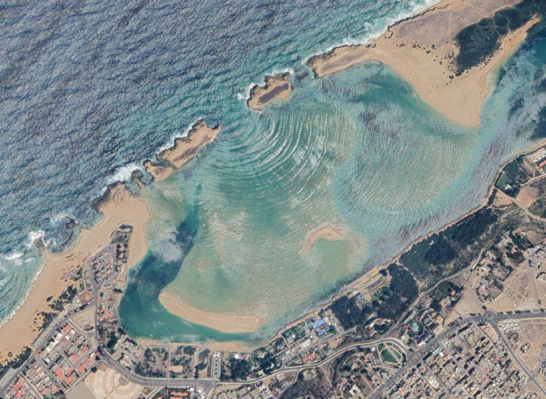

분명 장애물로 가려진 부분인데도 파도가 와닿는 모습을 볼 수 있다. 

소리 또한 파동이다. 기본적으로 직진하지만, 소리가 회절하는 덕분에 우리는 벽으로 막혀있음에도 불구하고 다른 방에서 나는 소리를 들을 수 있다. 회절은 파장이 길수록 더 잘 일어나며, 파장이 짧을수록 더 약해진다. 이를 라디오에서 체감할 수 있다. AM은 파장이 수백미터 단위인 중파를 사용하는데, FM은 파장이 미터단위인 초단파를 사용한다. AM은 회절을 더 잘하기 때문에 장애물에 더 강건하고, FM은 장애물에 더 약하다. 그래서 FM이 음질은 더 좋지만 치지직거릴 때, AM은 음질이 낮을지언정 더 잘 들릴 수 있다.

반면 가시광선은 어떨까? 가시광선의 파장은 약 400~700nm이다. FM의 백만배 넘게 차이가 난다. 따라서 빛의 회절은 정말 작게 일어나기 때문에, 우리가 위에서 봤듯이 빛이 대부분 직진한다고 여길 수 있는 것이다. 

그럼에도 빛의 회절을 보여주는 실험이 있다. 아마 중고등학교 물리 시간에 한번쯤은 배우지 싶은데, 이게 바로 유명한 이중슬릿 실험이다. 빛 또한 파동으로, 아래 이중 슬릿 실험을 통해 빛이 회절하는 모양을 관측 할 수 있다. 

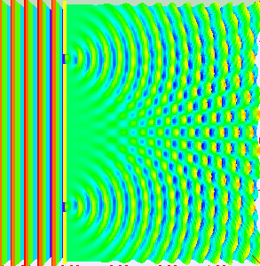

---

#### 더 깊이 - 파장의 수학

##### #1

자, 살짝 수학을 끼얹어보자. 장애물 구멍의 크기를 $D$, 파장의 길이를 $\lambda$ 라고 할 때, 회절각 $\theta$는 다음과 같다.

$$
\sin \theta \approx \frac{\lambda}{D}
$$

만약 문 폭이 1m, 가시광선의 파장을 400~700nm라고 한다면, 사실상 $\theta$는 0이 된다. 따라서 빛은 거의 회절하지 않고 직진한다고 볼 수 있다. 이 회절은 이중슬릿 실험과 같이 아주 작은 구멍이 될 때 유의미해진다. 

##### #2

더 가보자. 하위헌스의 원리에 따라, 파면의 모든 점은 각각 새로운 2차 파동의 파원이다. (이번에 글을 쓰면서 처음 알았는데, 이 정리가 나온 것은 1678년으로 이 가정으로 반사/굴절 법칙을 설명할 수 있었기에 순수 가설에 가까웠으며, 1882년에 키르히호프의 파동방정식의 정리로 인해 증명되었다.) 

이제 길이 $D$ 인 슬릿을 지나는 2차 파원을 전부 중첩하면, 슬릿 중점에서 관찰방향 $\theta$에서의 전기장 진폭은

$$
E(\theta) \propto \int^{D/2}_{-D/2}{e^{ikx \sin \theta} dx}
$$

로 나타낼 수 있다. (이 적분은 관측점이 충분히 멀다는 가정 위에 서 있다. 이를 프라운호퍼 회절이라 부르며, 렌즈가 있다면 그 '충분히 먼 곳'이 초점면으로 끌려온다. 뒤에서 센서면에 이 결과를 그대로 쓸 수 있는 이유다.)

여기서 한 가지 짚고 갈 것이 있다. 적분 구간이 곧 구멍의 모양이고, $e^{ikx\sin\theta}$ 는 푸리에 커널이다. 즉 **이 식은 개구 함수의 푸리에 변환이며, 회절무늬의 모양은 개구의 모양이 정한다.** 지금 푸는 것은 그중 슬릿 하나일 뿐이고, 나중에 원형 조리개를 넣으면 같은 적분에서 다른 함수가 나오게 된다.

$$
E(\theta) \propto \frac{2 \sin ({\frac{kD \sin \theta}{2}})}{k \sin \theta}
$$

여기서 식을 간소화하기 위해 다음과 같이 치환하자. ($k = 2\pi/\lambda$ 이다.)

$$
\beta \equiv \frac{kD \sin \theta}{2} = \frac{\pi D \sin \theta}{\lambda}
$$

그러면 진폭은

$$
E(\theta) \propto D \frac{\sin \beta}{\beta}
$$

로 정리된다. 다만 우리가 직접 보는 것은 진폭이 아니라 세기이고, 세기는 진폭의 제곱이다.

$$
I(\theta) \propto \left| E(\theta) \right|^2 \propto \left( \frac{\sin \beta}{\beta} \right)^2
$$

회절무늬의 중앙, 즉 $\theta \to 0$ 를 취하면, $\sin\beta/\beta \to 1$ 이라 가장 밝다. 처음으로 완전히 어두워지는 지점은 $\sin\beta = 0$ 이 되는

$$
\beta = \pi
$$

이며, 이를 $\beta$ 의 정의에 되돌리면

$$
\sin \theta = \frac{\lambda}{D}
$$

가 된다. 즉, 회절각 공식은 첫번째 극소의 위치이다. 회절된 에너지의 대부분(슬릿의 경우 약 90%)은 이 첫 극소 안쪽의 중앙 봉우리에 담긴다.

여기서 결론을 $\sin\theta$ 가 아니라 **$\beta = \pi$** 라는 형태로 기억해두자. 개구의 모양이 바뀌면 이 상수만 바뀌기 때문이다.

---

&nbsp;

### 스펙트럼

")

앞에서 파동에 대해 살펴봤다. 파장이 다르면 이름이 다를뿐, 사실은 전부 같은 전자기파다. AM의 파장이 중파(수백 m), FM이 초단파(m), wifi의 경우 마이크로파(cm)로 나뉘지만, 전부 전자기파이며, 빛 또한 전자기파이다. 적외선에서 가시광선, 가시광선에서 자외선, 더 나아가서 X-ray 까지, 전부 전자기파의 한 종류일 뿐이다. 위의 그림이 그걸 잘 보여주는 나사의 일러스트이다.

정리하자면, 전자기파의 일정 영역은 우리가 눈으로 감지할 수 있고, 그 영역을 가시광선이라 부른다. 우리가 평소에 빛이라 부르는 물건은 여러가지 길이의 파장을 가진 파동들의 집합이고, 빛은 안에 어느정도 파장 길이를 얼마나 많이 가지고 있는지로 분해할 수 있다. 따라서 빛을 표현할 때, 우리는 그 빛 안에 있는 각 주파수와 그 주파수의 세기를 나타낼 수 있고, 이걸 스펙트럼이라고 부른다. 태양광의 스펙트럼은 아래와같다.

가시광선이 제일 많지만, 피부암을 유발하는 자외선도, 열을 잘 전달하는 적외선도 많이 함유하고 있는 것을 볼 수 있다. 즉 이와 정반대되는 빛으로는 레이저가 있는데, 레이저는 단일 파장으로 이루어져 있다. 따라서 레이저의 스펙트럼을 보면 아래와 같다.

깔끔하게 단일 파장으로 이루어져 있는 것이 보인다. 아마 조명을 진지하게 사본 사람은 들어봤을 수도 있는데, 같은 백색광이라 하더라도 CRI(color rendering index)가 더 높은 조명은 이 스펙트럼이 더 풍부하게 구성되어 있다.

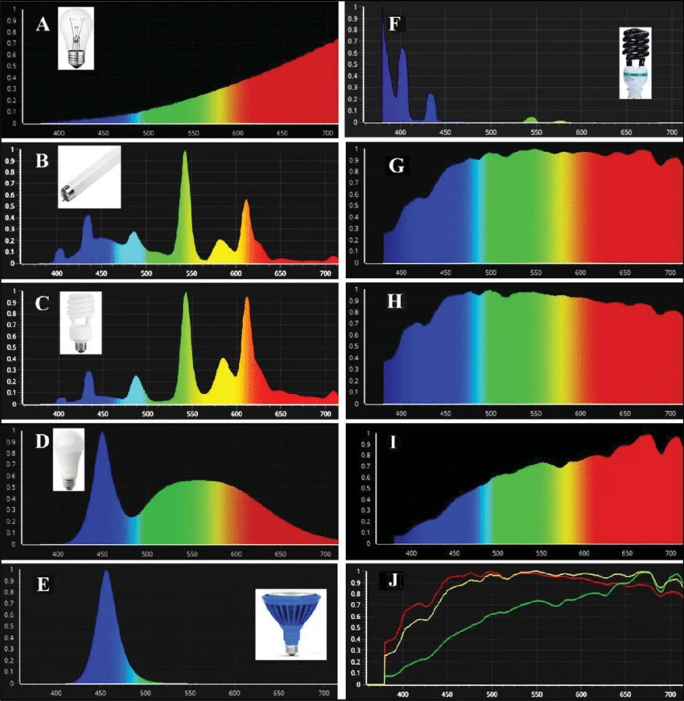

그러면 왜 같은 백색광으로 보이는데 더 스펙트럼이 균일한 비싼 조명이 필요한 것일까? 우리는 스펙트럼을 색으로 인지하기 때문이다. 예를 들어 위 그림에서 C와 D조명, 그리고 H태양광이 전부 완전히 같은 빛으로 느껴진다고 해보자. 그리고 어떤 파란색 물감이 정말 순수하게 새파란 색이어서, 파란 빛만 반사시키고, 나머지는 다 흡수한다고 해보자. 이 파란 물감은 햇볕 아래에서 볼 때와, C조명에서 볼 때와, D조명에서 볼 때가 전부 다른 색일 것이다. D조명 아래에선 태양광보다 더 강한 푸른 빛 성분으로 밝게 빛날 것이고, C조명에선 상당히 어두운 푸른색이 될 것이다. 

무지개에는 흰색이 없다. 흰색은 우리가 빛을 받아들이는 원추세포가 셋 모두 비슷한 비율로 활성화 될 때 우리가 생각하는 것일 뿐이다. (나중에 살펴보겠지만 흰색은 매번 움직이는 값이다.) 무지개에는 자주색(magenta)이 없다. 자주색은 색이 아니다.(정확히는 빛이 아니다.) 파장에는 존재하지 않는 개념이고, 우리 눈에 닿은 가시광선 중 녹색 파장 빛이 없을 때 우리가 받아들이는 느낌이다. 즉, 색은 빛의 파장을 해석하는 우리 고유의 시각일 뿐이다. 

&nbsp;

다음 파트로 이어가기 위한 징검 다리를 어거지로 하나 놓아보겠다. 파도의 피해를 예상할 때, 파장으로 표현하는 것을 본 적이 있는가? 아마 없을 것이다. 파도의 피해량은 파장이 아니라 파도의 높이가 결정한다. 즉 세기가 결정한다. 그런데 햇빛이 아무리 강해도 적외선은 피부를 데울 뿐이지만, 흐린 날에도 자외선은 피부에 해를 입힐 수 있다. 왜 그런가?

적외선은 따지자면 고무 공이고, 자외선은 쇠공이다. 아무리 고무공을 던져도 창문을 깰 수 없지만(없다고 쳐주자.), 쇠공은 하나만 던져도 창문을 깰 수 있을 것이다. 마찬가지로 적외선은 아무리 강해도 입자 하나가 가진 에너지가 작고, 자외선은 크다. 여기서 세기가 '입자의 양'과 '입자의 에너지' 두 가지 개념으로 분리될 수 있으며, 더 큰 세기의 빛은 '입자의 양'을 늘리는 것이고, 더 큰 주파수의 빛은(더 짧은 파장의 빛은) '입자의 에너지'를 늘리는 것이다. (광자 하나가 가진 에너지는 $E=h\nu$($h$는 플랑크 상수, $\nu$는 진동수)로, 진동수에 비례한다.) 이제 입자성에 대해 살펴보자.

### 입자성

아마 빛은 파동성과 입자성을 동시에 갖고 있다는 얘기를 들어보았을 것이다. 사실 어느정도 널리 알려진 것에 비해 빛의 입자성은 생각보다 늦게 증명되었다. 아인슈타인이 1905년에 광양자 가설을 제안하긴 했고, 1921년 노벨상 수상의 명분이 되었지만(이에 대해선 상당히 길고 정치적인 배경이 있다.), 실제론 1923년 콤프턴 산란이 증명하기 전까진 물리학자들 사이에 회의론이 꽤 있었던 것으로 알려져 있다. 

하여튼, 디지털 이미징에서 더 물리의 디테일에 대해 설명할 필요는 없지만, 빛은 입자성을 가지고 있다. 광자가 판을 때리면 전자가 나오는데, 이걸 광전효과라고 부른다. 카메라 센서는 이 광전 효과를 이용하는 것으로, 센서에 도달한 광자가 전자로 변환되며, 이 전자가 모여 전기 회로에서 감지된다. 따라서 카메라의 노이즈 특성의 설명엔 이 빛의 입자성이 필요하다. 따라서 카메라 노이즈는 포아송 분포로 모델링 하는데 이에 대해선 뒤쪽 카메라 센서에 대해 설명할 때 조금 더 자세히 설명하겠다.

### 정리

빛의 성질을 파동성과 입자성으로 나눌 수 있지만, 여기서는 굳이 굳이 네 개의 축으로 나누어보았다. 이 네 개의 축이 기본적으로 디지털 이미징을 이해하는 데에 필요한 네 가지 성질이고, 뒤에서 한번씩 건드리기보단 앞서 모아두는게 나을 것 같아서 이렇게 정리했다. 

**빛의 직진성**은 기본적인 모델링이다. 광학계의 축이고, 모든 렌더링의 방법이며, 그 근본적인 설계 원칙이다. 여기서 **빛의 파동**이 그 근본적인 설계 원칙의 한계로 주어진다. 색수차와 조리개 회절 한계 등이 여기서 기인한다. **스펙트럼**은 색의 한계이다. 사진작가들이 왜 raw 데이터를 필요로 하는지, 왜 한번 화이트 밸런스나 색 조정을 하고 나면 돌이킬 수 없는 손실 압축이 되는지, 색이랑 빛의 관계는 무엇인지에 대해 이해하는 데 필요하다. 마지막으로 **입자성**은 제일 제한적이지만, 기본적인 센서의 작동 원리에 대해 아는데에 있어 도움이 된다. 

기본적인 설명만 해도 길었다. 이제 이번 글의 나머지는 광학계에 대해 살펴보자.

## 광학계에 대한 이해

### 바늘구멍 카메라

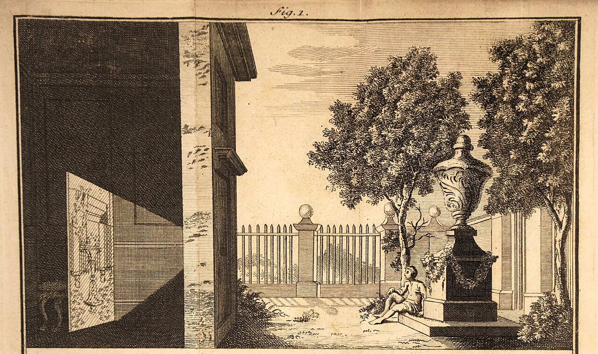

벽에 작은 구멍을 뚫고, 방을 어둡게 하면 벽에 바깥의 풍경이 뒤집혀서 보이게 된다. 이 현상을 최초로 기술한건 기원전 4세기경 묵자이고, 그 이유를 빛이 화살처럼 곧게 날아가기 때문이라고 설명했다. 이후 11세기 이슬람에서는 이 현상을 일식 관측의 실험 도구로 사용했다. 그 뒤로 주로 계측용으로 사용되었으며, 르네상스 시기를 맞이해 회화용도로도 사용되었다. (*'이 장치로 상을 베껴 그리면 그림을 못 그리는 사람도 그릴 수 있다' - Giambattista della Porta, Magia Naturalis*) 이 장치를 사람들은 '어두운(obscura) 방(camera)'이라고 불렀다. 아래 영상을 통해 이 현상을 실제로 볼 수 있다.



&nbsp;

여기서 살짝 이해가 어려울 수 있기 때문에 그림과 함께 설명을 더 해보겠다.

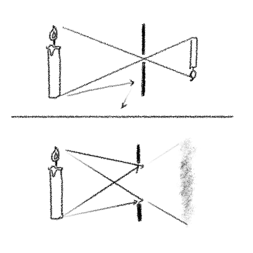

위쪽의 이미지는 구멍이 작게 뚫려있다. 벽에 생긴 상의 촛불 끝점의 기준에서 생각하면, 작은 구멍을 통해 보이는 부분은 촛불 끝밖에 없을것이다. 초의 바닥을 볼 수 없다. 즉, 이 지점에 닿을 수 있는 빛은 촛불 끝에서 나온 노란 빛 말고는 없다. 그런데 구멍이 커지게된다면, 바닥은 몰라도 초 중간까진 같이 보일것이다. 그려면 초의 불꽃 부분에서 나온 따듯한 빛 뿐만 아니라, 파라핀의 탁한 백색 빛마저 이 지점에 닿을 것이다. 즉, **이 벽에는 여러 지점에서 온 빛이 한꺼번에 닿게 된다.**

따라서 바늘구멍 카메라의 의미는, '어떠한 지점에 한군데에서만 온 빛만 선택적으로 닿도록 해주는 장치'이다. 그래야 상이 맺히기 때문이다. 조금 더 말을 풀어내자면, '세상과 상을 1대1로 매칭하도록 하는 장치' 가 된다. 그리고 이 현상은 빛이 직진해야지만 이루어질 수 있다. 

아주 작은 구멍을 통한 카메라이기 때문에 이를 **'바늘구멍 카메라'** 라고 부르며, 이것이 모든 카메라 모델의 원류가 된다. 시대에 따라 이 상이 맺히는 평면은 그냥 그림을 그리는 도화지가 되기도 했고, 화학 약품이 발린 필름의 위가 되기도 했으며, 전자 센서의 위가 되기도 했다.

### 렌즈

그런데 '진짜' 바늘구멍 카메라엔 꽤 문제가 있었다. 정말로 바늘 구멍 하나만 뚫으면 당연히 들어오는 광량이 작을 것이고, 어두울 것이다. 반면 밝게하기 위해 구멍을 키우면 상이 흐려지다가 종내에 완전히 무너지고야 만다. 당연히 선명한 사진엔 메리트가 있다. 그런데 밝은 사진엔 어떤 메리트가 있는가? 광량이란게 왜 중요한가?

혹시 초기 카메라에 대해 들어보았는가? 1826년 조제프 니세포르 니엡스가 최초로 사진을 찍었는데, 여러 문헌엔 8시간 동안 노출했다고 하지만 현대 연구자들은 최소 며칠을 추정한다.(태양의 방향으로 인해서) 물론 이땐 빛에 반응해서 상을 남기는 감광제의 문제가 더 심각했지만, 결국 같은 감광제라고 한다면 더 잘 반응할수 있도록 빛을 많이 주는것도 중요하다. 그러면 어떻게 구멍크기를 키워서 빛을 더 많이 받아들이며, 동시에 바늘구멍 없이도 선명한 상을 맺히게 할 수 있는가?

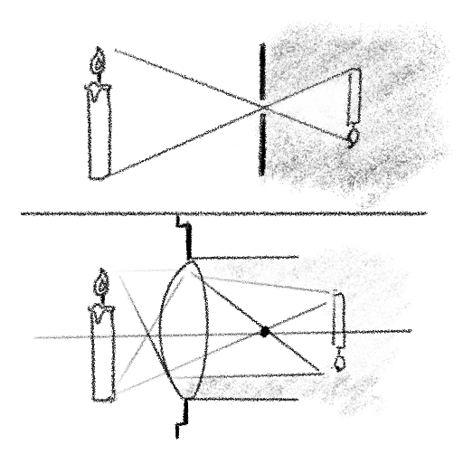

그 문제를 해결한 것이 바로 렌즈이다. 렌즈를 사용하면 빛을 강제로 모을 수 있다. 따라서 구멍을 크게 열면서도 빛을 모을 수 있고, 상을 만들 수 있다.

---

#### 더 깊이 - 얇은 렌즈와 두꺼운 렌즈

여기서부턴 조금 더 렌즈설계에 대해 설명해보겠다. 우선 여기서부턴 조금 복잡해진다. 하나 깔고가자면, 이 렌즈 설계에서 용어는 정말 정말 헷갈린다. 우선 컴퓨터 비전(computer vision, 이하 cv)과 카메라 모델에 대한 지식이 있는 사람에게 이쪽은 추상화 아래의 영역이다. 결과적으로 렌즈 관점에서 사용하는 용어와, 추상화 위쪽에서 정의한 용어가 종종 충돌한다. 그리고 사진 커뮤니티에선 용어의 오용이 꽤 많다. 그리고 자체적으로 중복이 많은데, stop이라는 단어는 정말 많은 것들을 동시에 표현한다. 결과적으로 렌즈설계, 카메라, 영상기하 세 분야중 렌즈설계쪽만 개념이 탄탄하게 잡혀있다. 

그런데 반대로 얘기하면, 추상화 위쪽에서 정의 할 수 있었다는건, 그렇게 정의해도 cv쪽에선 아무 문제가 없다는 것이기도 하다. 따라서 **이 부분은 그냥 생략해도 아무런 문제가 없다.**

자, 그럼 이제 어디부터 어디까지 추상화 대상인지 명시해보자. 일반적으로 cv의 영상기하학에선 이상적인 바늘구멍(pinhole) 모델을 가정한다. 모든 광선이 지나는 이상의 모델로 카메라를 피팅하는데, 실제로는 그렇진 않기 때문에 잔차 오차가 생길 수 밖에 없는 모델이다. 영상기하쪽에선 이 글에선 다루지 않도록 하고, 카메라 렌즈를 가벼운 설계부터 복잡한 설계까지 하나 하나 살펴보자.

우선 간단한 용어정리.

- Optical center : 앞서 말한 바늘구멍 모델의 가운데 점을 말한다. 모든 빛이 지나는 점이다.
- Focal Point : 무한대의 거리에 있는 빛은 평행 광선이 되는데, 이 빛이 렌즈를 지나며 모이는 점이다.
- Optical Axis : 광축. 렌즈의 가운데 점을 지나는 점은 굴절되지 않는데, 이 축을 얘기한다.

광학설계가 정말 헷갈리는 점은, 간단한 개념에서 출발해서 하나씩 얹어가는 과정이 불가능 하단 점이다. 예를들어, 덧셈을 정의하고 덧셈의 반복으로 곱셈을 정의할 수 있다. 즉, 한 계단씩 올라가는 것이다. 그러나 광학설계에선 간단한 개념이 처음 나온다음, 그 개념이 분화되어서 다시 생각해봐야하는 일이 반복된다. 다시 한 번 말하지만 이건 정말 쓸데없고(실무관점에서) 복잡하다. 괜히 카메라 커뮤니티와 cv 커뮤니티가 이 개념에서 멀어진 것이 아니다.

##### 얇은 렌즈



위 그림에서 거리 셋을 정의할 수 있다. 렌즈에서 물체까지의 거리 $u$, 렌즈에서 이미지까지의 거리 $v$, 그리고 초점까지의 거리 $f$. 각 거리에 대해, 렌즈 공식 

$$
1/f = 1/u + 1/v
$$ 

가 성립한다. (여기서 말하는 초점거리는 cv의 focal length와 별개다.) 여기서 조절할 수 있는 실제 렌즈의 수치는 $f$로, 굴절률의 영향을 받는다.

이 때, 물체가 무한히 멀면($u \to \infty$) $f=v$ 가 된다. 쉽게 얘기해서, 태양광에서 볼록렌즈로 빛을 모아 뜨겁게 하는 그 지점이다. 헷갈릴까봐 미리 말하자면, 이미지 평면은 초점이 아니다. 벌써 헷갈릴텐데, 일상적으로 초점이 맞았다고 하는 용어를 자주 쓰기 때문이다. 실제로 초점을 이미지 평면에 맞춰버리면 센서가 탈 수 있다. 실제론 무한히 먼 물체를 찍는것이 아니라 더 가까운 물체를 찍기 때문에, 이미지가 선명하게 '초점이 맞았다'고 해서 초점이 이미지 평면상에 있는 것은 아니다. 

이 모델에서 optical center에 해당하는 점은 렌즈의 중심이다. 

##### 두꺼운 렌즈



여기서부터 조금 복잡해진다. 실제 렌즈는 얇은렌즈와 다르게, 두번의 굴절이 일어난다. 여기서 주 평면이 등장한다. H와 H'로 표현하는데, 광선이 한쪽 주평면으로 들어가면 반대쪽 주평면의 같은 높이에서 나온 것으로 모델링이 가능하다. 위 얇은 렌즈에서 렌즈의 가운데 평면이 둘로 나뉘었다고 보면 된다. 즉, 모든 근축 광선은 H까지 직진하고, H와 만난 점에서 H'로 평행이동 한다음, 굴절된다.

그래서 물체까지의 거리 $u$는 H에서, 이미지까지의 거리 $v$ 는 H'에서 재며, 초점거리는 두 개가 존재하는데, 물리적인 초점거리인 BFL(Back Focal Length)와 EFL(Effective Focal Length)로 나뉘게 된다.



Nodal ray는 렌즈를 통과하고 나서도 굴절되지 않는 광선을 얘기한다. 이 광선과 광축이 만나는 점이 nodal point(절점)가 된다. Nodal point는 주평면이 공기중에 있다면 주평면 위에 위치한다. 아까 초점거리는 cv의 focal length와 별개라고 했는데, 이번엔 사진 커뮤니티에서 단어의 오용이 좀 있다. 종종 파노라마 촬영을 위해서 카메라를 nodal point에 고정시켜야 한다는 설이 엄청나게 오용되고있다. 심지어 글을 작성하는 이 순간에도 구글에 검색해보면 ai가 그게 오용이라는 위키피디아의 링크를 걸면서, 동시에 nodal point를 기준으로 회전시켜야한다는 주장을 해버린다. 정확히 지금 이 모델상에서, optical center에 해당하는 점은 존재하지 않는다. 

---

&nbsp;

### 조리개

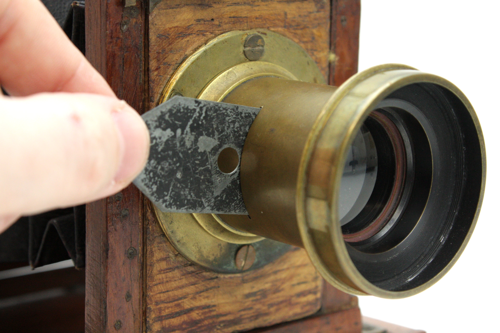

카메라 시스템에서 이제 필름이 받아들일 수 있는 빛은 두 가지로 조절 가능하다. 첫번째는 노출시간. 이걸 셔터스피드라고 부른다. 그리고 조리개. 조리개는 구멍의 크기를 바꿀 수 있는데, 조리개(aperture)는 초기엔 조절 가능한 것이 아니었다. 이걸 Stop이라고 불렀다.

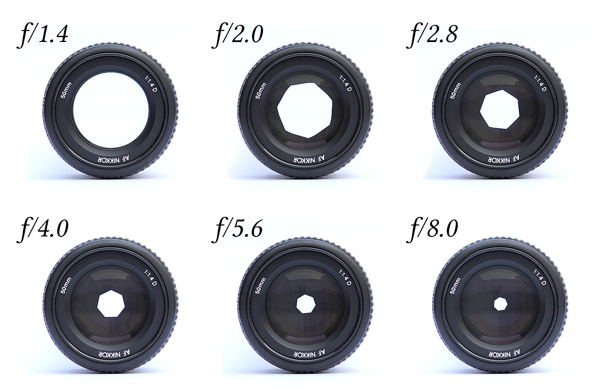

나중에 이 구조가 동적으로 구멍의 크기를 바꿀 수 있는 구조로 개발되었으며, 이를 조리개(aperture)라고 부른다. 조리개값을 칭할때 f값, 혹은 f-stop이라고 많이들 말한다. 여기서 stop 이라는 용어가 카메라의 온갖곳에 쓰이는데, 한 stop차이나면 광량은 두 배 차이난다고 보면된다. 

---

#### 더 깊이 - No parallax point

앞서 서사를 위해 다소 정확도를 희생한 설명이 있다. 바로 stop의 개발 동기인데, stop은 이 뒤에 살펴볼 수차를 제어하는 용도로 개발되었다. 광학 시스템에선 두 개의 stop이 있으며, 그게 aperture stop(개구 조리개)과 field stop(시야 조리개)이다. 이에 대해선 생략한다.

그래서 사실은 stop과 렌즈 시스템이 이미 카메라의 개발 이전에 발명되었다. 따라서 stop과 렌즈시스템이 원래 있었고, 그 다음 카메라가 개발되었다. 이후 감광재가 발달하면서 점차 더 짧은 시간 노출이 가능해졌으며, 감광재의 발달로 손으론 제어하기 힘든 영역까지 노출시간이 짧아지며 기계식 셔터가 필요해졌다. 요즘 디지털 카메라 기준으로 맑은 날이면 셔터속도를 1/4000초를 해도 과노출이 될 수 있다. 따라서 조리개를 조여야한다. 이 당시 셔터속도는 그정도로 빠르지 않았으며, 결국 감광재의 발달로 조리개가 광량조절의 역할을 맡게 되었다.

##### f값

수식으로 보자면 다음과 같다.

- $N$ : F-Number. 조리개값
- $f$ : 초점거리(focal length).
- $D$ : 실제 조리개 지름(정확히는 입사동의 유효 조리개 지름)

$$
N=f/D
$$

따라서 f값을 $f/1.4$, $f/2.0$ 등으로 표기하는데, f값이 각 1.4, 2.0이 된다는 것이다. 이것도 역수 따라서 표기 따라 좀 헷갈린다. f값이 1.4라는 것인데, 즉 $D = f/1.4$ 라서 실제 조리개 지름이 $f/1.4$ 이다 라고 표기하는 것이다. 1.4는 $\sqrt 2$ 로, 광량은 면적에 비례하기 때문에 광량은 1/2이 된다. 여기서 한 스탑 더 간다면 $f/2.0$, 광량은 1/4. 그 다음이 $f/2\sqrt2 \approx f/2.8$ 이기 때문에 광량은 또 1/8이 된다. 위 조리개값과 면적에 대해 살펴보면 이해가 쉽다.

##### 조리개와 입사동

조리개는 여러 렌즈군의 사이에 위치한다. 이 때, 물체 방향에서 조리개를 본다면 조리개는 어디에 있을까? 조리개 앞에도 렌즈가 있으므로, 보이는건 조리개가 아니라 앞쪽 렌즈군이 만든 조리개의 상이다. 반면 뒤쪽에서 본다면, 조리개의 상은 또 반대쪽에 맺히게 된다. 물체 방향에서 본 렌즈의 상을 입사동, 센서쪽에서 바라본 렌즈의 상을 사출동이라고 부른다. 

이걸 왜 정의하냐면, 모든 빛은 조리개를 지나기 때문이다. 따라서 조리개면에서 이 조리개를 지나는 높이에 따라 추상화가 가능하기 때문에, 여러개의 렌즈군을 입사동(entrance pupil)과 사출동(exit pupil)으로 설명 가능하다. 실제로 앞에서 f값을 설명할때 D가 조리개 지름이 아니라, 입사 동공의 유효 조리개 지름인 이유가 결국 뒤쪽에서 입사동의 유효 조리개 지름을 기준으로 투영하기 때문이다. 이 구조를 예제로 보면 다음과 같다.



여기서 물체의 주 광선을 굵은 실선으로 표시하고, 조리개 끝을 지나는 광선을 옅은 실선으로 표시했다. 센서쪽에서 날아오는 광선의 연장선을 보면, 조리개의 상이 사출동에 맺히는 것을 볼 수 있다. 반대로 물체쪽에서 바라본다면, 조리개의 상이 입사동에 맺히는 것을 볼 수 있다.

##### 보케(Bokeh)

사진 커뮤니티와 친숙하지 않은 사람들에게 조금 더 설명을 하기 위해 이미지 한장을 준비해보았다. 일반적으로 초점이 안맞았다, 정도로 얘기할 수 있는데, 사진용어로는 이를 '보케' 라고 부르며, 초점이 맞지 않는 부분의 흐려진 것, 혹은 흐려지는 모양을 뜻한다.

여기선 광원이 강렬하게 퍼져있기 때문에, 한 점에서 온 빛이 어떻게 센서에 와 닿았는지를 직관적으로 볼 수 있다. 이를 예제로 보면 다음과 같다.



이 예제에서 볼 것이 몇가지 있다.

1. 이 예제에선 stop을 렌즈 앞으로 밀 수 있다. 굴절이 없기 때문에, 앞쪽에서 바라본 조리개면을 뜻하는 입사동이 완전히 stop과 동일해지는 것을 확인 할 수 있다.
2. 조리개를 완전히 조이면 어째서 모든 상이 선명해지는지를 알 수 있다.
3. Focus plane에 있는 물체는 조리개와 상관없이 선명한 상을 맺는다.
4. 모든 물체쪽 주 광선의 연장선이 전부 입사동의 중심을 지나는 것을 볼 수 있다.

자, 이제 사실상 이 모든 렌즈 설계를 가지고 유일하게 투영 기하에 적용시킬 수 있는것이 나온다.

##### No parallax point



일반적으로 파노라마 촬영에서 투영 중심을 중심축으로 회전을 해야지, 이동을 해버리면 파노라마 이미지가 망가지게 된다. 따라서 파노라마 촬영에 중요한 그 투영 중심을, no parallax point라고도 부른다. 이 점이 바로 **영상 기하학을 통해 찾는 카메라의 위치가 된다.** pivot position을 움직이다 보면 어떻게 돌려도 near 와 far가 같이 움직이게 되는 지점이 있는데, 바로 이 지점이 no parallax point 이자, 입사동의 중심이다.

만일 여기까지 성실하게 예제를 따라왔다면, 어째서 cv에서 아무도 camera pose가 물리적으로 무엇인지 신경을 안쓰는 이유를 어렴풋이 알았을 것이다. 여기서 문제. 초점을 어떻게 맞추는가? 정답은 렌즈군이 이동한다. 렌즈군이 이동하면 어떻게 되는가? 입사동의 위치가 바뀐다. **즉, 카메라를 고정시켜놓아도 초점을 맞출 때 카메라의 기준 위치가 움직인다.** 이 뿐만 아니라, parameter들도 이동한다. 이에 대해선 알아두는것이 나쁘지 않다.

---

&nbsp;

### 완벽한 카메라에도 생기는 오차

앞서 렌즈를 사용해서 우리는 광량을 얻었다. 그리고 초점거리를 조절을 할 수 있게 되었기 때문에 화각과 배율도 고를 수 있게 되었다. 당장 바늘구멍 카메라의 경우 그저 들어온 각도대로 나가기 때문에, 망원경은 렌즈 없이는 불가능 했을 것이다. 이 거래는 공짜는 아니었고, 얻은 것이 있기에 잃은 것도 있다. 순서대로 어떤것들을 주고 어떤것들을 잃었는지, 앞서 기하에 대해 다루었으니 그로 인한 특성을 기준으로 살펴보자.

##### 심도

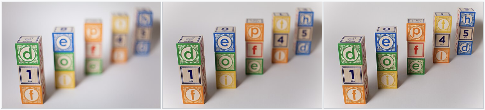

우선 바늘구멍 카메라에선 모든 면이 초점이 맞았다. 그러나 렌즈를 도입함으로써 초점면이라는게 생겼다. 가까이 있거나 멀리 있으면 상을 맺을 수 없다. 이건 아무리 이상적인 렌즈라고 하더라도 렌즈를 도입함으로써 들어오는 어쩔 수 없는 댓가이다. 물체가 초점면에서 멀어질수록 조금씩 빛이 센서에서 차지하는 영역이 커지게 된다. 초점면에서 멀어질수록 급격하게 센서에서 차지하는 영역이 커지면, 즉 흐려진다면 선명한 영역이 작을 것이고, 초점면에서 멀어지더라도 센서에서 차지하는 영역이 완만하게 커지면 선명한 영역이 상대적으로 클 것이다. 이를 피사계 심도라고 하고, 심도가 깊다는 것은 이렇게 선명하게 찍을 수 있는 영역이 크다는 것이다. 위 이미지 세장은 모두 같은 첫번째 블록에 초점을 맞춘 것인데, 피사계 심도가 왼쪽에서 오른쪽으로 갈 수록 점점 깊어지는 비교이다. 사족을 덧붙이자면 최근 핸드폰 카메라들이 더 좋아지면서 오히려 광학계의 피사계 심도가 너무 얕아져버렸고, 음식 사진을 찍을 때에 항상 소프트웨어 보정이 들어가게 되었다. 아마 최신폰으로 바꾸고 나서 오히려 음식 사진이 흐려졌다면 이것이 원인이다.

##### 보케(Bokeh)

위쪽에서 한번 쓴 사진이지만 (위쪽에선 조금 더 가보기 안에서 설명했으므로) 다시 가져오자면, 심도의 제한으로 인한 결과가 bokeh이다. 어두운 배경에 밝은 빛이 강하게 보일 때, 한 점에서 온 빛이 퍼지는 모양이 잘 보이게 되는데 이걸 보케라고 한다. 보케와 심도의 경우에는 사실 사진에 있어서는 미적 요소로 사용되는 느낌이 있고, 메인 피사체를 돋보이게 해줄 수 있는 장점이 있다. 물론, 영상 기하의 측면에서 보면 노이즈일 뿐이다.

##### 회절

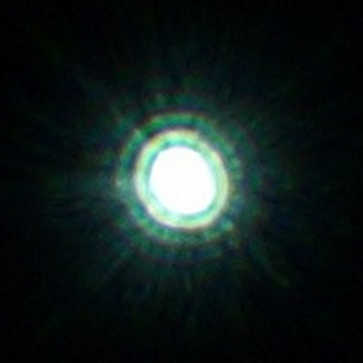

앞서 살펴본 회절이 조리개에 따라 다시 문제가 된다. 아까 회절은 극히 작아서 빛이 직진한다고 서술해놓고서, 왜 다시 얘기하냐고 한다면, **센서의 한 픽셀이 실제로 훨씬 작기 때문이다.** 예를들어 아이폰 17 pro의 메인 카메라를 살펴보자. 48메가 픽셀(8064*6048) 1/1.28인치 크기 센서를 쓴다. 그 소리는 한 픽셀당 물리적으로 차지하는 공간이 1.22µm라는 뜻으로, 1mm에 픽셀이 약 820개가량 들어간단 뜻이다. 따라서 **회절이 진짜 문제가 된다.** 회절은 빛이 지나가는 간격이 좁을수록 더 잘 일어난다.(앞서 조금 더 가보기에서 계산한 바가 있다.) 즉, 조리개를 조이면 빛이 한 픽셀 이상의 공간에 걸칠 정도로 회절이 일어나서 화질이 점차 열화되게 된다. 

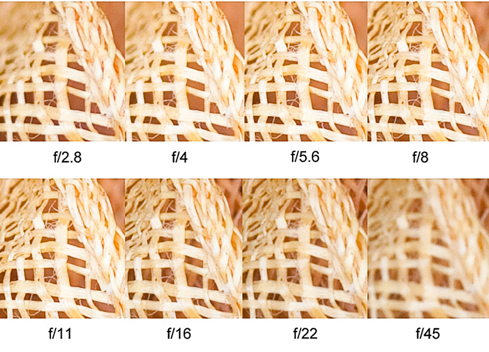

f/8에서 선명하던 이미지가, 오히려 조이개를 조일수록 더 흐려지는 것을 볼 수 있다. 빛의 회절을 고려하지 않은 이상적인 바늘구멍 카메라 모델에선 광량이 줄어들 뿐 더 선명해져야한다.

---

#### 더 깊이 - Airy Disk

##### 회절 예제



Aperture값을 조종하면 Airy pattern(에어리 패턴)이 커지는 것을 볼 수 있다. 세번째 패널은 이를 주파수 영역에서 본 것으로, 가로축은 공간주파수(1mm 안에 줄무늬 몇 쌍이 들어가는가), 세로축은 그 줄무늬가 얼마나 대비를 유지한 채 전달되는가이다. 이 곡선을 MTF(modulation transfer function)라고 부른다. 네번째 패널은 그것을 눈으로 확인하기 위한 차트로, 오른쪽으로 갈수록 줄무늬가 촘촘해진다. 조리개를 조여보면 MTF 곡선이 왼쪽으로 주저앉고, 그에 맞춰 차트의 오른쪽부터 뭉개진다.

여기선 픽셀 피치를 4.0µm로 가정했다. 줄무늬를 해석하려면, 픽셀은 줄무늬당 두개가 필요하다. 즉, 8µm로 줄무늬 하나를 담을 수 있는데, 따라서 125lp/mm 이상은 애초에 센서의 해상도가 충분하지가 않다.(센서면 상에서 정의된 줄무늬임에 유의) 이것이 Nyquist frequency다. 어떤 주파수를 에일리어싱 없이 담으려면 **샘플링 주파수가 그 두 배**여야 하고, 뒤집어 말하면 담을 수 있는 최고 주파수는 샘플링 주파수의 **절반**이라는 뜻이다. 파장으로 보자면 픽셀 간격의 두 배가 되고, 센서가 4.0µm 마다 샘플링하니 주기 8.0µm보다 굵은 신호까지만 유의미하게 구분한다는 것이다. 즉, 대략 f/14.5 이상부턴 센서의 해상도 이슈가 아니라 조리개 이슈이다. 이것보다 작으면 해상도가 부족한 것이다.

그런데 이건 정말 정보이론으로서의 최소한이고, 조리개값을 6.0으로 두면 한 픽셀이 딱 회절 패턴의 절반을 차지하는 것을 볼 수 있다. 이때 pixel Nyquist에서 MTF가 49%가 되는데, 이 지점즈음이 가장 무난한 지점이다. 이것보다 더 조리개를 열면 선명도는 피사계 심도 이슈로 떨어지거나, 혹은 에일리어싱이 생긴다. 여기서 더 조이면 주파수 이론으로서는 여유가 있지만, Airy pattern이 너무 커지면서 선예도가 다소 떨어지게 된다. 여기서 재밌는 것은, 조리개를 열었을 때 에일리어싱이 생긴다는 점이다. 즉, Airy pattern이 일종의 convolution kernel 역할을 하기 때문이며, 다시 말해 신호처리 관점에서 보자면 조리개는 광학적인 low pass filter가 된다.

하여튼, 앞서 살펴본 아이폰 카메라는 픽셀 피치가 1.22µm로 훨씬 작다. 계산해보면 Airy pattern이 픽셀 두 개에 걸치는 지점이 f/1.8정도인데, 실제 카메라가 이정도 조리개값을 사용한다. 여기서 픽셀 피치가 더 작아지면 큰 이득이 없다. 다만 여기서 더 줄이지 않는 이유는 실제론 픽셀 피치나 Airy pattern과 같은 광학계 쪽이 아니라, 센서쪽에 있다. 실제로 이미 아이폰 최대해상도는 오히려 픽셀을 묶어서 화소를 1/4만 쓰는것보다 어떤 조건에서는 더 안좋은 화질이 된다. (쿼드베이어 패턴이라 네이티브 48MP도 아니긴 하다.) 센서쪽은 나중에 다시 살펴본다.

##### 1.22λN의 유도

위의 예시에선 첫 암부에 1.22λN이란 숫자를 아무 설명없이 썼는데, 이에 대해서 유도해보자. 앞서 파동을 다룰 때 슬릿의 회절을 풀어 첫 극소가 $\beta = \pi$ 라는 결론을 얻었다. 그런데 조리개는 슬릿이 아니라 원이다. 그리고 그때 짚었듯이 회절무늬는 개구 함수의 푸리에 변환이므로, 개구가 바뀌면 같은 적분에서 다른 함수가 나온다. 이번엔 그 적분을 원으로 다시 풀어보자.

반지름 $R = D/2$ 인 원형 개구에 대해, 개구면의 점 $(r, \phi)$ 에서 관찰방향 $\theta$ 로 나가는 파의 위상차는 $kr\sin\theta\cos\phi$ 이다. 슬릿에서 했던 것과 같이 개구 전체를 중첩하면

$$
E(\theta) \propto \int_0^{R}\!\!\int_0^{2\pi} e^{ikr \sin\theta \cos\phi}r \; d\phi\;dr
$$

가 된다. 여기서 안쪽 적분(각도적분)에 대해 다음 0차 베셀 함수

$$
J_0(x) = \frac{1}{2\pi}\int_0^{2\pi} e^{ix\cos\phi}\; d\phi
$$

를 사용하면,

$$
E(\theta) \propto 2\pi \int_0^{R} J_0(kr\sin\theta)r\; dr
$$

로 줄어든다. 이제 베셀 함수의 관계식 $\frac{d}{ds}[s^n J_n(s)] = s^n J_{n-1} (s)$를 적분으로 살짝 바꾸면

$$
\int_0^{x} sJ_0(s)\;ds = x J_1(x)
$$

형상이 된다. 이를 이용하기 위해 원래 수식에서 $s=kr \sin\theta$로 치환하면

$$
E(\theta) \propto  \int_0^{R} J_0(kr\sin\theta)\,r\;dr
\\\;
\\ = \frac{1}{(k\sin\theta)^2}\int_0^{kR\sin\theta} s J_0(s)\;ds
\\\;
\\ = \frac{kR\sin\theta \; J_1(kR\sin\theta)}{(k\sin\theta)^2}
$$

가 된다. 여기서 슬릿에서와 같은 방식으로

$$
v \equiv k R \sin\theta = \frac{\pi D \sin\theta}{\lambda}
$$

를 정의하면

$$
E(\theta) \propto 2\pi R^2 \frac{J_1(v)}{v}
$$

가 된다. 슬릿에서 $\sin\beta/\beta$ 가 나온 자리에 $J_1(v)/v$ 가 들어앉은 것이다. 세기는 마찬가지로 제곱이며, 중앙에서 1이 되도록 규격화하면

$$
I(\theta) = I_0 \left[ \frac{2 J_1(v)}{v} \right]^2
$$

이다. 이 무늬를 Airy pattern(에어리 패턴), 첫 극소 안쪽의 중앙 원반을 Airy disk(에어리 원반)라고 부른다.

&nbsp;

이제 첫 극소를 찾자. 슬릿에서는 $\sin\beta = 0$ 에서 $\beta = \pi$ 였다. 원에서는 $J_1(v) = 0$ 인 첫 지점을 찾아야 하는데, 이 값은 해석적으로 떨어지지 않고 수치적으로

$$
v = j_{1,1} = 3.8317\cdots
$$

이다. 

$$
v = \frac{\pi D \sin\theta}{\lambda} \approx 3.8317
$$

$3.8317 / \pi \approx 1.2197$ 이므로,

$$
\sin \theta = 1.2197 \frac \lambda D
$$

여기서 각도를 센서 위 길이로 바꾸자. 센서 위 길이 $r$에 대해, $r=f\cdot \sin\theta$ 이므로,

$$
r = f\cdot 1.2197 \frac \lambda D = 1.2197 \lambda \frac f D = 1.22 \lambda N
$$

으로 정리된다. 즉, 1.22는 베셀함수의 첫 영점을 $\pi$로 나눈 값이며, 개구부가 원이라는 가정 하에 성립되는 값이다. 또한 수식이 깔끔하게 f값과 $\lambda$로 정리된 것을 볼 수 있는데, 사실상 파장은 조절 불가능한 값이므로 Airy disk의 크기는 조리개로 결정된다. 여기서 다시 위쪽으로 가서 이중슬릿 실제 이미지를 보자면, 파장이 긴 붉은 색이 더 많이 회절되어 더 멀리 뻗어나간 것을 확인 가능하다. 처음에는 빛의 여러 파장이 겹쳐서 있다가, 점차 편차가 커지면서 색이 더 또렷이 나타나는 것을 볼 수 있다.

한 가지 덧붙이자면, 중앙 봉우리에 담기는 에너지 비율도 개구 모양에 따라 달라진다. 슬릿에서 약 90%였던 값이 원형 개구에서는 약 84%가 된다.

---

&nbsp;

### 완벽하지 못한 카메라

지금까지는 이상적인 카메라라도 피할수 없는 영역이었다. 회절은 빛의 성질 때문에 일어나는 현상이었다. 굴절은 초점면, 즉 카메라가 세상과 센서 사이의 1대1 매핑을 확실하게 할 수 있는 영역이 한정되어서 일어나는 일이었다. 그러나 실제 카메라의 경우 그렇지 않다. **초점면 위의 점이라도 실제로 하나의 점으로 맺히지 못한다.** 그것을 수차라고 부른다. 그 외에도 몇몇가지 이상적인 이미지와는 별개의 일들이 일어나는데, 그에 대해 살펴보자.

##### 수차

사실 렌즈는 예전부터 구면이었다. 구를 가공하기가 제일 쉽기 떄문이다.(무작위로 둥글리면 구가 된다.) **그런데 사실 구면 렌즈는 점을 한점으로 모을 수 없다.** 아래 예시를 통해 볼 수 있다.



이 종류의 수차를 구면 수차라고한다. 초점면 위의 점, 즉 실제로는 한 점으로 모였어야 하는 점이 한 점으로 모이지 못하는 현상을 수차라고 부르며, 렌즈가 구면이라 발생하는 수차를 구면수차라고 한다. 이 종류의 수차에 이름이 붙어있단건 실제론 다른 종류의 수차들이 많다는 것이고, 이에 대해선 심화 내용에서 조금 더 살펴본다. 이 수차는 색과 상관없이 발생하는 수차이므로, 이를 단색 수차 라고 부른다. 

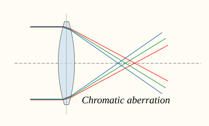

이와 반대되는 개념으로는 색수차가 있다. 파장이 길수록 굴절률이 작아지기 때문에, 같은 각도로, 같은곳으로 렌즈면에 진입하더라도 빛의 파장에 따라 경로가 다르다. 위의 개념도에서 적색파장(긴 파장)은 덜 휘고, 보라색에 가까운 파란 파장(짧은 파장)은 더 많이 휜 것을 볼 수 있다. 실제 사진 예시는 아래와 같다.

.jpg "아래쪽은 저가의 렌즈. 색수차가 심하다. wikipedia : Chromatic aberration (comparison).jpg, CC BY-SA 3.0")

##### 왜곡

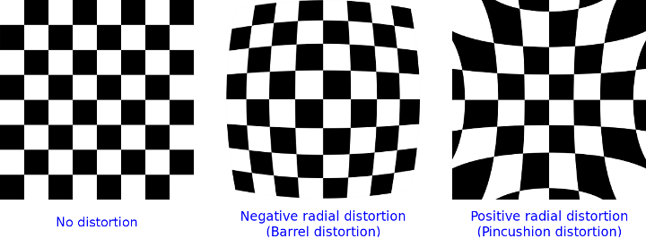

자세한건 여기선 생략하겠지만, 조리개 또한 이슈를 낳는다. 그중에 하나는 왜곡이다. 왜곡은 빛이 맺혀야할 원래 위치가 아니라 다른 위치에 맺히는 현상이다. 자이델의 5대 수차라는 것이 있는데, 그 중에 하나는 왜곡으로, 왜곡도 수차로 취급되기도한다. 재밌는 사실은 왜곡이 현대 렌즈에서 가장 관대한 허용치를 갖는다는 점인데, 다른 수차들의 경우 상 자체가 흐려지는데에 반해 왜곡은 상의 위치를 바꿀 뿐이기 때문이다. 상 자체가 흐려지면 어떻게 할 방법이 없지만, 왜곡의 경우에 나중에 소프트웨어 처리를 이용해서 교정 가능하다.

##### 비녜팅

비녜팅은 이미지의 가장자리가 더 어두워지는 현상이다. 비녜팅의 원인은 정말 다양하고, 나중에 더 살펴볼 것이다. 원인으로는 우선 센서 가장자리로 갈수록 광선이 비스듬해진다는 점이 있다. (겨울에 더 추운 그 이유) 그 외에도 실제로 가장자리쪽이 광선의 진행 경로가 더 길단점도 있을것이고, 경통이나 조리개가 가장자리를 더 많이 가리기 때문이기도하다.

##### 플레어

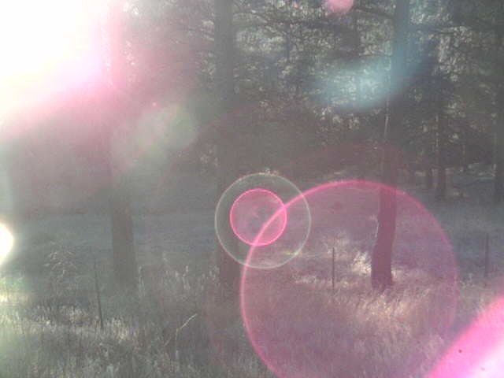

용어가 완전히 정착하진 않은 분야인데, 원인은 두개가 있어서 여기서 용어를 좀 다듬으면서 설명해보겠다. 위 이미지에는 두개의 상이 둘 다 들어있다. 둘 다 강한 빛이 들어올때 광학적으로 올바른 경로로 들어오는 빛이 아닌, 다른 잡광들이 유입되면서 생기는 현상이다. 우선 아래 사진을 보면 왼쪽위에서 들어온 빛이 사진 전체에 번져있는 것을 볼 수 있다.

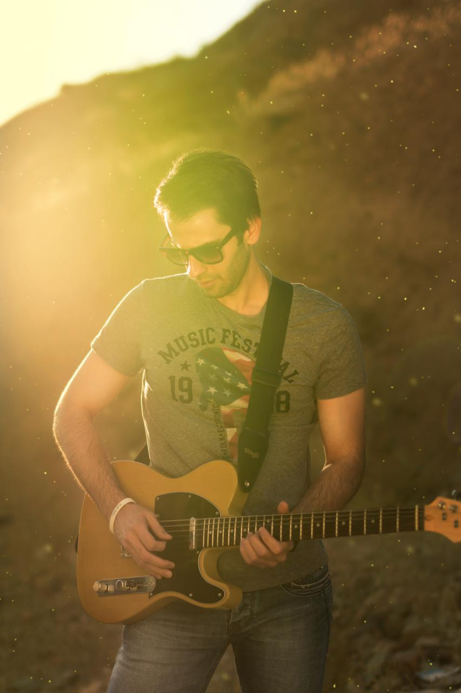

주로 플레어(flare), 세부적으로는 veiling flare·glare 등으로 부르는 현상인데, 강한 빛이 렌즈의 이상적인 경로를 따르지 않고 여러 방향으로 산란되면서 일어난다. 정면이 아닌 비스듬하게 들어오는 빛에서 종종 생기며, 그 외에는 주로 뭔가 결함때문에 생긴다. 예를들어 유분기등 렌즈의 오염(스마트폰 렌즈가 뿌옇다면 한번 닦아주자), 스크래치, 습기 등이 있다. 

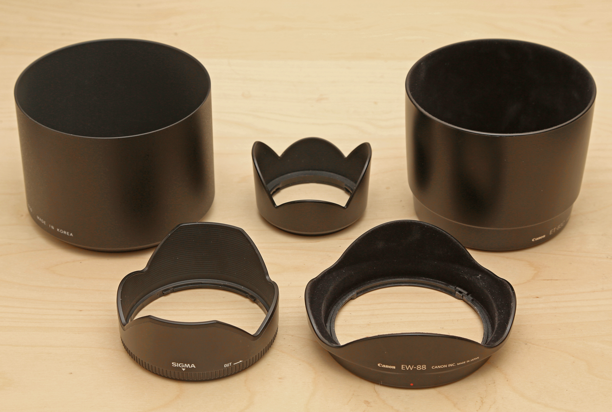

사진가들이 가지고 다니는 카메라에서 렌즈 앞에 있는 것을 후드라고 하는데, 강한 빛이 옆에서 들어오면 더 번지기 쉽기 때문에 강한 측광을 막기 위해서 사용한다. 

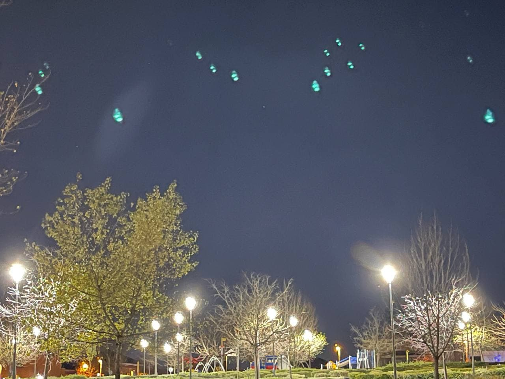

반면 이 사진은 고스트(ghost flare, ghosting, lens ghost)를 보여준다. 이건 빛이 너무 강해서 렌즈들 사이에서, 혹은 센서면에서 반사될 때 생긴다. 들어온 빛이 어디선가 반사되고, 다시 반사되면서 센서로 들어올 때 생기며, 현대에선 주로 반사 방지 코팅을 통해 잡는다. 이 두개의 설명을 보면 위의 렌즈 플레어 이미지를 다시 보고 서로 다른 두개의 원인을 찾을 수 있다. 화면 좌상단에는 빛이 번져서 생긴 상이, 중앙과 왼쪽 아래쪽으로는 강한 빛이 어디선가 튕겨서 다시 돌아온 것을 볼 수 있다.

### 심화 - 수차

#### 스넬의 법칙과 근축광학

자, 이제 의도적으로 피했던 용어를 여기선 다뤄보겠다. 바로 근축(Paraxial)이라는 용어다. 사실 모든 렌즈설계는 스넬의 법칙(Snell's law)에 종속되어있다. 스넬의 법칙은 다음과 같다.

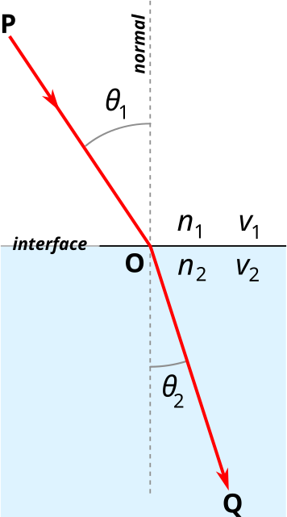

$n_1, n_2$는 각 매질에서의 굴절율, $\sin \theta_1, \sin \theta_2$ 는 각 매질에서의 굴절각이다. 이 때,

$$
n_1 \sin \theta_1 = n_2 \sin \theta_2
$$

가 성립하며, 이는 절대적인 기본 법칙이다. 그런데 광축근처의 작은 영역에 대해선 $\sin \theta = \theta$ 근사를 사용할 수 있다. 이 근사를 기저로 성립시킨 광학이 '근축 광학(Paraxial Optics)'이라고 불리며, 가우스 광학이라고도 부른다. 이 광학에선 다음 근사를 활용한다.

$$
\frac{n_2}{n_1} = \frac{\sin \theta_1}{\sin \theta_2} \approx \frac{\theta_1}{\theta_2}
$$

그러나 이에는 한계가 있고, 현실 물리법칙이 이를 만족하지 않아 생기는 오차들을 수차라고 부른다.

&nbsp;

#### 자이델의 5대 수차와 색수차

루드비히 폰 자이델이 5가지의 단색 수차를 정의했으며, 이게 가장 기본적인 수차이다. 현대 렌즈 설계는 이 5대 수차가아닌, 실제 광선 추적을 통해 진행하는 것으로 알고 있지만 이에 대해선 개인적으로 정확한 지식이 없기 때문에 기본적인 5대 수차에 대해 살펴보고 수차에 대해선 넘어가도록 하려한다. 실제로 여전히 수차에 대해서 말할 때는 이 5대수차를 사용한다. 수차의 특성을 잘 설명해주기 때문이다.

우선 수차에 대해 알아야 할 두가지 파라미터는 바로 동공 좌표 $\rho$와 상고 $h$ 이다. 동공 좌표 $\rho$ 는 광선이 지나는 입사동에서의 위치이다. 상고 $h$는 이미지에서 상이 광축과 얼마나 떨어져있는지이다. 즉, 각각 조리개에서 광축과 떨어진 거리와 상면에서 광축과 떨어진 거리이다. 하나의 상은 조리개면의 모든 영역을 지난다. $\rho$는 '조리개를 얼마나 개방하느냐' 에 따라 바뀌는 특성이라 볼 수 있고, 상고 $h$는 '이미지의 중앙에서 얼마나 떨어졌느냐' 라는 특성으로 볼 수 있다. 아래 데모를 통해서 개념을 잡길 바란다.



수차는 $\rho$, $h$, 그리고 둘 사이의 각, $\theta$ 에 대해 $\cos\theta$ 3가지 항으로 정의가능하다. 이에 대한 의미는 수차 이후에 다시 살펴본다.

&nbsp;

##### 구면수차 (Spherical Aberration)

$$
W_{spherical} \propto \rho^4
$$

구면수차에 대해서는 이미 위 예시를 통해 살펴보았다. 앞서 살펴본  $\rho$ 와 $h$ 중에, $\rho$ 에만 의존하는 수차이다. 즉, 상고 - 이미지의 어디에 찍혔는지와 상관없이 이미지 전체가 뿌옇게 되는 효과가 있으며, 근축광학이 성립하지 않는 렌즈의 가장자리에서 더 강해지는 수차이기 때문에 렌즈의 가장자리 빛을 억제하도록 조리개를 조이는 것으로 잡을 수 있다.(사실 대다수 수차들이 조리개를 조이면 잡을 수 있지만.) 

&nbsp;

##### 코마 수차 (Coma Aberration)

$$
W_{coma} \propto h\rho^3 \cos \theta
$$

상고에 선형적으로 비례하는 수차로, 구면 수차와는 다르게 상고 항이 추가되어서 화면 주변부로 갈수록 커지는 것을 볼 수 있다.



&nbsp;

##### 비점수차 (Astigmatism)

$$
W_{astigmatism} \propto h^2\rho^2 \cos^2 \theta
$$

비점수차의 경우엔 sagittal(구결) focus와 tangential(자오) focus 면이 다르게 형성되는 것을 볼 수 있다.



&nbsp;

##### 상면만곡 (Field Curvature)

$$
W_{field} \propto h^2\rho^2
$$

상면 만곡은 최적 초점위치가 $h^2$ 에 비례해서 앞으로 이동하는 특성을 가지고있다. 결과적으로 가운데에 초점을 맞추면 상고가 높은 부분은 초점이 맞지않고, 상고가 높은 부분에 초점을 맞추면 가운데에 초점이 맞지 않는 이미지를 볼 수 있다. 아래 예제의 초점면은 조금 과장되어있긴하다.



&nbsp;

##### 왜곡 (Distortion)

$$
W_{distortion} \propto h^3\rho \cos \theta
$$

여기서 왜곡의 특성에 대해 오해를 할 수 있어서 미리 얘기해볼 것이 있다. 수차가 대략적으로 어느정도 크기다 하는 데에 사용하기엔 수차항 자체를 보는게 맞지만, 실제로 그 특성에 대해 알기 위해선 실제론 파면항의 광선위치 오차로 봐야한다. 이미 위에서 상면 만곡을 설명하기 위해선 초점면의 $\delta z$ 를 설명을 했어야했는데 전혀 설명을 하지않았다. 그래도 특성 자체를 이해하는데엔 이미지만 보면 되므로 큰 문제가 없지만, cv에 있어서 정말 중요한 특성이므로 조금 더 덧붙여야한다. 자세한 설명을 너무할 정도로 생략을 해보자면, 

$$
\frac{\partial W}{\partial x} \propto h^3 , \frac{\partial W}{\partial y} = 0
$$

이므로, 동공의 위치와 상관없이 광선이 shift되는 개념으로 봐야한다. 따라서 수차항에 W 가 있다고 하여서 조리개를 조이면 왜곡이 줄어들고 그러진 않는다.



여기서 단색 수차 중 왜곡의 경우 현대 렌즈설계에 있어서 가장 관대한 항이다. 왜냐하면 다른 수차의 경우 결상에 지장을 주는 반면, 왜곡의 경우엔 평행이동이라는 특성이 있기 때문에 나중에 영상처리를 통해서 거의 완벽하게 복원해낼 수 있기 때문이다. 따라서 이 항이 cv 관점에선 거의 유일하게 중요한 수차가 되고, 반대로 사진 촬영 측면에선 거의 중요하지 않은 항이 된다. (그리고 다소 distortion이 있어도 사진을 감상하는 데엔 별 문제가 되지않는다.)

&nbsp;

##### 색수차(Chromatic Aberration)

색수차의 경우 축상 색수차와 배율 색수차 두개로 나뉘어진다. 위 이미지에서 축상 색수차는 축 방향으로 일어나는 색수차이기 때문에 상고와 상관없이 일어나고, 배율 색수차의 경우 상고에 영향을 받는다. 그 외에 아래 예제에서 control knob로 주어진 아베수라는 개념에 대해 간략히 설명하자면, 색수차의 대략적인 지표이다. 굴절력이 크면 당연히 색이 더 많이 벌어질 것이기에 색수차의 품질 지표를 '단위 굴절력당 색수차'로 정한 것인데, (정확히는 역수) 아베수$V$는 다음과 같이 정의한다.

$$
V_d = \frac{n_d - 1}{n_F - n_C}
$$

여기서 $n$은 각 색에서의 굴절률로, $n_F$ 는 청록 486.13nm, $n_d$는 노랑 587.56nm, $n_C$ 는 빨강 656.27nm 이다. 즉 아베수는 (평균적인 굴절력/색에 따른 굴절력 변화)라고 볼 수 있다. 왜 각 색을 저렇게 정했는지는 프라운호퍼 선을 검색해서 참고하면 된다. 여기 예제에도 프라운 호퍼선이 사용된다.

**축상 색수차 (axial / longitudinal chromatic)**



&nbsp;

**배율 색수차 (lateral / transverse chromatic)**



---

#### 더 깊이 - 수차 공식

##### 렌즈 설계의 불변량

파면에 대해 정의하기 위해, 광선이 어디를 지나는지 추적한다고 해보자. 여기서 중요한건 조리개면과 이미지 면의 어디를 지나는 광선인지를 추적해야한다. 이 관점에서, 동공좌표와 상 좌표가 각각 $\rho_x, \rho_y, h_x, h_y$ 라고 해보자. 이러면 4자유도이다.  

$$
\vec \rho = (\rho_x, \rho_y) \; , \quad  \vec h = (h_x, h_y)
$$

그러나 렌즈의 경우 광축에 대해서 회전 대칭이기 때문에, 자유도 하나가 퇴화된다. 결국 렌즈기하에서 중요한건 각 벡터의 크기 둘, 각 벡터의 상대각 하나로 정의 가능하며, 이 때 불변량 세개는 다음으로 정의 된다.

$$
h^2 = \vec h \cdot \vec h \; , \quad \rho^2 = \vec \rho \cdot \vec \rho \; , \quad h\cdot\rho
$$

결과적으로 불변량은 다음과 같이 표현하게 된다.

$$
h = \sqrt {\vec h \cdot \vec h}\; , \quad \rho = \sqrt{\vec \rho \cdot \vec \rho} \; , \quad \cos \theta = \frac{\vec h \cdot \vec\rho}{h\rho}
$$

##### 수차의 정의

이 때, 수차라는 것은 무엇이냐 하면 실제 광학계의 optical path에서, 이상적인 optical path와 실제 optical path의 차이를 말하는 것이다. 이 수차 W에 대해 다시 $x, y, z$ 좌표를 정의해보자. 

- $x$ : 입사동 평면중 광축에서 멀어지는 방향(소위 tangential)
- $y$ : 입사동 평면중 광축과 수직인 방향(소위 sagittal)
- $z$ : 입사동 평면과 수직한 광축방향

여기서 수차는 optical path의 차이로 주어진다고 했다. 여기서 수차의 차수에 따라 수차의 거동특성이 달라진다.

- $W=C$ : 파면 전체의 위상이동
- $W=ax$ : 파면의 기울기가 생겼다 = 상 점이 이동한다.
- $W=ax^2$ : 파면 곡률이 변화한다 = 초점이 이동된다.

여기서 파면 전체가 위상이동된다는건, 경로는 달라지지 않은 채로 위상차이가 나서 도달 시점이 달라진다는 것이다. (이걸 piston이라고 부른다.)

##### 불변량과 5대수차

자, 이제 마지막. 수차 $W$는 어떻게 기술해야할까? 불변량 세개를 이용하여 기술 가능하다. 이 때,

$$
W = f(h^2, \rho^2, h\rho \cos \theta)
$$

가 되는데, 이 특성을 기술하기위해 taylor 전개를 하면 다음과 같아진다.(세 불변량은 각$u,v,w$ 로 치환하면)

$$
\begin{aligned}
W &= f(h^2, \rho^2, h\rho \cos \theta)
\\
&= f(u,v,w)
\\
&=C
\\
&+C_u u +c_v v + c_w w
\\
&+ \frac12 C_{uu} u^2 + C_{uv} u v + C_{uw} u w + \frac12 C_{vv} v^2 \cdots
\end{aligned}
$$

여기서 상수는 piston이며, 1차항에 대해 생략한다. 2차항이 바로 우리가 보는 5대 수차가 된다.(2차항이지만, 기저 불변량이 각 2차라서 4차항이라고 부른다.)

예를들어 구면수차는 다음과 같다. 

$$
v^2 = \rho^4
$$

구면수차는 상고에 영향을 받지 않으므로, 이미지 중심에서도 발생한다. 이에대해선 이미 위에서도 대락 설명했다. 

##### 왜곡을 통해 수차에 대해 이해하기

조금 더 이 숫자에 대한 그림을 그려보자. 상고를 고정하고 $\rho$에 대해서 살펴보는 것은, 각 pupil 위치에서 광선 방향이 얼마나 틀어졌는지를 설명하는 것이 된다. 이런 관점에서 수차중 왜곡에 대해 살펴보자.

왜곡은 위 전개식에서 $C_{uw} u w$ 자리, 즉 $h^2$ 와 $h\rho\cos\theta$ 가 곱해진 항이다.

$$
W_{dist} = C h^3 \rho \cos \theta = C\, h^2\, (\vec h \cdot \vec \rho)
$$

$h\rho\cos\theta$ 를 원래의 내적으로 되돌려 놓은 것이 오른쪽 형태인데, 이렇게 써두면 $\vec \rho$ 가 내적 안에 1차로만 들어있다는 것이 눈에 보인다. 여기서 $\vec \rho$ 에 대한 gradient를 취하면,

$$
\nabla_\rho W_{dist} = C h^2 \, \nabla_\rho (\vec h \cdot \vec\rho) = C h^2 \vec h
$$

가 된다. 여기서 $\vec \rho$ 항이 남지 않기 때문에, 동공의 어디를 지나던 파면의 기울기가 똑같이 변화한다는 것을 볼 수 있다.

이제 이 기울기를 센서 위의 길이로 바꾸자. 광선은 파면의 법선이므로, 파면이 기준 구면에서 어긋나면 그만큼 광선 방향이 틀어지고, 사출동에서 상면까지 날아가는 동안 그 각도가 길이가 된다. 즉 상면에서의 오차, 곧 횡수차 $\vec\epsilon$ 은

$$
\vec \epsilon \propto \nabla_\rho W
$$

이다. 비례상수는 사출동에서 상면까지의 거리 같은 계의 기하가 정하는 값이고, 지금 보려는 특성에는 관여하지 않으므로 접어두자. 왜곡을 넣으면

$$
\vec \epsilon_{dist} \propto h^2 \vec h
$$

앞서 $x$ 를 광축에서 멀어지는 방향으로 잡았고 계가 회전 대칭이므로, 일반성을 잃지 않고 $\vec h = (h, 0)$ 으로 두어도 된다. 그러면

$$
\epsilon_x \propto h^3 \; , \quad \epsilon_y = 0
$$

여기서 왜곡의 성질 세가지를 짚을 수 있다.

- **상이 흐려지지 않는다.** $\vec\epsilon$ 에 $\vec\rho$ 가 없으므로 동공 전체의 광선이 전부 같은 만큼 밀린다. 점은 여전히 점이고 자리만 틀렸다. 다른 수차들이 $\vec\rho$ 에 따라 서로 다른 값을 주어 광선을 흩뿌리는 것과 정확히 반대다.
- **밀리는 방향이 $\vec h$ 다.** 광축에서 멀어지는 방향, 즉 순수한 반경 방향이며 접선 성분이 0이다. 상이 비틀리거나 회전하지 않는다. 3차항이라서 벡터가 남기 때문에, 광축을 기준으로 양쪽의 변위가 다르게 된다.
- **조리개를 조여도 줄지 않는다.** 정규화된 $\rho$ 는 조리개를 조이든 열든 언제나 0에서 1까지이므로, 조리개 의존성은 $\vec\epsilon$ 에 남은 $\rho$ 의 차수가 결정한다. 조리개를 조인다는 것은 결국 광선이 지날 수 있는 물리적 동공 반지름을 줄이는 것이고, 절대 크기로 보면 $\vec\epsilon$ 은 그 반지름의 남은 차수만큼 비례하기 때문이다. 왜곡은 그 차수가 0이라 조리개가 아예 식에 들어오지 않는다. 구면수차가 $\rho^3$ 이라 조리개를 절반으로 줄이면 흐림이 $1/8$ 이 되는 것과 대조적이다.

이렇게 식을 통해 각 수차의 특징에 대해 살펴볼 수 있다.

##### 왜곡과 왜곡(?)

여기서 상고 h 에 이 오차를 더하면 실제 상이 맺히는 위치가 된다. 즉,

$$
h' = h + \epsilon_x = h(1+k_1 h^2)
$$

인데, cv에서 카메라 모델이 쓰는 방사형 왜곡 $r_d = r(1+k_1 r^2 + k_2 r^4\cdots)$ 중 첫 항이 바로 자이델의 5대수차에서 왜곡항을 뜻하는 것을 알 수 있다. 그 이상의 고차항은 아까 수차의 테일러 전개에서 더 고차항이 맡게 된다. 왜곡에 대해선 3장 신호처리 쪽에서 더 살펴보자. 참고로 여기서 sagittal, tangential 등의 용어를 써서 하나 짚어두자면, cv 에서 radial tangential 로 칭하는 tangential과 여기서의 tangential이 같은 용어가 아니다. 거기서 tangential distortion은 센서와 이미지 평면이 평행하지 않아서 생기는 왜곡이며, 지금까지 렌즈 설계에 대해서는 이미지 평면과 입사동이 무조건 평행하다는 가정하에 진행했다는 점을 특기한다. 

---

&nbsp;

### 정리

카메라란 빛을 담아내는 장치이다. 빛의 성질에서 이 챕터를 시작한건 카메라의 근본이 빛이기 때문이다. 빛의 직진성이 세상과 상의 1대1 매칭이라는 이상적인 카메라의 원형을 제공해주었고, 파동성이 굴절과 회절을 주었고, 스펙트럼이 색과 색수차를 주었다. 여기서 결론은 이상적인 카메라란, 사진의 미적인 부분을 제외한다면 세상과 평면을 1대1로 매칭하는 장치란 것이다. 

이 챕터에서 그 매칭이 어떤 것들을 통해 흔들리는지 살펴보았다. 렌즈의 한계, 수차 등의 이유로 흔들리고, 심지어는 그나마 가장 관대한 수차 또한 왜곡임을 살펴보았다. 이 흔들림은 다음 챕터에서 교정되기는 커녕 더 가속화된다. 앞으로 이상적인 카메라와 벌어지게 되는 또 다른 왜곡들에 대해 살펴보자.

다음 챕터들에서는 이 챕터에서 회수하지 않은 것들에 대해서 더 살펴볼 것이다. 예를들어 빛의 입자성은 2장에서 회수하고, 스펙트럼과 흰색의 정의에 대해서는 3장에서, 그리고 비녜팅과 같은 가볍게 짚고 넘어간 것들에 대해서도 더 살펴보고, 카메라 캘리브레이션 등에서 왜곡 모델에 대해서도 조금은 더 짚어볼 것이다. 또, 신호처리로써의 영상에 대해서도 살펴본다. 