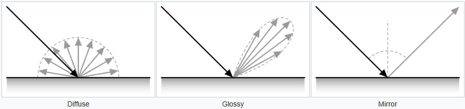
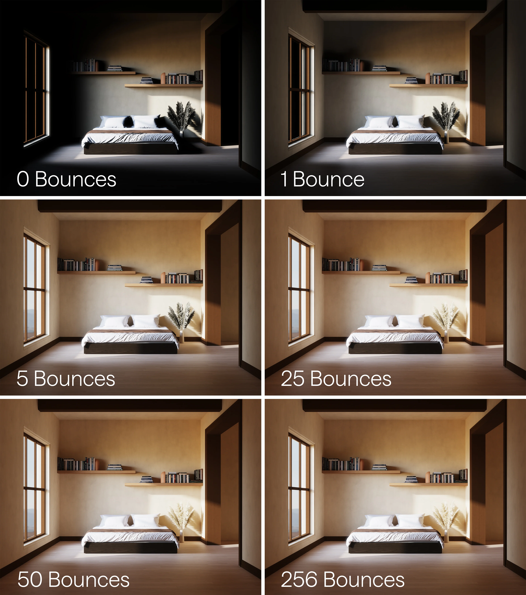
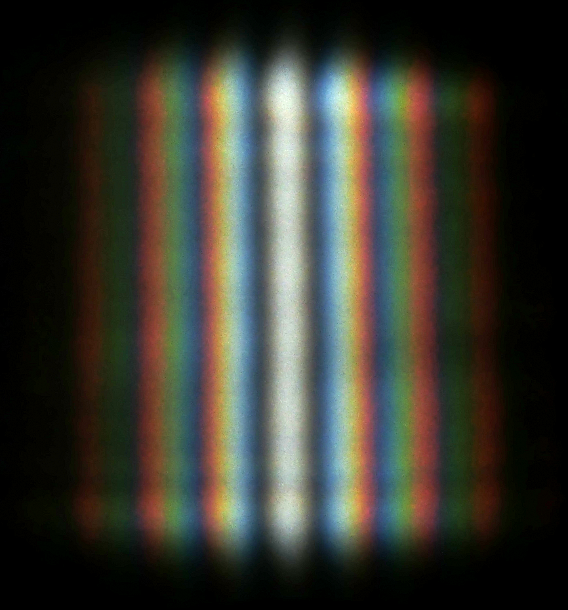
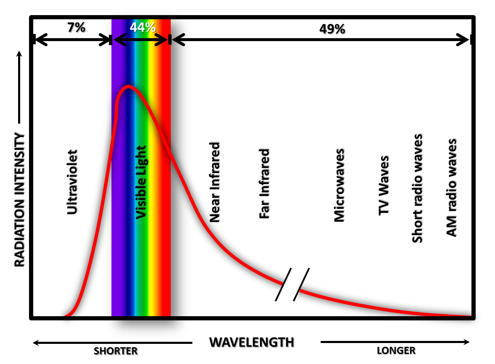
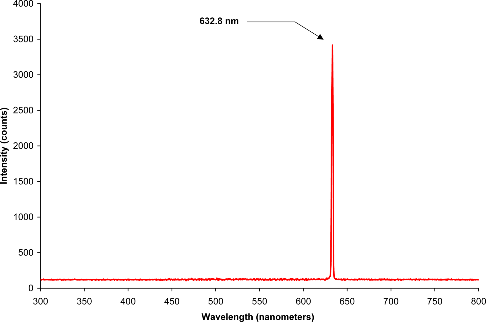
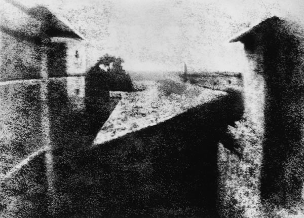

+++
date = 2026-06-25T20:54:26+09:00
lastmod = 2026-06-26T16:19:15+09:00
draft = true

title = "디지털 이미징의 총체적 이해(1)-광학에 대한 이해"
summary = ""
description = ""

isCJKLanguage = true

tags = [""]
categories = ["academic"]

[references.led_spectra]
title = "Caenorhabditis elegans as a model to study the impact of exposure to light emitting diode (LED) domestic lighting"
authors = "Abdel-Rahman F, Okeremgbo B, Alhamadah F, Jamadar S, Anthony K, Saleh MA."
doi = "10.1080/10934529.2016.1270676"

+++

디지털 이미징의 총체적 이해
(0) Introduction
(1) 광학에 대한 이해
(2) 센서에 대한 이해
(3) 신호처리에 대한 이해
(4) 시공간에 대한 이해(timesync)
(5) depth camera에 대한 이해(itof, dtof, structured light, stereo vision)
(6) 라이더에 대한 이해
(7) realistic simulation을 위한 센서별 특징
(8) Rendering & inverse rendering

# Introduction

현대에 어떤 식으로든 디지털 이미징을 포함한 영역은 정말로 광범위하다. 사진 촬영, 영상 처리, 머신 비전...심지어 비슷한 CG, 렌더링, 광학 설계등까지도 이런 영역에 걸친다. 그만큼 이 영역은 광대하며, 마찬가지로 이 영역에 종사하는 사람도 정말로 다양하다. 하지만 전체 파이프라인이 커진 만큼 전문성은 올라갔고, 전문성이 올라간 만큼 전체 파이프라인에 대한 이해는 점점 피상적이 되어갔다. 어떠한 물체에서 나온 빛이 어떻게 RGB값의 데이터로 변환되는지 그 사이의 일들은 대게 블랙박스로 남아 있다.

사실 이게 큰 문제는 되지않는다. 광학 설계를 하는 사람이 굳이 영상 처리 알고리즘을 알 필요가 없고, 객체 검출을 연구하는데 영상기하학을 알 필요는 없으니까. 개인적인 취향으로는 모두가 더 나은 이해를 함양해야한다는 꼰대같은 생각을 하고 있긴 했지만, 엄밀히 따지자면 전체 파이프라인에 대한 지식은 교양 그 이상도 이하도 아니었다.

그런데 시대가 physical AI로 넘어오면서, 이 교양이 변명거리를 얻었다. 수많은 학습 데이터를 현실에서 모으는 비용은 워낙 크기 때문에 synthetic data를 잘 사용하는 것이 중요한데, physical AI는 물리적 상호작용을 필요로 하기 때문에 이전에 비해 시뮬레이터의 중요성이 올라갔다. 결과적으로 이 시뮬레이션과 현실의 차이를 줄여야하며(이를 소위 sim-to-real gap이라 부른다.), physically accurate image를 만들기 위해선 이 파이프라인을 어느정도 재현하는것이 중요해졌다.

그리고 앞서 '꼰대같은 생각'이라고 비하하긴 했지만, 교양 그 이상의 의미가 원래도 분명히 존재했다. RGB값이 선형도메인인지 비선형 도메인인지 모른다면 단순 산술연산이 어디서 깨지는지를 모른다. 영상에서 일반적으로 노이즈를 가우시안이라고 생각하고 처리하려든다면 저조도 환경에서 문제가 생긴다. 영상기하 오차가 왜 카메라 주변부에서 강해지는지 모른다. 실내 조명에서 플리커링이 생겼을때, 어떤 파라미터를 바꿔야 이를 고칠수 있는지 판단을 못한다. 마이크와 스피커가 같은 데이터 교환의 역방향인것처럼, 한쪽을 알면 반대쪽에서 당연해지는것이 있다. 모아레 현상을 알면 렌더링에서 mip-map을 왜 필요로 하는지 알 수 있으며, 영상 취득의 본질을 신호처리 영역으로 표현 가능하다.

그래서 이 시리즈는 물리적 공간에서 튕겨다니는 빛이 어떻게 센서에 닿아 한장의 이미지가 되는지, 모든 과정에 대해 순차적으로 쓴 글이다. 물론 몇몇 부분들에 대해 디테일은 생략한다. 글을 쓰는 내가 잘 몰라서 생략하는 부분도 분명히 존재하지만, 이미 충분히 광대한 영역을 담고 있기에 해상도를 일정 이상 올릴 수 없다는 것을 양해 바란다. 이 글은 각 영역에 대해, 일반인도 이해할만한... 아마 일반인도 이해할만한 내용을 최대한 앞쪽에 같이 담으려고 노력했다. 흐름을 먼저 짚고, 그 다음 **구분선을 주어서 디테일을 격리**시켜놨기 때문에, 디테일을 생략해도 아마 흐름은 이어질 것이다.

앞의 세 챕터는 조금 더 카메라에 초점을 맞추며, 빛의 여정을 시계열 순서 그대로 가져간다. 빛이 어떻게 해서 센서까지 닿는지(광학), 도달한 빛이 어떻게 전기신호로 변환되는지(센서), 이렇게 샘플링한 데이터가 어떻게 RGB 이미지로 바뀌는지(신호처리).

뒤의 네 챕터는 조금 더 로보틱스, 3D vision 도메인에서 끌고가본다. 센서 sampling이란 측면에서 시공간에 대해 무엇을 알아야 하는지(timesync), depth camera는 어떤 특징이 있는지, 그리고 이렇게 얻은 개념들을 바탕으로 lidar에 대한 이해를 가져가본다. 마지막으로는 realistic simulation을 위해 센서별 특징이 어떻게 정리되는지 살펴보며, 광학계는 아니지만 상당히 많이 사용하는 센서인 만큼 IMU의 noise model도 살짝 담아보았다.

마지막 한 챕터는 rendering과 inverse rendering에 대해 담아보았다. 결국 이 파이프라인 전체를 거꾸로 되짚어가며 이 글의 여정을 마무리 지어본다.

이 글의 내용을 모두가 알아야하는 것은 당연히 아니다. 오히려 쓸모있는 영역이 절반 이하일 수 있다. 고로 중간중간에 충분히 생략해도 좋은 내용들이 많을 것이다. 하지만 그럼에도 이 글이 디지털 이미징 필드에 대해 충분한 커버리지를 제공해서 대략적인 지도의 역할을 하길 바란다. 기억의 한 구석에 잠자고 있다가, 언젠가 불현듯 기억나 더 깊게 알아보는, 그리하여 업무에 도움이 되는 그런 글이 되길 바란다.

# 광학에 대한 이해

광학계란 빛의 영역이다. 외부에서 나온 빛이 어떻게 해서 센서까지 닿게 되는지, 그 사이 어떤 요소들을 지나는지에 대해 살펴보고, 광학적인 관점에서 '이상적'인 카메라란 무엇인지에 대해 살펴본다. 

우선 빛에 대한 이해에서 출발하자. 여기서 빛에 대한 이해를 깔아두어야 앞으로 계속해서 써먹게된다.

## 빛에 대한 이해

### 직진성

**빛은 직진한다.** 이 명제는 단순하지만 단순하지 않다. 왜냐하면 우리는 눈으로 항상 빛을 받아들이고 있지만, 역설적으로 빛 자체를 순수히 관측하긴 어렵기 때문이다. 빛의 직진성은 그림자에서 관측된다. 빛의 진행 경로를 막고 있는 물체가 있다면, 빛은 닿을 수 없다. 

그런데 왜 직진성은 직관적이지 않을까? 공간상에서 빛은 직진하지만, 동시에 표면에서 다시 한번 흩어지기 때문이다. 어떤 공간에 빛이 있다면, 그 빛은 반사하여 공간을 가득 채우게 되고, 광원이 한 점이라고 해도 공간을 은은하게 채운다. 그럼에도 빛이 약하게 닿는 지점들이 생긴다. 이를 우리는 그림자라고 부른다. 우리는 빛의 부재에서 빛의 직진성을 발견할 수 있다. 

빛이 어떠한 물체에 닿을때, 물체의 표면의 특성에 따라 다음과 같은 현상이 이루어진다.

표면의 반사율에 따라 일부는 흡수되고 일부는 반사되며, 이렇게 반사된 빛이 다시 한 번 공간 전체로 퍼지며, 공간을 채워 나간다. 거울은 반사율이 아주 높으며, 들어온 각도대로만 빛을 반사하기 때문에 상이 유지된다. 반면 불투명하게 빛을 튕겨내면 우리 눈에도 그 빛이 들어와서 표면에 반사된 빛이 보이는 것이다. 이 중간으로는 빛이 대략적으로 들어온 각도대로 반사하되 살짝 퍼지는 단계가 있는데, 이때 우리는 살짝 반짝이되 거울같지는 않은 상을 보게된다. 이 빛의 반사에 대한 개념은 아래 이미지가 충실히 설명해준다.

광원은 일반적으로 모든 방향으로 빛을 내뿜으며, 따라서 우리 눈에 직진성이 잘 들어오지 않을 뿐이다. 

&nbsp;

### 파동성

아마 어디서 풍문으로라도 들어봤을 소리인데, 빛은 파동이다. 파동은 공간상에서 어떻게 움직일까? 파동 또한 직진한다. 그러나 파동의 거동엔 재밌는 특성이 있는데, 바로 회절한다는 것이다. 회절이란 장애물의 가장자리에서 휘어지는 현상이다. 이에 대해 재밌는 예시 이미지가 있다. 파도 또한 파장이며, 회절한다.

분명 장애물로 가려진 부분인데도 파도가 와닿는 모습을 볼 수 있다. 

&nbsp;

소리 또한 파장이다. 기본적으로 직진하지만, 소리가 회절하는 덕분에 우리는 다른 방에서 나는 소리를 벽으로 막혀있음에도 불구하고 들을 수 있다. 회절은 파장이 길수록 더 잘 일어나며, 파장이 짧을수록 더 약해진다. 이를 라디오에서 체감할 수 있다. AM은 파장이 수백미터 단위인 중파를 사용하는데, FM은 파장이 미터단위인 초단파를 사용한다. AM은 회절을 더 잘하기 때문에 장애물에 더 강건하고, FM은 장애물에 더 약하다. 그래서 FM이 음질은 더 좋지만 치지직거릴때, AM은 음질이 낮을 지언정 더 잘 들릴 수 있다.

반면 가시광선은 어떨까? 가시광선의 파장은 약 400~700nm이다. 따라서 빛의 회절은 정말 작게 일어나기 때문에, 우리가 위에서 봤듯이 빛이 대부분 직진한다고 여길 수 있는 것이다. 

그럼에도 빛의 회절을 보여주는 실험이 있다. 아마 중고등학교 물리 시간에 한번쯤은 배우지 싶은데, 이게 바로 유명한 이중슬릿 실험이다. 빛 또한 파동으로, 아래 이중 슬릿 실험을 통해 빛이 회절하는 모양을 관측 할 수 있다. 

---

##### 조금 더 가보기

**파장의 수학**

**#1**

자, 살짝 수학을 껹어보자. 장애물 구멍의 크기를 $a$, 파장의 길이를 $\lambda$ 라고 할 때, 회절각 $\theta$는 다음과 같다.

$$
\sin \theta \approx \frac{\lambda}{a}
$$

만약 문 폭이 1m, 가시광선의 파장을 0.4μm~0.7μm라고 한다면, 사실상 $\theta$는 0이 된다. 따라서 빛은 거의 회절하지 않고 직진한다고 볼 수 있다. 이 회절은 이중슬릿 실험과 같이 아주 작은 구멍이 될 때 유의미해진다. 

&nbsp;

**#2**

조금 더 껹어보자. 하위헌스의 원리에 따라, 파면의 모든 점은 각각 새로운 2차 파동의 파원이다. (이번에 글을 쓰면서 처음 알았는데, 이 정리가 나온 것은 1678년으로 이 가정으로 반사/굴절 법칙을 설명할 수 있었기에 순수 가설에 가까웠으며, 나중에 키르히호프의 파동방정식의 정리로 인해 증명되었다.) 

이제 길이 $a$ 인 slit을 지나는 정상파를 전부 중첩하면, 슬릿 중점에서 관찰방향 $\theta$에서의 전기장 진폭은

$$
E(\theta) \propto \int^{a/2}_{-a/2}{e^{ikx \sin \theta} dx}
$$

로 나타낼 수 있다.

$$
E(\theta) \propto \frac{2 \sin ({\frac{ka \sin \theta}{2}})}{k \sin \theta}
$$

여기서 식을 간소화하기 위해 다음과 같이 치환하자. ($k = 2\pi/\lambda$ 이다.)

$$
\beta \equiv \frac{ka \sin \theta}{2} = \frac{\pi a \sin \theta}{\lambda}
$$

그러면 진폭은

$$
E(\theta) \propto a \frac{\sin \beta}{\beta}
$$

로 정리된다. 회절무늬의 중앙, 즉 $\theta \to 0$ 를 취하면, $\sin\beta/\beta \to 1$ 이라 가장 밝고, 처음으로 완전히 어두워지는 지점은 $\sin\beta = 0$이 되는 $\beta = \pi$, 즉

$$
\sin \theta = \frac{\lambda}{a}
$$

이다. 즉, 회절각 공식은 첫번째 극소의 위치이며, 회절된 에너지의 대부분(약 90%)은 이 첫 극소 안쪽의 중앙 봉우리에 담긴다.

---

&nbsp;

### 스펙트럼

")

앞에서 파동에 대해 살펴봤다. 파장이 다르면 이름이 다를뿐, 사실은 전부 같은 전자기파다. AM의 파장이 중파(수백 m), FM이 초단파(m), wifi의 경우 마이크로파(cm)로 나뉘지만, 전부 전자기파이며, 빛 또한 전자기파이다. 적외선에서 가시광선, 가시광선에서 자외선, 더 나아가서 X-ray 까지, 전부 전자기파의 한 종류일 뿐이다. 위의 그림이 그걸 잘 보여주는 나사의 일러스트이다.

정리하자면, 전자기파의 일정 영역은 우리가 눈으로 감지할 수 있고, 그 영역을 가시광선이라 부른다. 우리가 평소에 빛이라 부르는 물건은 여러가지 길이의 파장을 가진 파동들의 집합이고, 빛은 안에 어느정도 파장 길이를 얼마나 많이 가지고 있는지로 분해할 수 있다. 따라서 빛을 표현할 때, 우리는 그 빛 안에 있는 각 주파수와 그 주파수의 세기를 나타낼 수 있고, 이걸 스펙트럼이라고 부른다. 태양광의 스펙트럼은 아래와같다.

&nbsp;

가시광선이 제일 많지만, 피부암을 유발하는 자외선도, 열을 잘 전달하는 적외선도 많이 함유하고있는 것을 볼 수 있다. 즉 이와 정 반대되는 빛으로는 레이저가 있는데, 레이저는 단일 파장으로 이루어져있다. 따라서 레이저의 스펙트럼을 보면 아래와 같다.

&nbsp;

깔끔하게 단일 파장으로 이루어져 있는 것이 보인다. 아마 조명을 진지하게 사본 사람은 들어봤을 수 도 있는데, 같은 백색광이라 하더라도 품질(CRI값등)이 더 높은 조명은 이 스펙트럼이 더 풍부하게 구성되어있다.

그러면 왜 같은 백색광으로 보이는데 더 스펙트럼이 균일한 비싼 조명이 필요한 것일까? 우리는 스펙트럼을 색으로 인지하기 때문이다. 예를들어 위 그림에서 C와 D조명, 그리고 H태양광이 전부 완전히 같은 빛으로 느껴진다고 해보자. 그리고 어떤 파란색 물감이 정말 순수하게 새파란 색이어서, 파란 빛만 반사시키고, 나머지는 다 흡수한다고 해보자. 이 파란 물감은 햇볕 아래에서 볼 때와, C조명에서 볼 때와, D조명에서 볼때가 전부 다른색일 것이다. D조명 아래에선 태양광보다 더 강한 푸른 빛 성분으로 밝게 빛날 것이고, C조명에선 상당히 어두운 푸른색이 될 것이다. 

무지개에는 흰색이 없다. 흰색은 우리가 빛을 받아들이는 원추세포가 셋 모두 활성화 될 때 우리가 생각하는 것 뿐이다. (나중에 살펴보겠지만 흰색은 매번 움직이는 값이다.) 무지개에는 자주색(magenta)이 없다. 자주색은 색이 아니다.(정확히는 빛이 아니다.) 파장에는 존재하지 않는 개념이고, 물질에서 반사된 가시광선 중 녹색 파장 빛이 없을 때 우리가 받아들이는 느낌이다. 즉, 색은 빛의 파장을 해석하는 우리 고유의 시각일 뿐이다. 

&nbsp;

다음으로 파트로 이어가기 위한 징검 다리를 어거지로 하나 놓아보겠다. 파도의 피해를 예상할 때, 파장으로 표현하는 것을 본적이 있는가? 아마 없을것이다. 파도의 피해량은 파장이 아니라 파도의 높이가 결정한다. 즉 세기가 결정한다. 그런데 햇빛이 아무리 강해도 적외선은 피부를 데울 뿐이지만, 흐린 날에도 자외선은 피부에 해를 입힐수있다. 왜 그런가?

적외선은 따지자면 고무 공이고, 자외선은 쇠공이다. 아무리 고무공을 던져도 창문을 깰 수 없지만(없다고 쳐주자.), 쇠공은 하나만 던져도 창문을 깰 수 있을 것이다. 마찬가지로 적외선은 아무리 강해도 입자 하나가 가진 에너지가 작고, 자외선은 크다. 여기서 세기가 '입자의 양'과 '입자의 에너지' 두 가지 개념으로 분리될 수 있으며, 더 큰 세기의 빛은 '입자의 양'을 늘리는 것이고, 더 큰 주파수의 빛은(더 짧은 파장의 빛은) '입자의 에너지'를 늘리는 것이다. (광자 하나가 가진 에너지는 $E=h\nu$($h$는 플랑크 상수, $\nu$는 진동수)로, 진동수에 비례한다.) 이제 입자성에 대해 살펴보자.

&nbsp;

### 입자성

아마 빛은 파동성과 입자성을 동시에 갖고있다는 얘기를 들어보았을 것이다. 사실 어느정도 널리 알려진 것에 비해 빛의 입자성은 생각보다 늦게 증명되었다. 아인슈타인이 1905년에 광양자 가설을 제안하긴 했고, 21년 노벨상 수상의 명분이 되었지만(이에 대해선 상당히 긴 배경이 있다.), 실제론 1923년 콤프턴 산란이 증명하기 전까진 물리학자들 사이에 회의론이 꽤 있었던 것으로 알려져있다. 

하여튼, 디지털 이미징에서 더 물리의 디테일에 대해 설명할 필요는 없지만, 빛은 입자성을 가지고 있다. 광자가 판을 때리면 전자가 나오는데, 이걸 광전효과라고 부른다. 카메라 센서는 이 광전 효과를 이용하는 것으로, 센서에 도달한 광자가 전자로 변환되며, 이 전자가 모여 전기 회로에서 감지된다. 따라서 카메라의 노이즈 특성의 설명엔 이 빛의 입자성이 필요하다. 따라서 카메라 노이즈는 포아송 분포로 모델링 하는데 이에 대해선 뒤쪽 카메라 센서에 대해 설명할 때 조금 더 자세히 설명하겠다.

&nbsp;

### 정리

빛의 성질을 파동성과 입자성으로 나눌 수 있지만, 여기서는 굳이 굳이 네개의 축으로 나누어보았다. 이 네개의 축이 기본적으로 디지털 이미징을 이해하는 데에 필요한 네가지 성질이고, 뒤에서 한번씩 건드리기보단 앞서 모아두는게 나을 것 같아서 이렇게 정리했다. 

**빛의 직진성**은 기본적인 모델링이다. 광학계의 축이고, 모든 렌더링의 방법이며, 그 근본적인 설계 원칙이다. 여기서 **빛의 파동**이 그 근본적인 설계 원칙의 한계로 주어진다. 색수차와 조리개 회절 한계등이 여기서 기인한다. **스펙트럼**은 색의 한계이다. 사진작가들이 왜 raw데이터를 필요로 하는지, 왜 한번 white balance나 색 조정을 하고 나면 돌이킬 수 없는 손실 압축이 되는지, 색이랑 빛의 관계는 무엇인지에 대해 이해하는데 필요하다. 마지막으로 **입자성**은 제일 제한적이지만, 기본적인 센서의 작동 원리에 대해 아는데에 있어 도움이 된다. 

기본적인 설명만 해도 조금 길었던 것 같다. 이제 이번 글의 나머지는 광학계에 대해 살펴보자.

&nbsp;

## 광학계에 대한 이해

### 바늘구멍 카메라

벽에 작은 구멍을 뚫고, 방을 어둡게 하면 벽에 바깥의 풍경이 뒤집혀서 보이게 된다. 이 현상을 최초로 기술한건 기원전 4세기경 묵자이고, 그 이유를 빛이 화살처럼 곧게 날아가기 때문이라고 설명했다. 이후 11세기 이슬람에서는 이 현상을 일식 관측의 실험 도구로 사용했다. 그 뒤로 주로 계측용으로 사용되었으며, 르네상스 시기를 맞이해 회화용도로도 사용되었다. (*'이 장치로 상을 베껴 그리면 그림을 못 그리는 사람도 그릴 수 있다' - Giambattista della Porta, Magia Naturalis*) 이 장치를 사람들은 '어두운(obscura) 방(camera)'이라고 불렀다. 아래 영상을 통해 이 현상을 실제로 볼 수 있다.



&nbsp;

여기서 살짝 이해가 어려울 수 있기 때문에 그림과 함께 설명을 조금 더 해보겠다.

&nbsp;

위쪽의 이미지는 구멍이 작게 뚫려있다. 벽에 생긴 상의 촛불 끝점의 기준에서 생각하면, 작은 구멍을 통해 보이는 부분은 촛불 끝밖에 없을것이다. 초의 바닥을 볼 수 없다. 즉, 이 지점에 닿을 수 있는 빛은 촛불 끝에서 나온 노란 빛 말고는 없다. 그런데 구멍이 커지게된다면, 바닥은 몰라도 초 중간까진 같이 보일것이다. 그려면 초의 불꽃 부분에서 나온 따듯한 빛 뿐만 아니라, 파라핀의 탁한 백색 빛마저 이 지점에 닿을 것이다. 즉, **이 벽에는 여러 지점에서 온 빛이 한꺼번에 닿게 된다.**

따라서 바늘구멍 카메라의 의미는, '어떠한 지점에 한군데에서만 온 빛만 선택적으로 닿도록 해주는 장치'이다. 그래야 상이 맺히기 때문이다. 조금 더 말을 풀어내자면, '세상과 상을 1대1로 매칭하도록 하는 장치' 가 된다. 그리고 이 현상은 빛이 직진해야지만 이루어질 수 있다. 

아주 작은 구멍을 통한 카메라이기 때문에 이를 **'바늘구멍 카메라'** 라고 부르며, 이것이 모든 카메라 모델의 원류가 된다. 시대에 따라 이 상이 맺히는 평면은 그냥 그림을 그리는 도화지가 되기도 했고, 화학 약품이 발린 필름의 위가 되기도 했으며, 전자 센서의 위가 되기도 했다.

&nbsp;

### 렌즈

그런데 '진짜' 바늘구멍 카메라엔 꽤 문제가 있었다. 정말로 바늘 구멍 하나만 뚫으면 당연히 들어오는 광량이 작을 것이고, 어두울 것이다. 반면 밝게하기 위해 구멍을 키우면 상이 흐려지다가 종내에 완전히 무너지고야 만다. 당연히 선명한 사진엔 메리트가 있다. 그런데 밝은 사진엔 어떤 메리트가 있는가? 광량이란게 왜 중요한가?

&nbsp;

혹시 초기 카메라에 대해 들어보았는가? 1826년 조제프 니세포르 니엡스가 최초로 사진을 찍었는데, 여러 문헌엔 8시간 동안 노출했다고 하지만 현대 연구자들은 최소 며칠을 추정한다.(태양의 방향으로 인해서) 물론 이땐 빛에 반응해서 상을 남기는 감광제의 문제가 더 심각했지만, 결국 같은 감광제라고 한다면 더 잘 반응할수 있도록 빛을 많이 주는것도 중요하다. 그러면 어떻게 구멍크기를 키워서 빛을 더 많이 받아들이며, 동시에 바늘구멍 없이도 선명한 상을 맺히게 할 수 있는가?

그 문제를 해결한 것이 바로 렌즈이다. 렌즈를 사용하면 빛을 강제로 모을 수 있다. 따라서 구멍을 크게 열면서도 빛을 모을 수 있고, 상을 만들 수 있다.

---

##### 조금 더 가보기

**얇은 렌즈와 두꺼운 렌즈**

여기서부턴 조금 더 렌즈설계에 대해 설명해보겠다. 우선 여기서부턴 조금 복잡해진다. 하나 깔고가자면, 이 렌즈 설계에서 용어는 정말 정말 헷갈린다. 우선 cv background와 camera model에 대한 지식이 있는 사람에게 이쪽은 추상화 아래의 영역이다. 결과적으로 렌즈 관점에서 사용하는 용어와, 추상화 위쪽에서 정의한 용어가 종종 충돌한다. 그리고 사진 커뮤니티에선 용어의 오용이 꽤 많다. 그리고 자체적으로 중복이 많은데, stop이라는 단어는 정말 많은 것들을 동시에 표현한다. 결과적으로 렌즈설계, 카메라, 영상기하 세 분야중 렌즈설계쪽만 개념이 solid하게 잡혀있다. 

그런데 반대로 얘기하면, 추상화 위쪽에서 정의 할 수 있었다는건, 그렇게 정의해도 cv쪽에선 아무 문제가 없다는 것이기도 하다. 따라서 **이 부분은 그냥 생략해도 아무런 문제가 없다.**

자, 그럼 이제 어디부터 어디까지 추상화 대상인지 명시해보자. 일반적으로 cv의 영상기하학에선 이상적인 pinhole모델을 가정한다. 모든 광선이 지나는 이상의 모델로 카메라를 피팅하는데, 실제로는 그렇진 않기 때문에 잔차 오차가 생길 수 밖에 없는 모델이다. 영상기하쪽에선 이 글에선 다루지 않도록 하고, 카메라 렌즈를 가벼운 설계부터 복잡한 설계까지 하나 하나 살펴보자.

우선 간단한 용어정리.

- Optical center : 앞서 말한 바늘구멍 모델의 가운데 점을 말한다. 모든 빛이 지나는 점이다.
- Focal Point : 무한대의 거리에 있는 빛은 평행 광선이 되는데, 이 빛이 렌즈를 지나며 모이는 점이다.
- Optical Axis : 광축. 렌즈의 가운데 점을 지나는 점은 굴절되지 않는데, 이 축을 얘기한다.

광학설계가 정말 헷갈리는 점은, 간단한 개념에서 출발해서 하나씩 얹어가는 과정이 불가능 하단 점이다. 예를들어, 덧셈을 정의하고 덧셈의 반복으로 곱셈을 정의할 수 있다. 즉, 한 계단씩 올라가는 것이다. 그러나 광학설계에선 간단한 개념이 처음 나온다음, 그 개념이 분화되어서 다시 생각해봐야하는 일이 반복된다. 다시 한 번 말하지만 이건 정말 쓸데없고(실무관점에서) 복잡하다. 괜히 카메라 커뮤니티와 cv 커뮤니티가 이 개념에서 멀어진 것이 아니다.

&nbsp;

**얇은 렌즈**



위 그림에서 거리 셋을 정의할 수 있다. 렌즈에서 물체까지의 거리 $u$, 렌즈에서 이미지까지의 거리 $v$, 그리고 초점까지의 거리 $f$. 각 거리에 대해, 렌즈 공식 

$$
1/f = 1/u + 1/v
$$ 

가 성립한다. (여기서 focal length는 cv의 focal length와 별개다.) 여기서 조절할 수 있는 실제 렌즈의 수치는 $f$로, 굴절률의 영향을 받는다.

이 때, 물체가 무한히 멀면($u \to \infty$) $f=v$ 가 된다. 쉽게 얘기해서, 태양광에서 볼록렌즈로 빛을 모아 뜨겁게 하는 그 지점이다. 헷갈릴까봐 미리 말하자면, 이미지 평면은 초점이 아니다. 벌써 헷갈릴텐데, 일상적으로 초점이 맞았다고 하는 용어를 자주 쓰기 때문이다. 실제로 초점을 이미지 평면에 맞춰버리면 센서가 탈 수 있다. 실제론 무한히 먼 물체를 찍는것이 아니라 더 가까운 물체를 찍기 때문에, 이미지가 선명하게 '초점이 맞았다'고 해서 초점이 이미지 평면상에 있는 것은 아니다. 

이 모델에서 optical center에 해당하는 점은 렌즈의 중심이다. 

&nbsp;

**두꺼운 렌즈**



여기서부터 조금 복잡해진다. 실제 렌즈는 얇은렌즈와 다르게, 두번의 굴절이 일어난다. 여기서 주 평면이 등장한다. H와 H'로 표현하는데, 광선이 한쪽 주평면으로 들어가면 반대쪽 주평면의 같은 높이에서 나온 것으로 모델링이 가능하다. 위 얇은 렌즈에서 렌즈의 가운데 평면이 둘로 나뉘었다고 보면 된다. 즉, 모든 근축 광선은 H까지 직진하고, H와 만난 점에서 H'로 평행이동 한다음, 굴절된다.

그래서 물체까지의 거리 $u$는 H에서, 이미지까지의 거리 $v$ 는 H'에서 재며, focal lengths는 두개가 존재하는데, 물리적인 초점거리 BFL(Back Focal Length)와 EFL(Effective Focal Length)로 나뉘게 된다.



Nodal ray는 렌즈를 통과하고 나서도 굴절되지 않는 광선을 얘기한다. 이 ray와 광축이 만나는 점이 nodal point가 된다. Nodal point는 주평면이 공기중에 있다면 주평면 위에 위치한다. 아까 focal length는 cv의 focal length와 별개라고 했는데, 이번엔 사진 커뮤니티에서 단어의 오용이 좀 있다. 종종 파노라마 촬영을 위해서 카메라를 nodal point에 고정시켜야 한다는 설이 엄청나게 오용되고있다. 심지어 글을 작성하는 이 순간에도 구글에 검색해보면 ai가 그게 오용이라는 위키피디아의 링크를 걸면서, 동시에 nodal point를 기준으로 회전시켜야한다는 주장을 해버린다. 정확히 지금 이 모델상에서, optical center에 해당하는 점은 존재하지 않는다. 

---

&nbsp;

### 조리개

카메라 시스템에서 이제 필름이 받아들일 수 있는 빛은 두 가지로 조절 가능하다. 첫번째는 노출시간. 이걸 셔터스피드라고 부른다. 그리고 조리개. 조리개는 구멍의 크기를 바꿀 수 있는데, 조리개(aperature)는 초기엔 조절 가능한 것이 아니었다. 이걸 Stop이라고 불렀다.

나중에 이 구조가 동적으로 구멍의 크기를 바꿀 수 있는 구조로 개발되었으며, 이를 조리개(aperature)라고 부른다. 조리개값을 칭할때 f값, 혹은 f-stop이라고 많이들 말한다. 여기서 stop 이라는 용어가 카메라의 온갖곳에 쓰이는데, 한 stop차이나면 광량은 두 배 차이난다고 보면된다. 

---

##### 조금 더 가보기

앞서 서사를 위해 다소 정확도를 희생한 설명이 있다. 바로 stop의 개발 동기인데, stop은 이 뒤에 살펴볼 수차를 제어하는 용도로 개발되었다. 광학 시스템에선 두 개의 stop이 있으며, 그게 aperature stop과 field stop이다. 이에 대해선 생략한다.

그래서 사실은 stop과 렌즈 시스템이 이미 카메라의 개발 이전에 발명되었다. 따라서 stop과 렌즈시스템이 원래 있었고, 그 다음 카메라가 개발되었다. 이후 감광재가 발달하면서 점차 더 짧은 시간 노출이 가능해졌으며, 감광재의 발달로 손으론 제어하기 힘든 영역까지 노출시간이 짧아지며 기계식 셔터가 필요해졌다. 요즘 디지털 카메라 기준으로 맑은 날이면 셔터속도를 1/4000초를 해도 과노출이 될 수 있다. 따라서 조리개를 조여야한다. 이 당시 셔터속도는 그정도로 빠르지 않았으며, 결국 감광재의 발달로 조리개가 광량조절의 역할을 맡게 되었다.

&nbsp;

**f값**

수식으로 보자면 다음과 같다.

- $N$ : F-Number. 조리개값
- $f$ : focal length.
- $D$ : 실제 조리개 지름(정확히는 입사동공의 유효 조리개 지름)

$$
N=f/D
$$

따라서 f값을 $f/1.4$, $f/2.0$ 등으로 표기하는데, f값이 각 1.4, 2.0이 된다는 것이다. 이것도 역수 따라서 표기 따라 좀 헷갈린다. f값이 1.4라는 것인데, 즉 $D = f/1.4$ 라서 실제 조리개 지름이 $f/1.4$ 이다 라고 표기하는 것이다. 1.4는 $\sqrt 2$ 로, 광량은 면적에 비례하기 때문에 광량은 1/2이 된다. 여기서 한 스탑 더 간다면 $f/2.0$, 광량은 1/4. 그 다음이 $f/2\sqrt2 \approx f/2.8$ 이기 때문에 광량은 또 1/8이 된다. 위 조리개값과 면적에 대해 살펴보면 이해가 쉽다.

&nbsp;

**조리개와 입사동**

조리개는 여러 렌즈군의 사이에 위치한다. 이 때, 물체 방향에서 조리개를 본다면 조리개는 어디에 있을까? 조리개 앞에도 렌즈가 있으므로, 보이는건 조리개가 아니라 앞쪽 렌즈군이 만든 조리개의 상이다. 반면 뒤쪽에서 본다면, 조리개의 상은 또 반대쪽에 맺히게 된다. 물체 방향에서 본 렌즈의 상을 입사동, 센서쪽에서 바라본 렌즈의 상을 출사동이라고 부른다. 

이걸 왜 정의하냐면, 모든 빛은 조리개를 지나기 때문이다. 따라서 조리개면에서 이 조리개를 지나는 높이에 따라 추상화가 가능하기 때문에, 여러개의 렌즈군을 입사동과 출사동으로 설명 가능하다. 실제로 앞에서 f값을 설명할때 D가 조리개 지름이 아니라, 입사 동공의 유효 조리개 지름인 이유가 결국 뒤쪽에서 입사동공의 유효 조리개 지름을 기준으로 투영하기 때문이다. 이 구조를 예제로 보면 다음과 같다.



여기서 물체의 주 광선을 굵은 실선으로 표시하면, 물체쪽 '연장선'은 화각과 무관하게 전부 입사동의 중심 한 점으로 모인다. 사진 커뮤니티와 친숙하지 않은 사람들에게 조금 더 설명을 하기 위해 이미지 한장을 준비해보았다. 일반적으로 초점이 안맞았다, 정도로 얘기할 수 있는데, 사진용어로는 이를 '보케' 라고 부르며, 초점이 맞지 않는 부분의 흐려진 것, 혹은 흐려지는 모양을 뜻한다.

여기선 광원이 강렬하게 퍼져있기 때문에, 한 점에서 온 빛이 어떻게 센서에 와 닿았는지를 직관적으로 볼 수 있다. 이를 예제로 보면 다음과 같다.



이 예제에서 볼 것이 몇가지 있다.

1. 이 예제에선 stop을 렌즈 앞으로 밀 수 있다. 굴절이 없기 때문에, 앞쪽에서 바라본 조리개면을 뜻하는 entrance pupil이 완전히 stop과 동일해지는 것을 확인 할 수 있다.
2. 조리개를 완전히 조이면 어째서 모든 상이 선명해지는지를 알 수 있다.
3. Focus plane에 있는 물체는 조리개와 상관없이 선명한 상을 맺는다.
4. 모든 물체쪽 주 광선의 연장선이 전부 입사동의 중심을 지나는 것을 볼 수 있다.

자, 이제 사실상 유일하게 이 모든 렌즈 설계를 가지고 말할 수 있는것이 나온다.



일반적으로 파노라마 촬영에서 투영 중심을 중심축으로 회전을 해야지, 이동을 해버리면 파노라마 이미지가 망가지게 된다. 따라서 파노라마 촬영에 중요한 그 투영 중심을, no parallax point라고도 부른다. 이 점이 바로 영상 기하학을 통해 찾는 카메라의 위치가 된다. pivot position을 움직이다 보면 어떻게 돌려도 near 와 far가 같이 움직이게 되는 지점이 있는데, 바로 이 지점이 no parallax point 이자, 입사동의 중심이다.

만일 여기까지 성실하게 예제를 따라왔다면, 어째서 computer vision에서 아무도 camera pose가 물리적으로 무엇인지 신경을 안쓰는 이유를 어렴풋이 알았을 것이다. 여기서 문제. 초점을 어떻게 맞추는가? 정답은 렌즈군이 이동한다. 렌즈군이 이동하면 어떻게 되는가? 입사동의 위치가 바뀐다. **즉, 카메라를 고정시켜놓아도 초점을 맞출 때 카메라의 기준 위치가 움직인다.** 이 뿐만 아니라, parameter들도 이동한다. 이에 대해선 알아두는것이 나쁘지 않다.

---

### 이상적이지 않은 요소들의 도입

심도

보케

비녜팅

왜곡

수차



---

##### 조금 더 가보기

**수차**

근축광학을 이제와서 정의

근축광학이 무너진다.

수차 종류 정의

색수차

## 정리

우선 쉬운부분부터, 적당히 빛 보고 바늘구멍 보고. 

PSF얘기로 마무리

======

# 센서에 대한 이해

이제 센서에 닿은 빛이, 주로 raw데이터라고 불리는 비트 덩어리가 되는 방식에 대해 정의

앞에서 빛에 대한 이해에선 주로 빛의 파동성과 빛의 스펙트럼에 대해서 다루었다면, 이젠 빛의 입자성에 대해서 다루어야한다. 기본적으로 광학센서란 아인슈타인이 노벨상을 받은 직접적인 주제인 광전효과를 이용해 개발되었다. 광자는 다음 과정을 거친다.

## 센서

### 광전효과 

### 센서의 종류

### 베이어 필터

## 광자와 전자

CMOS CCD...
Readout과정... Global shutter, rolling shutter

- 빛의 입자가 판을 때리면 전자가 튀어나온다. 더 많은 빛은 더 많은 전자를 내뿜게 되고, 신호가 더 강해진다.
- 이렇게 빛을 감지할수있는걸 몇백만개씩 배열하면, 센서가 된다.
- 그런데 이건 흑백이다. 따라서 우리가 원하는 R G B 만 받도록, 앞에다 필터를 씌운다.
- 근적외선(NIR) 차단 필터(IR cut filter)와 베이어 이미지
- 그러면 이제 세상에서 들어오는 빛이 R G B 세가지 값으로 나뉘어서 들어오고, 결과적으로 칼라이미지가 되었다.

#### 광자와 전자

- 화소 배열 + micro lens

- Photon-> e- (광전 변환)
- 여기서 광자가 도착 자체의 포아송 분포가 있다. 종종 센서 화소가 커도 오히려 노이즈가 커짐

- e- 적분
- 이렇게 전자를 우물에 모아둔다. 그런데 우물이 포화된다면 더 전자가 들어올 수 없다. 이것이 clipping이다.
- 한두 픽셀만 이런다면 모를까, 많은 픽셀들이 다함께 이렇게 된다면 영상 구분이 안된다.

- Readout
- 모아둔 Charge 를 각 셀에대해 하나씩 read하는것.
- CCD와 CMOS, smear 에 대해 살펴봄.

#### Voltage 처리

- ISO/gain 
- 각 픽셀별로 전압이 생겼음. 이 전압에서 증폭을 함. 앞단의 노이즈까지 같이 증폭되기 때문에 광량은 무조건 많아서 gain이 적은게 좋음.
- 여기서도 gain을 먹였을때, 최대 전압에 도달하면 clipping이 일어난다.

- 여기서 ADC -> 전압에서 digital 로 보정이 일어난다. 일반적으로 raw 데이터는 10~14비트정도, 일반적인 이미지데이터는 8bit.

- 결론 : 궁극적으로 이 단계는 sampling / sensing 문제이고, 높은 SNR하나만 중요하다. 이를 보장하기위해선 위의 전제조건들을 아는편이 좋다.

#### 덤 - 노이즈에 대해

- Dark Fixed pattern noise 

- Dark Random noise

- Photon Response Non-unifomity

#### 덤 - 샘플링 theory

- 나이퀴스트와 moire

# 신호처리에 대한 이해

이쪽에 대해선 굳이 안봐도 좋음. 여러가지로 나눠볼수있을것같다. 
광량 복원 / 색역복원. 혹은 선형역역 복원 / 비선형 역역 복원. 혹은 modelable / convention. 아니면 선형/비선형 영역, 디모자이크(디베이어링) 이전과 이후. 
우선 가장 기본이 되는 상식을 하나 깔아야 이해가 가능하니 그걸 말하고, 그 다음에 파이프라인 순서대로 살펴보자.

#### 색역에 대한 대략적인 이해

빛- 스펙트럼
이중에 세값만 가져온다고 생각해보자. 
-> 즉, 완벽한 복원은 애초에 세개로 불가능

metamerism 설명

#### 디베이어링 이전

##### Black level 교정

- 카메라 센서의 가장자리에 있는 optical black pixel 등을 이용하여 black level correction을 수행
- 그 외에, 카메라 하드웨어에서 불량 화소 보간등이 일어나기도함.
- linearize - 디지털 양자화 한 신호를 linearize

##### 비녜팅 보정

- 비녜팅은 다양한 원인으로 생김
- 마이크로 렌즈 그림자, lens shading 등등
- per pixel gain map이 있다.

##### 화이트밸런스

- RGB대각성분 복원

##### 디베이어링

- 모든 픽셀은 사실 RGB중 하나 값만 가지고있음. 왜냐하면 픽셀별로 필터가 있기 때문
- 그런데 RGB를 얻기 위해선 근처에서 가져옴. 이게 베이어 패턴을 없앤다 해서 디베이어링.
- 사실상 이 단계부터 돌이킬수 없음. 실제 측정값이 어디인지 모르게 오염되기 때문이다.
- (물론 이전에도 클리핑등의 손실이 있는 연산들이 있지만, 여전히 고 bit의 곱셈으로 광량 측정데이터라고 볼 수 있으나 여기서부턴 아님)

#### 디베이어링 후

##### 색교정

- ccm 3*3 행렬곱
- 이 단계에서 아무리 열심히 해도 잔차는 남는다.

##### 톤매핑

- 여기서부터 linear 하지 않은 영역
- 왜냐하면 실제광량과 linear 하게 쓰면 사람 눈에 맞지 않음.(더 이전에 CRT때부터 쓴 응답 곡선)
- 원래 gamma 값 썼음
- sRGB는 아래 linear 영역 존재. 말그대로 tone을 매핑해두는 커브에 가까움
- 이 다음 HDR 이미지가 SDR이 됨.

##### 8bit quantize

# 시공간에 대한 이해

실질적으로 영상 엔지니어로써 마주치는 특징
 -> 센서의 영역과 광학계의 영역으로 들어가는 부분들이 분명히 존재하지만, 조금 더 실무엔지니어 적인 특징을 담하 이해를 돕는 것

프레임레이트

플리커 밴딩

# depth camera에 대한 이해(itof, dtof, structured light, stereo vision)

# 라이더에 대한 이해

# realistic simulation을 위한 센서별 특징
