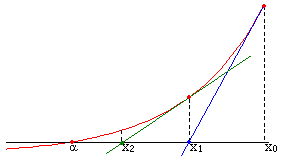
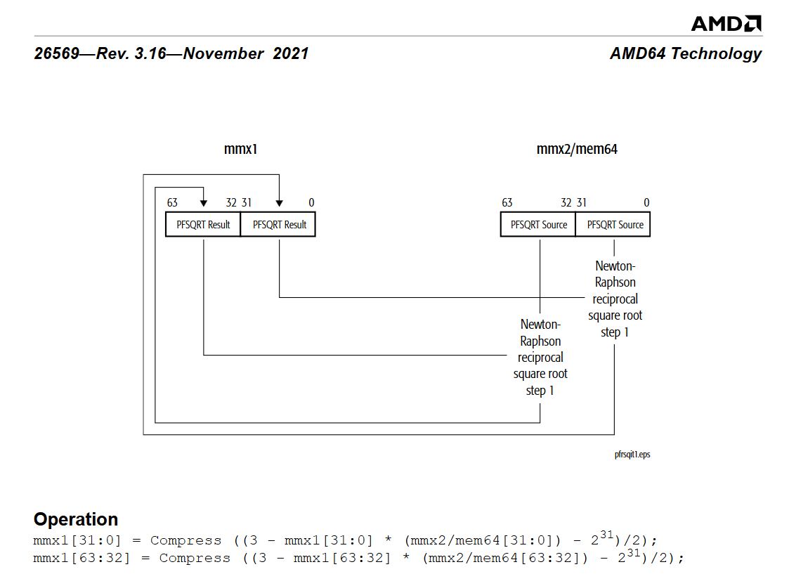

+++
date = 2024-12-27T15:09:31+09:00
lastmod = 2024-12-30T16:35:59+09:00
draft = false

title = "Fast inverse square root and modern methods"
summary = ""

isCJKLanguage = false

tags = ["Assembly", "fast inverse square root", "mathematics", ]
categories = ["dev"]
+++

I’ve come across the fast inverse square root algorithm before, but at the time I just thought, “Wow, that’s cool,” and moved on. Suddenly, I got curious about it again and tried to understand it. Since the Wikipedia article felt a bit lacking, I derived it on my own, and while I was at it, I looked into more modern approaches as well. This post is a summary of that.

Here, I’ll give a slightly more detailed derivation than what you find on Wikipedia. However, I haven’t included detailed information about execution times or instruction sets. Because I found a very thorough post on that topic (especially regarding how different compiler flags can affect performance), I’ll provide a link to it.

[Revisiting The Fast Inverse Square Root - Is It Still Useful?](https://hllmn.net/blog/2023-04-20_rsqrt)

## Fast Invese square root

### Intro

Although it’s already a very well-known anecdote, I’ll briefly explain it here. While rendering, you frequently need normals for lighting calculations. These normals need to be normalized to have length 1, so you frequently compute the reciprocal of a square root, a lot. Meanwhile, Quake III Arena introduced a fascinating algorithm called Fast Inverse Square Root to handle this. Once it was made public, it became extremely famous. The bizarre comment in the code and the logic that’s hard to immediately grasp are the highlights of its notoriety.

For those who aren’t that familiar with C (omitting the iteration part at the end):

1. Treat a float as an integer (keeping the same bits).
2. Subtract the (integer-interpreted) float from a magic number.
3. Interpret it again as a float.
4. Now it becomes the reciprocal of the original float’s square root (?).

The original source code is as follows.

[Github 'Quake-III-Arena'](https://github.com/id-Software/Quake-III-Arena/blob/master/code/game/q_math.c#L552)

```c
float Q_rsqrt( float number )
{
	long i;
	float x2, y;
	const float threehalfs = 1.5F;

	x2 = number * 0.5F;
	y  = number;
	i  = * ( long * ) &y;						// evil floating point bit level hacking
	i  = 0x5f3759df - ( i >> 1 );               // what the fuck?
	y  = * ( float * ) &i;
	y  = y * ( threehalfs - ( x2 * y * y ) );   // 1st iteration
//	y  = y * ( threehalfs - ( x2 * y * y ) );   // 2nd iteration, this can be removed
	return y;
}
```

The key points here are:

1. Mathematically, what does it mean to jump back and forth between integer and float?
2. What does the iteration mean?

The second point might be trivial in some sense, but if you’re not familiar with numerical optimization, it can be challenging, so we’ll explore it together.

&nbsp;

### Delving into float and int

The core concept here is the binary float representation.


According to the IEEE 754 32-bit floating-point format, a float has the following structure:

- Sign(1bit) $s$: Indicates positive/negative
- Exponent(8bit) $e$: the power of 2, with an offset of 127
- fraction(23bit) $f$: starting from the MSB, it represents $2^{-1}, 2^{-2}, \cdots, 2^{-23}$

Let’s consider the exponent and fraction bits as integers itself, calling them $e$ and $f$ respectively. The fraction part is essentially a regular integer multiplied by $2^{-23}$. So the float representation looks like this.

$$
float \to {(-1)}^s \cdot 2^{(e-127)} \cdot (1+2^{-23}f)
$$

On the other hand, when the same bits are interpreted as an integer (ignoring the sign for now), we have something like this:

$$
int \to 2^{23}e + f
$$

Here we note the following properties:

1. n the floating-point representation, the mantissa $(1+2^{-23}f)$ falls within the range $[1.0~2.0)$.
2. In the integer representation, the exponent e has effectively been **moved into the fraction part.**

Because of (2), converting a float to an int ends up being a transformation with some scale and an arbitrary offset $alpha$.

$$
f_{float \to int}(y) : 2^{23} \log_2 y + \alpha
$$

And here is the key property of the logarithm: it can transform exponent parts into simple arithmetic operations. Therefore, if we convert $-{1\over2} \log_2 y$ back into an exponential form, it becomes $y^{(-1/2)}= {1\over \sqrt{y}}$.

&nbsp;

### Approximating

If we develop the equation a bit further,

$$
f_{float \to int}(y) = 2^{23} (e-127 + \log_2(1+2^{-23}f) ) + \alpha
$$

we end up with this. Since $\log_2 (1+2^{-23}f)$ lies in the interval $[0,1)$, we can approximate it by $\log_2(1+x) \approx x + c$. (Here, $c$ is an error compensation term.)


  const width = canvas.clientHeight;
  const height = canvas.clientHeight;
  const margin = 40;
  
  // draw axis
  const x = d3.scaleLinear()
    .domain([-0.1, 1.1])
    .range([margin, width - margin]);
  
  const y = d3.scaleLinear()
    .domain([-0.1, 1.1])
    .range([height - margin, margin]);
  
  const svg = d3.create("svg")
    .attr("width", width)
    .attr("height", height)
    .attr("viewBox", [0, 0, width, height]);
  
  svg.append("g")
    .attr("class", "axis x-axis")
    .attr("transform", `translate(0, ${height - margin})`)
    .call(d3.axisBottom(x));
  
  svg.append("g")
    .attr("class", "axis y-axis")
    .attr("transform", `translate(${margin}, 0)`)
    .call(d3.axisLeft(y));

  // grid
  const gridData = [[0,-0.1],[0,1.1],null,[1,-0.1],[1,1.1]]
  svg.append("path")
    .datum(gridData)
    .attr("fill", "none")
    .attr("stroke", "lightgray")
    .attr("stroke-width", 1)
    .attr("d", d3.line().defined(d=>d!==null).x(d=> x(d[0])).y(d=> y(d[1])));

  svg.append("path")
    .datum(gridData)
    .attr("fill", "none")
    .attr("stroke", "lightgray")
    .attr("stroke-width", 1)
    .attr("d", d3.line().defined(d=>d!==null).x(d=> x(d[1])).y(d=> y(d[0])));

  // draw log2
  const data = d3.range(-0.05, 1.05, 0.01).map(x => ({
    x: x,
    y: Math.log2(1+x)
  }));

  const lineLog2 = d3.line()
    .x(d => x(d.x))
    .y(d => y(d.y));

  svg.append("path")
    .datum(data)
    .attr("fill", "none")
    .attr("stroke", "steelblue")
    .attr("stroke-width", 2)
    .attr("d", lineLog2);
  
  // draw linear
  const lineLinear = d3.line()
    .x(d => x(d.x))
    .y(d => y(d.x + 0.0450465));

  svg.append("path")
    .datum(data)
    .attr("fill", "none")
    .attr("stroke", "red")
    .attr("stroke-width", 2)
    .attr("d", lineLinear);

  const legend = svg.append("g")
  .attr("transform", `translate(${margin+20}, ${margin+20})`);

  legend.append("rect")
  .attr("x",0)
  .attr("y",-5)
  .attr("width",115)
  .attr("height",45)
  .attr("rx", 2)
  .attr("ry", 2)
  .attr("stroke", "black")
  .attr("stroke-width", 1)
  .attr("fill-opacity", 0.7)
  .attr("fill", "white");

  legend.append("line")
  .attr("x1", 10)
  .attr("y1", 10)
  .attr("x2", 30)
  .attr("y2", 10)
  .attr("stroke", "steelblue")
  .attr("stroke-width", 2);

  legend.append("text")
    .attr("x", 40)
    .attr("y", 10)
    .attr("dominant-baseline", "middle")
    .text("log₂(1 + x)");

  legend.append("line")
  .attr("x1", 10)
  .attr("y1", 30)
  .attr("x2", 30)
  .attr("y2", 30)
  .attr("stroke", "red")
  .attr("stroke-width", 2);

legend.append("text")
  .attr("x", 40)
  .attr("y", 30)
  .attr("dominant-baseline", "middle")
  .text("x + c");

  canvas.append(svg.node());


Therefore,

$$
\begin{align*}
f_{float \to int}(y) &=  2^{23} e + f \newline
&\approx 2^{23} (e-127 + 2^{-23}f + c ) + \alpha \newline
&\approx 2^{23} e + f + 2^{23}(c - 127) + \alpha \newline
\end{align*}
$$

resulting,

$$
\alpha \approx 2^{23} (127-c)
$$

$$
f_{float \to int}(y) : 2^{23} (\log_2 y + 127 - c)
$$

&nbsp;

### Compensating the bias

Next, consider multiplying by −1/2​ in the integer domain.

$$
-{1\over2}2^{23} (\log_2 y + 127 - c) = 2^{23} (\log_2 y^{-{1\over2}} - {1\over2} (127 - c) )
$$

However, before converting it back into a float, we want the constant term $(127−c)$ on the right side to stay in its original shape. Therefore, we add the following constant.

$$
2^{23} (\log_2 y^{-{1\over2}} - {1\over2} (127 - c) ) + 2^{23}({3\over2}(127-c))
\newline
= 2^{23} (\log_2 y^{-{1\over2}} + 127 - c)
$$

Once we convert it back to a float, it becomes the inverse square root.

Let’s compute the constant $2^{23}({3\over2}(127-c))$. The constant we used earlier was `0.0450465` (This reproduces the original “magic number.” Chris Lomont found an optimal constant of `0.432744889959443195468521587014`)

$$
2^{23}({3\over2}(127-0.0450465))\newline
\approx 1597463007_{(10)}\newline
= 5F3759DF_{(16)}
$$

Also, in the integer domain, shifting a bit to the right by 1 with op `>>` is equal to effectively dividing by 2. Hence, if we multiply by −1/2​ and then add a correction constant, we can express that entire process as code, as follows.

```c
i  = 0x5f3759df - ( i >> 1 );
```

&nbsp;

### Newton-Raphson Method



Newton’s method refers to a numerical solution technique that uses derivatives and the x-intercepts of tangents when the exact solution is unknown. In equation form, it can be written as follows.

$$
x_{n+1}=x_n - {{f(x_n)}\over{f'(x_n)}} 
$$

To represent the reciprocal of a square root in this method, we reshape it into $f(x) = 0$.

$$
y={1\over \sqrt x} \newline
y^{-2}-x=0 = f(y)
$$

At this point, the value we want to solve for is $y$, and the input $x$ is effectively a constant. Applying Newton’s method:

$$
\begin{align*}
y_{n+1}
&=y_{n} - {{y_n^{-2}}-x\over -2y_n^{-3}} \newline
&=y_{n} + y_n({1\over2} - {1\over2} x y_n^2) \newline
&=y_n({3\over2} - {1\over2} x y_n^2)
\end{align*}
$$

Here’s how it looks in code.

```c
const float threehalfs = 1.5F;
x2 = number * 0.5F;
y = y * ( threehalfs - ( x2 * y * y ) );
```

That solves every step in the process.

```c
float Q_rsqrt( float number )
{
	long i;
	float x2, y;
	const float threehalfs = 1.5F;

	x2 = number * 0.5F;
	y  = number;

    // log_2 를 적용
	i  = * ( long * ) &y;

    // -0.5를 곱하고, 지수부의 bias 및 기타 근사화 수치를 보정
	i  = 0x5f3759df - ( i >> 1 );

    // 다시 float 형식으로 변환
	y  = * ( float * ) &i;


    // newton's method
	y  = y * ( threehalfs - ( x2 * y * y ) );   // 1st iteration
//	y  = y * ( threehalfs - ( x2 * y * y ) );   // 2nd iteration, this can be removed
	return y;
}
```

## Instructions for sqrt

### Basic instruction sets

|Instruction set|&emsp;&emsp;&emsp;&emsp;$\sqrt x$&emsp;&emsp;&emsp;&emsp;|&emsp;&emsp;&emsp;&emsp;${1\over{\sqrt x}}$&emsp;&emsp;&emsp;&emsp;|
|:-:|:-:|:-:|
|x87|`fsqrt`||
|3DNow!||`pfrsqrt`|
|SSE|`sqrtps`, `sqrtss`|`rsqrtps`, `rsqrtss`|
|SSE2|`sqrtpd`, `sqrtsd`||
|AVX|`vsqrtps`, `vsqrtpd`,`vsqrtsd`,`vsqrtss`|`vrsqrtps`,`vrsqrtss`|
|AVX-512|`vsqrtps zmm` etc.|`vrsqrt14ps` etc.|

Starting with AVX, there are many variants of these instructions. Among them, `fsqrt` is rarely used, and AMD 3DNow! has been deprecated. For reference, here’s how to interpret the naming:

- `sqrt` : obviously indicates a square root.
- `rsqrt` : reciprocal of square root.
- `s`/`p` : scalar/packed. In SIMD instructions, multiple data elements can be processed simultaneously.
- `s`/`d` : single precision / double precision
- `v` : a vectored extension allowing 3-operand usage (more flexible src/dst, etc.).
- `zmm` : name of register
- `14` : indicates the precision of the approximate calculation; 14 means 14-bit accuracy.

For example, `vrsqrt14ps` computes the reciprocal of the square root for packed single-precision data, guaranteeing a relative error on the order of $2^{-14}$.

### So how does this work?

[3DNow! reference pdf](https://www.amd.com/content/dam/amd/en/documents/archived-tech-docs/programmer-references/21928.pdf)

Let’s look at the algorithm back in the days of 3DNow! The value `b` is the one we want to take the square root of, and `X3` will hold the reciprocal of the square root.

```
X0 = PFRSQRT(b) // Packed float reciprocal of square root
X1 = PFMUL(X0, X0) // packed float multiplication
X2 = PFRSQIT1(b, X1) // packed float reciprocal of square root iteration#1
X3 = PFRCPIT2(X2, X0) // packed float reciprocal iteration#2
```



According to the documentation, `PFRSQRT` is accurate up to 15 bits, and after using `PFRSQIT1` for iteration, it reuses the iteration instruction `PFRCPIT2`, among `PFRCPIT1`and `PFRCPIT2` which is used for reciprocal computations, to achieve 24-bit accuracy. The technical manual explicitly notes that this is the Newton-Rhapson method, which is the same method as the earlier bit-level “hacking.”


It seems they use Newton-Rhapson for obtaining higher precision, although the initial approximation does not rely on the same bit-level trick. Once instructions are defined at the architectural level, though, the exact implementation can vary by manufacturer and architecture. Still, the manual explicitly says it uses a Square Root Table Lookup.

Floating-point data can be split into an exponent and a mantissa. By taking some bits from both the exponent and mantissa, it appears they can consult a lookup table to quickly generate an approximate result. After that, they might do a few dedicated iterations or just use the approximate value as is. Essentially, they trade off memory usage versus performance to get about 15 bits of precision.

### Modern instruction choices

The `sqrt` method is not labeled as “approximate,” whereas `rsqrt` (the reciprocal of the square root) is marked as approximate. The distinction hinges on an error tolerance of $\pm0.5 \mathrm{ulp}$. ULP stands for “unit of least precision,” a measure relative to the least significant bit. If the error is below 0.5 ULP, then it’s indistinguishable at the binary representation level, so it’s considered “exact,” not an approximation.

Interestingly, in the 3DNow! era, to compute `fsqrt` , they multiplied the original data by the result of `rsqrt` followed by `RFRCPIT2`, effectively deriving the square root. Later, however, `sqrtss` became more dedicated to handling such tasks, so it can be used to calculate `rsqrt`. [Intel® 64 and IA-32 Architectures Optimization Reference Manual: Volume 1](https://www.intel.com/content/www/us/en/content-details/671488/intel-64-and-ia-32-architectures-optimization-reference-manual-volume-1.html) provides the relevant data.


In that reference, the 22-bit and 11-bit entries show how the throughput compares to using 24-bit-accurate data. Curiously, in some example operations, 22-bit-accurate data yields lower throughput than 24-bit-accurate data. The document explains that instructions like `DIVPS` / `SQRTPS` have lower latency, making them faster than performing multiple approximate iterations.


Ultimately, if you want a 24-bit reciprocal square root, the recommended approach is to compute the square root first, then take its reciprocal. [One blog post mentioned earlier](https://hllmn.net/blog/2023-04-20_rsqrt) shows experimental data that, unless you enable compiler options allowing approximations, you typically won’t see those approximations used. Their results suggest that if you lack a dedicated square root instruction, a fast inverse square root approach can still be valid. However, such environments aren’t that common anymore, and not many scenarios need this level of fine-grained optimization.

In conclusion, in modern computing environments, the reciprocal square root (rsqrt) instruction can achieve 24-bit accuracy and still be impressively fast. This speed advantage appears to stem from having a dedicated instruction for sqrt.