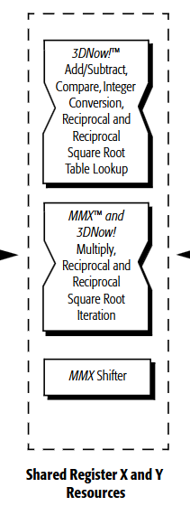
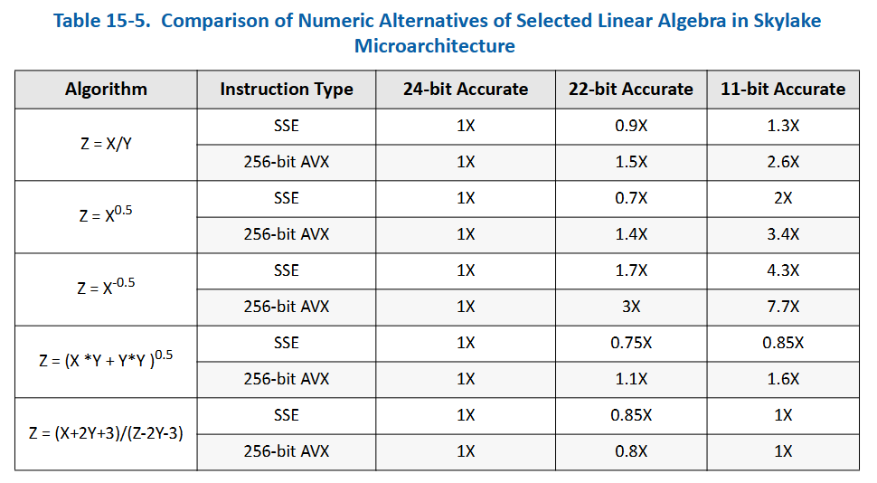
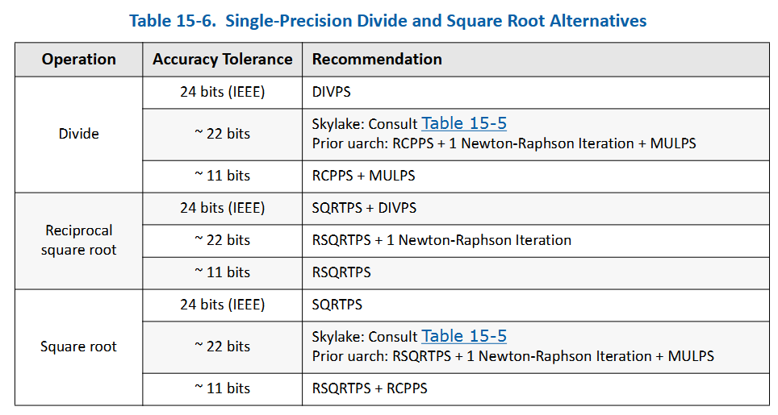

+++
date = 2024-12-27T15:09:31+09:00
lastmod = ''
draft = false

title = "고속 역제곱근과 그 후 구현체들"
summary = ""

isCJKLanguage = true

tags = ["Assembly", "fast inverse square root", "mathematics", ]
categories = ["dev"]
+++

예전에도 fast inverse square root알고리즘을 본 적은 있지만, 그 때는 그저 '오-신기하네' 하고 넘어갔던 기억이 있다. 문득 최근 갑자기 거기에 생각이 미쳐 이해해보려 했으나, 위키피디아의 문서가 살짝 부실해서 개인적으로 직접 유도해보았고, 그 김에 궁금증이 생겨서 모던 방법론까지 찾아보았다. 이 포스팅은 그에 대한 정리다.

이 포스트에선 조금 더 친절하게 유도해준다. 그러나 각 실행 시간 및 명령어 셋에 대한 상세한 정보를 담진 않았고, 그에 대한 자세하고 좋은 포스팅을 발견했기 때문에(특히 어떤 컴파일 플래그를 사용했을 때 어떻게 달라지는지에 대해 아주 상세한 보고를 담고 있었다.) 이에 링크를 건다.

[Revisiting The Fast Inverse Square Root - Is It Still Useful?](https://hllmn.net/blog/2023-04-20_rsqrt)

## Fast Invese square root

### Intro

이미 너무 잘 알려진 일화지만, 우선 설명을 해보겠다. 렌더링 분야에서 조명 및 셰이딩등의 필요로 인해 normal을 상당히 자주 구해야한다. 이 때 이 normal을 정규화 하기 위해 제곱근의 역수를 계산의 필요성이 컸다. 이 중 퀘이크 3 아레나에 쓰인 Fast inverse square root라는 알고리즘이 아주 유명하다. 골때리는 주석과 선뜻 이해하기 힘든 로직이 이 유명세의 백미이다.

c와 친하지 않은 분들을 위해 설명하자면,(뒤쪽 iteration 부분은 빼고)

1. float 를 integer취급한다.(비트는 그대로인 채)
2. magic number에서 integer 취급한 float를 뺀다.
3. 다시 float취급한다.
4. 이제 원래 float의 제곱근의 역수가 되었다.(?)

원본 소스코드는 다음과 같다.

[Github 'Quake-III-Arena'](https://github.com/id-Software/Quake-III-Arena/blob/master/code/game/q_math.c#L552)

```c
float Q_rsqrt( float number )
{
	long i;
	float x2, y;
	const float threehalfs = 1.5F;

	x2 = number * 0.5F;
	y  = number;
	i  = * ( long * ) &y;						// evil floating point bit level hacking
	i  = 0x5f3759df - ( i >> 1 );               // what the fuck?
	y  = * ( float * ) &i;
	y  = y * ( threehalfs - ( x2 * y * y ) );   // 1st iteration
//	y  = y * ( threehalfs - ( x2 * y * y ) );   // 2nd iteration, this can be removed
	return y;
}
```

여기서 핵심은 다음 두 가지이다.
1. 수학적으로 integer와 float를 옮겨타는게 어떤 뜻을 의미하는가?
2. iteration은 어떤 의미를 갖는가?

두 번째는 어떤 의미로는 trivial 하지만, numerical optimization과 친하지 않다면 어려울 것이므로 같이 풀어보자.

&nbsp;

### Delving into float and int

여기서 핵심은 float representation이다.


IEEE 754의 32비트 부동소수점 데이터 포맷에 따르면 float는 위 구조를 가지고 있다.

- Sign(1bit) $s$: 양수/음수
- Exponent(8bit) $e$: 2의 지수부. 127의 offset을 갖는다.
- fraction(23bit) $f$: msb부터 $2^{-1}, 2^{-2}, \cdots, 2^{-23}$

이에 대해 지수부와 가수부의 비트를 integer로 생각하고 각각 나타내는 숫자가  $e$와 $f$라고 해보자. fraction 파트가 나타내는 바는 결국 정수형과 같지만 $2^{-23}$을 곱했을 뿐이다. float representation은 다음과 같아진다.

$$
float \to {(-1)}^s \cdot 2^{(e-127)} \cdot (1+2^{-23}f)
$$

반면 같은 비트가 integer를 의미할 때는 다음과 같다. (sign은 생략.)

$$
int \to 2^{23}e + f
$$

여기서 다음 성질이 있다.

1. floating point representation에서, 가수부 $(1+2^{-23}f)$  는 $[1.0~2.0)$이다.
2. integer representation이 되면서, **2의 지수 $e$ 가 실수부로 내려왔다.**

2번에 의해서, float가 int로 변환된다는 것은 scale과 임의의 offset $\alpha$ 를 가진 다음 변환이 된다.

$$
f_{float \to int}(y) : 2^{23} \log_2 y + \alpha
$$

그리고 log는 지수부를 단순 사칙연산으로 바꿀 수 있다는 특징이 있다. 따라서 $-{1\over2} \log_2 y$ 를 다시 exponent로 바꾸면, $y^{(-1/2)}= {1\over \sqrt{y}}$ 가 된다.

&nbsp;

### Approximating

여기서 식을 조금 더 develop한다면,

$$
f_{float \to int}(y) = 2^{23} (e-127 + \log_2(1+2^{-23}f) ) + \alpha
$$

이 된다. 여기서 $\log_2 (1+2^{-23}f)$ 은 $[0,1)$이기 때문에, $\log_2(1+x) \approx x + c$ 로 근사 가능하다.
(여기서 $c$는 error compensation term.)


  const width = canvas.clientHeight;
  const height = canvas.clientHeight;
  const margin = 40;
  
  // draw axis
  const x = d3.scaleLinear()
    .domain([-0.1, 1.1])
    .range([margin, width - margin]);
  
  const y = d3.scaleLinear()
    .domain([-0.1, 1.1])
    .range([height - margin, margin]);
  
  const svg = d3.create("svg")
    .attr("width", width)
    .attr("height", height)
    .attr("viewBox", [0, 0, width, height]);
  
  svg.append("g")
    .attr("class", "axis x-axis")
    .attr("transform", `translate(0, ${height - margin})`)
    .call(d3.axisBottom(x));
  
  svg.append("g")
    .attr("class", "axis y-axis")
    .attr("transform", `translate(${margin}, 0)`)
    .call(d3.axisLeft(y));

  // grid
  const gridData = [[0,-0.1],[0,1.1],null,[1,-0.1],[1,1.1]]
  svg.append("path")
    .datum(gridData)
    .attr("fill", "none")
    .attr("stroke", "lightgray")
    .attr("stroke-width", 1)
    .attr("d", d3.line().defined(d=>d!==null).x(d=> x(d[0])).y(d=> y(d[1])));

  svg.append("path")
    .datum(gridData)
    .attr("fill", "none")
    .attr("stroke", "lightgray")
    .attr("stroke-width", 1)
    .attr("d", d3.line().defined(d=>d!==null).x(d=> x(d[1])).y(d=> y(d[0])));

  // draw log2
  const data = d3.range(-0.05, 1.05, 0.01).map(x => ({
    x: x,
    y: Math.log2(1+x)
  }));

  const lineLog2 = d3.line()
    .x(d => x(d.x))
    .y(d => y(d.y));

  svg.append("path")
    .datum(data)
    .attr("fill", "none")
    .attr("stroke", "steelblue")
    .attr("stroke-width", 2)
    .attr("d", lineLog2);
  
  // draw linear
  const lineLinear = d3.line()
    .x(d => x(d.x))
    .y(d => y(d.x + 0.0450465));

  svg.append("path")
    .datum(data)
    .attr("fill", "none")
    .attr("stroke", "red")
    .attr("stroke-width", 2)
    .attr("d", lineLinear);

  canvas.append(svg.node());


따라서,

$$
\begin{align*}
f_{float \to int}(y) &=  2^{23} e + f \newline
&\approx 2^{23} (e-127 + 2^{-23}f + c ) + \alpha \newline
&\approx 2^{23} e + f + 2^{23}(c - 127) + \alpha \newline
\end{align*}
$$

에서,

$$
\alpha \approx 2^{23} (127-c)
$$

$$
f_{float \to int}(y) : 2^{23} (\log_2 y + 127 - c)
$$

가 된다.

&nbsp;

### Compensating the bias

이제 integer에서 -1/2를 곱한다고 생각해보자.

$$
-{1\over2}2^{23} (\log_2 y + 127 - c) = 2^{23} (\log_2 y^{-{1\over2}} - {1\over2} (127 - c) )
$$

그런데 우리는 다시 float로 바꾸기 전에, 우측의 상수 term$(127 - c)$은 다시 원래 모양을 찾길 바란다. 따라서 다음 상수를 더해준다.

$$
2^{23} (\log_2 y^{-{1\over2}} - {1\over2} (127 - c) ) + 2^{23}({3\over2}(127-c))
\newline

= 2^{23} (\log_2 y^{-{1\over2}} + 127 - c)
$$

이제 다시 float로 변환하면 inverse square root가 된다.

여기서 상수 $2^{23}({3\over2}(127-c))$ 를 구해보자. 위에서 그림을 그릴 때 사용했던 상수는 `0.0450465`이다. (이 상수는 원본의 magic number를 재생산 하기 위한 숫자이다.Chris Lomont는 최적의 상수 `0.432744889959443195468521587014`를 구해내었다.)

$$
2^{23}({3\over2}(127-0.0450465))\newline
\approx 1597463007_{(10)}\newline
= 5F3759DF_{(16)}
$$

또, integer는 bit `>>` 연산으로 오른쪽으로 한 비트 미는 것으로 1/2을 얻을 수 있다. 따라서 -1/2를 곱하고, 보정하기 위한 상수를 더하는 과정을 코드로 표현하면 다음과 같다.

```c
i  = 0x5f3759df - ( i >> 1 );
```

&nbsp;

### Newton-Raphson Method


Newton’s method라고 불리는 이 방식은 정확한 해를 모를 때 derivative와 접선의 x절편을 이용하여 수치해를 찾아내는 방법으로, 식으로 나타내자면 다음과 같다.

$$
x_{n+1}=x_n - {{f(x_n)}\over{f'(x_n)}} 
$$

여기서 우리가 원하는 제곱근의 역수를 이 식으로 나타내기 위해 $f(x) = 0$ 꼴로 만들자.

$$
y={1\over \sqrt x} \newline
y^{-2}-x=0 = f(y)
$$

우리가 구해야하는 해는 $y$이고 , 입력 $x$는 이 시점에서 상수와 같다. Newton’s method를 적용시켜보면,

$$
\begin{align*}
y_{n+1}
&=y_{n} - {{y_n^{-2}}-x\over -2y_n^{-3}} \newline
&=y_{n} + y_n({1\over2} - {1\over2} x y_n^2) \newline
&=y_n({3\over2} - {1\over2} x y_n^2)
\end{align*}
$$

이를 코드로 나타내보자.

```c
const float threehalfs = 1.5F;
x2 = number * 0.5F;
y = y * ( threehalfs - ( x2 * y * y ) );
```

이것으로 모든 방법이 풀렸다.

```c
float Q_rsqrt( float number )
{
	long i;
	float x2, y;
	const float threehalfs = 1.5F;

	x2 = number * 0.5F;
	y  = number;

    // log_2 를 적용
	i  = * ( long * ) &y;

    // -0.5를 곱하고, 지수부의 bias 및 기타 근사화 수치를 보정
	i  = 0x5f3759df - ( i >> 1 );

    // 다시 float 형식으로 변환
	y  = * ( float * ) &i;


    // newton's method
	y  = y * ( threehalfs - ( x2 * y * y ) );   // 1st iteration
//	y  = y * ( threehalfs - ( x2 * y * y ) );   // 2nd iteration, this can be removed
	return y;
}
```

## square root 명령어

### Basic instruction sets

|Instruction set|&emsp;&emsp;&emsp;&emsp;$\sqrt x$&emsp;&emsp;&emsp;&emsp;|&emsp;&emsp;&emsp;&emsp;${1\over{\sqrt x}}$&emsp;&emsp;&emsp;&emsp;|
|:-:|:-:|:-:|
|x87|`fsqrt`||
|3DNow!||`pfrsqrt`|
|SSE|`sqrtps`, `sqrtss`|`rsqrtps`, `rsqrtss`|
|SSE2|`sqrtpd`, `sqrtsd`||
|AVX|`vsqrtps`, `vsqrtpd`,`vsqrtsd`,`vsqrtss`|`vrsqrtps`,`vrsqrtss`|
|AVX-512|`vsqrtps zmm` etc.|`vrsqrt14ps` etc.|

AVX부터는 종류가 많다. 이 중 `fsqrt`는 잘 사용되지 않으며, AMD 3DNow!도 deprecated되었다. 해석하는 법을 첨언하자면 다음과 같다.

- `sqrt` : 당연히 제곱근을 의미한다.
- `rsqrt` : reciprocal of square root. 제곱근 역수.
- `s`/`p` : packed. SIMD명령어에서 여러 데이터를 동시에 처리한다.
- `s`/`d` : single precision / double precision
- `v` : vectored extenson. 3-operand등의 방식을 사용 가능하다. (src/dst등이 더 자유로움)
- `zmm` : name of register
- `14` : 근사 계산의 precision. `14` 는 

예를들어, `vrsqrt14ps` 같은 경우는 packed single precision 데이터에 대해 제곱근의 역수를 계산하며, $2^{-14}$의 상대 오차를 보장한다는 뜻이다.

### So how does this work?

[3DNow! reference pdf](https://www.amd.com/content/dam/amd/en/documents/archived-tech-docs/programmer-references/21928.pdf)

우선 3DNow! 시절 알고리즘을 보면 다음과같다. `b`가 제곱근을 구할 대상이며, `X3` 가 reciprocal of square root가 된다.

```
X0 = PFRSQRT(b)
X1 = PFMUL(X0, X0)
X2 = PFRSQIT1(b, X1)
X3 = PFRCPIT2(X2, X0)
```


이에 대해 PFRSQRT 는 15비트까지 accurate하며, `PFRSQIT1` 를 이용해 iteration을 하고, 역수를 계산하기 위한 iteration 명령어인 `PFRCPIT1`과 `PFRCPIT2` 중 `PFRCPIT2` 명령어를 재사용하여 24비트 정확도를 얻어낸다고 되어있다. 여기 technical manual에서 명시적으로 위의 bit-level hacking과 동일한 구조의 Newton-Rhapson method에 대해 발언한다.



정밀도를 얻어내는 과정이야 이제 Newton-Rhapson method인 듯하나, 최초 근사의 경우 이런 bit-level hacking을 사용하진 않는 듯 보인다. 비록 명령어셋까지 정의한 시점에서 그 아래 레이어의 구현체는 하드웨어 제조사의 마음이며, 아키텍쳐에 따라서도 variation이 있을 것이다.  다만 이 문서에는 명시적으로 Square Root Table Lookup이라고 되어있다.

floating point의 데이터는 exponent/mantissa 의 분리가 가능한데, 이렇게 분리한 후 exponent의 일부와 mantissa의 데이터를 상위 n비트를 이용하여 lookup table을 이용하여 빠른 속도로 근사하는 것으로 보이며, 이 안에서 dedicated된 몇 iteration을 돌거나 그대로 나오는 것으로 보인다. 결국은 memory<->속도 사이의 trade-off를 나름대로 조절하여 15비트 수준의 정밀도를 내보내는 것으로 보인다.


### Modern instruction choices

`sqrt`  방법은 근사치라고 되어있지 않은데에 반해, `rsqrt` reciprocal의 경우 근사치라고 명시되어있다. 여기서 근사치와 근사치가 아님의 기준은 $\pm0.5 \mathrm{ulp}$ 인데, ulp는 unit of least precision으로 lsb에 대한 상대 단위를 나타낸다. 이 단위의 0.5 이하로 오차가 들어온다면 이 bit representation으로 표시 불가능한 차이이기 때문에 근사치가 아니다라고 말할 수 있다.

재미있게도 3DNow!의 경우엔 `fsqrt` 를 구할 때 `RFRCPIT2` 이후 원본 데이터와 곱해주어 제곱근을 얻어내는 선택지를 골랐는데, 이후엔 `sqrtss` 명령어 쪽이 조금 더 dedicated 되어 `rsqrt`를 사용하는 데에 쓰도록 바뀌었다. 이에 대해서 [Intel® 64 and IA-32 Architectures Optimization Reference Manual: Volume 1](https://www.intel.com/content/www/us/en/content-details/671488/intel-64-and-ia-32-architectures-optimization-reference-manual-volume-1.html) 에서는, 다음과 같은 자료를 제공해준다.



여기서 22-bit와 11-bit항목은 각 항목을 24-bit accurate 데이터로 처리하는 것에 비해 얼마나 throughput이 나오는지인데, 재밌게도 몇몇 예시 operation의 경우 24-bit accurate 데이터보다 22-bit accurate 데이터가 더 throughput이 낮다. 이에 대해선 `DIVPS` / `SQRTPS` 등의 명령어셋이 레이턴시가 더 빠르기 때문에 반복적인 근사작업을 하는 것 보다 더 빠른 결과를 낸다는 설명이 주어졌다.



결과적으로 24비트 reciprocal of square root의 선택지는 square root 이후 역수를 구하는 방식이 권장 사항이 된다. 이에 대해선 [맨 처음 언급한 블로그](https://hllmn.net/blog/2023-04-20_rsqrt) 글에서 실험 결과가 있는데, 근사치를 허용하는 컴파일러의 옵션을 주지 않는 이상 일반적으로 근사치를 사용하지 않는 것 같다. 이 실험 결과에선 dedicated sqaure root instruction이 없는 한 이 fast inverse square root method가 아직 괜찮다고 결론 내린것 같지만, 아마 그런 환경이 엄청 흔하진 않을 것 같고, 또 이 정도의 최적화를 요구하는 환경이 많지는 않을 것으로 보인다.

결과적으로 modern computing 환경에서는 reciprocal square root는 24-bit accurate하며, 그 속도도 충분히 빠르다고 볼 수 있을 것 같다. 또한 이 빠른 속도의 근원은 sqrt만을 위한 dedicated instruction이 되는 듯 싶다.