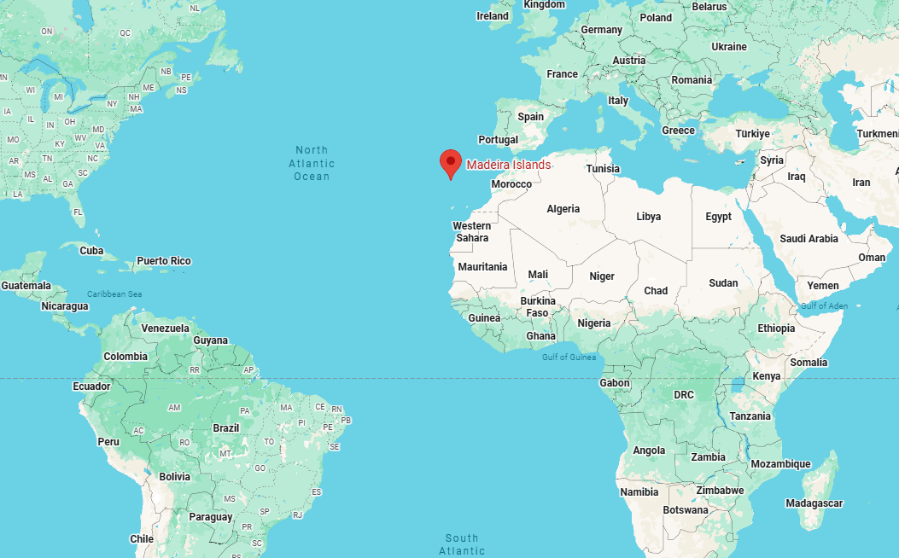
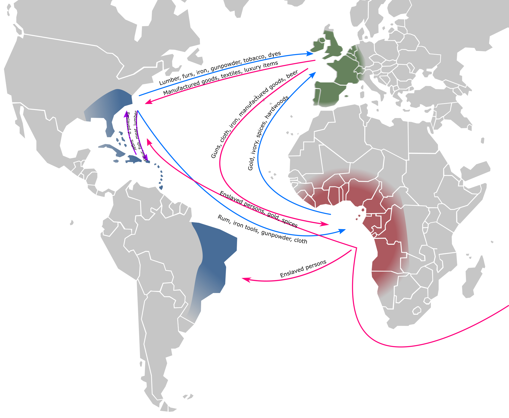
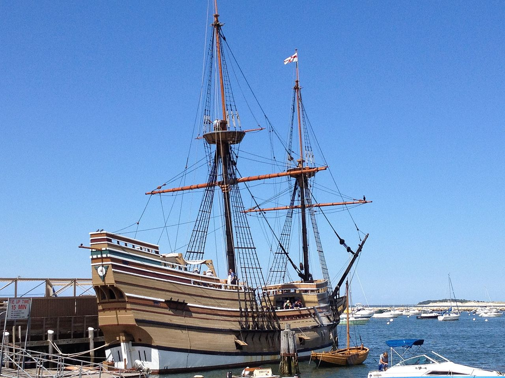
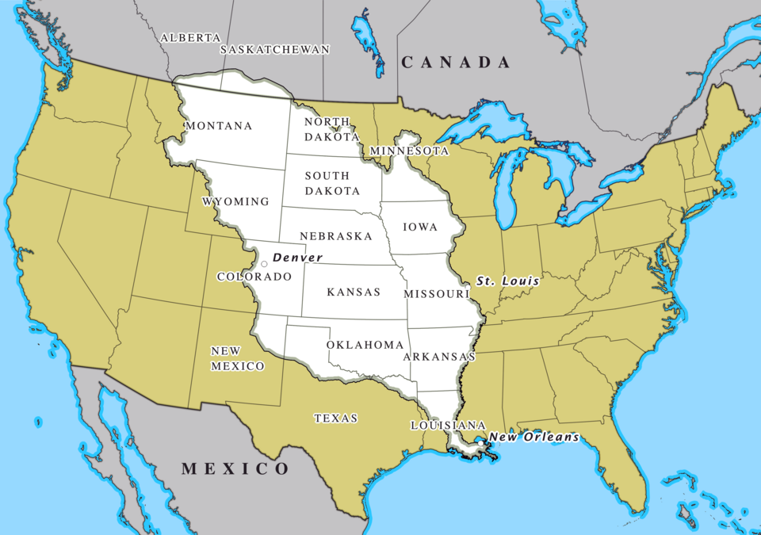
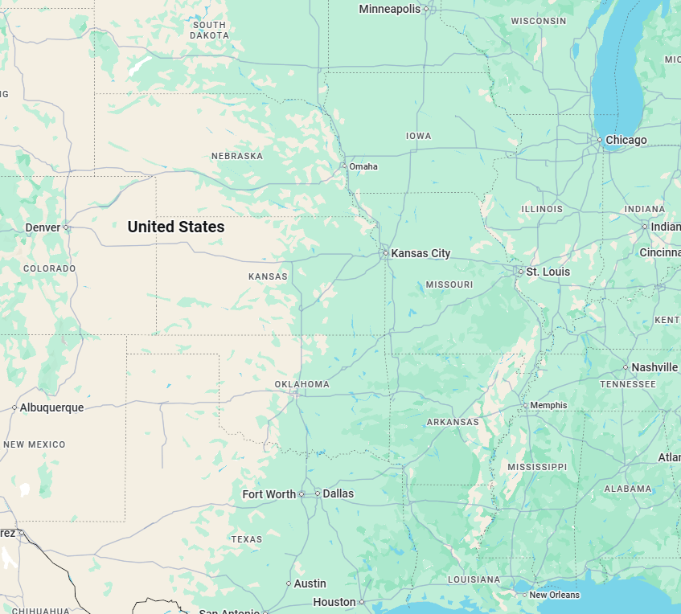

+++
date = 2026-02-01T11:00:00+09:00
lastmod = 2026-02-19T12:36:00+09:00
draft = true

title = "노예의 나라, 미국"
summary = ""

isCJKLanguage = true

tags = ["america", "economy", "essay", "nation of slaves"]
categories = ["essays"]

references = [
    # 1 
    {title = "Trump's immigration approval drops to record low, Reuters/Ipsos poll finds", link = "https://www.yahoo.com/news/articles/trumps-immigration-approval-drops-record-210330579.html"},
    # 2
    {title = "DHS.gov", link = "https://www.dhs.gov/news/2026/01/22/day-1-secretary-noem-president-trump-have-enhanced-federal-law-enforcement-training"},
    # 3
    {title = "Two Systems of Justice, American Immigration Council", link = "https://www.americanimmigrationcouncil.org/wp-content/uploads/2025/01/aic_twosystemsofjustice.pdf"},
    # 4
    {title = "Fong Yue Ting v. United States, 149 U.S. 698 (1893)", link = "https://supreme.justia.co/cases/federal/us/149/698/"},
    # 5
    {title = "Global Estimates of Modern Slavery", link = "https://publications.iom.int/books/global-estimates-modern-slavery-forced-labour-and-forced-marriage"},
    # 6
    {title = "Spices and Their Costs in Medieval Europe", link = "https://www.economics.utoronto.ca/munro5/SPICES1.htm"},
    # 7
    {title = "Madeira, Sugar, and the Conquest of Nature in the 'First' Sixteenth Century, Part I: From 'Island of Timber' to Sugar Revolution, 1420–1506", authors = "Jason W. Moore", link = "https://www.jstor.org/stable/41427474"},
    # 8
    {title = "Bartolomé de las Casas", link = "https://en.wikipedia.org/wiki/Bartolom%C3%A9_de_las_Casas"},
    # 9
    {title = "대한성서공회", link = "https://www.bskorea.or.kr/"},
    # 10
    {title = "Sanhedrin 108b", link = "https://www.sefaria.org/Sanhedrin.108b?lang=bi"},
    # 11
    {title = "The development of the plantation system", link = "https://discoveringbristol.org.uk/slavery/routes/places-involved/west-indies/plantation-system/"},
    # 12
    {title = "Ending the Slavery Blame-Game", link = "https://www.nytimes.com/2010/04/23/opinion/23gates.html"},
    # 13
    {title = "Negro womens children to serve according to the condition of the mother", link = "https://encyclopediavirginia.org/primary-documents/negro-womens-children-to-serve-according-to-the-condition-of-the-mother-1662"},
    # 14
    {title = "An act declaring that baptisme of slaves doth not exempt them from bondage", link = "https://encyclopediavirginia.org/primary-documents/an-act-declaring-that-baptisme-of-slaves-doth-not-exempt-them-from-bondage-1667"},
    # 15
    {title = "An act for the apprehension and suppression of runawayes, negroes and slaves", link = "https://encyclopediavirginia.org/primary-documents/an-act-for-the-apprehension-and-suppression-of-runawayes-negroes-and-slaves-1672/"},
    # 16
    {title = "An act for preventing Negroes Insurrections", link = "https://encyclopediavirginia.org/primary-documents/an-act-for-preventing-negroes-insurrections-1680"},
    # 17
    {title = "An act for suppressing outlying slaves", link = "https://encyclopediavirginia.org/primary-documents/an-act-for-suppressing-outlying-slaves-1691"},
    # 18
    {title = "An act concerning Servants and Slaves", link = "https://encyclopediavirginia.org/primary-documents/an-act-concerning-servants-and-slaves-1705"},
    # 19
    {title = "Textile manufacture during the British Industrial Revolution", link = "https://en.wikipedia.org/wiki/Textile_manufacture_during_the_British_Industrial_Revolution"},
    # 20
    {title = "Slave trade in the United States", link = "https://en.wikipedia.org/wiki/Slave_trade_in_the_United_States"},
    # 21
    {title = "The Domestic Slave Trade", link = "https://courses.lumenlearning.com/wm-ushistory1/chapter/the-domestic-slave-trade/"},
    # 22
    {title = "THE AMERICAN YAWP 11. The Cotton Revolution - ref 7", link = "https://www.americanyawp.com/text/11-the-cotton-revolution"},
    # 23 
    {title = "The importance of slavery and the slave trade to industrializing Britain", authors = "Eltis D, Engerman SL.", doi = "10.1017/S0022050700024670"},
    # 24 산업혁명의 구체적인 수치
    {title = "Industrial Revolution", link = "https://en.wikipedia.org/wiki/Industrial_Revolution"},
    # 25 생도맹그의 생산력
    {title = "History of Haiti", link = "https://en.wikipedia.org/wiki/History_of_Haiti"},
    # 26 윌리엄 윌버포스의 노조 발언
    {title = "William Wilberforce and the Perceptions of the British People", autohors = "Hind, Robert J", doi = "10.1111/j.1468-2281.1987.tb00500.x"},
    # 27 브라질 노예무역 법안
    {title = "Aberdeen Act", link = "https://en.wikipedia.org/wiki/Aberdeen_Act"},
    # 28
    {title = "Indo-Guyanese", link = "https://en.wikipedia.org/wiki/Indo-Guyanese"},
    # 29
    {title = "George Mason's Views on Slavery", link = "https://archive.gunstonhall.com/georgemason/slavery/views_on_slavery.html"},
    # 30 1808까지 SC의 노예 수입
    {title = "The Louisiana Purchase and South Carolina's Reopening of the Slave Trade in 1803", authors = "Handelsman, Jed", doi = "10.2307/3125182"},
    # 31 토마스 제퍼슨
    {title = "The Dark Side of Thomas Jefferson", link = "https://www.smithsonianmag.com/history/the-dark-side-of-thomas-jefferson-35976004/"},
    # 32 birthing의 인센티브 구조
    {title = "Birthing a Slave: Motherhood and Medicine in the Antebellum South", authors = "Schwartz, M. J. ", doi = "10.2307/j.ctv1n1bscg"},
    # 33 흑인 신체 평가 
    {title = "Black Maternal and Infant Health: Historical Legacies of Slavery", authors = "Owens, D.C, Fett ,S.M.", doi = "10.2105/AJPH.2019.305243"},
    # 34 Negro President
    {title = "\"Negro President\": Jefferson and the Slave Power", authors = "Garry Wills", isbn = "978-0618485376"},
    # 35 버지니아 대 펜실베니아 예시
    {title = "The Troubling Reason the Electoral College Exists", link = "https://akhilamar.com/wp-content/uploads/2021/01/Voting-History-The-Real-Reason-the-Electoral-College-Exists-Time.pdf"},
    # 36 더글라스
    {title = "Stephen A. Douglas", link = "https://en.wikipedia.org/wiki/Stephen_A._Douglas"},
    # 37 Kansas-Nebraska Act
    {title = "Kansas-Nebraska Act", link = "https://www.archives.gov/milestone-documents/kansas-nebraska-act"},
    # 38 Kansas-Nebraska Act 결과
    {title = "TO PASS H.R. 236.", link = "https://www.govtrack.us/congress/votes/33-1/h309"},
    # 39 사무엘 대처의 발언
    {title = "The Electoral College", link = "https://www.lwvbae.org/league-news/electoral-college-series-1/"},
    # 40 윌모트의 발언
    {title = "The Frontier Against Slavery: Western Anti-Negro Prejudice and the Slavery Extension Controversy", authors = "Berwanger, Eugene H.", isbn = "0252070569"},
    # 41 Dred Scott case판결문
    {title = "Dred Scott v. Sandford (1857)", link = "https://www.archives.gov/milestone-documents/dred-scott-v-sandford"},
    {title = "", link = ""},
    {title = "", link = ""},
    {title = "", link = ""},
    {title = "", link = ""},
    {title = "", link = ""},
    {title = "", link = ""},
    {title = "", link = ""},
    {title = "", link = ""},
    {title = "", link = ""},
    {title = "", link = ""},
    {title = "", link = ""},
    {title = "", link = ""},
    {title = "", link = ""},
    {title = "", link = ""},
    {title = "", link = ""},
    {title = "", link = ""},
    {title = "", link = ""},
    {title = "", link = ""},
    {title = "", link = ""},
    {title = "", link = ""},
]

+++

2026년 1월 24일, 미네소타주 미니애폴리스에서 ICE요원의 단속 과정에서 총격이 발생했다. 37세의 보훈병원 중환자실의 간호사이자, 미국의 시민권자 Alex Jeffrey Pretti가 사망했다. 마찬가지로 미국의 시민권자인 Renee Good의 ICE 단속으로 인한 총격 사망 사건 이후에 발생한 미니애폴리스의 두번째 총격 사망사건이었다. 

정작 ICE의 체포작전에서 희생당한 사람들은 불법체류자가 아니었다. 단속에 반대하던 미국 시민권자였다. 이 사건을 둘러싼 미국 갈등의 골이 점점 더 깊어지고 있다. ICE요원들은 시민들의 반발을 의식해 마스크를 쓰고 체포작전을 진행한다. 대략 10만명이 참여한 대규모 시위가 열렸고, 무려 58%의 미국 시민이 '너무 과하다'며 반대의 목소리를 내고 있다. 

하지만 정치인은 누군가 반대하는 일은 해도, 아무도 지지하지 않는 일은 하지 않는다. 즉, 이 모든 사태는 **미국인들이 — 일부일지언정 — 원해서** 일어난 일이다. 초기의 이민자 단속에 대한 지지율은 훨씬 높았고, 이렇게 대규모 이슈가 터진 시점에서도 아직 39%의 미국 시민은 이민자 단속에 대해 찬성을 하고 있다. 

프레이밍은 명확하다 : '불법 입국자들이 미국인의 일자리를 뺏고있다.' 비록 누군가는 총격 사건에 대해 불만을 표하고, 가끔 과하다고 생각을 할 수 있겠지만, 본질적으로 불법 체류자를 쫓아내는 데에는 대중적인 합의가 어느 정도 성립한다고 볼 수 있다. 그들은 '불법'체류자이기 때문이다. 범죄를 저지르는 존재이고, 미국인의 일자리를 빼앗는 존재이기 때문에, 다소의 진통이 있을지언정 추방하는 것이 옳다고 생각한다. 이런 생각이 틀렸다는 것이 아니다. 법치주의 사회에서 불법을 저지른 사람에 대한 처벌은 보편타당하게 동의 가능한 명제이다.

그런데 여기서 근본적인 의문이 제기된다. **'불법'인데, 왜 경찰이 단속하지 않는가?** 어째서 수년간의 체포경험이 있는 전문직 요원들이 이 업무에 동원되지 않고, 최근 들어서는 훈련이 무려 42일까지 단축된 ICE요원들이 이들을 단속하는가?

그건 이들이 받게 되는 재판이 **'민사'** 재판이기 때문이다. 형사 재판이 아니기 때문에, 미란다 원칙 고지가 필요 없다. 국선 변호인도 지원되지 않으며, 자비로 변호사를 구해야한다. 배심원 재판도 없다. 판사 한 명이 결정한다. 증거 기준도 낮다. 소급 적용 금지 원칙도, 시효도 없다. 본질적으로 우리가 만들어낸 현대 법 체계의 보호와 절차가 그들에게 적용되지 않는다. 1893년 대법원에선, 추방은 형벌이 아니라 '체류를 허용하지 않는 행정 조치'이기 때문에, '배심재판권, 불합리한 수색/압수 금지, 잔혹하고 비정상적인 처벌을 금지하는 조항도 적용되지 않는다'고 판결했다.

이건 실수가 아니다. 정교한 디자인이다. 이 시스템에는 역사가 있다. 저임금 무권리 노동자를 양산하고 처분하기 위해 시행착오를 거쳐 온 역사이다. 이 역사는 미국의 탄생과 그 연원을 같이 한다. 

이것은 노예에서 시작해, 죄수 임대를 거쳐 오늘날의 이민 노동까지 이어지는, 미국의 **시스템 최적화**에 대한 이야기다.

&nbsp;

## 노예의 기원

### 설탕

인류 역사상 노예는 보편적인 신분제도였다. 이미 선사시대 때부터 노예가 있었다는 증거가 있으며, 기원전 4000년경의 수메르에서도 노예는 이미 제도화 되어있었다. 오늘날까지도 - 노예의 정의에 따라 다르지만 - ILO는 2021년 기준 약 5000만 명이 현대의 노예상태라고 추측한다. 그러나 이중 우리가 가장 익숙한 노예제라함은, **대서양 노예무역**이다. 지금까지도 사회에 커다란 영향을 준 노예 무역이자, 대항해 시대 대격변의 한복판에 서있던 노예무역, 그리고 1000만 이상이 이주한 대단위 노예무역이기 때문이다.

그렇다. 대서양 노예무역의 시작엔 대항해시대가 위치한다. 일반적으로 대항해시대의 이미지엔 향신료가 존재하지만, 대항해시대의 화물은 향신료만이 아니었다. 이 당시 후추가 엄청난 사치품이었다는 사실은 잘 알려져있지만, 설탕이 잠시간이지만 후추 이상의 가격을 자랑했다는 사실은 상대적으로 덜 알려져있다. 설탕은 후추에 버금가는 작물이었다. (사탕수수는 남아시아, 동남아시아쪽이 원산지이다.) 1438년경의 기록으로 보자면, 설탕 1파운드(약 350~380g)가 대략적으로 숙련공의 이틀 일당이라 했다. 이 당시 설탕 1파운드는 16펜스, 후추 1파운드는 18펜스라고 하니 설탕과 후추의 가격이 실제로 엇비슷했다. (통념과는 달리, 금가격에 버금가진 않았다.) 이 당시 소 한마리와 설탕 2.6kg이 비슷한 가격이었으니, 설탕을 안정적으로 공급 받는건 거의 금광을 갖는 것과도 같았던 것이다.

이런 시대 배경에서, 포르투갈은 1420년 식민화한 마데이라에서 1440년대부터 사탕수수 재배를 시작한다. 1470년에는 연당 생산량이 230톤 수준이었으나, 1506년에는 무려 연당 2500톤 가량을 생산한다.  마데이라에서는 연료가 부족하여 생산량이 쇠퇴했지만, 사실 설탕 생산에는 아주 커다란 또 다른 어려움이 있었다. 바로 **노동력**이었다.

사탕수수를 자르는 바로 그 순간부터 당분은 분해되고 발효되기 시작한다. 사탕수수 농업은 구조적으로 수확과 가공이 거의 동시에 이루어져야 했으므로 노동력이 상당히 많이 들어갔다. 심지어 가공 과정 또한 상당히 노동 집약적이다. 설탕 정제는 압착, 가열, 정제 과정을 거친다. 압착은 원래 물리적으로 위험한 과정이란 걸 차치하고서라도 상당히 노동을 많이 요한다. 압착한 사탕수수 즙을 끓이는 과정도 중요한데, 반복적으로 오랜 시간 끓이는 데다가 끓이는 과정에서 불순물을 계속해서 제거해줘야했다.

&nbsp;

### 원주민 노동과 바야돌리드 논쟁

이런 흐름에서, 콜럼버스가 1493년 두 번째 대서양 항해에 사탕수수를 가져갔다. 히스파니올라에서 재배가 시작되었다. 1502년, 엔코미엔다 시스템이 확립되었다. 엔코미엔다는 스페인의 식민지 통치제도로, 강제노동의 대가로 보호령으로 삼는 것이다. 결국 히스파니올라의 원주민들은 플랜테이션에 동원되었다.

하지만 신대륙의 원주민들은 구대륙의 질병에 전혀 항체가 없었다. 면역력이 없는 새로운 질환에 노출된 그들은 병에 걸려 죽어갔다. 질병만이 아니었다. 그들은 질병에 더해 가혹한 노동과 기아로 죽어나가기 시작했다. 1508년, 20년도 지나지 않아 히스파니올라 원주민이 40만에서 6만으로 감소하였다.

스페인의 '표면적인 명분'은, 원주민을 종교적으로 교화해서 영혼을 구제하고 보호해주는 것이었다. 실질적으론 노예제로 기동한 엔코미엔다지만 그 아래에 깔린 명분을 무시할 수는 없는 법이다. 실제로 잔인한 식민지배에 큰 충격을 받은 본국인들도 다수 존재했었고, 결국 원주민 보호논쟁에 불이 붙었다. 그 중 가장 유명한 신부가 바르톨로메 데 라스 카사스(Bartolomé de las Casas) 신부이다.

그가 식민지에 있을 때, 식민지배에 항전하던 원주민 중 구심점으로 작용하던 아투에이(Hatuey)가 화형 당하는 일이 벌어졌다. 그는 화형 전에 종군 신부에게 개종 제안을 받았다. 개종하면 천국으로 갈 수 있다 하였다. 아투에이는 '*그리스도인들이 천국에 가냐*' 고 물었고, 신부는 그렇다 하였다. 아투에이는 그 말을 듣고, 천국을 거부하겠노라 하였다. 이 사건을 보고 라스 카사스는 큰 충격을 받았고, 후에 아래와 같은 글을 남겼다.

>
> *Esta es la fama y honra que Dios e nuestra fe ha ganado con los cristianos que han ido a las Indias.*
>
> *이것이 인디아스로 간 그리스도인들 때문에 하느님과 우리 신앙이 얻은 명성과 명예다.*
>
> 
> 

라스 카사스는 노예가 풍부한 그의 엔코미엔다를 포기하였다. 라스 카사스만 충격받은 것이 아니었다. 인디오들에 대한 착취를 멈춰야한다는 목소리는 커져가고 있었다. 1537년 교황 바오로 3세가, 원주민이 이성적 인간이며 영혼이 있다고 선언하였다. 또, 1542년, 신법이 통과되어 엔코미엔다 제도가 제한되었다. 

그러나 **산업 구조는 바뀌지않는다.** 설탕은 여전히 비쌌고, 사탕수수는 여전히 노동집약적이었다. 반란이 일어났다. 결국 1544년 신법이 일부 철회되고, 1547년 엔코미엔다 제도는 복귀되었다. 

결국 1550년 스페인 서북부의 바야돌리드에서, **바야돌리드 논쟁(Junta de Valladolid)** 이라 부르는 유명한 논쟁이 벌어지게 되었다. 한 쪽은 신법을 아예 폐지해서 제한을 풀고싶어했다. 라스 카사스 신부측은 정복 자체를 중단하고 싶었다. 이 논쟁은 유럽 사상 최초로 제국주의의 도덕성을 공개 토론한 사례로 뜻 깊게 남아있으며, 근대 인권 담론의 선구적 사례로 평가받는다. 그러나 이 논쟁은 무승부로 끝난다. 

설탕은 여전히 비쌌고, 사탕수수는 여전히 노동집약적이었다. 인디오들은 보호되어야했다.  노동력은 필요했다. **새로운 노동력**이 필요했다. 그 해답은 1516년, 원주민의 인구가 급격히 줄어드는 현상에 대해 라스 카사스 신부가 추기경에게 제출한 14개 개혁안 중 11번째 개혁안에서 엿볼 수 있다.

>
> 왕실에 대한 원주민 노역 배정은 폐지된다. (중략) 대신에, 각 공동체마다 20명의 **흑인 노예** 또는 기타 노예를 배정하여, 적절히 먹이고, 금광에서 일하게 한다. 
>
> 
>

&nbsp;

### 흑인 노예

1550년까지 넘어간 시계를 잠시 1440년대까지 되돌려보자. 원래 노예 무역은 대서양이 아니라 지중해에서 주로 행해졌다. 사하라를 횡단하여 북아프리카를 통해 노예를 수출하는 사하라 횡단무역이 주 노예 공급 경로였다. 이 당시 노예의 인종은 다양했다. 전쟁 포로, 해적에게 나포된 사람들, 흑인, 그리고 슬라브(slav-slave의 어원)인들 까지. 즉, 이 당시 흑인 노예는 딱히 새로운 것은 아니었다. 그들은 가내 노동, 도시 수공업, 노잡이 등 여러가지 일에 동원되었다.

그러나 수요처가 모든 것을 바꾸었다. 1400년대 후반에 접어들며 사탕수수의 수요가 점점 커지고 있었는데, 사탕수수는 지중해에서 재배하기 적합하지 않았다. 지중해보단 마데이라에서 재배하기 적합했고, 마데이라보단 더 아래쪽이 적합했다. 결국 적도 부근의 상투메(São Tomé)에서 1480년대에 사탕수수 플랜테이션이 시작되게 된다. 상투메는 기니 만의 딱 적도 위에 위치하는 섬으로, 아프리카 본토와 아주 가깝게 붙어있었다. 이 당시 이미 안탕 곤살베스(Antão Gonçalves) 등의 탐험가가 1440년에 이미 흑인 노예를 아프리카에서 나포하였기에, 상투메에선 필연적으로 아프리카에서 나포한 흑인 노예를 이용한 플랜테이션이 돌아가고 있었다.

그러나 아프리카보단 드넓은 신대륙에서 사탕수수 재배가 원활했으므로, 당분간은 주로 제국주의의 창 끝은 브라질 북동부의 원주민을 향했다. 그들을 종교적으로 보호해주고 계몽시켜주는 댓가로 노동을 동원하면 되었기 때문이었다. 그러나 시간이 흐르며 원주민들은 그들이 보기에도 너무 많이 죽었으며, 바야돌리드 논쟁 등으로 원주민을 보호하겠다는 생각이 점차 커져갔다. 

이 당시 사람들은 면역력에 대한 이해가 없었다. 질병으로 인한 죽음과 강제 노역으로 인한 죽음을 특별히 분리해서 생각하지 못했다. 그들이 볼 때, 그 인종은 노동에 적합하지 않은 인종이었다. 반면 대서양 건너편 마데이라와 상투메에는 증명된 일꾼들이 존재했다. 바로 흑인이다. 흑인이 노동에 사용된 이유가 여러가지가 있는데, 첫째. 구대륙의 질병에 이미 그들은 면역이 있었기에 죽어나가지 않았다. 둘째. 이미 플랜테이션에서 사용되었다. 셋째. 지리적으로 유럽과 충분히 가까우며, 서아프리카에서 노예를 구하면 운송 경로가 최적화 되었기에 비용이 크게 나가지 않았다. 넷째. **그들의 기독교적 담론에서, 흑인은 인간이 아니었다.**

&nbsp;

### 함의 저주

>
> 20 노아가 농사를 시작하여 포도나무를 심었더니 21 포도주를 마시고 취하여 그 장막 안에서 벌거벗은지라 22 가나안의 아버지 함이 그의 아버지의 하체를 보고 밖으로 나가서 그의 두 형제에게 알리매 23 셈과 야벳이 옷을 가져다가 자기들의 어깨에 메고 뒷걸음쳐 들어가서 그들의 아버지의 하체를 덮었으며 그들이 얼굴을 돌이키고 그들의 아버지의 하체를 보지 아니하였더라 24 노아가 술이 깨어 그의 1)작은 아들이 자기에게 행한 일을 알고 25 이에 이르되 **가나안은 저주를 받아 그의 형제의 종들의 종이 되기를 원하노라** 하고 
>
>  
>

이 당시 흑인을 노예로 삼는 정당한 근거(성격적 가치관에서 보자면)로 자주 인용되는 것이 바로 이 함의 저주이다. 주로 함의 저주로 알려졌지만, 실제로 저주를 한 것은 노아이며, 저주 받은 것은 함의 아들, 가나안이었다. 성경적 맥락으로 보자면 이스라엘의 가나안 정복을 정당화 하기 위한 것으로 추정된다. 그러나 바빌로니아 탈무드 산헤드린 108b에서 결정적인 첨가가 일어난다.

>
> 방주에서 세 존재가 성관계를 했다. 개, 까마귀, 그리고 함. 모두 벌을 받았다. 함은 피부가 검어졌다. 
>
>  
>

히브리어로 '함'(חָם,Ḥam)과 '뜨겁다'(חַם,ḥam)가 아주 유사한 발음이며, '갈색'(חוּם,ḥum) 또한 비슷한 발음이었기에 민간 어원학으로 연결된 것으로 보인다. 이 논리는 점차 강화되고 재생산되었다. 초기 기독교에서 흑인과 타락을 연결하는 데 쓰였고, 시리아 기독교와 이슬람에서도 흑인 노예를 정당화하는 근거로 재생산되었다. 중세 유럽에서도 이것이 수용되었다. 결국 아프리카인은 함의 후손으로 해석되었고, 저주를 받아 '종들의 종'이 되리란 운명을 지닌 것으로 믿어졌다.

이는 여러가지 측위에서 흑인을 노예로 삼는데 도움이 되었다. 우선 슬프게도, 인간의 직관은 '백색=좋은것, 검은색=나쁜것' 이라는 도식을 참 쉽게 받아들였다. 도덕적인 부담을 덜어낼 수 있었다. 또한 피부색만으로 누군가를 낙인 찍어서 '저주받은 혈통'이자, '노예 계급'임을 쉽게 알아볼 수 있었으므로 구분이 쉬웠다. 마지막으로, **출구가 없었다.** 앞서 살펴본 원주민 저항세력의 아투에이에게 개종 권유가 갔듯이, 이 당시 개종을 한다는 것은 서구의 기독교적 세계관을 중심으로 한 문명 질서에 편입된다는 것이다. 즉, 인간이 된다는 것이다.

그런데 흑인이 같은 인간이 된다면 문제가 발생한다. 그들을 노예 삼을 명분이 사라지기 때문이다. 이미 9세기경 아랍 노예무역이 흑인 노예를 정당화 하는데 썼던 *바로 그 논리* 가 다시 한 번 이용되었다. 흑인은 종이 되기 위해 태어난 인종이기 때문에, 기독교적 세계관으로 편입 되었는지 여부는 노예가 되는데에 중요하지 않다. 

카리브해 네비스 섬의 플랜테이션 소유주인 존 피니(John Pinney)는 1760년대 편지에 이렇게 썼다.

>
> "나는 처음 인간이 팔리는 것을 보고 충격을 받았다. 하지만 분명히 신께서 그들을 우리의 사용과 이익을 위해 정하셨다: 그렇지 않았다면 신의 거룩한 뜻이 어떤 특별한 징조나 표징으로 나타났을 것이다."
> 
> 
> 

&nbsp;

### 대서양 삼각무역

이미 플랜테이션은 더 많은 노동력을 계속해서 갈구하고 있었다. 초기엔 스페인/포르투갈 인들이 플랜테이션을 했으나, 이미 유럽 전역이 플랜테이션이 황금 알을 낳는 거위임을 알게 되었다. 카리브해 전역이 사탕수수 플랜테이션으로 뒤덮였으며, 신대륙에도 수많은 플랜테이션이 생기기 시작했다. 열강들은 본국에서 최대한 일꾼을 모아왔다. 그러나 계약 하인들은 비쌌고, 징역을 사는 죄수들은 말을 잘 안 들었으며, 무엇보다 운송비가 비쌌다.

그리하여 노예에 대한 수요가 폭발하게 되었다. 흑인 노예의 주 공급원은 같은 흑인이었다. 제국주의자들도 광활한 아프리카의 안에서 수백만을 잡아올 순 없었다.(그러면 비싸진다.) 약 90%의 노예들이 다른 흑인에 의해 노예로 공급되었다.  처음엔 장애인 등 사회적 약자들 혹은 범죄자들, 채무자들이 주로 판매 대상이었다. 점점 수요는 확대되었다. 서 아프리카의 황금 해안에선 끊임없이 배가 드나들었다. 다호메이 왕국, 아로 연맹, 오요 제국, 등등 많은 토착 세력이 서구 열강에게서 물자를 공급받았다. 백인의 무기로 그들은 주변을 정복하고, 다시 백인에게 물건을 샀다.

노예들은 바다를 건너 아메리카로 넘어갔다. 아메리카의 플랜테이션에서, 그들은 당밀, 담배, 목화등을 유럽으로 공급하였다. 그 중 당밀은 세수 등의 이유로 본국에서 가공했으며, 목화등도 본국에서 천으로 가공되었다. 즉, 고부가가치 산업은 본국에서, 1차 산업은 신대륙에서 하는 구조였다. 그 돈으로 다시 노예를 사왔다. 이렇게 삼각 무역이 시작되었다. 아메리카에는 노예들이 쏟아져 들어갔다. 

&nbsp;

## 미국의 노예

### 정착 과정

1620년, 잉글랜드 출신 이민자 102명을 태운 메이플라워호가 매사추세츠주 플리머스에 도달한다. 그들은 그 해 11월 11일, 선상에서 메이플라워 서약에 서명했다. 그들 스스로 정당하고 평등한 법률, 조례, 법, 헌법이나 직책을 만들어 순종할 것을 맹세했다. 메이플라워호는 민주주의라는 사회계약의 첫 사례로 불리며, 미국 민주주의의 원형으로 일컬어진다.

그러나 그보다 1년 전의 일이다. 포르투갈 노예선 São João Bautista에는 앙골라에서 사온 노예가 실려있었다. 영국 사략선의 습격을 받았고, 그 20여명의 노예들이 1619년 미국 땅을 밟게 되었다. 미국이 여전히 식민지였을 때, **민주주의의 원형 이전에 이미 미국엔 노예가 존재했다.**

물론 이들이 실질적으로 식민지에서도 노예로 기능했는지는 논쟁의 여지가 있다. 왜냐하면 이 당시 문서에 servant와 slave의 경계가 애매했기 때문이다. 일반적으로 백인들은 계약하인(Indentured servant)으로 대부분 4-7년이 기록에 남아있으나, 흑인의 경우 계약 기간이 명시되어있지 않거나, forever라고 적혀있었다. 그러나 실제로 자유를 얻고 토지를 소유한 사건도 존재하고 있어, 회색영역이 남아있던 상황이었다.

그러나 이 회색영역은 금방 명시적으로 지워진다. 1640년 3명의 계약하인이 도주한다. 이 중 백인 둘은 복역이 연장되었다. 그러나 흑인 하인, John Punch의 경우엔 달랐다. 그는 종신 복역 선고를 받았다. 이 판결이 사실상 첫 명시적인 노예의 법적 인정으로 고려된다. 입법부의 법제화 사례는 조금 뒤에 찾아온다. 1661년 버지니아 의회가 통과시킨 도주 관련 조항에서 찾아볼 수 있다. 영국인 계약 하인이 흑인과 함께 도주했을 경우, 영국인 하인은 본인의 노역일수에 더해 흑인 노예의 노역일수까지 추가 복무해야한다는 법이다. 어차피 **흑인 노예는 종신 복역**이기에 추가 가산이 불가능하기 때문이다. 이미 사회적 관행의 흐름은 명확했다. 그 이후 연쇄적인 입법이 이루어진다. 

- *1640, John Punch case*
- *1661, English running away with negroe.*
- *1662, Partus sequitur ventrem(태생은 모태를 따른다.)* 
- *1667, An act declaring that baptisme of slaves doth not exempt them from bondage.* 
- *1669, An act about the casual killing of slaves.*
- *1672, An act for the apprehension and suppression of runawayes, negroes and slaves.* 
- *1680, An act for preventing Negroes Insurrections* 
- *1691, An act for suppressing outlying slaves* 
- *1705, An act concerning Servants and Slaves* 

1662년, 자녀의 신분이 아버지가 아닌 어머니의 신분을 따르도록 하였다. 역사적으로 이곳저곳에서 등장하는 종모법인데, 이 당시 영국에선 아버지의 신분을 따졌다. 미국은 이걸 뒤집어서 어머니의 신분을 따르게 하였는데, 이 순간부터 미국의 노예는 출생되고 세습되는 신분으로 확립되었다. 1667년 기독교 세례와 신분을 분리시킨다. 세례를 받아서 종교적 동화를 이루어내더라도 벗어날 수 없도록 제도화하였다. 

1669년에는 'Casual Killing' 법안이 입법된다. 논리는 다음과 같다. '하인을 처벌하기 위해선 계약기간 연장이란 수단을 쓸 수 있는데, 종신 하인에겐 이 법안이 불가능하다. 그래서 폭력적인 수단이 인정된다. 만일 그 과정에서 노예가 죽더라도, 악의가 있다고는 추정 불가능하다. **어떤 사람이 자기 재산을 고의로 파괴하겠는가?**' 이것이 재산으로서의 노예의 성격을 명확히 하는 법안이 되었다.

1672년에는 이 법이 한 단계 더 나아간다. 우발적 살인을 면제했던 법안에서, 도주 저항시 살해가 합법화된다. 1680년, 노예는 집합, 이동, 무장의 자유가 제한된다. 1691년에도 도망 노예 대응법이 나오는데, 이 법은 white가 법문에 등장하는 초기사례로 유명하다. 1705년, 이전까지 산발적이었던 법률을 41개의 조항으로 체계화한다. 이로써 신대륙에 노예 신분이 법으로 정립되었다.

&nbsp;

### 독립과 노예 무역 금지

'대표 없이는 과세도 없다'는 슬로건으로 1775년 시작된 독립 전쟁은, 1783년 미국의 승리로 끝났다. 미국은 이제 영국의 식민지가 아닌 연방 국가가 되었다. 그러나 이 당시 연합은 아주 느슨했는데, 심지어 주들이 서로에게 관세를 매길정도였다. 연방에 대한 필요성이 어느정도 공유되던 와중 1786년에 일어난 셰이스의 반란으로 인해 그들은 강한 중앙정부를 구성하기로 했다. 강한 중앙정부에 반대하던 로드 아일랜드를 제외한 12개 주의 55명 대의원이 연합 규약의 수정(revising the Articles of Confederation)을 위해 필라델피아에 모였다. 

그러나 수정(revising) 수준이 아니었다. 그들은 더욱 복잡한 문제에 휘말렸으며, 무려 약 4개월동안 제헌회의를 진행하게 되었다. 문제는 대주와 소주의 대표권 문제였다. 버지니아같은 대주에선 양원제와 더불어 인구 비례 대표를 원했다. 반면 뉴저지 같은 소주에선 단원제에 각 주 동등한 한 표를 행사하길 원했다. 결국 그들은 대타협(Great Compromise, a.k.a Connecticut Compromise)를 통해, 하원은 인구비례, 상원은 각 주 동등하게 2석의 양원제로 합의를 본다. 여기서 또 다른 커다란 쟁점이 발생했다. '인구'에 노예를 포함해야하는가? 이는 나중에 이어질 갈등의 시발점이기도 한데, 독립전쟁 당시 전쟁분담금을 계산할 때 썼던 비율, '3/5만큼의 인구로 인정한다'고 합의를 보았다.

노예에 관한 또 다른 쟁점은 노예 무역이었다. 강한 중앙정부가 되기 위해 통상 규제권을 주어야 하는데, 그렇다면 '노예 무역'은 어떻게 할 것인가? 이 당시 12개주는 남북으로 단순히 갈리지 않았다. 핵심은 Upper south와 Deep south.

- *North* : 뉴햄프셔, 매사추세츠, 코네티컷, 뉴욕, 뉴저지, 펜실베이니아, 델라웨어
  - 플랜테이션에 적합하지 않은 기후
  - 일부 주는 이미 노예 무역 폐지
- *Uppper South* : 버지니아, 메릴랜드, 노스캐롤라이나
  - 토양 고갈 상황
  - 노예 인구 충분
  - 노예가 자연 증가로 빠르게 늘어나서 수입보다 파는 것이 유리
- *Deep South* : 사우스캐롤라이나, 조지아
  - 쌀, 인디고 플랜테이션
  - 습지 농업의 높은 사망률로 지속적인 노예 수입필요

여기서 보이듯이, 단순 남북으로 갈려 노예에 대한 찬반 문제로 정리되는 일이 아니었다. 사실 North에선 노예가 그다지 필요하지 않았다. 경제적 유인도 없고, 도덕적 이득은 있으니, 그들은 노예무역 폐지에 찬성했다. 이들 사이에도 의견이 좀 갈렸는데, 극렬히 찬성하는 경우도 있었지만, 그냥 간섭하지 않으려는 파도 있었다. 이들은 연방 유지를 바랄 뿐이었다. 흥미로운건 upper south다. 일반적으로 남부주가 노예무역을 찬성한다는 입장이 있지만, 오히려 upper south에선 노예 무역 금지에 찬성을 했다. 노예 무역을 금지한다면 domestic 거래가 늘어나고, 이는 그들의 자산가치 상승으로 이어지는 흐름이기 때문이었다. 버지니아의 조지 메이슨(George mason)이 가장 적극적으로 노예 무역 금지를 주장했는데, 그의 언어는 도덕적 수사로 가득했다. *'사악한 거래infernal trafic'* , *'그 자체로 악마적such a trade is diabolical in itself'* ... 그러나 그 본인도 수백명의 노예를 가지고 있었다.

반대로, deep south에선 노예소비가 격렬했기 때문에 값싼 노예의 공급이 중요했다. 금지를 하면 가격이 상승할 것이란건 자명했고, 사우스캐롤라이나와 조지아는 노예 무역을 금지한다면 탈퇴를 한다고 강경하게 반대했다. 결국 패키지딜이 성사되었다. Deep south는 노예무역 금지를 1808년까지 20년간 유예한다는 조건으로 연방에 잔류했으며, 그와 함께 도주 노예 반환 조항을 얻어냈다. 

&nbsp;

### 목화

면직물 생산에는 두 단계가 있다. 실을 뽑는 방적(Spinning), 천을 짜는 방직(Weaving). 1733년, 발명가 John Kay가 직조 속도를 두 배로 올려주는 나는 북(Flying shuttle)을 개발한다. 무려 하나의 발명으로 생산성이 두배가 되는 혁신이 벌어졌다. 이제 병목은 방적이었다. 방적의 혁신은 연달아 찾아왔다. 1764년 James Hargreaves의 Spinning Jenny, 1769년 Richard Arkwright의 Water Frame, 1779년 Samuel Crompton의 Spinning mule. 이제 다시 방직이 느렸다. 1785년 Edmund Cartwright의 Power Loom이 다시 파괴적 혁신을 불러왔다. 18세기에 손으로 면사 100파운드를 방적하려면 5만시간이 걸렸다. 1790년대 뮬 방적기로는 300시간이 걸렸다.  방직, 방적이 모두 해결된 이 순간, 이제 병목은 **목화**였다. 목화의 수요가 폭발했다. 영국의 원면 수입량은 1760년 260만 파운드에서, 1837년 3억 6천만 파운드로 144배 폭증하였다.  

이런 시대적 흐름이 미국에 전달된다. 사실 식민지(미국)의 주요 작물은 담배와 인디고였다. 그런데 영국에서 방적기의 생산으로 목화의 필요성이 폭증하고 있는 것 외에도, 여러가지 흐름이 겹쳐 미국에서 목화 재배가 시작된다. 첫번째. 인디고는 영국 해군 군복 염색용으로 식민지에서 재배하고 있었는데, 독립전쟁으로 인해 영국이 구매를 끊게 된다. 농장주들은 대체 작물이 필요했다. 두번째, 영토가 생겼다. 1803년 루이지애나 매입으로 광활한 영토가 생겼고, 1830년대 Indian Removal Act가 발효되어 원주민들을 축출하게 된다. 세번째, 1820년, 미시시피 로드니에서 Petit Gulf 품종의 목화를 개발하게 된다. 질병 저항력도 강했고, 사람 손으로 따기도 쉬웠으며, 이 당시 조면기(목화를 가공하는 기계)와 궁합이 좋았고, 단위 면적당 수확량도 좋았다. 시대가 미국의 목화 생산을 안배했다 봐도 될 정도로 시의적절한 사건들이 연달아 일어났다.

결론적으로 미국 남부에 목화 왕국이 들어서게 된다. 1790년에서 1860년 사이 100만명 이상의 노예가 남부로 이송되었고, 노예의 수요가 폭발했으며, 노예의 가격은 폭등했다. 이 당시 노예의 가치를 2015년 기준 경제로 환산하면 미국 GDP의 67%에 해당하는 12.1조달러라는 어마무시한 가치가 된다.  1820년에서 1860년 사이 전 세계 목화공급의 80%가   미국에서 생산되었다.

목화는 1860년대 미국 수출의 60%를 차지했다.  미국 남부만이 아니라, 미국 전체가 목화의 왕국이었다. 수출입 과정에서의 신용, 보험, 담보 대출등으로 뉴욕의 금융산업이 성장했으며, 북부에서는 목화를 위해 방직기를 사와 공업을 발전시켰고, 미국 국토에 목화를 옮기기 위한 인프라가 깔렸다. 노예들이 끌려들고, 사람들이 모여들며 서비스업까지 연쇄투자되었다. 목화는 단순한 농작물이 아니었다. 목화는 **미국의 성장 엔진**이었다.

---

#### Trivia

**발명가들의 말년**

John Kay는 폭력에 당해서 프랑스로 이주하였다. Hargreaves의 기계는 폭도들에게 모두 부셔지고, 나중에 특허도 인정받지 못했다. Arkwright의 공장도 파괴되었다. Crompton은 가장 빈곤했는데, 그는 몰래 몰래 다락방에서 발명을 했다. 특허를 낼 돈도 없었고, 다른 제조업자들에게 고작 60파운드만 받았다. 이중 Arkwright만 부유해졌는데, 그는 부유한 사업가였기 때문에 특허도 낼 수 있었고, 본인이 공장을 지어 자본을 굴릴 수 있었기 때문이다.

**미국의 루이지애나 구입**

생도맹그(현 아이티)에서 노예 해방을 위해 일어난 혁명은, 나폴레옹의 생도맹그 재탈환 시도를 불러일으켰다. 그러나 실패하였다. 루이지애나는 당시 생도맹그의 식량창고이자 보급기지였는데, 생도맹그를 잃어버렸기 때문에 루이지애나는 나폴레옹에게 더 이상 필요가 없었다. 결국 미국은 루이지애나를 1500만 달러에 산다. 역사상 가장 저렴한 땅 구매일 것이다.

그리고 이렇게 열린 거대한 땅은 더 많은 노예 노동을 필요로 했고, 실제로 더 많은 노예들이 착취당했다. 아이티의 노예 해방이 다른 곳에서의 노예 농장으로 이어진 역사의 아이러니다.

---

&nbsp;

### Breeder의 시대

1808년의 노예무역 금지 유예기간이 다가오던 1807년 3월, 비교적 수월하게 금지법이 통과되었다. 1808년 1월부터 미국의 노예 무역은 공식적으로 금지된다. 왜 그렇게 극렬히 반대하던 Deep south가 있는데도 이 법안이 수월하게 통과되었을까? 우선 첫번째 이유로, 사우스 캐롤라이나가 약 4만명의 노예를 수입해서 비축해 두었기 때문이다. 이는 사우스캐롤라이나에 잔류한 노예만 센 보수적 숫자로, 다른 곳으로 흘러들어간 노예까지 더하면 약 두 배 가량 될 것으로 예측된다.

그리고 두번째 이유는, **국내 노예 시장**이 충분히 성숙했기 때문이었다. 이미 앞서 Upper south등은 이미 노예 무역을 금지한 바가 있었다. 이미 토양 고갈이 꽤 일어났었고, 주요 작물이 노동집약적인 담배에서 훨씬 덜 노동집약적인 밀로 전환되며 잉여 노예가 발생했다. 결과적으로 인구가 증가했고, 노예시장이 활성화되었다. 이제 버지니아에서 가장 커다란 산업은 담배가 아니라 노예 수출이었다.

Upper South뿐만아니라 Deeper south에서도 노예 인구는 늘어났다. 현대에선 악랄한 착취로 평가받는 목화노역이지만, 사실 사탕수수보다는 훨씬 안전한 노역이었다. 사탕수수는 수확기에 24시간 작업해야했다. 칼로 베고, 압착기가 돌고, 설탕물을 끓여야 했다. 카리브해 열대 습지환경에선 말라리아와 황열병이 창궐했다. 그러나 목화는 손으로 따는 단순 노동이었고, 기후도 상대적으로 온건했다. 자메이카나 바베이도스에선 인구가 자연적으로 증가하지 못했지만, 미국에선 Upper south뿐만 아니라 Deeper south에서도 노예가 자연스럽게 증가했다. 결론적으로 1790년 연방 인구자료조사에서 697,624명이었던 노예는 1860년(8차 조사) 3,953,769명으로 70년만에 거의 6배에 가까운 수에 도달했다.

Breeder라고 해서, 현대 축산식 공장을 말하는 것은 아니다. Breeding이란 행위에 대해 여러가지 레벨로 정의가 가능하다. 우선 실제로 1)현대 축산식 공장을 떠올릴 수 있겠고, 2)강력한 출산 장려 — 유무형의 당근과 채찍을 고려한 —, 그리고 3)구조적 인센티브가 분명히 존재하는 사회 구조를 지칭할 수 있다. 이 중 세번째에 대한 근거는 명약관화하게 넘쳐난다. 이미 GDP의 67%가치였으며, 시장은 노예가 증식하면 인센티브를 주는 구조로 돌아갈 수 밖에 없었다.

그러면 어느정도 레벨이었을까? 이에 대해선 논쟁적이지만, 굳이 참고문헌을 달지 않아도 품종이 좋은 노예를 짝짓기 시켰다는 증언은 상당히 존재한다. Breeding이라는 단어가 아주 일상적인 수준으로 쓰였다는 것 또한 사실이다. 미국 건국의 아버지로 불리는 토머스 재퍼슨은 노예로 인해 자산이 4%씩 복리고 증가한다고 직접 계산했고, 재정난에 빠진 지인에게 Negroes에게 투자했어야 했다고 조언했다. 

Marie Jenkins Schwartz에 따르면,  출산한 여성에겐 추가 의복이 지급되고, 체벌이 면제되며, 노동도 경감되고 여러 물질적 혜택이 주어졌다고 한다. 반대로, 불임 여성의 경우를 보면 목화 할당량은 남성과 동일하게 부과되었으며, 일정기간 아이가 없을 경우 배우자를 교체당했다. 출산 이력이 있는 여성은 오히려 가임성을 인정받아 가격이 올라갔다. 그리고 남부 의사의 핵심 전문성 중 하나로 흑인 신체의 시장 가치를 정확히 평가하는 능력을 꼽았다.

결과적으로, 경제적 이득에 대한 유인효과는 충분히 많았으며, 실질적으로 breeding, mate등의 용어가 일상적으로 쓰였으며, 당근과 채찍이 강력하게 기능했고, 법적으로 종모법으로 체계화 되어있었으며, 의사들의 전문성이 인정받을 정도로 산업 기반이 닦여 있었다. 

---           

#### Trivia

이 당시 노예는 금융상품으로도 기능했다. 노예 담보대출이 성행했으며, 구매한 노예를 담보로 새 노예를 구매하는 레버리지 전략이 시장에서 통용되었다. 수요가 많았으니 채권이 뉴욕, 런던, 암스테르담, 파리 등 대도시에서 팔렸다. 목화의 무한한 수요는 무한한 노예의 수요를 불렀고, 이는 또 무한한 토지의 수요를 불렀다. 목화, 노예, 토지의 가격이 전부 상승했고, 노예는 어느새 중복 담보로 제공되며 엄청난 레버리지를 불러일으켰다. 우상향하는 가격은 시장의 경계심을 무너뜨렸다. 

그러나 1836년 영국에서 긴축재정과 목화 공급원 다변화를 시작하자, 목화 가격이 하락했다. 농장주 수익이 감소하여 대출 상환 불능에 빠졌고, 노예를 매각했다. 노예가격이 폭락했고, 망한 농장의 토지도 가격이 폭락했다. 1842년 미시시피 재무부 잔액이 34센트가 남았다 하며, 8개주가 디폴트를 선언했다. 몇몇주는 아예 채무를 부인했다. 그리고 이 역사는 약 150년 뒤인 2008년, 다른 상품으로 되풀이된다.

---

&nbsp;

### 남북 갈등의 시작

#### Slave Power

당시 투표는 노예와 비시민, 여성은 제외하고 성인 남성들만 하는 개념이었다. 그러나 의석수는 자유인구 기준으로 받았다. 거기에 노예 인구는 대타협 당시 정해진 원칙으로 3/5로 가산했는데, 이 원칙이 남부의 정치적 영향력을 크게 부스팅 시켜주었다. 북부에서 계몽주의적 사상이 존재했던 것도 사실이지만, 그렇다고 그들이 심정적으로 온전히 흑인을 동등한 인간으로 취급했다 생각하긴 어렵다. 북부의 입장에서 봤을때, 그들은 사기를 치고 있었다. 당시 의석수를 살펴보면 다음과 같다.

| Year | 남부 실제 의석 | 자유인구 기준 의석 | 노예 보정 의석 | 전체 하원 |
| ---- | -------------- | ------------------ | -------------- | --------- |
| 1793 | 47             | 33                 | +14            | 105       |
| 1812 | 76             | 59                 | +17            | 143       |
| 1833 | 98             | 73                 | +25            | 240       |

이 구조의 구체적인 예시가 버지니아 대 펜실베이니아였다. 1800년대 인구조사 기준으로 펜실베이니아의 자유인구는 버지니아보다 10% 많았다. 그러나 선거인단 투표는 오히려 20%가 적었다.  이때 Thomas Jefferson이 당선되었는데, Garry Wills는 아예 본인의 책에서 Jefferson을 "Negro President"라고 칭한다.

실제로 노예를 가졌기에 power가 생겼는지, power를 가진 자들이 기본적으로 노예를 소유했는지, 당시 시대의 흐름인것인지에 대한 인과 분석은 하지 않겠다. 그러나 1대 George Washington, 3대 Thomas Jefferson, 4대 James Madison, 5대 James Monroe, 7대 Andrew Jackson, 9대 William Henry Harrison, 10대 John Tyler, 11대 James K. Polk, 12대 Zachary Taylor까지 전부 남부의 노예소유주였다는 것은 확고한 사실이다. 

심지어는 남부인이 아닌 대통령조차 남부인의 이득을 대변했다. 민주당은 연합정당이었으나 당내 권력이 남부쪽에 집중되어있었으므로, 공천등의 권력 구조가 주로 남부의 이익들 대변하기 쉬운 구조가 되어있었기 때문이다. 이에 대해 '남부의 압력에 dough처럼 쉽게 눌리는 사람'을 멸칭하는 doughface라는 단어까지 남아있을 정도이다.

#### 남부의 확장, 노예주와 자유주

여기서 하나 중요한 것이 있다. 현대에선 잘 생각하기 어렵지만, 프리츠 하버가 공기 중에서 질소를 마음껏 뽑아낼 수 있는 하버-보슈법을 개발하여 인류에게 화학 비료가 주어지기 전까지 지력은 쇠하는 존재였다는 점이다. 특히 단일 경작(monoculture)방식은 여러 작물을 심는 간작(intercropping)에 비해 지력 소모가 훨씬 격렬하기 때문에, 점차 수확량이 줄어들게 되어있었다. Upper South가 Deeper south보다 먼저 노예 거래가 활발해 진 것도, 먼저 재배를 시작한 데다 주로 담배를 재배했기 때문에 지력이 먼저 쇠퇴했기 때문이다.(담배는 4-5사이클이면 거의 고갈되고, 목화는 10년~15년 정도면 고갈되었다.)

따라서 새로 얻은 주가 노예가 합법인 노예주가 되는지, 노예가 불법인 자유주가 되는지는 정말로 커다란 문제였다. 그저 노예가 싫어서/좋아서의 단순한 도덕과 사상의 문제가 아니었다. 산업 기반의 이동 가능성과 유지 가능성의 문제이며, 상원과 하원의 선거인단 구성을 어떻게 할지 정하는 정치 권력의 복합 문제였다. 이 문제는 남부의 욕심의 문제일 뿐만 아니라, 생존의 문제이기도 했다.

이 뒤로는 역사적으로 Slave power의 행사가 이어진다. 우선 1820년 미주리가 노예주로 승인된다. 이와 함께, 미주리는 노예주로 하되, 남북 경계선(36°30')을 그어 이 이남에서만 노예를 허용하기로 했다. 1836년엔 Gag rule로 반노예 청원은 자동 보류되는 결의안이 통과한다. 1846년부터 1848년까지 이어진 멕시코 전쟁에서 미국은 루이지애나 구입에 이어 또 한번 대량의 땅을 얻는다. 여기서 과달루페 조약이 체결된 것이 1848년이지만, 실제론 1847년 멕시코시티가 이미 함락되었고, 이미 1846년 하원의원 David Wilmot이 멕시코에서 획득한 영토를 자유주로 만들기 위해 윌못 조항(Willmot Proviso)을 발의했다. 하원을 통과하는데 성공했지만, 상원에서 남부가 저지했다. 

1850년엔 도망노예법(Fugitive Slave Law)이 통과되어버린다. 이 때 대통령은 13대 대통령 밀러드 필모어(Millard Fillmore)로,  비남부 출신의 대통령이었지만 전형적인 doughface로 평가받는다. 이 법은 남부 노예 소유주가 북부에 들어와 노예를 잡아가는 것을 허용할 뿐 만 아니라, 연방 공무원에게 체포의무가 부과되었으며, 연방공무원이 해당 업무중 아무 행인이나 차출 가능했다는 점이 엄청 컸으며, 북부에서 이 법에 대한 반발이 어마무시했다. 

1854년, Slave power의 정점을 찍는다. 

#### Kansas-Nebraska Act

일리노이주 출신이자 민주당 소속의 Stephen A. Douglas는 승승장구하는 정치인이었다. 22세에 주 검사, 27세에 주 국무장관, 28세에 주 대법관, 30세에 연방 하원의원, 34세에 연방 상원의원. 그는 대통령을 노리고 있었다. 1854년 더글라스는 **재미있는 계산**을 한다. 당시 대륙 횡단 철도를 남부에 깔지, 북부에 깔지가 논쟁이었다. 그는 대륙횡단 철도가 북부에 깔리길 바랐다. 그 철도가 시카고를 통과하길 바랐다. 일리노이 주의 의원이자 부동산을 가지고 있었던 그에겐, 사익과 정치적 이익이 같은 방향을 가르키고 있었다. 그러나 당연히 공짜는 아니었고, 남부에게 무언가 딜을 걸어야만 북부에 철도를 유치할 수 있었다.

그는 남부가 뭘 원하는지 알았다. 바로 **노예주 성립의 완화**. 더글라스의 계산은 명확했다. 북부의 기후는 플랜테이션이 가능한 기후가 아니었으며, 어차피 노예제가 성립 가능한 주가 아니다. 따라서 미주리 타협선은 줘도 큰 문제가 아니다. 그러나 이는 동시에 남부인들이 강하게 원하는 바였으며, 최적의 거래 아이템이었다. 그래서 그는 Kansas-Nebraska Act를 발의하며, 내용은 다음과 같다.

1. 네브래스카 영토를 Kansas와 Nebraska로 조직한다.
2. 주민투표(popular sovereignty)를 통해, 각 영토의 노예제 여부를 정한다.
3. 미주리 타협선을 폐기한다.(is hereby declared inoperative and void)

이 법안에 계산은 여럿있다. 우선 루이지애나 구입을 통해 얻은 평원은 대부분 평원으로 남겨져있었으며, 해당 주들이 조직되어야 철도를 깔 수 있었기에 1번은 당연했다. 당시 대통령 Franklin Pierce는 2번의 자율성이 노예제 논쟁을 정리해 줄 수 있을 것이라고 믿었다. 캔자스와 네브라스카를 나눈 것은 남부의 메리트였다. 남부입장에선 해당 법안을 통해 미주리에서 건너가서 투표하면 노예주가 생기는 것이었다. 북부 입장에선 네브라스카는 자유주일수밖에 없었다. 이미 미주리를 노예주로 정할때, 자유주인 메인을 하나 할당하는 것으로 자유주/노예주 할당의 균형을 맞추는 것은 거의 관례였다. 디자인은 나쁘지 않았다.

결론적으로 해당 법안은 상원에서 37대 14로 통과했고, 하원에서 113대 100으로 통과했다.  북부 휘그당은 전부 반대했지만, 법안은 통과되었다. **그러나 모든것이 오산이었다.** Kansas에선 양쪽이 몰려와 투표 다수를 차지하려했다. Bleeding Kansas사건이라 부르는 유혈 충돌이 일어났으며, 사실상 소규모의 내전이 일어났다. Civil war의 전조였다.

#### 북부의 분노

잠시 Thomas Jefferson이 당선되던 그때까지 시계를 돌려, 북부의 분노를 추적해보자. 우선 남부의 과대 대표는 처음부터 당연히 북부에게있어선 큰 불만이었다. 특히 Thomas Jefferson은 기적과 같은 동률 이후, 하원에서 무려 36차 투표까지 간 다음에야 당선되었는데, 메사추세츠의 하원의원 사무엘 대처(Samuel Thatcher)는 이 투표과정에서 최초로 공식적으로 과대 대표에 대한 불만을 드러냈다. 물론 그 전에도 불만은 꽤 존재했을 것으로 여겨진다. 불만은 점차 고조될 수 밖에 없었다. 이미 위에서 대통령을 나열하며 보았듯이, 건국 후 첫 36년중 32년을 버지니아의 노예 소유자가 대통령이었다. 당연히 이에 대해 과대 대표권을 탓할 수 밖에 없는 구조였다.

불만은 거기서 멈추지 않았다. 우선 경제 시스템상 문제가 있었는데, 통상 규제권은 연방에게 있었으며 관세에 대한 의견이 달랐다. 북부는 보호관세를 원했는데, 남부는 원치 않았다. 1832년 South Carolina가 관세 위헌선언으로 무효화 시도(nullification)를 했으나, 우선 진압되고 1833년 타협 관세로 해당 갈등은 우선 봉합되었다. 그 후 버지니아에서 노예 반란이 일어나서, 남부에선 노예제에 대한 어떤 비판도 '반란 선동'으로 간주하기 시작했다. 앞서 나온 Gag Rule인데, 반노예 청원을 자동 보류하여 논의 자체를 금지시키는 법안이었다. 어찌 통과는 되었지만, 반발은 당연히 격렬했고 1844년, 북부 민주당의 이탈로 폐지되었다. 민주당의 내홍이 점차 커져가고 있었다.

그리고 남부의 영토가 너무 늘어나기 시작했다. 텍사스가 공화국으로 독립 후 미국에게 병합을 추진했다. 거대 노예주가 추가되며 균형이 파괴되기 시작했다. 멕시코 전쟁으로 인해 얻은 영토도 주로 남부주였다. Wilmot 조항을 통해 자유주로 만드려 했으나 상원에서 저지당했다. 더 이상의 노예주를 막기 위한 이념으로 Free Soil당이 창당되었다. 그들의 슬로건은 *'자유로운 땅, 자유로운 발언, 자유로운 노동, 자유로운 인간 Free soil, Free speech, Free labor, Free Men'* 이었다. 부디 나이브한 착각은 하지 않길 바란다. David Wilmot이 직접 밝힌 동기는 아래와 같으니.

>
> *I plead the cause and the rights of white freemen [and] I would preserve to free white labor a fair country, a rich inheritance, where the sons of toil, of my own race and own color, can live without the disgrace which association with negro slavery brings upon free labor.* 
>
> *나는 백인 자유민의 대의와 권리를 위해 변론한다. 나는 자유로운 백인 노동자에게 공정한 땅, 풍요로운 유산을 보존하고자 한다. 나와 같은 종이자, 나와 같은 피부색인, 땀을 흘려 노동하는 자들이, 흑인 노예제가 자유 노동에 덧씌우는 치욕 없이 살아갈 땅을.*
>
> 
>

1850년의 도주노예법은 사실상 폭탄이었다. 안그래도 북부의 산업은 노예위주로 굴러가지않았고, 노예와는 거리를 두고싶어했다. 도주노예법은 남부의 문제를 전 연방의 문제로 바꿨다. 갈등은 여기서 커지기 시작했다. 18년 전 South Carolina가 했듯이, 해당 법의 무효화(nullification) 시도가 북부의 각 주에서 일어났다. 1850년 버몬트에서 시작해서, 1855년 미시건과 위스콘신, 메인, 오하이오 등이 전부 비슷한 법을 통과시켰다.

그리고 1854년, Kansas-Nebraska Act가 발의되었다. 과대 대표권에선 짜증이 났다. Gag rule은 더 싫었지만, 어떻게든 폐지시켰다. 도주노예법의 갈등은 더욱 커져가고있었지만, 주차원의 nullification장치가 작동되었다. Kansas-Nebraska Act의 메시지는 조금 더 강력했다. *'이미 본 합의조차 파기 가능하다.'* 결국 이 때 찬성표를 던진 북부 민주당의 대다수는 재선에 실패한다. 휘그당은 소멸하고, Free soil당과 여러 정치인들이 **공화당을 창당**한다. 이 공화당은 노예제 확장 반대가 존재 강령이었다.

그 후 갈등은 더욱 고조되어만 가는데, 우선 앞서 Bleeding Kansas사건이 있었고, 1857년 대법원에서 남부출신 판사, Roger B. Taney가 Dred Scott case에서 폭탄을 터뜨려버린다. 해당 케이스는 폭탄으로 가득 차있었지만, 제일 큰 폭탄은 아래부분이다.

>
> *The Constitution of the United States recognises slaves as property, and pledges the Federal Government to protect it. And Congress cannot exercise any more authority over property of that description than it may constitutionally exercise over property of any other kind.* 
>
> *합중국의 헌법은 노예를 재산으로 인정하며, 연방 정부가 이를 보호할 것을 선서한다. 그리고 의회는 어떤 종류의 재산에 대해, 다른 종류의 재산보다 더 큰 권한을 행사할 수 없다.*
> 
> 
>

어떤 종류의 재산은 노예를 말하는 것으로, 노예 또한 다른 종류의 재산과 동일하기 때문에 의회와 상관없이 연방 정부의 보호 대상이라는 논리가 되는데, 이는 즉, **미주리 타협선 자체의 위헌판결**이었다.

그 후는 더 드라마틱하다. Kansas에선 친노예파가 부정선거로 노예주 가입 찬성이 있었고, 폐지론자 John Brown이 연방 무기고를 습격해서 노예 반란을 시도했다가 처형당했나. 남부는 북부가 무장반란을 지원한다고 생각했고, 북부는 John Brown을 순교자로 추앙했다.

#### 권력의 역전

    차차 늘어나는 북부의 인구-아일랜드이민등 ->힘 역전
    반대로 남부입장에서의 불만

#### 링컨의 당선

    구조적으로 양쪽이 다 위기감을 느낌.
    링컨의 당선 - 남부 선거인단 표가 없었음. 화룡점정

### 남북전쟁과 노예 해방

- 사우스캐롤라이나를 시작으로 7개 주가 탈퇴, 남부연합 결성. 전쟁의 명분은 "주의 권리(states' rights)"였지만, 그 권리의 내용은 노예를 소유할 권리였다. (남부연합 헌법이 이걸 명시한다.)
- 링컨의 전쟁 목표는 처음엔 연방 보존이었지, 노예 해방이 아니었다. 경계주(border states) — 켄터키, 미주리 등 노예주이면서 연방에 남은 주 — 를 잃을 수 없었기 때문이다.
- 전쟁이 장기화되면서 전략적 계산이 바뀐다. 노예 해방은 남부의 경제 기반을 파괴하는 군사 전략이 되었고, 흑인 병사 징집이란 인력 확보 수단이 되었다.
- 1863년 노예해방선언: 반란 주의 노예만 해방. 경계주와 이미 점령한 지역의 노예는 해방 대상이 아니었다. 도덕적 선언이 아니라 전쟁 수행 권한(war powers)에 기반한 군사적 조치.
- 전쟁이 끝나고, 수정헌법 13조(1865)가 노예제를 전면 폐지한다. 그러나 해방은 시작이지 끝이 아니었다 — 이건 다음 장의 이야기.

---
---
---
---

## 덧붙임

### 영국 노예무역 금지의 흐름

이 당시엔 노예 무역을 금지하고자 하는 흐름이 존재했다. 이런 흐름의 주된 동력은 단순 인권 담론도 아니었으며, 단순 산업구조 변화도 아니었다고 보는 것이 맞다. 아래 다섯가지 개별적/복합적인 흐름들에 대해 살펴보자.

---

#### 경제구조적 조건

영국에서 산업혁명이 일어남에 따라, 식민지 무역이 영국 경제에서 차지하는 상대적 비중이 줄어들었다. 서인도제도 설탕 플랜테이션은 1805년 영국 GDP의 약 2% 정도를 차지했다.  물론 적지 않다. 그러나 영국 면직물 산업은 더욱 가파르게 치솟고있었다. GNP기준(이때는 national 과 domestic의 차이가 무시 가능하다)으로 보자면, 목화 산업은 0%에서 1812년 8%로 치솟았다. 철강 또한 산업혁명의 파도 속에 가파르게 치솟아오르고 있었다.

자본가 계급이 새로운 권력이 되었다. 산업 혁명의 파도 속에, 이미 약화되고 있던 구시대의 도제-길드 체제가 완전히 해체되었다. 숙련공이 의미를 잃었고, 비숙련공과 같은 위치에서 경쟁이 일어났다. 심지어는 여성과 아이들까지 산업 구조에 동원되었고, 노동력의 대체 가능성이 강하게 부상하였다. 노동자의 협상력이 무너졌다. 이후엔 다들 익히 아는 산업혁명 시대의 살인적인 노동환경이 찾아왔다. 

그리고 하나 더 포인트가 있다. 바로 현대 농업과 당시 농업은 기본 개념부터가 다르다는 점이다. 하버-보슈 법의 발명으로 인해 NPK비료(질소-인-칼륨 복합비료)가 인류에게 오기 전까지, 농업이란건 지력을 소모하는 행위였다. 특히 단일 경작(monoculture)방식은 간작(intercropping)에 비해 지력 소모가 훨씬 격렬하며, 이미 최초의 플랜테이션중 하나인 마데이라에선 16세기에 작물의 생산성이 아주 떨어져있었다. 이 당시 농업의 비용을 이해하기 위해선 인구뿐만이 아니라, 땅을 새로 확보하는 비용도 생각해야한다.

#### 이데올로기의 변화

이전 영국의 체제는 중상주의(Mercantilism)이었다. 프랑스는 이 당시 중농주의(Physiocratie)를 택했고, 에스파냐는 중상주의를 택했다. 즉, 국가의 부라는 것은 토지와 금은으로 정의 가능한 것으로 여겨졌다. 수출을 극대화하고 수입을 최소화하며, 무역수지 흑자와 보호무역이 당연하던 시기. 이는 구시대의 체제였다. 서인도 플랜터(설탕 보호관세), 동인도 회사(아시아 무역독점), 지주계급(곡물법으로 수입제한). 체제는 이들의 이득 아래에 굴러가고있었다.

그러나 신흥 산업 자본가 계급이 등장하며 긴장이 생긴다. 산업 자본가에겐 **이 모두가 불편했다.**

- *원료 비용의 문제* - 보호 관세때문에 식민지산 원료만 비싸게 사야했다. 
- *생산 비용의 문제* - 곡물법(Corn Laws)을 폐지하면, 빵값이 내려가고, 노동자들을 굴릴 최저 임금이 낮아진다. 혹은 농민 계급이 도시 노동자 계급으로 쏟아져나와 노동자의 시장가격이 낮아진다. 실제로 이렇게 굴러갔는지의 여부가 좀 재밌는데, 적어도 [Anti-Corn Law League](https://en.wikipedia.org/wiki/Anti%E2%80%93Corn_Law_League)가 *'노동자들에게 싼 빵을'* 이라는 명분으로 산업 자본가들의 주도 아래 성립된 사실은 남아있다.
- *시장의 문제* - 산업혁명으로 인해 생산량이 많아졌는데, 세계 시장에 팔지 않으면 더 작은 시장에서 경쟁해야했다.

산업 자본가는 이를 뒤집을 동력을 **아담 스미스**의 사상에서 찾았다. 그는 국부론에서 중상주의를 뒤집는 새로운 선언을 했다. **'국부는 금은이 아니라 노동생산성이다.'** 그는 도덕의 언어가 아니라 효율의 언어로 말했다. *'독점과 보호관세는 비효율을 만든다. 시장에게 자원을 배분하도록 놔두면 전체 파이가 커진다.(보이지 않는 손)'* , *'노예 노동은 비효율적이다. 자유 노동자가 인센티브로 움직이는게 더 효율적이다'*. 산업자본가의 부상과 함께 자유 시장주의가 힘을 얻어갔다.

#### 외부 충격

1789년 프랑스 혁명이 일어난다. 이 혁명에서 내걸었던 자유, 평등, 우애의 정신은 본토에서만 머무르지 않고 식민지에까지 전달되었다. 그로부터 2년이 지난 1791년, 현재는 아이티라고 불리는 프랑스령 생도맹그(Saint-Domingue)에서 혁명이 발생했다. 생도맹그는 혁명 직전 유럽에 수입되는 설탕의 약 40%, 커피의 약 60%를 공급하던 세계 최대의 플랜테이션 식민지이자 프랑스의 돈줄이었다. 가혹한 노역에 반발한 노예들의 반란은 카리브해에서 특별할 것도 없는 일이었다. **그 혁명이 성공하지만 않았다면.**

1791년부터 1804년까지 이어진 이 아이티 혁명에 영국 또한 발을 들여놓고 있었다. 우선 1793년 2월 프랑스가 영국에게 선전 포고를 했기 때문에 영국과 프랑스는 적성국이었다. 그리고 이 해 8월 프랑스 혁명 정부는 노예제 폐지를 선언했는데, 현지 플랜터 입장에선 자산이 한순간에 증발할 수밖에 없는 상황이었다. 플랜터들은 노예제를 유지해줄 영국에게 손을 내밀었다.  적성국에 지역민들의 요청이란 명분까지 생겼겠다, 영국은 구미가 당겼다. 단순 영토적 실리 뿐만이 아니다. 혁명의 이념에 감화되는 영국령 식민지민들에게 보여주기 위해서라도 해당 반란은 진압되어야했다. 

결론만 말하자면, 영국은 10만명의 사상자를 냈다. 총 비용은 400만 파운드. 아이티는 독립에 성공했고, 영국은 실패했다. 러프하게 추정치를 산출하면 GDP의 약 1%정도 되는 금액이었다. 여기서 영국은 식민지는 비싸다는 교훈을 얻었다.

#### 정치적 동원

이 부분엔 복음주의와 급진노동담론 — 이후 차티즘으로 이어지는 — 이라는 쌍두마차가 존재한다. 윌리엄 윌버포스(William Wilberforce)로 대표되는 복음주의자는 노예제를 도덕적 죄악으로 규정하여 노예제 폐지를 주장했다. 노동 담론은 자국 우선주의 성향이었다. 산업 혁명 당시 열악한 노동 처우를 노예제에 빗대어, *'wage slavery'* 라는 단어로 자신들을 지칭했다.

이 두 담론은 서로를 용납 할 수 없었다. 급진파는 복음주의자들이 바다 건너 노예에게 배푸는 온정이 자국민들에겐 주어지지 않는 것에 대해 비난했다. 실제로 윌버포스는 1799년의 노동 조합 금지법(Combination Acts)을 적극 지지했다. 그는 노동조합을 *'우리 사회의 질병(a general disease in our society)'* 이라고 불렀다. 자국민의 비참한 노동환경은 뒤로 한 채 외국인 노예를 우선하는 것을, 급진파는 도저히 이해할 수 없었다.

복음주의는 단순 인권과는 조금 다른 관점에서 이해해야한다. 이 당시 프랑스 혁명의 이념은 유럽을 뒤흔들었고, 지금까지 이어진 종교와 전통적 사회 위계 구조를 파괴하는 행위였다. 각 국은 대프랑스 동맹을 결성했다. 복음주의자는 종교와 전통적 사회 위계 구조의 수호자들이었다. 이런 관점에서 그들의 눈에 노동 담론은 마치 매카시즘 시대의 빨갱이와 같은 행동이었다. 실제로 급진 노동 담론은 차티즘으로 이어졌는데, 1830년대 차티스트 운동의 슬로건은 'Fraternity - Liberty - Humanity' 였으며, 어디서 영향을 받았는지 뻔히 보인다는 점에서 그 적개심의 근원을 유추 가능하다.

두 트랙은 서로를 열렬히 공격했으며, 그 과정에서 상호 강화 작용을 이끌어 냈다. 복음주의는 식민지 노예의 참상을 부각시켰고, 노동 담론은 본국 노동자의 열악한 현실을 부각시켰다. 그 경쟁 속에 서로의 존재감이 커졌다. 

#### 패권 전략

윌리엄 윌버포스는 1789년부터 약 20년간 의회에서 폐지 법안을 밀어붙였고, 1807년 노예 무역법(Slave Trade Act)의 통과를 이끌어냈다. 노예 무역을 금지시켰으며, 심지어는 타국의 노예 무역 또한 단속했다. 개별 국가와 조약을 체결해 나갔다. 심지어는 브라질처럼 조약에 응하지 않은 경우엔 주권 침해 수준으로 브라질 노예선을 일방적으로 나포했다.

이는 순수한 인도주의적 행위가 아니었다. 영국은 **이미 산업 기반으로 전환을 완료한 상태였다.** 영국 경제의 엔진은 더이상 플랜테이션이 아니라 공장이었다. 반면 경쟁국들은 여전히 노예 노동과 플랜테이션 기반으로 굴러가고 있었다. 이런 상황에서 노예를 금지 시키는 것은 시간이 흐르면서 벌어질 비교우위를 영국에게 가져다 줄 수 있었다. 이런 일방적으로 이득을 볼 수 있는 비대칭적 개방의 흐름은 이후 영국의 [Free trade imperialism](https://en.wikipedia.org/wiki/The_Imperialism_of_Free_Trade)으로 이어진다. 

따라서 노예무역에 대한 금지는 *'도덕적 우월성'* 이라는 소프트 파워와, *'경쟁국의 비교우위 제거'* 라는 하드 파워를 모두 충족 시켜줄 수 있는 영국의 패권 전략으로 볼 수 있다.

---

**노예 무역 금지의 도덕과 실리**

트리니다드 초대 총리이자 카리브해 역사가인 에릭 윌리엄스(Eric Williams)는 노예 노동으로 산업 혁명의 자본을 제공, 그 후 산업 혁명으로 전환 되고 나서 필요가 없어서 폐지되었다는 [견해](https://en.wikipedia.org/wiki/Capitalism_and_Slavery)를 제시한다.

이에 대한 major attack으로 셰무어 드레셔(Seymour Drescher)의 'Econocide'가 있다. 1807년에 아직 노예체제가 경제적으로 수익성이 있으며, 영국은 수익성이 있는 시스템을 economic suicide했다고 주장했다. 그 주요 원인으로는 투표권을 가진 영국 대중의 도덕적 분노를 꼽았다.

현재는 순수 경제결정론도, 순수 도덕동인론도 단독으로 받아들여지지 않고 복합적으로 작용했다고 보는 추세라고 한다.

여기서부턴 영국의 노예무역 금지에 대한 몇가지 사견이다. 

첫번째, 식민지는 지속적으로 쇠퇴한다. 하버-보슈법의 발명 이전에 지력은 쇠하는 것이었으며, 플랜테이션에서 이는 특히 — monoculture이기에 — 격렬했다. 최초의 식민지 중 하나인 마데이라는 이미 16세기에 생산량이 급감해있었다. 이 당시 사람들은 이미 식민지의 생산량 감소에 대한 개념이 충분히 존재했다고 봐야한다.

두번째. 경제적으로 수익이 있다 하더라도, 더 큰 비교 우위를 달성하는 시점에서 이는 충분한 동인이 될 수 있다. 노예 무역의 유의미한 경제성이 노예 무역 폐지의 필요성에 대한 부정으로 단순히 이어지지는 않는다. 원서를 읽어본 것은 아니나, David Eltis의 Atlantic Cataclysm의 [리뷰](https://historyreclaimed.co.uk/review-atlantic-cataclysm-rethinking-the-atlantic-slave-trades-by-david-eltis/)를 보면 1804년에서 전세계 노예 중 1.7%만 영국 식민지 소속이었다고 한다.

세번째. 영국의 의도했든 하지 않았든, 실제로 노예 무역 폐지를 영국은 패권 전략으로 활용하였다. West Africa Squadron을 이용해 해군 순찰을 하였고, 불평등 조약을 통해 타국의 노예 무역금지를 강제했고, Aberdeen Act 같은 일방적인 나포권마저 행사하였다. 이는 1805년 트라팔가 해전 이후 공고해진 영국의 해상 패권을 활용하는 방법이었다.

네번째. 이 당시 프랑스의 사상은 꽤 영향이 컸다고 봐야한다. 이 글에서 일관되게 도덕 단일 작용론을 부정하고 있고, 앞으로도 부정할 예정이지만, 도덕론은 단일로 작용하지 못할 뿐, 추진력을 공급하는 포텐셜은 충분히 가지고 있다고 볼 수 있다. 이런 관점에서 도덕적 비교 우위는 소프트 파워로 작용한다고 볼 수 있다. 소프트 파워의 역할과 힘은 공산주의 시대에 충분히 보았으며, 그 정도가 아니더라도 언제나 명분적 우위는 차지해서 나쁠 것이 없다.

다섯번째. 애초에, 노예제 폐지를 하지않고 노예 무역 폐지를 했다. 이 간극은 충분히 크다. 그리고 사실 이후에 살펴볼 내용이지만, 노예는 이름일 뿐이다. 실제로 영국은 이 뒤에도 인도인을 대량으로 데려왔다. 1966년 영국에서 독립한 가이아나의 최대 인구 구성 그룹은 인도계다. 얼마든지 노예같은 인간은 다른 이름과 명분 하에 공급될 수 있다.

<!-- 
### 국제적 정세

### 미국 노예의 생활

### 남북 전쟁

### 해방

---

미국의 참여
- 미국은 태초부터 노예 선진국. 1620년 메이플라워호보다 1년 앞서, 노예가 미국땅에 발을 들였다.
- 실질 법제화는 다소 늦었지만, 노예는 존재했다.
- 1661년, 첫 노예법이 버지니아에서 발의되었고, 1662년 종모법, 즉 세습 노예제가 확립되었다.
- 원래 노예의 프레이밍은 그들의 비기독적 세계관에 맞춰져있었으나, 1667년 기독교 세례를 받아도 노예 신분을 유지하게 되었고.
- 1669년 노예 살해는 범죄가 아니게 되었다. 

국제적 정세
- 영국의 산업혁명-노동자들의 필요 감소-노예의 필요가 없어짐-노동자들의 협상권이 약화-본국 사람들마저 노예 같았음.
- 이 당시 독립 흐름->아이티 혁명이 카리브해 플랜테이션을 붕괴시킴, 노예 폐지(나중에 나폴레옹이 되살림)
- 결과적으로 당시 플랜테이션 필요는 크게 두가지. 설탕과 목화.
- 목화는 미국 남부가 최적의 생산지였다. 설탕은 남미로가는데, 브라질도 노예가 정말 늦게 (1888년) 폐지됨.
- 결과적으로 노예무역이 금지

다시 미국에서
- 플랜테이션 노동의 현실
- 도망노예법과 Slave Patrol
- 편가르기(가내노예->농장노예)
- 1808년, 미국 노예무역이 금지되었다. 그러나 노비 종모법, 강간은 노예 생산 자산획득의 수단이 되었다. (1860년까지 노예 인구 증가)

남북전쟁
- 이 당시 계몽주의 흐름, 북부는 애초에 노예가 필요하지않음.
- 남부에선 재산의 수단
- 서쪽으로 미국은 확장하던 상황(멕시코 전쟁 이후)
- 노예주 vs 자유주
- 그러나 남부의 경우 노예가 필요했음. 게다가 엄청난 자산.
- 남북의 갈등이 시작되었다.
- 이미 전세계적으로 흑인들이 무장행동을 하던 시기.
- By giving freedom to the slave, we assure freedom to the free.
- 남북전쟁과, 그때 흘린 피(링컨까지 포함하여)
- 결과적으로 노예가 해방되었다.
- 흑인들의 Watch night. 그들의 즐거워하는 반응
- 결과적으로 위대한 수정헌법 13조

===

노예의 기원과 동산노예의 등장
- 인류 역사상 보편적인 신분제도 -> 졌으니까 노예가 되었다.
- 대항해시대와 플랜테이션이 맞물린 시대의 흐름
- 인종적 차이로, 새로운 노예의 기원이 열렸다.(인간은 타자화된 대상에 대해 잔인해질 수 있는 존재)
- 도미니크 수도사 Annius of Viterbo → 함의 저주 (성경) 재해석
- 노예 무역의 시대가 열렸다.

미국의 참여(노예와 시스템을 설명하는 파트)
- 미국은 태초부터 노예 선진국. 1620년 메이플라워호보다 1년 앞서, 노예가 미국땅에 발을 들였다.
- 실질 법제화는 다소 늦었지만, 노예는 존재했다.
- 1661년, 첫 노예법이 버지니아에서 발의되었고, 1662년 종모법, 즉 세습 노예제가 확립되었다.
- 원래 노예의 프레이밍은 그들의 비기독적 세계관에 맞춰져있었으나, 1667년 기독교 세례를 받아도 노예 신분을 유지하게 되었고.
- 1669년 노예 살해는 범죄가 아니게 되었다. 
- 노예라는게 원래 어두운 면이 있지만, 같은 인종에게 발휘하는 온정함에 맞춘 법리적 프레임이 아니었다.
- 미국의 법 체계는 이 당시 노예를 최대한 써먹기 위한 잔인한 프레임웍 위에 굴러가고 있었다.

미국에서 동산 노예의 처우 (플랜테이션, 도망노예법, 종모법)
- 플랜테이션 노동의 현실
- 도망노예법과 Slave Patrol
- 편가르기(가내노예->농장노예)
- 1808년, 미국 노예무역이 금지되었다. 그러나 노비 종모법, 강간은 노예 생산 자산획득의 수단이 되었다. (1860년까지 노예 인구 증가)

국제적 정세
- 앞서 1808년 노예 무역이 금지되었다고 했는데, 이 당시 노예 무역은 왜 금지되었을까?
- 영국의 산업혁명-노동자들의 필요 감소-노예의 필요가 없어짐-노동자들의 협상권이 약화-본국 사람들마저 노예 같았음.
- 이 당시 독립 흐름->아이티 혁명이 카리브해 플랜테이션을 붕괴시킴, 노예 폐지(나중에 나폴레옹이 되살림)
- 결과적으로 당시 플랜테이션 필요는 크게 두가지. 설탕과 목화.
- 목화는 미국 남부가 최적의 생산지였다. 설탕은 남미로가는데, 브라질도 노예가 정말 늦게 (1888년) 폐지됨.
- 그 결과 노예 무역이 없어지는 흐름에, 미국은 오히려 노예 무역이 자국 산업의 기회가 된 것
- 북부에선 영국에서 가져온 면직기가 돌아갔고, 남부에선 노예를 이용해 목화를 생산했다.

남부와 북부의 갈등과 남북전쟁
- 이 당시 계몽주의 흐름, 북부는 애초에 노예가 필요하지않음.
- 남부에선 재산의 수단
- 서쪽으로 미국은 확장하던 상황(멕시코 전쟁 이후)
- 노예주 vs 자유주
- 그러나 남부의 경우 노예가 필요했음. 게다가 엄청난 자산.
- 공화당과 민주당의 갈등(이땐 공화당이 진보)
- 이미 전세계적으로 흑인들이 무장행동을 하던 시기.

남북 전쟁과 링컨의 정신, 노예의 해방
- By giving freedom to the slave, we assure freedom to the free.
- 남북전쟁과, 그때 흘린 피(링컨까지 포함하여)
- 결과적으로 노예가 해방되었다.
- 흑인들의 Watch night. 그들의 즐거워하는 반응
- 결과적으로 위대한 수정헌법 13조

죄수 임대
- 남북전쟁은 산업의 구조를 바꾸지 않음.
    - 전쟁은 순수하게 정치적인것. 인간의 재화구조를 바꾸는게 아님.
    - 남북전쟁은 노예제를 폐지했지, 노예를 폐지하지않음
    - 링컨의 노예에 대한 일관적이지 않은 태도를 조명.
    - 즉, 노예는 경제구조의 지탱을 위해 필요했다.
    - 13조의 예외조항 조명

- 새로운 산업 - 죄수 임대(법리적 부분)
    - 죄수 임대 시스템
    - 그러나 어떻게 수급했을까? 흑인 = 죄수(Black Codes, 부랑죄)
    - 어떤의미로 혁신적인 모델. 성인이 될때까지 먹이고 키우는것 필요없음. 알아서 큼.(경제성으로 전환 암시)
    - 도덕적으로도 편리. "범죄자"에 대한 낙인이 정치부담을 약화시키는 구조.
    
- 죄수 임대의 경제적 조명(경제적 부분)
    - 원래 유지보수 하려면 재산이 소모됨. 아껴써야함. 그러나 임대물이기 때문에 극한까지 써도됨.
        "One Dies, Get Another" - 역사가 Matthew Mancini의 책 제목
    - 노예 breeder가 벌던 돈을 주 정부가 가져가는 구조가 됨. 앨라배마는 1898년 주 전체 세수의 73%가 죄수임대에서 나옴
    - 남부만 썼는가? 북부도 썼음. US Steel의 전신 TCI는 테네시주 전체의 교도소 인구를 연 101,000달러에 임대.
    - 북부의 자본가들이 이 시스템을 활용함
    - 결과적으로 노예가 더 적은 리스크(외주화)로 전국에 퍼짐
    - 노동자들의 협상력 약화

- 죄수임대 폐지 흐름
    - 경제성이 너무 좋았음. 주 정부가 자기들이 직접 하기 시작.
    - 주 차원의 노예제 운용
    - 노동자들은 노동자 나름대로 불만이 컸음. 지금 이민자 반대와 같은 느낌으로. (노동자 반란과 파업)
    - 기업가들은 기업가 나름대로 공급을 받는 기업과 못 받는 기업 사이 알력이 존재.
    - 이 세가지 흐름으로 죄수임대는 폐지됨. 죄수 노동만이 남았음.

- 수감자 노동은 아직도 존재한다.
    - 결과적으로 노예 임대는 폐지되었음.
    - 그러나 수감자 노동은 폐지되지않음. 다만 민간과 직접경쟁하는 포지션에서 다소 바뀌었을 뿐.
    - 1900~1950년대 죄수들을 사슬로 묶어 공공도로를 건설하기도했음. (Chain Gang) 
    - 미곡 교도소 노동은 현재에도 존재함. 미국 국방부가 최대 규모 고객임. 알게 모르게 경제 수혜를 받음. 다만 이 글에서 더 깊게 다룰것은 아님.

이민노동
- 노예제 전환의 두가지 수레바퀴 : 죄수노동과 이민노동
    - 1865년 죄수노동 시작, 1866년 남부 플랜터들의 중국인 노동자 모집 시작
    - 1868년 미중이민 허용. 1869년 대량으로 중국인 노동자를 고용했던 대륙횡단철도가 완공, 중국인 노동자 대량 실업
    - 캘리포니아 농업은 1870년대 80%가 중국인 노동자에 의존
    - 1871년 LA 중국인 린치 사건 발생
    - 1882년 불만 고조, 중국인 배제법

- 역사의 되풀이
    - 마치 남북전쟁이 산업구조와 상관없던 것 처럼, 중국인 배제법도 상관이 없었다.
    - 바로 직후 미국은 일본에 눈을 돌렸다. 일본 정부에 압박을 넣었고, 1884년 일본 노동자 출국 허용
    - 일본인이 그나마 가까운 하와이로 많이 갔고(현재에도 많이 삼), 1898년 하와이가 미국에 합병되었다.
    - 1900년부터 일본인이 미국에 쏟아져들어왔고
    - 러일 전쟁 이후 경제난이 가속화. 1907년엔 30000명이 유입되었다.
    - 그러나 마찬가지로 현지 시민들의 반발이 뒤따랐다.
    - 일본은 체면을 차리고싶었고, 자발적으로 출국 제한 협정을 맺었다.(신사 협정)

- 이민자들에 대한 교묘한 견제
    - 1913년 토지소유 금지(외국인토지법)
    - 이민법 1917: 아시아 "금지 구역" 설정 (이후 1924년 완전 금지)
    - 1920년 임대 금지, 자녀 명의 사용도 금지
    - 1924년 이민법. 아시아인은 전면 금지.(일본인 배제법)
    - 1927년 법인 통한 우회도 금지

- 다음 노동자는 어디일까 - 멕시코
    - 1910년 멕시코 혁명으로 멕시코인이 대량 이민중이었음.
    - 웃기게도 이민법이 발효되며 아시아인을 금지구역 설정한 1917년, 멕시코 노동자들을 받아들임. 이따 설명할 1942년에서 따와서 WW1 Bracero라고도 부름(미운털이 상대적으로 덜 박힌 뉴페이스)
    - 일본인 노동자들을 쫓아내면서 멕시코 노동자를 다시 받아들이는 기묘한 구조가 되었음.
    - 1929년 대공황으로 인해 일자리가 없어짐->멕시코인 대추방(200만명)
    - 미국은 대단한 진리를 깨우침
        - 멕시코 노동자는 가까워서 쫓아내기 편하네? 
        - 아시아 노동자는 기회비용이 크기 때문에 어려움
    - 1941년, 미국 2차 세계대전 참전 - 다시 노동자가 부족해!
    - 1942년 2차 브라세로 프로그램. 브라세로 프로그램이라 하면 주로 이걸 지칭.
    - 1943년 중국인 배제법도 다시 폐지되었다

이민 노동 최적화의 산물 - 불법 체류자
- 국경선의 발명
    - 1924년의 이민법은 아메리카 대륙 내 이동을 제한하지 않았다.
    - 이 당시 멕시코인들에게 불법입국이란 개념이 성립하지 않았다. 
    - 공개적 인종차별 주의자였던 민주당의 상원의원 Coleman Blease가 1929년 새로운 법을 발의한다.
    - 공식 입국지점이 아닌 곳으로 국경을 넘는 행위가 범죄가 되었다.
    - 1929년은 대공황이 일어난 시기기 때문에, 외국인 노동자 추방의 목소리가 강했다.
    
- Bracero 프로그램과 텍사스의 반란
    - 1941년, 미국은 2차 세계대전에 참전하고 다시 노동자가 부족해졌다.
    - 1942년 브라세로 프로그램을 시작, 멕시코 노동자들을 대량으로 받아들인다.
    - 그러나 Bracero 프로그램은 비쌌다. 위생기준, 최저임금등 고용주의 비용을 요구했다.
    - 농장주들은 당연히 싫어했다. 불법 노동자들을 고용해 더 저렴하게 인력을 얻었다.
    - 멕시코 정부는 반발했다. 텍사스를 브라세로 프로그램에서 제외시켜버렸다.
    - 그러나 텍사스에는 노동력이 여전히 필요했다.
    - 연방정부는 불법 입국에 대해 묵인하기 시작했다.
    - 심지어는 체포한 불법 노동자를 농장주에게 배달하는 사례도 발생했다.
    - 멕시코인은 불법과 합법 노동자들이 혼재되어있었다.

- Operation wetback
    - 다만 이렇게 관리가 안되는 노동자들이 많아지는 것에 대해 이 당시 연방 차원에선 우려가 있었다.
    - 또한 멕시코도 이 문제를 인력 유출로 심각하게 받아들이기 시작했다.
    - 그러나 노동 요구량은 여전히 컸다.
    - 결과적으로 브라세로 프로그램의 인원을 올리고, 불법체류자는 추방하는 흐름이 생겨났다. 텍사스도 다시 배정 대상에 포함되었다.
    - 실제로 양국의 합의에선, 불법 이주자는 멕시코 내륙까지 이송시키는 절차에 대한 준비가 있었다.
    - 그러나 실무는 달랐다. 내륙까지 이동하는게 아니라, 국경까지 데려간 뒤, 곧바로 브라세로로 합법 재입국 시켰다. 
    - 1954년 브라세로는 31만명이었다. Operation wetback 으로 100만명이 체포되었고, 1956년 브라세로는 45만명이 되었다.

- 브라세로 프로그램의 종료
    - 1950년대에서 60년대까지, 기계화가 널리 보급되며 요구되는 노동량이 줄어들었다.
    - 또, 브라세로의 존재가 미국 노동자들의 임금을 낮춘다는 경제적 증거들이 나왔다. 
    - 또한 인권 단체들은 브라세로 프로그램이 노동착취적이라고 압박을 넣었다.
    - 결과적으로 미국인 노동자들을 위해, '정의로운 인권'을 위해 1964년, 연방은 브라세로 프로그램을 종료하기로 했다.
    - 그리고 1965년, 서반구 쿼터를 설정, 합법 입국을 제한했다.
    - 물론 이후 농업 임금의 급격한 상승이 이어졌다.
    - 또한, 기계화를 가속화했다. 
    - 당연하게도, 정치는 수요를 바꾸지 못한다.
    - 결과적으로 기계화를 하고도 필요한 저임금 노동자들은 여전히 존재했다.
    - 그리고 이번엔 당연히 모두들 알고있었다. 
    - 이렇게 멕시코 이주 노동자의 법적 지위가 완전하게 불법으로 굴러 떨어지게 되었다.

미국의 이상한 민사 구조
    - 1929년, 입국은 불법화되었음. 재입국도 나쁨
    - 그러나 overstay는 개념이 없었음
    - 결과적으로 현재까지도 비자이후 체류는 민사의 영역.
    - 이는 재입국의 비용을 올렸음
    - 결과적으로 체류기간의 장기화로 유인 요소가 되었고
    - 멕시코 뿐만 아니라, 이주 노동자들은 미국에서 정착하게 되었음.
    - 이 민사구조가 미국 법 체계에서 뒤틀린 지점. 이에 대해선 나중에 살펴봄.

1986년 IRCA 법안과 2002년 Hoffman Plastic
    - 결과적으로 체류시간이 늘어나고 어느새 어라? 너무 많다 싶음
    - 레이건 사면(IRCA)
    - 행정적으로 추방은 비현실적인 규모.
    - IRCA - 사면/고용주 제재/국경강화
    - 그러나 정부 감독과 집행은 거의 없었다.
    - 심지어는 벌금도 낮아 고용주 입장에선 들켜도 돈을 내는것이 나았음.
    - 게다가 애초에 국경 강화를 해봐야, 대다수는 overstay.
    - 2002년 대법 판결. 미지급 임금 청구 불과
    - 현재까지 이어지는 미국의 완벽한 노동착취구조가 완성되었다.

현재 미국의 불법 노동자
    - 애초에 일자리가 풍부함. 솔직히 유인요소가 있음. 모두가 앎.
    - 근로 기준법등이 적용될 여지가 없음
    - 의회의 선택: 형사로 분류하면 헌법적 보호 다 줘야 함 → 비용 많이 듦 → 민사로 유지
    - 행정 편의: 판사 대신 ICE 자체가 영장 발부, 빠른 처리
    - 민사인데 물리적 구속 가능
    - 미란다 원칙 고지같은것도 당연히 필요없음
    - 무엇보다 정치도 쉽게 움직임. "애초에 불법 아님?"
    - 그러나 핵심은, 착취할 노동자가 필요했으며, 정치적으로도 취약하여 쉽게 쫓아낼 대상이 필요했던것.

에필로그
- 노예들은 언제나 미국의 가장 핫한 주제임.
- 과거에는 인종이 달랐기에, 죄수였기에, 불법 이민자이기에 목소리가 클 수 없음
- 일부러 법적이 회색지대를 만들어서 정치적인 리스크를 피하고 노동력은 공급받을 수 있되, 원하면 언제든 추방 가능한 시스템이 완성됨.
- 개인의 재산으로 보호받던 과거보다 어떤의미에서 더욱 완전한 착취 구조가 완성됨.
- 미국은 역시 대단한 나라임
- 명분적으로도 좋음. 니들이 오고싶어서 온것 아님?

- 미국 개국때부터 그랬듯이, 정치적으로 이용되고 있음.
- 지금까지 그 흐름은 변하지 않았음
- 트럼프는 딱히 잘못하지 않았다. 정치적으로 때릴 타이밍이 된 것 뿐. 
- 2025년 트럼프, 1929년 멕시코인 대추방, 1882년 중국인 배제법. 그 아래에 남북전쟁의 정신이 살아 숨쉰다.
- 뭐...american dream의 상징 이미지 하나 보내주고 글 끝내면 될듯?

1996년 IIRIRA (Clinton) — 이게 핵심이야
"민사" 구조 공식화
3년/10년 재입국 금지 bar
이게 "떠나면 돌아올 수 없다" 구조를 만듦
결과: 불법 체류자가 계속 남는 게 "합리적 선택"이 됨
우리가 논의한 것처럼, 1996년 IIRIRA가 현재 구조의 핵심 법적 기반이야. 이게 빠지면 "왜 민사인가"의 설명이 불완전해.

IRCA와의 연결이 필요해:
IRCA가 "고용주 제재"를 명목상 도입
Hoffman은 IRCA를 근거로 노동자 권리 박탈
= IRCA가 의도치 않게(?) 노동자 권리 박탈의 법적 근거가 됨
이게 아이러니야: "불법 고용 막으려던 법"이 "불법 노동자 착취 합법화"로 이어짐. -->

<!-- 

    

### 국제적 노예 무역 금지의 흐름

이 당시 영국의 노예거래 금지는 여러가지 흐름이 하나로 묶여서 일어난 사건이라서, 개별적인 사건들과 복합적 사건들의 조건이 전부 작용하였다. 단순히 인권 담론, 혹은 산업구조 변화 라고 단적으로 판단 가능한 문제는 아니다.

#### 구조적 조건

영국에서 산업혁명이 일어남에 따라, 식민지 무역이 영국 경제에서 차지하는 상대적 비중이 줄어들었다. 서인도제도 설탕 플랜테이션은 1805년 영국 GDP의 약 2% 정도를 차지했다.  물론 적지 않다. 그러나 영국 면직물 산업은 더욱 가파르게 치솟고있었다. GNP기준(이때는 national 과 domestic의 차이가 무시 가능하다)으로 보자면, 목화 산업은 0%에서 1812년 8%로 치솟았다. 철강 또한 산업혁명의 파도 속에 가파르게 치솟아오르고 있었다.

자본가 계급이 새로운 권력이 되었다. 산업 혁명의 파도 속에, 이미 약화되고 있던 구시대의 도제-길드 체제가 완전히 해체되었다. 숙련공이 의미를 잃었고, 비숙련공과 같은 위치에서 경쟁이 일어났다. 심지어는 여성과 아이들까지 산업 구조에 동원되었고, 노동력의 대체 가능성이 강하게 부상하였다. 노동자의 협상력이 무너졌다. 이후엔 다들 익히 아는 산업혁명 시대의 살인적인 노동환경이 찾아왔다. 

#### 이데올로기의 변화

이전 영국의 체제는 중상주의(Mercantilism)이었다. 프랑스는 이 당시 중농주의(Physiocratie)를 택했고, 에스파냐는 중상주의를 택했다. 즉, 국가의 부라는 것은 토지와 금은으로 정의 가능한 것으로 여겨졌다. 수출을 극대화하고 수입을 최소화하며, 무역수지 흑자와 보호무역이 당연하던 시기. 이는 구시대의 체제였다. 서인도 플랜터(설탕 보호관세), 동인도 회사(아시아 무역독점), 지주계급(곡물법으로 수입제한). 체제는 이들의 이득 아래에 굴러가고있었다.

그러나 신흥 산업 자본가 계급이 등장하며 긴장이 생긴다. 산업 자본가에겐 **이 모두가 불편했다.**

- *원료 비용의 문제* - 보호 관세때문에 식민지산 원료만 비싸게 사야했다. 
- *생산 비용의 문제* - 곡물법(Corn Laws)을 폐지하면, 빵값이 내려가고, 노동자들을 굴릴 최저 임금이 낮아진다. 혹은 농민 계급이 도시 노동자 계급으로 쏟아져나와 노동자의 시장가격이 낮아진다. 실제로 이렇게 굴러갔는지의 여부가 좀 재밌는데, 적어도 [Anti-Corn Law League](https://en.wikipedia.org/wiki/Anti%E2%80%93Corn_Law_League)가 *'노동자들에게 싼 빵을'* 이라는 명분으로 산업 자본가들의 주도 아래 성립된 사실은 남아있다.
- *시장의 문제* - 산업혁명으로 인해 생산량이 많아졌는데, 세계 시장에 팔지 않으면 더 작은 시장에서 경쟁해야했다.

산업 자본가는 이를 뒤집을 동력을 **아담 스미스**의 사상에서 찾았다. 그는 국부론에서 중상주의를 뒤집는 새로운 선언을 했다. **'국부는 금은이 아니라 노동생산성이다.'** 그는 도덕의 언어가 아니라 효율의 언어로 말했다. *'독점과 보호관세는 비효율을 만든다. 시장에게 자원을 배분하도록 놔두면 전체 파이가 커진다.(보이지 않는 손)'* , *'노예 노동은 비효율적이다. 자유 노동자가 인센티브로 움직이는게 더 효율적이다'*. 산업자본가의 부상과 함께 자유 시장주의가 힘을 얻어갔다.

#### 외부 충격

1789년 프랑스 혁명이 일어난다. 이 혁명에서 내걸었던 자유, 평등, 우애의 정신은 본토에서만 머무르지 않고 식민지에까지 전달되었다. 그로부터 2년이 지난 1791년, 현재는 아이티라고 불리는 프랑스령 생도맹그(Saint-Domingue)에서 혁명이 발생했다. 생도맹그는 혁명 직전 유럽에 수입되는 설탕의 약 40%, 커피의 약 60%를 공급하던 세계 최대의 플랜테이션 식민지이자 프랑스의 돈줄이었다. 가혹한 노역에 반발한 노예들의 반란은 카리브해에서 특별할 것도 없는 일이었다. **그 혁명이 성공하지만 않았다면.**

1791년부터 1804년까지 이어진 이 아이티 혁명에 영국 또한 발을 들여놓고 있었다. 우선 1793년 2월 프랑스가 영국에게 선전 포고를 했기 때문에 영국과 프랑스는 적성국이었다. 그리고 이 해 8월 프랑스 혁명 정부는 노예제 폐지를 선언했는데, 현지 플랜터 입장에선 자산이 한순간에 증발할 수밖에 없는 상황이었다. 플랜터들은 노예제를 유지해줄 영국에게 손을 내밀었다.  적성국에 지역민들의 요청이란 명분까지 생겼겠다, 영국은 구미가 당겼다. 단순 영토적 실리 뿐만이 아니다. 혁명의 이념에 감화되는 영국령 식민지민들에게 보여주기 위해서라도 해당 반란은 진압되어야했다. 

결론만 말하자면, 영국은 10만명의 사상자를 냈다. 총 비용은 400만 파운드. 아이티는 독립에 성공했고, 영국은 실패했다. 러프하게 추정치를 산출하면 GDP의 약 1%정도 되는 금액이었다. 여기서 영국은 식민지는 비싸다는 교훈을 얻었다.

#### 정치적 동원

이 부분엔 복음주의와 급진노동담론 — 이후 차티즘으로 이어지는 — 이라는 쌍두마차가 존재한다. 윌리엄 윌버포스(William Wilberforce)로 대표되는 복음주의자는 노예제를 도덕적 죄악으로 규정하여 노예제 폐지를 주장했다. 노동 담론은 자국 우선주의 성향이었다. 산업 혁명 당시 열악한 노동 처우를 노예제에 빗대어, *'wage slavery'* 라는 단어로 자신들을 지칭했다.

이 두 담론은 서로를 용납 할 수 없었다. 급진파는 복음주의자들이 바다 건너 노예에게 배푸는 온정이 자국민들에겐 주어지지 않는 것에 대해 비난했다. 실제로 윌버포스는 1799년의 노동 조합 금지법(Combination Acts)을 적극 지지했다. 그는 노동조합을 *'우리 사회의 질병(a general disease in our society)'* 이라고 불렀다. 자국민의 비참한 노동환경은 뒤로 한 채 외국인 노예를 우선하는 것을, 급진파는 도저히 이해할 수 없었다.

복음주의는 단순 인권과는 조금 다른 관점에서 이해해야한다. 이 당시 프랑스 혁명의 이념은 유럽을 뒤흔들었고, 지금까지 이어진 종교와 봉건적 구조를 파괴하는 행위였다. 각 국은 대프랑스 동맹을 결성했다. 복음주의자는 종교와 봉건적 구조의 수호자들이었다. 이런 관점에서 그들의 눈에 노동 담론은 마치 매카시즘 시대의 빨갱이와 같은 행동이었다. 실제로 급진 노동 담론은 차티즘으로 이어졌는데, 1830년대 차티스트 운동의 슬로건은 'Fraternity - Liberty - Humanity' 였으며, 어디서 영향을 받았는지 뻔히 보인다는 점에서 그 적개심의 근원을 유추 가능하다.

두 트랙은 서로를 열렬히 공격했으며, 그 과정에서 상호 강화 작용을 이끌어 냈다. 복음주의는 식민지 노예의 참상을 부각시켰고, 노동 담론은 본국 노동자의 열악한 현실을 부각시켰다. 그 경쟁 속에 서로의 존재감이 커졌다. 

#### 패권 전략

윌리엄 윌버포스는 1789년부터 약 20년간 의회에서 폐지 법안을 밀어붙였고, 1807년 노예 무역법(Slave Trade Act)의 통과를 이끌어냈다. 노예 무역을 금지 시켰으며, 심지어는 타국의 노예 무역 또한 단속했다. 개별 국가와 조약을 체결해 나갔다. 심지어는 브라질처럼 조약에 응하지 않은 경우엔 주권 침해 수준으로 브라질 노예선을 일방적으로 나포했다.

이는 순수한 인도주의적 행위가 아니었다. 영국은 **이미 산업 기반으로 전환을 완료한 상태였다.** 영국 경제의 엔진은 더이상 플랜테이션이 아니라 공장이었다. 반면 경쟁국들은 여전히 노예 노동과 플랜테이션 기반으로 굴러가고 있었다. 이런 상황에서 노예를 금지 시키는 것은 시간이 흐르면서 벌어질 비교우위를 영국에게 가져다 줄 수 있었다. 이런 일방적으로 이득을 볼 수 있는 비대칭적 개방의 흐름은 이후 영국의 [Free trade imperialism](https://en.wikipedia.org/wiki/The_Imperialism_of_Free_Trade)으로 이어진다. 

따라서 노예무역에 대한 금지는 *'도덕적 우월성'* 이라는 소프트 파워와, *'경쟁국의 비교우위 제거'* 라는 하드 파워를 모두 충족 시켜줄 수 있는 영국의 패권 전략으로 볼 수 있다.

---

--- -->