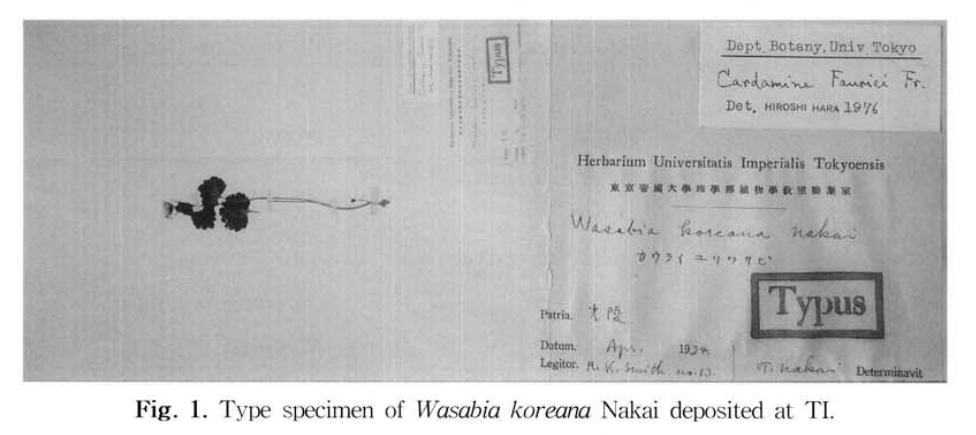
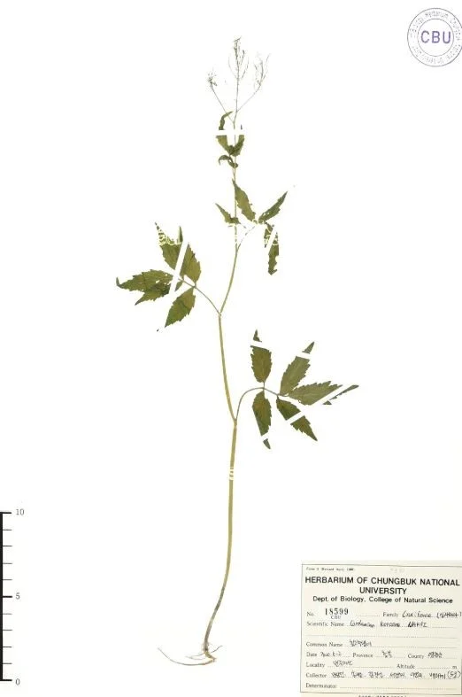
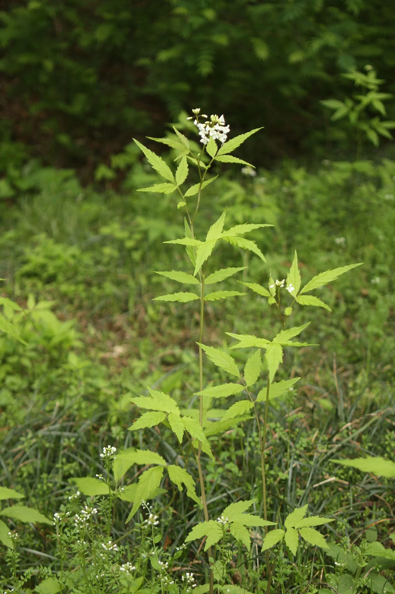
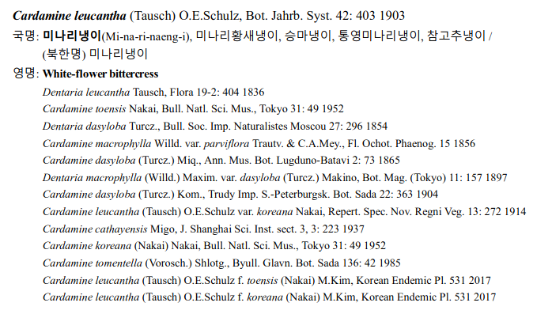
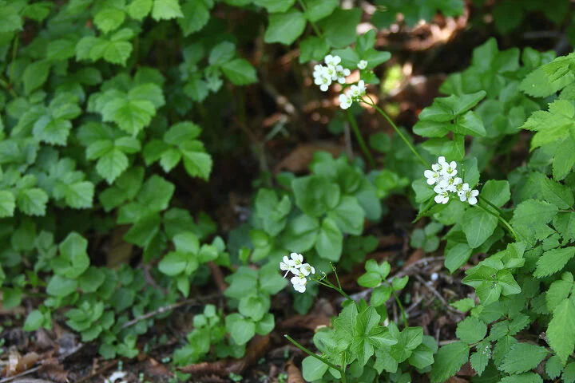

+++
date = 2021-08-13T17:03:00+09:00
lastmod = 2024-12-24T09:52:00+09:00
draft = false

title = "한국 와사비(참고추냉이), 정체가 뭐냐"
summary = "이 모든 골계의 역사"

isCJKLanguage = true

tags = ["essay", "ingredients", "wasabi"]
categories = ["food"]

+++

### Intro

**결론 먼저 얘기하자면, 참고추냉이는 존재하지 않는 식물이다.**

인터넷에 정말 무분별하게 재생산되는 정보가 있다. 물론 우리 한국인들은 초피 제피 산초 구분 못하고, 참치 참다랑어 구분 못하고 (다랑어류는 일반적으로 참치로 통칭한다. 고로 참다랑어는 참참치이다.), 곰탕 설렁탕 구분 못하는 음식에 묘하게 관심없는 사람들이긴 하다. 그러나 **참고추냉이**에 대해서는 조금 얘기가 다른데, 아예 없는 환상의 종이 심지어 학명까지 등록되어있기 때문이다. 결과적으로 재생산 되는 정보가 신뢰성이 높아지는 악순환이 일어났다.

기사는 하나만 가져왔지만, 궤를 따지자면 다음과 같다.

> [철원 고추냉이… 머리부터 발끝까지 그 알싸함에 침이 ‘꼴깍’](https://www.khan.co.kr/article/202401191549005)
>
>와사비와 고추냉이는 1930년대에 각각 학명이 부여됐다. 그 뒤 외래어를 한글 순화어로 바꾸는 과정에서 같은 ‘속’에 속하는, 특징이 비슷한 식물의 이름을 따다 보니 와사비를 대체할 말로 고추냉이를 선택했다. 와사비가 고추냉이라는 이름을 차지하면서 원래의 고추냉이는 ‘참고추냉이’로 불리게 됐다. 하지만 이 참고추냉이는 1930년대 이후 국내에서 개체가 발견되지 않고 있다.
>

심지어는 [국립생물자연관](https://species.nibr.go.kr/endangeredspecies/rehome/exlist/exlist_view.jsp?link_gbn=ex_search&rlcls_sno=397)에서 멸종위기종 해제종으로 분류되는거 보면 심지어 멸종위기종 취급도 받았다는 것을 알 수 있다. 이제는 검색도 안된다. 또, 국립국어원에서 한 때 '와사비'를 '고추냉이'로, 국산 자생종은 '참고추냉이'로 부르라고 했던 적도 있다. 물론, 이것도 이제는 검색이 안된다. 인터넷의 바다에 흔적만이 남아 있을 뿐...

### 최초의 표본 채집

R.K smith 라는 분이 광릉에서 1934년 표본을 채집하게 된다. 이를 보고 Nakai 라는 일본학자가 1935년, 와! 한국와사비! 하면서 Wasabia Koreana 라는 학명을 붙이게 된다.

[녹림축산식품부 생명자원정보 서비스](https://www.bris.go.kr/portal/book/nativeCropsDetailPopup.do?menuAbrvtn=crops&biorsrcMngNo=MANUIP3300200015)

여튼 한국 이름도 필요하니까,같은 십자화과에 속한 냉이에서 따와서 "매운 냉이"(박,1949)라는 이름을 붙이게 된다. 그보다 더 늦게 나카이의 제자 정태현이 1957년 매우니까 "고초냉이" 라는 이름을 붙이게 된다. 여기서 매운냉이보다 고추냉이가 그럴싸했는지, 아니면 나카이의 제자라서 그런건지 고추냉이가 정착한다.

### 멸종위기종 등재와 겨자냉이

나카이의 제자 정태현이 고초냉이란놈이 울릉도에 산다고 기재해놓은 탓에, 그 후 식물도감엔 한동안 고초냉이란 울릉도에 서식하는 한국 자생종이라 받아들이게 되어버린다.(한국 식물도감, 1957, p265) 그런데 사실 울릉도에 사는건 자생종이 아니었다! 울릉도에 있는건 호재천이란 사람의 조부가 일본으로부터 들여와서 재배하고 있던 **와사비였다(?).**

심지어는 1993년 어떤 연유에선지 멸종 위기종으로 등재되기까지 해버려 1994년 서울에서 고추냉이 살리기 운동까지 일어났다고한다.(이는 98년 해제된다.)

["울릉도 고추냉이 살리기" 해프닝](https://m.imaeil.com/Society/1994052808513929407)

여기서 또 꼬이는데, 이 울릉도의 와사비를 고초냉이도 아니고 와사비의 변종으로 주장하게 되었다.(이,1996) 결과적으론 이 울릉도에 사는 종을 wasabia Koreana NAKAI 라고 명명하게 되는데,  아마 호재천이라는 사람의 조부가 일본에서 들여온걸 몰랐나보다.

여기서 '아 그럼 우리 재래종은 고추냉이니까 이건(울릉도 와사비) 겨자냉이로 부르는게 어떨까?' 라는 말도 오갔나본데, 결론은 (허,2004)에 의해 그냥 와사비가 맞는걸로 확인되었다.

### 고추냉이 - 미나리냉이

결국 잠깐동안 고추냉이의 방패막이를 하고 사라진 겨자냉이. 때문에 몇십년동안 이 환상의 종은 자생종의 위치를 차지해버렸고, 국립 국어원도 다음 대답을 내놓는다.

[국립국어원](https://www.korean.go.kr/front/onlineQna/onlineQnaView.do?&mn_id=&qna_seq=69383&pageIndex=1)

국립국어원은 최근 2년간의 데이터만 보관하므로 리뉴얼되어 데이터가 삭제된듯 하나... 대략적으로 와사비는 고추냉이로 순화하고, 한국 종은 참고추냉이라는 답이었다.

이것이 국립 수목원에서 가지고 있는 참고추냉이 표본이라고 한다. 그런데...

&nbsp;

이것이 미나리냉이다. 2020년 발간된 [국가표준식물목록 자생종](http://www.nature.go.kr/fileUpload/download/%EA%B5%AD%EA%B0%80%ED%91%9C%EC%A4%80%EC%8B%9D%EB%AC%BC%EB%AA%A9%EB%A1%9D(%EC%9E%90%EC%83%9D%EC%8B%9D%EB%AC%BC).pdf)에는 이렇게 적혀있다.

**미나리냉이 A.K.A 참고추냉이**

&nbsp;



이에 대해선 유투브 입질의 추억에서 김윤영 박사님이라는 분이 영상 12분 3초 지점쯔음에 '그냥 미나리냉이더라구요' 라고 하는데...

### 왜갓냉이

비전공 나부랭이가 전공 박사의 발언에 태클을 걸기란 물론 조심스럽다만, 사실 지금 이 자칭 와사비 표본이 두가지가 있었다. 아마 김윤영 박사님은 국립수목원의 참고추냉이 표본을 보고 미나리냉이라고 하신 것 같다만, 사실 이 모든 논의는 Nakai가 1935년 광릉에서 발견한 Wasabia Koreana가 바로 그 근원이었던 것.

다시 한 번 맨 첫 사진을 본다면 실제로 미나리냉이와는 조금 다른 모습인데, 이에 대해 해외에선 이 표본을 왜갓냉이 *(Cardamine yezoensis Maxim)* 인 것으로 간주하고 있다고 한다. 

이것이 왜갓냉이이다. 그리고 다시한번 최초의 표본은

이렇게 생겼다. 다만 생긴게 조금 달라서 살짝 변이개체 정도로 친다는 것 같은데, 결코 와사비와 같은 *Eutrema* 속이 아니라 *Cardamine* 속 식물이라고 한다. 애초에 **이 이후에 이런 종이 채집된 적이 없다.** 

그 외에도 여러모로 찾아본 결과, *Cardamine* 속 식물들이 대부분 다채롭게 변이하는 듯 하다. 같은 *cardamine* 속 식물인 황새냉이 *(Cardamine flexuosa)* - 주의! *Caramine *속을 황새냉이속이라고 부르는 듯 하다... - 의 잎 또한 많이 다르게 생긴 것을 볼 수 있었다.

그러나 없음을 증명할 순 없으므로, 2008년 논문 "wasabi koreana nakai의 분류학적 실체에 대한 고찰" 에서는 *Cardamine pseudowasabi* 라는 학명을 제시한다. (실제로 저 논문이 처음 제시한 것은 아니지만 같은 저자였다.) 

&nbsp;

여튼, 실제로 지금까지 단 한번도 보고된 것이 없으니 왜갓냉이의 근연 개체가 맞는 듯 싶다.

&nbsp;

##### 결론. 아마 표본은 왜갓냉이. 참고추냉이란 것은 존재하지 않는다.