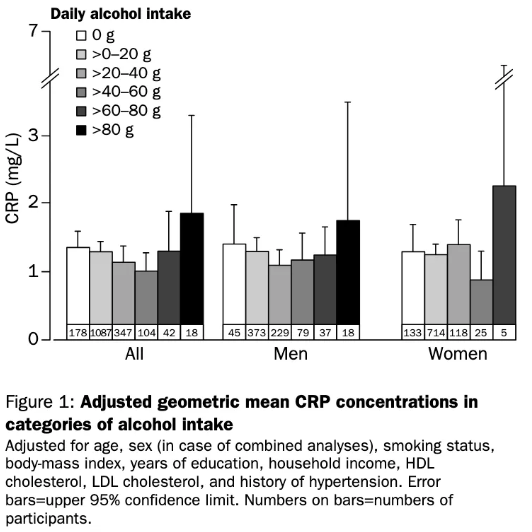
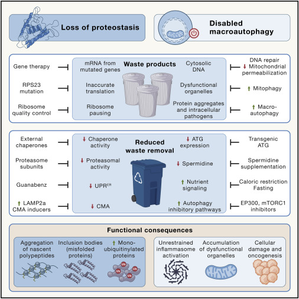

+++
date = 2025-04-29T19:51:22+09:00
lastmod = 2025-04-29T19:51:22+09:00
draft = true

title = "노화 방지를 위한 실천적 전략들(1) - 왜 늙는가?"
summary = "죽음을 유예하기"

isCJKLanguage = true

tags = ["essay", "anti aging", "health"]
categories = ["misc"]

references = [
    {title = "Association between physical activity and visceral adiposity index (VAI) in U.S. population with overweight or obesity: a cross-sectional study", authors = "XiaoLiang Tao, Xiang Xu, YaoXin Xu, QianKun Yang, TaoTao Yang, Xiang Zhou, Hao Xue, XiaoQin Ren & Fei Luo", doi = "10.1186/s12889-024-19810-1" },
    {title = "Melatonin modulates neuroinflammatory response and microglial activation in mice exposed to dim blue light at night", authors = "Song C, Suo Z, Wang Z, Cao J, Dong Y and Chen Y", doi = "10.3389/fphar.2024.1416350"},
    {title = "Effect of alcohol consumption on systemic markers of inflammation", authors = "A Imhof, M Froehlich, H Brenner, H Boeing, M B Pepys, W Koenig", doi = "10.1016/S0140-6736(00)04170-2"},
    {title = "Hallmarks of aging: An expanding universe", authors = "Carlos López-Otín, Maria A. Blasco, Linda Partridge, Manuel Serrano, Guido Kroemer", doi = "10.1016/j.cell.2022.11.001"}
]
+++

> *자넨 이제 30이 넘었으니 더 이상 물리학자가 아니야.*
>
> *“You are now past 30 and you are no longer a physicist.”*
>
> – Paul Dirac, 30세 생일이 갓 지난(Dec 5) Heisenberg에게. (1931)

최근 급격히 뇌 기능이 저하되는걸 느낀다. 암산을 잘하진 않지만 세자리 암산도 멀쩡했는데, 이젠 거스름돈 계산도 버겁다.(6400-2800 같은 계산이 바로 안나와서 얼마 전 진심으로 당황했다.) 뇌 기능만 저하될까. 밤을 이틀씩 샜던 몸은 이제 하루도 버겁다. 예전보다 피로가 덜 풀린다. 여드름이 어떤 느낌일지 궁금해하던 축복받은 사춘기를 지나온 피부는 코로나 후 마스크 여드름, 속칭 ‘Maskne’로 얼룩덜룩 해져버렸다. 팔엔 기미가 생겼다. 인간은 누구나 노화를 겪고, 나도 이 거대한 흐름을 피할 수 없었다. 

물론 누군가에겐 가소로운 나이일 수 있다. 하지만 어찌되었던 체감은 본인만 할 수 있지 않나? 아무런 관리도 안 하고, 운동도 안 하고, 먹고 싶은건 다 먹으며 밤을 밥먹듯 새던 어린이는 이제 공손해졌다. *‘와, 이젠 진짜 큰일났다.’*

최근 저속노화 식단이라는 단어가 귀에 자주 꽂힌다. 노화 연구자 정희원 교수가 얘기하는 식단인데, 사실 그 외에도 ‘노화는 극복 가능한 질병’이라는 컨셉 아래 꾸준한 식습관, 시술등으로 이를 극복하려던 시도가 있어왔다. 억만장자 Bryan Johnson은 아들의 혈장을 수혈받았고, David Sinclair교수는 시트루인을 활성화해야한다고 주장한다. 

**좋아, 이들의 주장을 한번 찾아보자.** 실행 가능한 수단이 무언가는 있겠지. 이렇게 항 노화를 위한 리서치가 시작되었다. (이들의 주장은 아래 직접적으로 같이 실려있진 않다. 아래는 내가 정리해둔 내용이다.) 

목표는, 건강수명의 연장이다. 

*Disclaimer) 논문을 살펴보고 의학서 살펴보고 AI한테 물어보면서 최소한의 팩트체크는 했지만, 필자는 비전공자다.*

## 노화를 촉진하는 요소들

우선 “생물학적 나이” 라는 주제부터 접근해보자. 자잘한 요소는 조금 쳐내고, 큰 흐름을 보자면 다음과 같다.

- **염증**
- **산화 스트레스**
- **세포/DNA 손상**

여기서 이 셋은 **밀접한 관계**를 가지고 있다. 염증으로 인해 산화 스트레스가 생기고, 산화 스트레스로 인해 염증이 생기며, 산화 스트레스로 인해 세포와 DNA가 손상되고, 그로 인해 산화 스트레스가 생긴다. 다만 염증으로 인해 산화 스트레스가 생기며, 그로 인해 세포/DNA가 손상된다는 하나의 큰 흐름을 형성하고 있다. 

우리 노화를 촉진하는 어떤 요소는 다양하다. 어떤 요소는 이 중 하나에만 관여하고, 어떤 요소는 이들 모두에 고루 관여하기도 한다. 그러나 결론적으로, 이 모든 노화 촉진 요소는 세포 손상까지 이어지게 된다. 이 복잡한 연결고리를 살펴보기 위해, 우선 염증부터 시작해서 어떤 상관 관계가 있는지 잘 알아보자.

## 염증

염증이란 자연 치유 반응이다. 외부에서 자극이 가해지고 감염이 일어나면 우리 몸에 비상경보가 발령된다. 혈관이 확장되고(여드름이 생기면 빨개지는 이유다), 대식세포들이 몰려들고, 면역력이 증가한다. 교감신경을 깨우고, 우리 몸은 외부와 싸울 준비를 한다.

그러나 **현대인은 이 염증 반응에 상당히 취약하다.** 염증 반응이 오히려 이미 충분히 과하다. 만성 염증에 시달리는 사람이 많다. 관절염, 근막염, 신경계 염증, 천식, 자가면역 질환, 아토피, 피부염… 우리가 익히 들어왔고 많이 격는 질환들이다. 심지어 현대에서 가장 흔하게 사용되는 진통제는 NSAIDs(비 스테로이드성 소염진통제), 즉 소염작용이 있는 약들이고, 피부 질환은 스테로이드로 다스리는 케이스가 상당히 많다. 도대체 왜 이렇게 염증은 현대인에게 만악의 근원이 된 걸까?

결론부터 말하자면, 염증 자체가 우리 몸에게 있어선 일종의 비상상황이기 때문이다. 야근, 특근과 같다. 하루 이틀은 생산성에 다소 도움이 되고, 사용하기 따라 유익할 수 있다. 그러나 사람이 1년내내 야근을 하면 지치고, 점차 생산성이 안나오게 될 것이다. 염증도 같다. 비상 상황이 지속되면 하나씩 문제가 생긴다. 현대인이 염증에 취약한건 일상적으로 염증이 일어나기 좋은 환경에 처해있기 때문이다. 어떤 것들이 염증을 유발할까?

### 스트레스

진화론 적으로 보자면 스트레스는 우리 몸에 대한 심각한 물리적 위협이다. 우리 몸은 적에게 맞서 싸울 준비를 하고, 아드레날린과 부신피질 호르몬을 분비한다. 면역을 억제하고, 소화를 억제하고, 혈당을 올려 에너지를 공급한다. 장기적으로 사용해야할 에너지들을 즉각적으로 사용할 수 있도록 돌려서, 큰 힘을 발휘하도록 몸을 준비한다.

이때 분비되는 코르티솔은 사이토카인(면역 단백질)을 억제하니 얼핏 보면 항염 작용을 할 것 같지만, 문제는 만성화다. 마치 항생제가 듣지 않는 바이러스가 생기듯, 지속적인 스트레스와 그로 인한 지속적인 코르티솔의 분비는 면역 세포들이 코르티솔에 저항성을 갖게 한다. 결과적으로 **만성 스트레스는 몸이 염증 작용을 그만둘 수 없게한다.** 이를 코르티솔 내성이라 부른다.

### 고혈당/고지방

Metabolism과 inflammation을 합쳐서 Metaflammation이라고 부른다. 고혈당과 고지방 모두 염증반응을 불러일으킨다. 

#### 고혈당

포도당은 ATP로 변환이 되어 소모되어야한다. 그런데 당뇨병이라던가, 혹은 당을 많이 먹는다거나, 인슐린과 관련된 기타 등등 이유로 지속적으로 고혈당이 유지될 수 있다. 이렇게 포도당이 장기적으로 피속을 돌아다니다 보면 효소의 작용이 아닌(즉, 원래 의도한 바가 아닌) 형태로 포도당이 변하게 된다. 주로 단백질, 지질, DNA등에 달라붙어서 비정상적인 화합물이 된다. 중간 과정을 생략하고, 이 포도당은 결과적으론 당화(glycation)되어 End-product가 된다. 이를 Advanced glycation end-product, 즉, **AGEs**라고 부른다. 그리고 이 당화과정을 우리는 마이야르 반응이라고 부른다. 어디서 많이 들었는데? 맞다. 맛있는 스테이크 크러스트는 식이 AGEs이다. 튀김, 고기, 빵, 커피 등등…WHO에서 피하라고 하는 이유가 있긴하다.

여튼, 이 AGEs는 단백질에 상당히 잘 달라붙어서 인체를 이루는 단백질의 구조를 자꾸 망가뜨린다. 피 속을 돌아다니다가 자꾸 이곳 저곳에 엉겨붙는다. 인슐린 수용체에 달라붙어서 인슐린 신호를 약화시키고, 눈의 수정체 단백질에 붙어서 백내장을 일으키고, 말초신경에 엉겨서 당뇨성 신경병증을 유도한다. 당뇨병의 합병증이 그토록 다채로운 이유다.

여기까지만 해도 만악의 근원이긴한데, 일단 염증 측면에서 보자. 우선 대식세포와 결합해서 대식세포를 활성화시키기도하고, 직접적으로 세포를 손상시키기에 염증을 유발하기도 한다. 그러나 이 AGEs가 염증을 유발하는 주된 경로는 RAGE(AGEs수용체)에 결합한다는 것이다. RAGE는 세포 스트레스나 손상 신호를 감지해서 면역 반응을 유도하는 수용체이다. 즉, 애초에 염증 반응을 유도하는 친구다. 마치 비상 경보와도 같은 스위치인데, AGEs가 몸 속을 돌아다니면 돌아다니면 이 스위치가 계속 눌린다.

그 다음엔 NF-κB 경로를 활성화해 사이토카인을 활성화시킨다. 그런데 웃긴건 이 사이토카인이 다시 RAGE 발현을 증가시킨다는것이다. 즉 양의 피드백이 일어나서 자가 증폭이 일어나게 된다. 이번에도 염증은 만성화되었다.

#### 고지방

지방은 섭취-혈중-저장의 모든 경로에서 염증을 불러일으킨다. 지방 대사 과정에 대해 간단하게 설명해보자. 지방을 먹으면 담즙이 지방을 흡수 가능하도록 유화시킨다. 그 후 우리 몸으로 들어와 일종의 포장 과정을 거친뒤 이송되고 다시 분해되는데, 분해될 때 포화지방산이 급증한다. 우선 섭취부터 보자. (아래 순서는 시간순으로 나열된 것이 아니다.) 

첫 번째 문제는 우리 몸에서 이송을 위해 포장될 때 발생한다. 세균은 지질다당류(LPS)를 일종의 보호막으로 가지고 있다. 따라서 우리 몸의 면역 체계는 지질다당류에 아주 강하게 반응한다. 그런데 문제는 우리가 지방을 패키징 할 때, 이 세균에서 떨어져나온 지질다당류들이 다소 섞여서 패키징되어서 배달된다는 점이다. 결론적으로 면역세포의 입장에선 세균들이 대량 배달된 것과 같은 상황이다. 당연히 비상 경보가 발령된다. 이 상황은 장내 건강이 안 좋을 수록 더 자주 일어난다.

두 번째. 이번엔 지방이 온전히 도달했다고 치자. 이제 우리 몸에서 분해되며 포화지방산이 급증하는데, 포화 지방산 또한 여러가지 경로를 통해 우리 몸의 염증 반응을 가속화한다.

세 번째. 지방을 패키징하고 남은 포장지는 추후 대사 후에 최종적으로 LDL이 된다. LDL자체는 낮은 농도에선 크게 문제가 없다.(있긴하다.) 마치 혈당 자체가 문제가 없었던 것처럼. 그러나 혈중 LDL이 너무 높아 오래되다보면, LDL 또한 변하게 된다. 주로 산화, 당화, 전기 음성화 등의 변화를 거치는데, 이 때 면역체계를 자극한다. 콜레스테롤이 혈관 내벽으로 스며들어서 산화과정을 거쳐 염증을 발생시키고, 단단해져서 차차 동맥경화를 유발하기도한다. 이 과정은 염증과 별개로도 위험하다.

네 번째. 살이 찌고, 지방이 과해진다 해보자. 지방층의 두께가 늘어난다. 지방세포는 두가지 기전으로 염증을 일으킨다. 우선 지방세포는 그 자체로 면역세포의 활성을 지원하는, 로컬 면역허브같은 역할을 할 수 있다. 과다한 에너지도 저장가능하고, 면역도 지원해주는 일꾼이다. 그러나 우린 이미 과다한 염증반응에 시달리고 있다. 이 과한 염증 반응에 지원군을 추가해 주는 것이다. 또, 지방세포가 지방을 저장하며 점점 커지는데, 너무 커지다 보면 모세혈관까지 거리가 멀어서, 혹은 세포들이 좁은 공간에 과밀화 되어서 산소를 공급받기 힘들어한다. 결국 지방 세포들이 악착같이 서로 산소를 가져가려고 경쟁하며, 결과적으론 섬유화 및 산소 부족으로 인한 **괴사가 일어난다.** 우리 몸에 쓰레기가 쌓이며, 이 쓰레기를 치울 대식세포들을 요구하게 된다. 염증반응이 생긴다.

다섯 번째. 지방세포에서 에너지를 꺼내 쓸 때도 이슈가 생긴다. 따지자면 지방 세포를 깔끔하게 가스불처럼 태워야하는데, 너무 많으면 문제가 된다. 마치 젖은 장작을 태우듯 불완전 연소가 일어나고, 원치 않는 독성 물질이 생긴다. 또, 아직 태우지 않은 장작들이 쌓이다보면(FFA) 이 자체로도 주변 대식세포들을 건드리고, 다시 한 번 비상 버튼이 눌리게된다.

### 운동 부족

운동을 하지 않으면 살이 쪄서~ 이런 소리가 아니다. 운동을 하면 마이오카인이라는 호르몬이 나오는데, 이 호르몬들은 사이토카인들을 억누르는 효과를 가지고있다. 이 기전은 두 단계로 작용한다. 우선 에너지 부족 신호를 내뱉는 순간, 지방과 당을 꺼내 쓰도록 훈련이 됨과 동시에 염증성 사이토카인을 억제하게 된다. 그 다음 마이오카인이 간과 면역세포에 영향을 끼쳐 항염 사이토카인이 실제로 분비가 된다. 즉, 운동을 하면 염증성 사이토카인은 억제되고 항염 사이토카인이 분비 된다.

또한 운동 그 자체의 항염 작용 뿐 만 아니라, 운동부족은 지방의 배치를 더 안좋게 바꾸게 된다. 운동을 주기적으로 하면 피하지방(SAT), 나머지 지방의 비율이 올라가고 내장지방(VAT)의 비율은 낮아진다.(기준 - 150 MET-h/week[1]. 이는 사실 프로수준의 운동량이긴 하다. 다만 조금 더 적은 운동량에서도 보고된 바는 있고, 그 외에 식단이 여기 영향을 준다는 얘기도 있다.) 동일한 체지방량을 가지더라도 운동을 안 할수록 ET체형이 된다는 것이다. 위에서 이미 살펴본 바와 같이 지방조직은 염증을 유발하는데, 이 중 내장 지방의 염증 유발력이 훨씬 크다. 결론적으로 똑같은 체지방량을 가지고 운동의 유무만으로 더 염증이 잘 유발될 수 있는것이다.

### 수면패턴 및 야식

Disclaimer : 이 부분은 사실 위의 다른 부분보다 훨씬 영향이 적고, 과학적 근거도 미약한 편이다. 

#### 문제는 빛

이 모든게 연결되어있다. 주로 문제는 밤에도 빛을 쐬기 때문이다. 밤에 빛을 쐬면 코르티솔을 분비한다. 멜라토닌은 줄어든다. 교감신경이 활성화되고 부교감 신경이 꺼지게 된다.(이미 여기서 스트레스 반응과 비슷하다.) 결과적으로 밤낮이 뒤섞이게 되는데, 이를 통해 일정한 생활패턴을 가지지 못하게 된다. 주기적인 생활을 하지 못하면 체내시계가 뒤흔들리게 되고, 체내 시계를 한번 뒤흔드는 것만으로도 염증성 사이토카인이 분비된다. 

최근엔 블루라이트로 인해 멜라토닌이 줄어들고, 미세아교세포가 활성화 된다는 연구[2]도 있다. 미세아교세포란 뇌 안에서 병원체, 혹은 손상된 세포를 제거하고, 뇌가 기능을 유지하도록 한다. 최근 알츠하이머의 원인으로 미세아교세포의 기능 저하를 의심하는 논문도 있었다. 그러나 염증도 과하면 문제가 되듯이, 미세아교세포가 과하게 활성화되면 뉴런과 시냅스를 공격하며 신경염증을 불러일으킬 수 있다.

#### 야식

빛은 우리 식욕을 조절하는 호르몬에도 관여한다. 심지어는 너무 밝은 곳에서 식사를 하면 인슐린의 작용이 낮아진다는 연구도 존재한다. 빛을 쐬면 포만감을 느끼게 하는 렙틴이 줄어들고, 식욕을 느끼게 하는 그렐린이 증가한다.(신뢰성이 다소 낮다.) 즉, 야식을 먹고 싶어진다. 그런데 야식을 먹으면 장-뇌 축 교란이 일어난다. 더불어 수면 부족도 장내 미생물에 영향을 준다. 아까 지방을 흡수할 때 LPS지질다당류를 흡수한다고 했는데, 장 컨디션이 안 좋아지면 지질다당류 흡수율이 확 올라간다. 이는 염증을 다시 불러일으킨다.

#### 수면 저산소

그런데 야식을 먹으면 위압이 상승한다. 야식 뿐만아니라 살이 쪘다거나, 피로나 수면부족등의 원인으로 코를 골게된다. 코를 고면 수면이 부족해진다. 자, 이제 자도 자도 피로가 풀리지 않는다. 수면 패턴이 교란되었다. 이제 1번으로 돌아가면 된다. 체내시계가 흔들렸고, 흔들린 체내시계는 밤에도 환한 빛이 더더욱 교란하고, 식욕을 느끼고, 야식을 먹으며, 수면 저산소에 시달리고, 체내시계는 흔들린다.

### 흡연과 음주

독성 물질을 몸에 쏟아넣고 염증이 없길바라는건 양심이 없지 않은가? 라고 하고싶지만, 흡연은 몰라도 음주의 경우 신기하게 염증 유발이 J-shape으로 나타난다. 즉, 적은 섭취량에서 다소 낮아지고, 그 후 일관되게 올라가는 형상을 그린다고 한다.[3] 물론 이건 염증 측면에만 국한되는 연구이기에, 알아서 적당히 먹자. (그런데 심혈관 계통에서도 다소의 알콜은 좋다고 했다.) 

흡연? 그건 그냥 안좋다. 굳이 원리와 기전을 알아볼 것도 없다. 심지어 염증을 완화해준다고 했어도 하지 말아야한다. 애초에 건강수명을 위한 연구였는데, 흡연만큼 수명에 확실하게 악영향을 미치는 factor는 흔치않다. 이에 대해 조금 더 자세히는 이따가 생활 습관 측면에서 다루어보도록 한다.

## 산화 스트레스

앞에서 염증반응에 대해 살펴보았다. 염증은 따지자면 면역 반응이고, 또 다시 따지자면 ‘어떤 세포를 죽이는 현상’이다. 일반적으로 호중구와 대식세포들이 외부 병원체등을 공격하기 위해 사용하는 방식에 대해 살펴보자. 대략적으로 중간 과정을 조금 뭉뚱그리면, 이들이 호흡폭발(Respiratory burst)이라는 현상으로 **ROS(활성산소)**를 내뿜어서 세균조직을 공격한다. 단적으로 예를 들자면 어떤 효소(MPO)는 이 과정에서 차아염소산을 생성하는데, 이게 바로 우리가 사용하는 락스이다. 그 외에도 iNOS라는 효소가 **RNS(활성질소, 반응성 질소종)**를 형성하게 된다. 

이들은 산화, 니트로화 등으로 세포를 공격하게 된다. 그런데 결국 반응성이 강하기 때문에 이물질에만 반응하지 않고 남아서 **우리 세포를 공격하게 된다.** 그러나 우리도 무턱대고 불을 지르는 것은 아니고, 우리 몸의 항산화 기전이 이들을 처리한다. 항산화 기전은 여러가지 단계로 일어난다. 우선 SOD등의 효소가 순간적으로 과한 ROS를 처리한다. 그리고 농도가 너무 높은(일정 이하의 몇몇 종류들은 생체가 이용하는 물질이기에) 상황에서 글루타치온, 비타민등 몇몇 방법을 통해 ROS/RNS등을 처리한다. 이렇게 더블액션으로 활성 산소/질소를 처리할 뿐만 아니라, 면역 과정에서 손상된 세포를 수선하는 기전도 존재한다. DNA수선, 오토파지 등으로 전쟁터를 청소한다. 따지자면, 즉각 대응, 지연된 광범위 대응, 마지막으로 피해 수복. 이렇게 세 가지 트랙으로 이에 대처한다. 

그런데 여기서 보면 이미 눈치를 챘겠지만, 이 기전이 제대로 확실하게 작용해야 한다. 그러나 우리 몸의 항산화 능력은 한계가 있고, 염증 반응이 지속되다 보면 항산화 능력에 한계가 오기 마련이다. 피해 수복을 안 하는게 베스트지만, 점차 피해가 누적된다. 심지어는 아무 문제가 없어도 활성산소가 발생해, 스스로를 공격하게 된다. 그나마 피해 수복을 할 수 있다면 다행이지만, **피해 수복이 불가능한 케이스**까지 생기기 마련이다. 우선 산화 스트레스를 증가시키는 원인에 대해 알아보자.

### 염증

다시 염증으로 돌아왔다. 앞서 말한 기전으로 염증이 발생(비상경보)-> 면역 반응 유발 -> ROS분비를 거치니, 당연하다. 그런데 만일 세포가 손상된다면 어떻게 될까? 그것은 치워야하는 물질이 된다. 즉, 다시 면역 반응이 필요하게 된다. 마찬가지로 비상 경보를 울릴 필요가 있기에, 사이토카인 분출이 가속화된다. 그 다음은 뭘까? 다시 활성산소가 분비된다.

### 오염

여기서 오염은 환경 오염을 말한다. 중금속 노출, 담배 연기, 미세먼지에 대한 노출을 말한다. 각각은 조금 다른 작용을 하기도하고, 대체적으로 비슷한 작용을 하기도 하는데, 대략적으로 보자. 이런 곳에 들어있는 미세 금속, 혹은 라디칼 등이 세포와 반응하게 되는데, 결과적으로 활성 산소가 생성된다.

### 광자극

강하게는 방사선, 그보다 약하게는 자외선, 가장 약한 종류로는 고강도 블루라이트까지도 포함된다. 아마 다들 자외선이 피부의 적이라는 얘기를 들어봤을 것이다. 빛을 쐬면 전자를 빼았기고, 그로 인해 반응성이 큰 이온이 된다. 위에 오염이 활성 산소를 생성시키는 것과 부분적으로 유사한데, 여튼 활성 산소가 생성되게 되어 주변 세포를 공격하는 결과를 낳는다.

### 미토콘드리아 기능 저하

몇가지 이 카테고리의 다른 기전들을 전부 여기로 묶을 수 있다. 미토콘드리아 기능 저하가 ROS생산의 주된 원인 중 하나이다. 여러 다양한 복잡한 기전을 (이번에도) 뭉뚱그려 표현해보자. 미토콘드리아의 에너지 생성 단계의 마지막에는 전자 전달계(ETC)라는 것이 존재한다. 이 막 사이에 전위가 생겨서 결론적으로 ATP를 생성하는 과정이다. 따라서 이 막 사이에는 기본적으로 전위 차이가 존재한다.그런데 몇몇 요소로 인해 미토콘드리아의 기능 저하가 생기고, 미토콘드리아 막 양 옆의 전위가 과하게 충전되는 경우가 발생한다. 이렇게 과하게 전위가 충전되면 전자가 포화되어 원래 흘러야 할 방향으로 흐르지 않고 반대로 흐르면서 누수되게 되는데, 이를 **Reverse Electron Transport(RET)**라고 부른다. 

이 뒤로 흐른 전자들은 여러 경로를 통해 유출되고, 이렇게 통제되지 않은 전자는 산소를 만나 산소를 직접 활성산소로 바꾸는 등 여러가지 기전을 통해 활성 산소를 생산하게 된다. 이 ROS는 바로 다시 미토콘드리아를 공격하게 되는데, 이 때 망가진 미토콘드리아는 위에서 설명한 바와 같이 염증 반응을 불러일으킨다. 이 때 미토콘드리아가 치워지지 않는다면 또 다른 문제가 생긴다. 미토콘드리아가 가지고 있던 Ca2+ 이온등이 누출되는데, 이는 주변 미토콘드리아의 전자 전달계 막의 전위 차이를 더 크게 만들면서 주변의 미토콘드리아의 기능을 저해시키는 연쇄작용을 촉발한다.

### 식이

칼로리를 너무 많이 섭취하면 ATP가 과하게 쌓이기 시작한다. ADP와 ATP의 비율이 망가지고, 전자전달계 속도가 저하되어 위에서 설명한 기전을 발동시킨다.

여기서 알코올의 얘기도 잠깐 짚고 넘어갈 만 하다. 간에서 항산화효소를 생성하는데, 알코올 대사과정에서 알코올이 항산화 효소계를 고갈시킬 수 있다. 즉, 항산화 능력이 떨어지기에 세포가 산화 스트레스를 받게 된다.

### 스트레스 및 수면 부족

염증 항목에도 있었지만, 스트레스는 염증->산화 경로 외에도 직접적으로 산화 스트레스를 자극한다. 우선 수면 부족으로 장기 능력이 손상되고, 항산화 요소가 줄어들게 된다. 스트레스에서 얘기한 바와 같이 코르티솔이나 카테콜아민 등은 즉각적인 대응을 도와주는 호르몬인데, 즉 이들은 에너지 형성을 원활하게 하기 위해 미토콘드리아의 막 전위를 올리는 작용을 한다. 그런데 우리가 에너지를 사용하지 않는다. 결과적으로 다시 한 번, 미토콘드리아 기능 저하가 발생한다. 이 뿐만 아니라 이들은 여러가지 기전을 통해 직접 NOX1, NOX2를 가동시켜 추가적인 활성산소를 유발하기도 한다.

## 노화

이제 잠시 염증→산화스트레스→세포 손상에서 산화 스트레스까지 다루었다. 산화 스트레스로 가기 전에, 노화란 무엇인지에 대해 정의하고 넘어가야 할 시간이 된거같다. 

우선 노화의 지표에 대해 대략적으로 살펴보고, 그 중 방지 가능한 몇몇 핵심 지표에 대해 따로 살펴보자. 사실 어차피 몇몇 중요한 지표 및 (그나마) 예방 가능한 방법에 대해선 따로 정리해놨고, 이 지표들은 아쉬워서 가져온 것이니 ‘노화의 12가지 지표’는 생략해도 된다. 그렇지만 글을 쓰다 아마 무의식중에 이 아래쪽에 있는 몇몇가지 지표들에 대해 말을 꺼내놓았을지 모르니, 읽으면 읽는대로 도움이 된다.

### 노화의 12가지 지표

Hallmarks of Aging: An Expanding Universe[4] 에선 노화에 대해 여러가지 지표를 제안한다.(중요하고 신뢰성이 높은 Paper이다.)이들 항목은 독립적이지 않다. 서로가 서로에게 영향을 주고받는다. 노화란 결국 복잡한 생리적 시스템에서 각 모듈의 기능이 점점 낮아지다가, 서로가 서로에게 악순환을 주고받으며 결론적으로 system failure가 유발되는것이다. 해당 논문에선 노화에 대해 12개의 지표를 제안하고, 3개의 큰 카테고리로 묶는다. 

#### Primary : 주된 노화 지표

주로 유전자와 관련된 지표이며, 시간에 따라 점차 손상이 쌓여간다.

##### 유전체 불안정성

DNA손상, 돌연변이 축적으로 인해 유전체가 불안정해진다.

##### 텔로미어 단축

텔로미어가 단축되면 유전자가 손상됨과 마찬가지다. 이에 대해선 조금 후에 살펴본다.

##### 후성 유전 변화

Epigenetic얘기인데,  자세한 것은 생략한다.(애초에 잘 알지도 못한다.) 여기서 후성 유전은 DNA의 발현 자체를 조절하는 것을 얘기한다. 예를 들어 애벌레와 나비는 같은 유전체를 가지고 있지만, 발현 자체가 다르다. 우리 몸은 정보를 가지고 있지만, 그 정보 중 어떤 것을 실제로 사용할 지에 대해선 선택이 가능한 것이다. 

나이가 들면 여러가지 기전을 통해 이 epigenetic 이 흔들리게 되며 정밀한 유전자 발현이 망가지게 된다. 실제로 epigenetic에서 발현을 조절하는 메커니즘 중 DNA메틸화가 있는데, 이 DNA 메틸화 정도는 노화의 강력한 지표 중 하나로 사용된다.

##### 단백질 항상성 붕괴

우리 몸에선 다양한 단백질을 사용한다. 대사 효소, 신호 전달, 세포구조, 세포 등 수명이 짧은 단백질(초~분단위)부터 긴 단백질(연 단위)까지 다양하게 있는데, 이들은 끊임없이 사용되고 생산되어야 한다. 이들은 만들어지면 점차 사용되기도 하고, 스트레스를 받아서 망가지기도 하기 때문이다. 

단백질을 합성하고, 검사하고, 분해하면서 이 동적 균형이 유지되는데, 분해가 제대로 안되기 시작하면 점차 피드백이 굴러가며 더더욱 분해가 안되기 시작하는 악순환에 빠지게 된다. 결과적으로 단백질 항상성이 붕괴된다.

단백질이 망가져서 생기는 질환에는 여러가지가 있다. 수정체 단백질이 망가지면 백내장, 신경단백질이 망가지면 알츠하이머, 파킨슨병, 콜라겐이 망가지며 동맥경화, 관절 경화등이 일어난다.

##### 거대자가포식 저하

여기서 거대자가포식은 Macro-autophagy를 말한다. 오토파지는 스스로 불필요하거나 손상된 세포 구성요소를 파괴해서 재활용하는 통제된 반응이다. 이에 대해선 나중에 하나로 뭉뚱그려서 노화 억제 기전에서 다시 살펴보도록 한다. 요는, 불필요하거나 손상된 세포 구성요소를 더 이상 재활용 하지 못하게 된다는 것이다. 

거대 자가포식은 오토파지(자가포식)의 일종인데, Macro-autophagy, micro-autophagy, chaperone-mediated autophagy(CMA) 등으로 나눈다. 이 아래 주된 노화 지표중 미토콘드리아 성능 저하도 있는데, 이런 성능 저하된 미토콘드리아를 Mitophagy 과정을 거쳐 재활용 해야하는데, 이런 선별적 오토파지 기능이 저하되며 미토콘드리아의 기능이 안 좋아진다.

#### Antagonistic : 대항성 노화 지표

이 카테고리의 지표들은 양면적 관점을 가지는 지표들이다. 주로 1차적으로 데미지를 받아서 발생하는 지표이기도하다. 일반적으로 여기 속한 지표들은 원래 우리에게 이점을 가져다 주는 경로였지만, 어떠한 데미지를 받음으로, 아니면 기능의 이상이 생기면서 점차 문제가 생기는 그런 지표들을 얘기한다. 예를 들어 영양 감지는 초기 세포 발달에 중요한 역할을 하지만, 성장 후기엔 노화를 가속시키는 역할을 한다.

##### 영양감지 경로 이상

이따 살펴볼 노화 억제의 핵심 중 하나이다. 인슐린, mTOR, AMPK와 같은 여러 대사 센서들이 조율을 잃어버리는 것이다. 이에 대해선 나중에 추가적으로 살펴본다.

##### 미토콘드리아 기능저하

원인이야 생략하고, 미토콘드리아는 세포의 에너지 공장이다. 이미 이전에 산화 스트레스 부근에서 ETC 막 전위 과충전에서 RET가 일어나서 ROS가 생기는 기전에 대해 다루어봤다. 그런데 그 기전 뿐만 아니라, 미토콘드리아가 기능이 저하되면 거의 무조건 ROS 증가가 일어난다.

와 줄기세포 고갈(B). From [4]")

##### 세포 노화

세포는 당연히 늙는거 아닌가? 라고 할 수 있는데, 여기서 세포 노화란 그냥 나이든 세포를 말하는 것이 아니다. 망가졌는데, 죽지도 않고 염증을 계속 내뱉는 세포를 말한다. 속칭, ‘좀비세포’를 얘기한다. 원래 세포가 죽을 땐 여러가지 방법이 있는데, 이에 해당하지 않는 세포를 말한다. 이에 대해선 또 다시 추후에 자세히 살펴보자.

#### Integrative : 통합성 노화 지표

위 두 카테고리의 지표들로 인해 유발되는 노화의 지표들이다. 결과적인 노화의 지표이기도 하며, 여러 원인들이 결합되며 다른 원인들로 영향을 주고 받는 그런 지표들이기도 하다. 

##### 줄기세포 고갈

줄기세포는 아직 분화가 되지 않은 세포이다. 분화되어 다른 세포가 될 수 있다. 일반적으로 어느 부분에 세포가 부족하면 이런 줄기세포들이 분화해서 그 자리를 채운다. 어떤 세포는 좀 천천히 분화되고, 어떤 세포는 매일매일 줄기세포가 그 자리를 채운다. 뒤에 살펴보겠지만 세포는 무한정 분열할 수 없다. 결론적으로 줄기세포도 고갈되고, 더 이상 어떤 종류의 세포를 생성할 수 없는 시점이 오게 된다는 것이다.

줄기 세포는 휴면 상태에선 대사가 낮아 비교적 온건한 상태로 유지되는데, 이 줄기세포가 염증 등의 교란을 통해 휴면이 유지가 되지 않을 수도 있다. 물론 그 외 요인으로 세포 손상이 지속되어 줄기세포를 과하게 쓰면 줄기세포가 고갈되게 된다.

##### 세포간 통신 이상

세포의 개별적인 노화 요인들이 점차 증폭되며, 결과적으로 세포간 소통에서 노이즈가 끼며, 항상성 조절이 붕괴되게 된다. 이 과정에서 신경계, 호르몬 신호 경로 등이 전반적으로 성능 저하를 일으키게 된다. 

1차 원인은 주로 노화세포와 같은 개별적인 요인이지만, 이런 세포 통신에 이상이 생기며 다른 노화를 전신으로 증폭시키는 메타적인 지표이다. 결과적으로 만성 염증 고착화, 면역감시 기능 저하, 뇌-장축 엇박자 등이 일어나게 된다. 

과 미생물 불균형(B). From [4]")

##### 만성염증

이미 살펴봤지만, 만성 염증은 면역력을 지치게한다. 사망율의 지표가 되기도 하는 중요 지표인데,  만성 염증은 면역세포를 지치게 하고 고갈시켜 면역력을 떨어트리기 때문이다. 

##### 미생물 불균형

최근 들어 점차 집중을 받고 있는 분야이다. 우리 몸에는 여러가지 미생물이 공생관계를 갖고있는데, 예를 들어 면역 필터가 고장난다거나 해서 유익균을 공격한다거나 하는 식으로 잠재적인 병원균이 점차 득세하고 유익균이 줄어든다거나, 미생물총의 다양성이 붕괴되게 된다.

이미 앞서 말한 LPS와 같은 물질들이 흡수되어 다시 염증을 유발하기도 하고, 그 외에 영양분 흡수 능력이 떨어지기도 한다. 당뇨, 비만, 암등을 유발할 수 있다.

