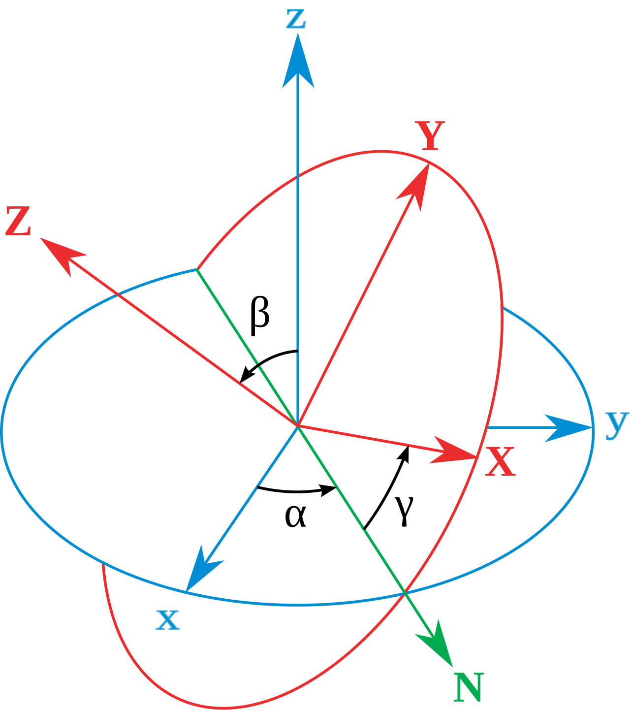

+++
date = 2025-01-07T00:42:15+09:00
lastmod = ""
draft = true

title = "SO3(2) - Basic parameterizations"
summary = ""

isCJKLanguage = true

tags = ["mathematics", "rotation", "SO3",]
categories = ["on rotations"]

+++

## Euler angles

### Background

사실 이 당시 matrix와 같은 편리한 수학적 도구들이 발명되지 않았으므로, Euler가 Euler angle을 유도하는 과정은 조금 더 대수적인 framework위에서 이루어졌다. 이에 대한 유도는 그가 자주 투고했다고 하는 *"Novi commentarii Academiae Scientiarum Imperialis Petropolitanae"* (Journal)의 vol 20, pp189-208에 실려있다. Euler의 *"Formulae generales pro translatione quacunque corporum rigidorum"*, 번역하자면 *"General formulas for any translation of rigid bodies"* 에 그의 대수적 유도 과정이 적혀있는데, 여기서 translation이란 용어가 현대에선 선형적인 움직임만을 뜻하고 회전을 뜻하지 않는 것과는 다르게 그가 사용한 용어에선 어떤 경우로든 3차원 공간상에서의 움직임을 가르킨게 흥미롭다. 라틴어 문서의 번역본은 [여기서](http://www.17centurymaths.com/contents//euler/e478tr.pdf) 볼 수 있다. 그는 이 문서에서 공간상에서의 움직임을 6자유도로 기술할 수 있음을 보였다.

### Basic definition

앞 챕터에서 세 개의 회전으로 어떠한 회전 운동을 나타낼 수 있음을 보였는데, 일반적으로 classical 한 Euler configuration에선 Z-X-Z축에 대한 각각의 회전을 이용하여 어떤 회전 운동을 기술한다.

본문엔 삽입하지 못했지만, [여기 좋은 이미지가 있다.](https://en.wikipedia.org/wiki/File:Euler2a.gif) 위 그림에서 알아보기 어렵겠지만, z축을 이용하여 $\alpha$ 만큼 회전하고, N축(즉 회전 후의 x축) 을 기준으로 $\beta$ 만큼 회전한 후, 마지막으로 z축을 기준으로 $\gamma$만큼 회전하면 파란 좌표축이 빨간 좌표축으로 변환되는 원리이다.

수식으로 나타내면 다음과 같다.

$$
\begin{align*}
R
&= R_{\mathrm z}(\alpha) R_{\mathrm x}(\beta) R_{\mathrm z}(\gamma) \newline
&= 
\begin{bmatrix}
\cos\alpha & -\sin\alpha & 0 \newline
\sin\alpha & \cos\alpha & 0 \newline
0 & 0 & 1
\end{bmatrix}
\begin{bmatrix}
1 & 0 & 0 \newline
0 & \cos\beta & -\sin\beta \newline
0 & \sin\beta & \cos\beta
\end{bmatrix}
\begin{bmatrix}
\cos\gamma & -\sin\gamma & 0 \newline
\sin\gamma & \cos\gamma & 0 \newline
0 & 0 & 1
\end{bmatrix}
\newline
&= 
\begin{bmatrix}
{c_{\alpha}c_{\gamma}-c_{\beta}s_{\alpha}s_{\gamma}} &
{-c_{\alpha}s_{\gamma} - c_{\beta}c_{\gamma}s_{\alpha}} & 
{s_{\gamma}s_{\beta}} \newline
{c_{\gamma}s_{\gamma} + c_{\alpha}c_{\beta}s_{\gamma}} & 
{c_{\alpha}c_{\beta}c_{\gamma} - s_{\gamma}s_{\gamma}} & 
{-c_{\alpha}s_{\beta}} \newline
{s_{\beta}s_{\gamma}} & 
{c_{\gamma}s_{\beta}} & 
{c_{\beta}}
\end{bmatrix}
\end{align*}
$$

( *Note* - 회전을 순차적으로 적용시키는 방법에서, 기준 축을 고정된 축으로 할지, 움직이는 축으로 할지에 따라 pre-multiply가 되는 경우가 있고, post-multiply가 되는 경우가 있다. 이에 대한건 우선 여기선 pre-multiply가 된다. 그런 기술이 이 뒤로는 크게 필요없다. 크게 신경쓰지 않아도 되고, 그저 헷갈리는 것이 있을까봐 적어둔다. )

그런데 **딱 보기에도 좀 불편하다.**  가장 큰 문제는, 이 Euler angle이 어떤 각을 쓰는지에 따라 정말 다르다는 것이다. 지금은 zxz를 사용했고, 실제로 zxz가 가장 널리 쓰이는 notation이긴 하지만, 어떤 곳에선 xyz, zyz, xzx, 등등 어떤 축을 사용할지, 두 축과 한 축을 사용할지 혹은 세 축을 순차적으로 사용할지에 따라 결과물이 천차만별이 된다. 따라서 이런 Euler angle에 대해 기술할 때엔, 필수적으로 **어떤 축을 기준으로 회전 시켰는지 같이 기술해주어야한다.**

- Euler angle의 정의 배경 및 parameterization
- 순서의 불 명확함으로 인한 한계
- 짐벌락으로 인한 한계
- Euler's rotation theorem
- axis + angle representation( 4dof ) / axis * angle representation ( 3 dof )
- rodrigues formular