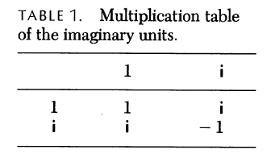

+++
date = 2022-03-21T23:36:00+09:00
lastmod = 2022-12-20T09:23:00+09:00
draft = false

title = "Hamilton, Rodrigues, 그리고 사원수 스캔들"
summary = "19세기의 가장 중요한 수학적 발명 중 하나인 사원수는 어떻게 잘못 되었나"

isCJKLanguage = true

tags = ["Quaternion", "Mathematics"]
categories = ["Translations"]

+++

※ 이 번역은 원문 저자에게 어떠한 허락도 받지 않았으며, 해당 번역문에 대해 어떠한 권리도 주장하지 않음을 알립니다. 또한 Reference 표기는 번역 과정에서 대부분 가져오지 않았으며, 이에 대해서는 원문을 참고 바랍니다.

원문

'Hamilton, Rodrigues, and the Quaternion Scandal' by Simon L. Altmann

DOI : [10.2307/2689481](https://doi.org/10.2307%2F2689481)

# 해밀턴, 로드리게스, 그리고 사원수 스캔들

\- 19세기의 가장 중요한 수학적 발명 중 하나인 사원수는 어떻게 잘못 되었나

SIMON L. ALTMANN, 옥스포드 브래스노스 칼리지

현대 수리 물리학이 태어나던 19세기 무렵, 최고의 석학들 중 몇몇은 사원수의 발견을 식빵의 발명 이래 가장 좋은 일이라고 호평했다. 전자기학의 아버지 제임스 클러크 맥스웰은 이렇게 썼다.

> “사원수 미적분학의 발명은 공간의 서술에 대한 지식에 있어 큰 발걸음이며, 그 중요성이 데카르트의 삼중 좌표 발명에 견줄 만하다. 이 미적분학의 개념은 모든 과학 분야에게 있어 가장 많이 사용되기에 걸맞다.”
> 

아쉽게도 모두가 같은 생각을 하진 않았다. 일부는 꽤 악평을 쏟아부었다.

> “사원수는 해밀턴의 진짜 훌륭한 작업이 다 끝난 뒤에야 나왔다. 아름답도록 똑똑하지만, 클러크 맥스웰을 포함해서 어떤 식으로든 접하게 된 이에게 독으로 작용하고 있다.” 
> 
> – Kelvin 경이 1892년 Hayward에게 보낸 편지

이처럼 강한 논조는 잊혀졌을지언정, 대부분의 사람들이 이상할 정도로 사원수를 꺼리는 사실만은 남게 되었다. 행렬과 벡터는 모든 물리학자들의 공용어가 되었지만, 사원수는 수학적 아이디어들의 생존 경쟁에서 다소 실패한 종의 분위기를 풍기는 듯하다. 수학자들이야 물론 사원수의 놀라운 대수적 특성을 위해 마음 한 구석 따뜻한 곳에 자리를 마련해 놓았지만, 이런 열정은 고지식한 물리학자들에겐 거의 의미가 없다.

이 글에선 사원수가 왜 찬밥 신세가 되었는지를 설명할 만한 사원수의 몇몇 해석 문제를 조명하고자 한다. 사원수가 충족시킬 수 없는 조건에 대한 지적들이 회전과 이중군을 다루기 최적인 사원수의 특출난 장점을 가리게 되었다. 이 글에서 주로 탐구할 것은 회전과 사원수에 대해서이며, 이중군에 대해 관심이 있는 독자들은 관련 논의를 내 최근 책에서 충분히 찾아볼 수 있다.

### 관계자 : 해밀턴과 로드리게스

역사를 들여다보지 않고서 사원수의 영광에서 쇠퇴로의 이상한 여정을 이해하는 것은 불가능하다. 사원수의 역사는 아마도 다른 19세기 다른 수학적 주제보다는 사원수의 두 발명가에게 영향을 받았다. 한 명은 아일랜드 왕립 천문학자인 윌리엄 로완 해밀턴 경(Sir William Rowan Hamilton)이며, 다른 한 명은 한 때 파리 뇌브-생-어거스틴 가의 ‘케스 이포테케흐’(Caisse Hypothécaire, 주택담보 대출 전문 은행) 이사였던 올랑드 로드리게스(Olinde Rodrigues)이다. 

해밀턴은 참으로 위대한 사람이었다. 그의 삶은 Graves 에 의해 세 권짜리 전기로 아주 상세하게 기록되어있다. 더욱이 사원수 100주년인 1943년, 그를 기리는 글이 *‘Proceedings of the Royal Academy, vol.A50’* 과 1944년 *‘Scripta Mathematica, vol.10’* 에 수록되었다. 새로 나온 뛰어난 전기 두 권이 있으며, 더욱이 수많은 개별 기사까지 있다. 우리는 해밀턴에 대해선 출생 시간까지 분 단위로 (1805년 8월 3일에서 4일 사이 정확히 자정) 알고 있다. 올랑드 로드리게스에 대해서는 Jeremy Gray의 뛰어난(그리고 유일한) 기사가 있음에도 불구하고 아는 것이 거의 없다. 그는 Michaud의 *‘Biographie Universelle’* ( 프랑스의 유명 인물사전-역주 ) 에 ‘경제학자이자 프랑스 개혁가’ 로 고작 한 페이지만 실려있을 뿐이다. 실제로 얼마나 알려진게 없는지, Cartan은 실수로 성인 ‘올랑드’를 ‘로드리게스의 동료’로 소개했는데, 심지어는 나중에 Temple도 이 실수를 반복했다. Booth는 본인의 책 전체에 그를 ‘로드리그Rodrigue’ 라고 부르고, Wilson은 그의 이름을 ‘로드리케스Rodriques’ 로 표기했다.

&nbsp;

로드리게스가 직교군에 기여한 업적 - 그 이전에 그 누구도 그만큼의 기여를 하지 못했고, 그 이후로도 수십년동안 아무도 하지 못한 - 은 그에게 대단한 명성을 가져다주지 못했다.  사실, 그는 어떠한 명성도 얻지 못했다. 직교군에 기여한 이 투명 인간은 아마도 1794년 10월 16일 보르도에서 유대인 은행가의 아들로 태어났다. 벤자민 올랑드(Benjamin Olinde)라는 이름을 받았지만, 그는 나중에 한번도 벤자민이라는 이름을 사용하지 않았다. 가족들이 종종 스페인 출신이라고 화자되는데 성씨의 철자는 오히려 포르투갈 혈통임을 암시한다. (*Enciclopedia Universal Illustrada Espasa-Calpe* 에서 주장한 바와 같이.)  그는 에콜 노르말 쉬페리외르에서 수학을 공부했는데, 유대계라서 에콜 폴리테크니크에 들어가지 못했기 때문이다. 주로 그의 이름을 알리게 되는 그 유명한 “로드리게스 공식” 이 포함된 르장드르 다항식에 관한 논문으로 1816년 신 파리 대학에서 박사 학위를 받았다.

---

역주 - École Normale Supérieure는 ‘고등사범학교’로 프랑스 최상위 그랑제꼴이다. 마찬가지로 École polytechnique는 ‘종합 기술학교’ 로, 프랑스 이공계 그랑제꼴 중 최고로 여겨지는 명문이다. 그랑제꼴은 프랑스의 고등 교육기관으로, 일반 대학과는 달리 엘리트를 양성하기 위한 특수 기관이다. 즉, 프랑스의 고등 교육은 소수의 엘리트 대학 / 그 외 평준화된 일반 대학으로 나뉜다.  

파리 대학의 역사는 아주 복잡하다. 일부만 적자면, 파리 대학은 12세기 창립되었다 1793년에 폐교되어 1896년에 새로 설립되었다. 다만 1806년 나폴레옹에 의해 관계 법령이 발효되어 인문학부, 법학부, 이학부, 약학부, 신학부 5개의 학부가 따로 다시 세워졌다. 이 중 이학부는 1808년 설립되었는데, 이 글에서 말하는 신 파리 대학은 시기상 이학부(Faculté des sciences de Paris)를 얘기하는 듯 하다. 파리 대학은 1896년 재창립되어, 1970년 13개의 학교로 재분할 되었다. ( 파리 제 2학교 등으로 ) 현재 몇몇 학교는 숫자 이름을 유지하고 있으며, 몇몇 학교는 다시 통합되어 이름을 갖게 된 학교도 있다. ( 제 4, 제 6 대학이 소르본 대학으로 재통합 되는등 )

---

난데없이 나중에 살펴볼 회전에 관한 논문을 쓰기 전까지 24년 정도, 로드리게스의 인생은 적어도 수학에 있어서는 텅 비어있다. 다만 다른 여러 일들을 했다. 그나마 아는 것이라곤 주로 카리스마 넘치는 유토피아 사회주의자 생 시몽의 들러리로서인데, 로드리게스는 생 시몽이 자살을 시도한지 2달 뒤에 그를 만났다. 그 후 은행가 로드리게스는 병과 궁핍에 빠진 생 시몽을 1825년 그가 죽을 때까지 재정적으로 지원했다고 한다.[40, p.30]  로드리게스가 매우 부유했음이 틀림없다는 Weill의 언급에서, 우리는 그가 은행 고위층에 속해있었다고 추론할 수 있다. 생 시몽은 로드리게스가 침대 맡에서 지키던 와중 사망했다. 그 후 로드리게스는 생 시몽의 오랜 친구이자 제자인 프로스페르 엔팡탱(Prosper Enfantin)과 함께 운동을 이끌었다. 그러나 그 관계는 오래가지 못했다. 1832년 로드리게스는 엔팡탱의 성적 자유에 대한 극단적인 견해를 거부하고 스스로를 생 시몽 주의의 사도로 지칭했다. 그 해 8월, 그는 불법 집회에 참여하고 공중 풍속을 어지럽힌 혐의로 기소되어 벌금 50프랑을 받는다. 생 시몽 주의에 관한 초기 두 역사가 Booth와 Weill은 로드리게스가 수학자였는지 언급조차 하지 않았다. 유일한 레퍼런스는 그가 1813년 에콜 폴리테크니크에서 엔팡탱을 가르쳤다는 사실이다. 실제로 1840년 그가 직교군에 관한 논문을 발표 했을때, 그에 대해 우리가 알고 있던 전부는 그가 “증권 거래소에서 사색했다” 는 것 뿐이었다.

로드리게스는 사회 및 정치 문제에 대한 광범위한 저술 외에도 은행 이론에 대한 소책자를 여럿 출판했으며, 프랑스 철도 발전에도 영향을 미쳤다. 하지만 그는 파리에서 거의 잊혀진 채로 사망한다. 심지어는 기일마저 불확실하다. *Biographie Universelle* 에 따르면 1850년 12월 26일이며, Larousse에 따르면 1851년 12월 17일이다. 생 시몽주의의 권위있는 역사가 Sébastien Charléty는 로드리게스에 대해 거의 다루지 않았지만, 1851년을 그가 사망한 해로 정했으며 현대 대부분의 문헌들 또한 동의하는 듯 하다.

해밀턴은 로드리게스의 사후 14년을 더 살았으며, 죽기 3개월 전 American National Academy of Sciences에 의해 살아있는 가장 위대한 과학자로 등재되는 기쁨을 누렸다. 그리고 정말 타당하게도, 그의 업적은 어떤 기준으로도 아주 엄청났다. 로드리게스와 비교하자면 슬프게도 해밀턴은 간신히 ‘도금’ 수저를 물고 태어났고 심지어는 그마저도 칠이 벗겨지고 있었다. 그가 세 살 때 가족들은 친척들과 함께 여러 아이들을 보살펴야 했고, 윌리엄은 트림(Trim)에서 교구 학교를 운영하는 삼촌 제임스 해밀턴에게 보내졌다. 어린 신동과 별난 교육자의 만남은 지성의 폭발을 불러일으켰다. 윌리엄은 세 살때 히브리어를 끄적였고, 일곱살때는 더블린에 위치한 트리니티 컬리지의 전문가에게 장학생들보다 어학 수준이 낫다는 소리를 들었다. 열 살에는 이미 10개의 동양 언어, 칼데아어, 시리아어, 산스크리트어 등을 마스터했으며 당연히도 그 외에 라틴어나 그리스어 등 여러 유럽 언어들을 마스터 했다. 이런 해밀턴의 지성에 대한 일화들은 살짝 과장의 요소가 있어 보이긴하는데, 일단 말년에 해밀턴의 독일어는 그다지 대단하지 않았고 이런 언어에 대한 일화들은 O’Donnell에 의해 의의가 제기되었다. 처음부터 엄청났던 암산 실력을 제외한다면, 수학에 대한 재능은 17살의 나이에 뒤늦게, 하지만 폭발적으로 찾아왔다. 17살에 해밀턴은 홀로 라플라스의 *‘천체 역학’* 을 읽다 오류를 찾아 왕립 아일랜드 학술원 학장에게 보냈다. 마찬가지로 여전히 17살이던 1823년, 그의 수학적인 커리어는 왕립 아일랜드 학술원에서 초면(caustic, 焦面)에 대해 발표하는 것으로 시작되었다.

그 후로 해밀턴의 경력은 엄청났다. 아직 졸업까지 두 번의 시험이 남아있던 학부생 시절, 그는 22살의 나이로 아일랜드 왕립 천문학자가 되었으며, 30살에 기사 작위를 받았다. 1820년 전자기 상호작용의 발견으로 세계를 뒤흔든 코펜하겐의 약사 외스트레드와 마찬가지로 해밀턴은 칸트 주의자였으며 당시 중부 유럽에서 유행하던 자연 철학 운동의 추종자였다.  해밀턴에게 있어 ‘물리학의 설계는 우주의 신탁의 언어를 배우고 해석하는 것’(Lecture on Astronomy, 1831) 이었다. 그는 미래를 내다보기라도 한 듯이 ( 나중에 상대성 이론에서 사원수를 사용하게 되었기에 ) “순수하게 시간에 관한 과학으로써의 대수” 라는 개념에 대해 1835년에 논의했다.  그는 산문과 운문을 수없이 썼고, 워즈워스와 평생 우정을 나누었다. 1832년 봄, 하이게이트에서 콜리지(역주 - Samuel Taylor Coleridge, 영국의 시인)를 만나 그 후 몇 년간 주기적으로 만났는데, 이 시인은 ‘과학은 철학이나 신지학(神智學) 아래에서 재건되는 세례를 받아야 한다’ 라는 발언을 두고 해밀턴을 아주 칭찬했다.

### 사원수의 발견

해밀턴은 1830년대 초반부터 복소수에 대해 관심을 가져왔고, 1833년 최초로 복소수가 두 쌍으로 대수 구조를 형성한다는 것을 보였다. 여기서 사원수에 대해 설명하기 전에 간단하게 리뷰를 해보겠다. 여기 이후부터는 모호함을 피하기 위해 개인적인 표기법을 사용하도록 하겠다. 우선 허수 체계를 정의하며, 일반적으로 잘 알려진 Table 1에 써있는 대로 1과 i의 곱셈 규칙을 사용하도록 하겠다. 이렇게 해서 대수의 원소들은 복소수 $\mathbb{A}=a1+A\mathrm{i}$ 로 표현되며, 여기서 $a$와 $A$는 실수이다.

대수학을 형성한다고 말하는 것은 당연히 정의된 대상에 대해 산술 연산의 규칙들이 유효하다는 것을 의미한다. 따라서 주어진 $\mathbb{A}$ 와 $\mathbb{B}$ 에 대해, 둘의 곱은 다음으로 나타낸다.

$$
\mathbb{AB}=ab-AB+\mathrm{i}(aB+bA)\tag1
$$

이제 복소수 $\mathbb{A,B}$ 를 순서쌍으로 나타낼 수 있다.

$$
\mathbb{A}=a,A,\quad\mathbb{B}=b,B\tag2
$$

그 둘의 곱 또한 여전히 순서쌍이다.

$$
\mathbb{AB}=ab-AB,aB+bA. \tag3
$$

해밀턴은 또 실수 $a$ 또한 복소수 순서쌍으로 나타낼 수 있는 것을 알아냈다.

$$
a=a,0\tag4
$$

다음 십년간, 해밀턴의 마음은 집착까지는 아닐지언정 두 문제에 사로잡혀있었다. 그 중 하나로 해밀턴은 복소수의 개념을 쌍(couple)에서 하나의 실수와 두 개의 복소수로 정의되는 삼중쌍(triple)으로 확장하려고 했다. 그러나 그조차도 이건 할 수 없었다. 다른 하나로, 그의 의식 속에서 벡터라는 개념이 형성되기 시작했다. 1830년대에는 벡터라는 단어조차 존재하지 않았다는 것을 기억하자. 비록 오늘날 우리가 보자면 벡터로 인식할 수 있는 개념을 이용해 힘이나 다른 물리량들에 대해 설명하고 있었지만 말이다. 이 태동기에, 결과적으로 해밀턴은 벡터의 표기법을 어떤 형태로든 마음 속에 그려내고 있었다는 것은 명확하다. 어떤 형태의 덧셈과 곱셈에 대해 마음 속에 그려놨지만, 단 하나의 연산자가 그를 미치게 하고 있었다. 해밀턴은 아침 식사를 위해 계단을 내려오며 종종 큰아들이 “아버지, 이제 벡터를 나누는 법은 알아내셨나요?” 라고 묻는 소리를 들을 수 있었다. 해밀턴은 세기의 가장 아름다운 대수학을 발명하기 직전이었지만, 동시에 결국 자신의 발명을 망칠 열병을 속에서 키우고 있었다.

이제 시간을 1843년 10월 16일 월요일로 돌려보자. 수학의 역사에서 가장 정확하게 문서화 된 날짜이며, 아이러니하게도 올랑드 로그리게스의 49번째 생일이었다. 올랑드 로드리게스의 업적은 무시당했지만, 해밀턴의 발견에 새로운 의미를 부여하게 된다. 해밀턴이 1865년 8월 5일 막내 아들에게 보낸 편지는 이미 너무  잘 알려져 있지만 간략히 이 일화를 설명하겠다. 그 날 아침 해밀턴은 부인과 함께 더블린의 왕립 운하를 따라 회의를 주재하기 위해 왕립 아일랜드 학술원을 향해 걸어가고 있었다. 브룸 다리를 지나던( 해밀턴은 브루엄 다리라고 불렀으며, 이후로는 이 이름으로 불리게 된다.)  해밀턴에게 순간적으로 영감이 번뜩였고, 허수가 두 개가 아닌 세 개가 필요하다는 것을 깨닫게 된다. 이들 허수의 속성은 다음과 같다.

$$
\mathrm{i^2=j^2=k^2=-1,\quad ij=k, \quad ji=-k}\tag5
$$

더욱이 순환치환(Cyclic Permutation)을 따른다. 모두 알듯이, 그리고 데 발레라(역주 - 에이먼 데 발레라,Éamon de Valera 아일랜드 3대 대통령)가 거의 1세기 후에 그의 감옥 벽에 그랬듯이, 해밀턴은 이 공식을 다리의 돌에 새겼다. (불쌍한 해밀턴 부인은 기다려야했다.) 이제 네 개의 숫자로 무장한 해밀턴은, 상수가 모두 실수로 주어진 이 숫자

$$
\mathbb{A}=a1+A_x\mathrm{i}+A_y\mathrm{j}+A_z\mathrm{k}\tag6
$$

를 **사원수(quaternion)** 라 불렀다. 이렇게 사원수가 세례를 받으며 탄생하였다. 1843년 11월 13일, W.R 해밀턴이 첫 번째 총회의 세션에 사원수 논문을 발표하기 위해 휴가를 받았다고 학술원에 기록되어있다.

사원수에 대해 사라져야 할 허위 사실 중 하나는 이름의 기원이다. 전혀 인정받지 못할 소스들이 종종 인용되는데, 콕 찝어 말하자면 Milton의 *Paradise Lost*에 언급된 사도행전 12장 4절이다. ( 역주 - ... 잡으매 옥에 가두어 군인 넷씩인 네 패[원문: tradens quatuor **quaternionibus** militum custodiendum]에게 맡겨 지키고 유월절 후에 백성 앞에 끌어내고자 하더라 ) 물론 우리는 해밀턴이 24살에 가장 좋아했던 시인이 Milton임을 알지만,  ‘quaternion의 군인이 배드로를 체포했던’ 일화에서 quaternion을 따왔다는 주장은 터무니없다. (이런 레퍼런스들은 사실 모든 학생들에게 친숙할 Dr. Johnson’s Dictionary에 실려있다.) 해밀턴의 사상에 대해 조금이라도 아는 사람들은 명백히 이런 얘기들을 받아들이지 않을 것이다. 그의 저서 *Elements of Quaternions* 에 첫 번째 단서가 있다. “단순한 단어 Quaternion은 주로 그 어원인 라틴어 Quaternion,혹은 그리스어 명사로 4의 집합을 뜻하는 “테트락티스 τετρακτύς” 를 상징한다.” 여기서 키워드는 테트락티스(tetractys,τετρακτύς)로, 이에 대한 증거는 브리태니커 백과사전(11판 Quaternion 항목)에 실려있는 해밀턴의 가장 가까우며 동시에 아마 유일한 제자인 P.G.Tait의 발언에 있다. “W.R. 해밀턴 경은 아마 신비로운 만물의 근원인 피타고라스의 테트락티스에 영향을 받았을 것입니다...” Tait가 이것을 확신했다는 것은 해밀턴이 자신의 사원수 논문 서문에 그리스어 시를 써 놓았다는 것으로 뒷받침된다. 이는 아우구스투스 시대에 매우 유행한 피타고라스의 헬레니즘 시 *Carmen Aureum*(황금 노래)의 47절과 48절로, 전문은 Diehl[11, p.45]에서 볼 수 있다.  한 단어에 여러 계층의 의미를 부여한 테트락티스의 개념은 해밀턴을 매료시켰을 것이다. 피타고라스는 그리스 음악의 간격이 1:2, 3:2, 4:3 의 비율을 띈다는 것을 알아 냈는데, 이에 kosmos 가 첫 네 숫자 1,2,3,4 에서 나온다고 생각했다. (역주 - kosmos 는 정연한 질서의 세계를 나타내는 그리스어로, 반댓말은 카오스이다. ) 1,2,3,4는 합쳐서 완벽하게 10이되는데, 이를 표현한 신성시되는 상징이 테트락티스이다.

(테트락티스 중 가장 유명한 묘사는 바티칸의 라파엘로가 그린 프레스코화, 아테네 학당에서 볼 수 있다. 피타고라스 앞에 이 신성시되는 상징이 있는데, 시대착오적이게도 로마 숫자로 그려져있다. )

(역주- 그 시기 주로 사용되던 수체계는 달랐다. 1부터 Α, Β, Γ, Δ, Ε, 등의 기호로 수를 나타냈다. 위 그림은 원문에 없는 그림으로, 아테네 학당의 피타고라스가 들고 있는 칠판이다. 그 시대 실제로 사용되었던 숫자가 아닌, 로마 숫자 I로 테트락티스가 그려진 것을 볼 수 있다.)

피타고라스 학파는 종종 테트락티스에 대해 맹세를 했는데, 섹스투스 엠피리쿠스(역주 - Σέξτος Ἐμπειρικός, 기원전 2세기의 의학,철학자)에 의해 기록된 바에 따르면 다음과 같다.

> “피타고라스 학파는 종종 ‘만물은 수와 같다’ 고 말하며, 때때로 다음과 같은 가장 강력하게 여겨지는 선서를 하는 데 익숙하다. ‘하나, 우리에게 테트락티스를 내려주신 분에 의하여, 테트락티스는 항상 흐르는 자연의 샘과 뿌리를 함의한다’ “
> 

  테트락티스가 해밀턴의 상상력에 영향을 준 것엔 의심의 여지가 없다. 이미 인용한 *Elements of Quaternions* 의 수수께기 같은 각주 외에도, 해밀턴과 많은 서신을 주고받은 아우구스투스 드모르간은 해밀턴이 테트락티스에 대한 sonnet(역주-영국의 14행시)을 보냈다고 1851년 12월 27일 언급한 바가 있다. 해밀턴에게 테트락티스를 소개한 사람은 콜리지(Samuel Taylor Coleridge)가 아주 유력한데, 그가 종종 테트락티스를 “사랑스러운 테트락티스” 혹은 “tetrad” 라고 여러번 언급했기 때문이다.

### 해밀턴을 기리며 : 사원수의 대수학

(2) 의 복소수 이항식과 비교했을 때, 사원수(6)은 하나의 실수와 $A_x,A_y,A_z$ 를 성분으로 갖는 벡터 $A$로 표현 가능하다.(이미 말했듯이, 역사적인 표기법 보다는 현대의 표기법을 우선시한다.) 

$$
\mathbb{A}=a,A,\quad A=(A_x,A_y,A_z).\tag7
$$

  복소수와 마찬가지로, 곱셈을 위해서는 식(5)에서 유래한 곱셈표가 필요하며, Table2에 주어져있다. 두 번째 사원수 $\mathbb{B}$가 있다고 할 때, $\mathbb{A}$와 $\mathbb{B}$ 모두 식(6) 처럼 표기하고 Table2를 이용하면 그 둘의 곱은 (3)과 마찬가지로 아래로 나타난다.

$$
\mathbb{AB}=ab-A.B,aB+bA+A\times B.\tag8
$$

해밀턴은 이런 연산에 어떤 이름이나 기호를 표기하지 않았지만, 이것이 바로 역사상 처음으로 등장한 두 벡터의 스칼라곱과 벡터곱이다. 이제 Table2로 돌아가서 해밀턴이 왜 $\mathrm{ij}$를 비가환(noncommutative) 으로  만들었는지 조금 추론해보자. 비가환 곱은 이 곳에서 수학사상 처음으로 등장했으며, 진정한 천재성의 한 획이었다. 해밀턴은 벡터의 나눗셈을 원했다는 것을 기억해보자. 결국 그는 성공하지 못했으나,(시도할 가치도 없었다.) 요점은 그가 이미 *나눗셈 대수학(Division Algebra)* 을 성취했다는 점이다. 즉, 어떤 대수 원소를 null이 아닌 다른 대수 원소로 나눌 때 나눗셈의 몫은 항상 존재해야 한다는 것이다. 나눗셈 대수학의 필요 조건은 이와 같다 : 두 대수 원소의 곱이 사라진다면 적어도 하나는 null 값이며, 그 역도 성립해야한다. Table2 는 이에 맞게 되어있으며, (8) 식을 이용해서 확인해 볼 수 있다. 반례를 보이면 이해하기 쉬울 것이다. 만일 Table2에서 $\mathrm{ij}$와 $\mathrm{ji}$ 가 동일하다고 가정해보자. 이 새로운 곱셈 규칙을 사용한다면, 다음 두 null이 아닌 값

$$
\mathbb{A}=\mathrm{i+j},\quad \mathbb{B}=\mathrm{-i+j},\tag9
$$

의 곱이 사라짐을 볼 수 있다.

해밀턴의 이 불후의 작품은 가환성을 제외하고는 실수, 복소수와 동일한 대수학을 따르며, 결과적으로 그들과 마찬가지로 나눗셈 대수학을 따르는 수학적 구조의 완성이었다. 해밀턴은 스스로의 발명에 대해 이해하고 있었다. 하지만 그 또한 그가 창조한 자식이 1878년에 Frobenius에 의해 실수와 복소수를 제외하고는 유일하게 가능한 대수 구조라는 것이 증명되어 최고의 영예를 얻을 것이라곤 예상할 수 없었다.

### 문제가 시작되다

이제 1843년 10월 16일로 돌아가보자. 이날 저녁 해밀턴은 학회지에 내놓을 초안을 쓰고 있었다. (이는 그의 친구 John Graves에게 보내졌고, A.J.McConnell이 처음 출판했다. ) 다음 날 최종 논문이 보내졌고, 나중에 Philosophical Magazine에 게재되었다. 또한, 아일랜드 학술원 11월 학회지 또한 거의 비슷한 시기에 발간되었다. 덕분에 우리는 거의 시간단위로 해밀턴의 사원수에 대한 생각을 짚어나갈 수 있다. 영광스러운 그 날의 아침에 그는 사원수를 발견했으며, 저녁즈음에는 사원수와 회전의 관계를 인식할 수 있었다. ( 그는 Warren의 영향을 받았음을 인정했다. ) 그리고 여기서 우리는 사원수를 집어삼킨 열병의 싹을 볼 수 있다. 해밀턴의 마음 속에 이미 있던 세 가지 서로 다른 아이디어들이 이 열병에 기여했다.

첫 번째 아이디어 : (4)에서와 같이, 해밀턴은 실수를 실수 사원수로 연관지어 생각했다.

$$
a=a,0.\tag{10}
$$

여기까진 아무런 문제가 없다. 하지만 해밀턴은 실수 부분이 없는 *순수 사원수 ( pure quaternion )*  란 개념을 만드는데, 어떠한 목적을 위해 1846년에 개발하게된다.

$$
\mathbb{A}=0,A.\tag{11}
$$

벡터의 발명가로서 그는 당연히 이 개념을 원하는 대로 부를 수 있었다. 하지만 그 당시 사람들은 이미 힘과 같은 물체에 대해서 오늘날 우리가 생각하는 것처럼 생각하기 시작했었고, 해밀턴의 ‘벡터’는 매우 혼동을 초래했다. 또한, 아주 일견 무해해보이는 (11)은 사실 두 가지 심각한 문제를 안고 있었다. 19세기 최고의 기하학자 중 한명인 Klein의 발언에서 암시적으로 드러났듯이, 여기에 무언가 커다란 문제가 있다는 것은 수십년간 점점 분명해졌다. 하지만 내가 찾을 수 있었던 최초의 명시적인 발언은 1958년, Marcel Riesz의 발언이었다.

> 해밀턴과 그의 유파는 모든 벡터가 사원수의 벡터부로 간주될 수 있기 때문에 사원수가 3차원의 벡터에 대한 학문을 불필요하게 만든다고 공언했다. 이 해석은 아주 크게 잘못되었는데, 사원수의 벡터부분은 좌표 변환에 대해 이중벡터(bivector) 혹은 유사벡터(axial vector) 처럼 행동하지, 일반적인 벡터나 극성벡터(polar vector) 처럼 행동하지 않기 때문이다.
> 

이 발언은(역주 - 해밀턴의 발언을 의미함.) 아주 끔찍하게 잘못되었는데, 순수 사원수는 벡터와 전혀 상관이 없기 때문이다. 순수 사원수는 $\pi$ 만큼의 회전을 의미하는 *binary rotation(이하 반바퀴 회전)이*다. 식(11)의 좌변은 $\mathbb{A}$라고 쓰여져야 하며, 주의깊게 벡터 $A$와는 구분되어야한다. 해밀턴이나 그 후계자 중 그 누구도 현재까지 이 둘에 대해 어떤 표기법도 도입하지 않았다는 사실이 바로 우리가 목격하게 될 엄청난 혼동의 근원이다.

해밀턴의 두 번째 아이디어는 첫 번째 아이디어와 밀접하게 관련되어 있으며 이미 언급되었다. 그는 두 벡터의 몫에 관한 정의를 하고싶어했는데, 우리는 우리에게 마지막 나눗셈 대수학을 밝혀준 이 집념에 대해 감사해야한다. 이제 앞으로 이 집념이 해밀턴을 사원수의 올바르지 않은 해석으로 이끌었다는 것을 보게 될 것이다.

해밀턴의 광활한 정신세계는 $\mathrm{i}^2 =-1$ 이라는 이 대수 성질의 형식 뿐만이 아니라, 그 뒤에 있는것, 즉 물리적이거나 기하학적인 의미를 이해하기 전까진 쉴 수 없었다. 이것이 바로 그의 세 번째 해결되지 않은 아이디어로, 1806년에 Argand가 Argand 평면(역주-아르강 평면, 복소평면을 의미한다.)에서 허수 단위(unit) $\mathrm i$ 가 우리가 지금 벡터라고 부르는 것을 $\pi/2$만큼 회전시키는 것을 발견한 것에서부터 힌트를 얻었다. 이 관점에서 보면, 사실 $\mathrm{i^2}$는 각 평면의 벡터에 $-1$ 을 곱하는 $\pi$만큼의 회전이어야 한다. 이런 이유에서 해밀턴은 언제나 사원수 원소(unit)를 $\pi/2$만큼의 회전이라는 뜻의 *quadrantal rotation* 을 의미하는 것으로 봤다. Clifford가 이에 대해서 아름다울 정도로 명료한 해석을 제시했다. 슬픈 사실은 해밀턴의 주장이 아무리 그럴싸하더라도, 사원수 단위를 $\pi/2$ 로 해석하는 것은 옳지 않을 뿐만 아니라, 직교군의 연구에 있어서 전혀 받아들일 수 없는 것이라는 것이다. 앞으로 살펴보겠지만, 사원수 단위는 *binary rotation* 그 이상도 이하도 아니었다.

---

*역주 - Quaternion Unit은 각 $\mathrm{i,j,k}$를 의미한다. 반면, Unit Quaternion은 norm이 1인 사원수를 의미하기도 한다. 이에 대해서 이 article에선 normalized quaternion이라는 용어를 사용한다. '단위 사원수'와 '사원수 단위'라는 단어는 혼동의 여지가 아주 충분하지만, 단위 사원수가 article 전체에 두세 번만 나오기 때문에 앞으로 quaternion unit은 '사원수 단위'로 번역하고, normalized quaternion은 '단위 사원수'로 번역한다.

---

### 사원수와 회전 : 첫 단계

창조의 첫 날, 해밀턴은 사실 이미 회전을 정의하기 위해 무엇을 해야하는지 알고있었다. 회전은 벡터의 길이를 불변으로 유지해야하고, 해밀턴에게 있어 벡터는 사원수의 특이 케이스였기 때문에, 우리가 해야할 것은 먼저 사원수의 놈(norm) 혹은 길이 $|\mathbb{A}|$ 를 정의하는 것이다. 해밀턴은 이 목적을 위해 켤레 사원수(conjugate quaternion)

$$
a,A^*=a,-A.\tag{12}
$$

를 정의했다. 이제 놈은 다음으로 정의된다.

$$
\mathbb{AA^*}=a,Aa,-A=a^2+A^2,0=a^2+A^2=|\mathbb{A}|^2.\tag{13}
$$

단위 놈을 가진 사원수를 단위 사원수(normalized quaternion)라고 부르며, 해밀턴은 더 일반화된 사원수에 대해서도 정의했지만 이 문서의 목적에는 별로 중요하지 않다. 해밀턴이 두 단위 사원수의 곱 또한 단위 사원수임을 보이는 것은 쉬웠다. 이제 우리는 해밀턴의 비범한 손재간을 살펴볼 준비가 되었다.

### 착시 : 직각 변환

회전은 단위(즉, 정규화된) 위치벡터(origin에서 시작되는 벡터) $\mathrm{r}$ 을 다른 단위 위치벡터 $\mathrm{r'}$ 로 바꾸는 작업이다. 해밀턴처럼 벡터 $\mathrm{r}$ 을 순수 사원수 $\mathbb{R}=0,\mathrm{r}$ 로 생각해보자. 우변은 확실히 정규화되어있다. 회전을 얻기 위해서는 이 $\mathbb{R}$이 여전히 정규화 된 상태로 남아있어야 한다. 자, 이제 이런 목적에서 새로운 사원수

$$
\mathbb{A}=\cos\alpha,\sin \alpha \mathrm{n},\quad |\mathrm{n}|=1,\tag{14}
$$

를 정의해보자. 이는 확실하게 정규화되어있다. (여기서 $\mathrm{n}$은 단위 위치벡터이다.) 당연히 여기서 끝이 아니다. 우리는 $\mathbb{AR}$이 정규화 되어 있을 뿐만 아니라, 결과적으로 $\mathbb{R'}=0,\mathrm{r'}$이라는 형태가 되어야 함을 알 수 있다. 이래야만 해밀턴이 원하던 회전된 위치벡터 $\mathrm{r'}$ 이 나오기 때문이다. 이것이 해밀턴이 깨달음의 날 저녁에 구상한 것이었고, 이 아이디어가 작동하려면 벡터 $\mathrm{n}$ 이 벡터 $\mathrm{r}$ 에 수직이어야 함 또한 깨달았다. ( 그래서 이를 직각 변환(Recetengular Transform)이라고 불렀다.) 이를 보이는 것은 사원수의 곱셈 법칙(8)을 사용하면 애들 장난이다. $\mathrm{r\cdot n=0}$이 주어졌을 때,

$$
\begin{align*}
\mathbb{AR}&=\cos\alpha,\sin \alpha \mathrm{n}0,r\\&=0,\cos\alpha \mathrm{r}+\sin\alpha\mathrm{(n\times r)} =0, \mathrm{r'}=\mathbb{R'}.\tag{15}
\end{align*}
$$

잠시 해밀턴이 이 방정식을 다시 쓰는 중간 과정을 생략하도록 하면

$$
\mathbb{A}\mathrm{r=r'},\tag{16}
$$

이렇게 작업이 끝났다. 사원수 $\mathbb{A}$ 는 단위 위치벡터 $\mathrm{r}$ 을 다른 단위 위치벡터 $\mathrm{r'}$ 로 바꾸며, 다시 말하자면 $\mathrm{r}$을 $\mathrm{r'}$로 회전시킨다. 이것뿐만이 아니다. Figure1 을 보자면 회전각이 $\alpha$임을 볼 수 있다. 

해밀턴은 사원수(14)를 축 $\mathrm{n}$ 을 기준으로 $\alpha$만큼의 회전을 가하는 사원수로 정의했다.

이 모든 것들이 완벽하게 설득력있으며 어떤 문제가 있다고 생각하기는 어렵다. 뿐만 아니라 해밀턴이 이 그림을 보자면 순수 사원수가 식 (14)에 의해 *quadrantal rotation*을 의미하는 것으로 보였기 때문에, 그는 그의 주제(역주 - 위에서 설명한 세번째 주제) 중 하나가 제대로 되어가고 있다고 생각했다. 예를 들어 단위 사원수 $\mathrm{k=0,k}$가 있다고 할 때, 식(14) 에 의해 회전 각은 $\pi/2$가 됨이 보일 것이다. 그의 다른 주제 또한 잘 풀려가고 있는듯 했는데, 식 (16) 에 의해 사원수 $\mathbb{A}$가 $\mathrm{r'}$을 $\mathrm{r}$로 나눴을 때의 몫으로 보일 여지가 있었기 때문이다. 이 그림은 해밀턴의 마음에 새겨져 나중에 *Lectures on Quaternions* 에서 사원수를 ‘두 벡터의 나눗셈의 몫, 혹은 벡터를 다른 벡터로 변환하는 연산자’ 라고 정의하게 되는데, 심지어는 나중에 옥스포드 영어 사전에도 사원수의 정의로 실렸다. 이 정의는 사원수 도그마의 핵심이 되어 끝없는 데미지를 입히게 된다. 곧 보겠지만, 사원수는 식 (16)이 암시하는 바와 다르게 벡터에 대해 절대로 연산(operate)할 수 없으며, 언제나 식(15)에서 처럼 사원수의 곱으로 이해되어야 한다.

### 원추형 변환

원추형 변환에서 자연은 해밀턴에게 저항하기 시작했다. 순수 사원수가 벡터라고 가정한다고 할지라도, 회전을 정의하기 위해서 정규화된 순수 사원수의 변환은 또 다른 정규 순수 사원수임을 보장해야 했다. 그런데 일반적인 연산 $\mathbb{AR}$로 일반적인 변환을 나타낼 수 없었는데, $\mathbb{A}$의 축이 $\mathrm r$ 에 수직이 아닌 이상 $\mathbb{AR}$이 순수 사원수가 아니기 때문이었다. 그래서 해밀턴과 동료들은 순수 사원수 $\mathbb R$에 정규화된 사원수 $\mathbb A$ 를 이용해 항상 순수 사원수 $\mathbb R'$ 를 결과로 가질 수 있는 연산을 찾아나섰다. 그 결과는 다음과 같다.

$$
\mathbb{ARA^*=R'}\tag{17}
$$

이 식은 (8)을 이용하면 실제로 좌변이 정규화 되어있고 순수 사원수임을 쉽게 보일 수 있다. 여기서 $\mathbb A$가 식 (14)로 주어진다고 하면, $\mathrm{r,n, r'}$ 이 Figure 2에 주어진 그림과 같음을 증명할 수 있다. 즉, 벡터 $\mathrm{r}$이 $\mathrm{n}$ 주위를 각도 $2\alpha$ 만큼 회전함이다.

여기엔 문제가 두 개 있다. 우선 (17)항의 어딜 봐도 (15)항과는 전혀 상관이 없다. 따라서 더 이상 사원수가 벡터를 다른 벡터로 변환한다고 말하기가 어려워졌다. 심지어는 두 벡터의 몫이라고 정의하기는 더더욱 어려워 졌다. 두 번째 문제 : 사원수가 나타내는 회전각은 직각변환 (14)처럼 $\alpha$인가, 아니면 더 일반화된 회전 변환의 케이스에서 처럼 $2\alpha$인가? 해밀턴이 (17)에서 켤레 사원수를 일종의 역수로 쓰는 성과를 얻어내었음에도 불구하고 한동안 어떤 형태로도 출판하지 않았음은 어쩌면 아주 의미심장하다. 케일리(Cayley)가 처음으로 이에 대해 출판을 하지만, 그 출판된 논문에서 그는 공을 해밀턴에게 돌린다. 케일리는  $\mathrm r'$의 구성요소에 대해  “이런 변환에 대해 올랑드 로드리게스에 의해  제시된 바와 정확히 일치한다 ...중략...이런 계수들이 먼저 나타난 것은 매우 흥미로운 일이다. “ 라고 적었다. 해밀턴의 이에대한 발언을 한 번 들어보자. 

> $q(\ )q^{-1}$연산에 대해 $q$는 연산자 사원수(operator quaternion) 이라 부르며, 이런 괄호 안에 들어갈 수 있는 다른 사원수($r$ 등) 를 피연산 사원수라고 부른다...중략...이는 피연산 사원수를 연산자 사원수를 중심축으로 연산자 사원수가 나타내는 각도의 두 배만큼 회전시키는 원추형 변환으로 간주 할 수 있다.
> 

해밀턴은 (14)가 나타내는 회전각이 (17)로 인해 $2\alpha$임을 받아들이기 보다 (16)으로 인해 $\alpha$일거라는 설에 명백하게 비중을 더 실었고, (14)의 각이 바로 회전각이라고 말하고 다녔다. 당연하게도 (16)은 해밀턴이 예상한 형태를 가졌지만, (17)은 케일리가 언급했듯이 설명할 수 없었다. 아마도 이 때문에 Figure2 야말로 가장 일반적인 형태의 벡터 회전임에도 불구하고, 해밀턴은 여기에 ‘원추형’ 변환 이라는 이름을 덧씌워 마치 벡터 변환의 특이 케이스인양 설명한다. 그러나 로드리게스는 심지어 해밀턴의 사원수 발명 3년 전에 (14)의 $\alpha$가 회전 각도 자체가 아니라 실제로는 회전 각도의 절반임을 인식했다. 그러나 그의 논문은 케일리를 당황하게 했을 뿐, 거의 확실하게 해밀턴에게 읽히지 않았으며 대부분의 사원수 연구자들에게 전혀 인용되지 않았다. 케일리의 의문에 대해선 1986년까지 아무도 대답하지 못했다. 

### 로드리게스의 구상

해밀턴은 사원수를 대수학으로 구상해냈으며, 여기서 대수학의 원소는 연산자(회전)와 피연산자(벡터)의 두 가지 역할을 모두 수행한다. 이에 대해서는 클리포드(Clifford)에 의해 명확하게 설명되었다. 여기서 짚고 넘어갈 것은, 우리가 이미 주장한 바와 같이 이런 체계에서 벡터는 아주 모호하다는 사실을 인식해야한다는 점이다. 이에 대해선 나중에 또 다시 살펴볼 것이다. 해밀턴의 회전에 대한 접근 방식은 대수학에 종속적이며 결과적으로 다양한 오해의 소지를 낳는다.

어찌되었던 역사적으로 회전과 사원수에 대한 접근은 1843년 이전 몇 해동안 해밀턴과 상관없이 진행되어 왔으며, 그의 접근 방향과는 정 반대였다. 이러한 접근방식은 완전히 기하학적이었으며, 간단한 방법으로 간단한 작업을 하려고 했기 때문에 아주 명료하고 정확했으며 완전히 성공적이었다. 하지만 많은 사람들에게 무시당했다.

다양한 축으로 인해 중심이 고정된 단위 구의 회전을 고려해보자. 첫 번째 문제는 회전을 하나씩 여러개 적용 시켰을 때, 결과적으로 하나의 축을 중심으로 하는 하나의 회전이 되는지에 대한 여부였다. 오일러는 이것이 사실임을 대수적으로 증명했지만, 어떤 기하학적이나 건설적인 솔루션을 내놓지 않았다. (즉, 결과값인 회전축과 회전각을 기하학적, 혹은 대수적으로 구하는 방법). 이러한 문제의 모든 측면을 해결한 것은 로드리게스의 1840년 논문이었다. 그 논문의 § 8 에서 그는 그림 없이 가장 명확하게 두 연속적인 회전의 회전축과 회전각이 주어졌을 때 결과값인 하나의 회전축과 회전각을 구하는 법을 기하학적으로 설명한다. 이 방법은 일반적으로 *오일러 구성(The Euler Construction)* 이라고 불리는데, 오일러와는 아무 상관이 없다. 이 방법은 사원수 연구자들에 의해 무시되었을 뿐 아니라, 대부분 직교군에 관한 책에도 언급되지 않는다. 해밀턴이 기하적으로 따로 발견해냈지만, 로드리게스의 방법에 대해서는 그나 다른 학자들 또한 별 관심을 기울이지 않았다.

축 $\mathrm p$를 중심으로 각도 $\phi$ 만큼의 회전을 $R(\phi \mathrm p)$로 나타내보자. 이 때, 다음 회전의 곱에 대해 로드리게스의 방법(construction)을 사용한다면,

$$
R(\alpha \mathrm{l} ) R(\beta \mathrm{m})=R(\gamma\mathrm{n}), \tag{18}
$$

축 $\mathrm{l,m,n}$이 Figure3에서 보이는 바와 같은 각을 가진 구면 삼각형이 됨을 보일 수 있다. ( (18)의 좌변에서 우측부터 $\mathrm{m}$에 대한 회전을 먼저 적용하고, $\mathrm{l}$에 대한 회전을 적용 시킴을 기억하자. 이게 일반적인 표기법이다. )

이 매우 단순한 삼각형의 매우 놀라운 점은 회전 각도가 *절반* 으로 나타난다는 점인데, 회전에 관한 연구에서 절반의 각도가 등장한 것은 이것이 처음이다. 이 발견은 나중에 보겠지만 아주 절대적으로 중요했는데, 오일러는 무시했고 해밀턴이나 그 추종자들에겐 고려조차 되지 않았다. 이 중요성이 인정 받는데는 무려 40년 이상이 걸렸다. 오늘날엔 Figure3의 구면 삼각형을 꺼릴 사람이 많겠지만, 당시 프랑스의 측량등에 대한 수학적인 교육은 아주 수준이 높았기에 로드리게스는 (18) 식의 결과 ( 우변이 좌변의 구성요소만으로 이루어지는 ) 를 꽤 쉽게 얻어낼 수 있었다. 다음은 로드리게스가 제시한 것과 정확히 일치하는 공식이다. 다만 그 당시에는 존재하지 않았던 벡터 표기법을 도입했다.

$$
\cos {\gamma \over 2} =\cos{\alpha \over2}\cos{\beta\over2}-\sin{\alpha \over2}\sin{\beta\over2}\mathrm{l\cdot m},\tag{19}
$$

$$
\sin{\gamma\over2}\mathrm{n}=
\sin{\alpha\over2}\cos{\beta\over2}\mathrm{l}+
\cos{\alpha\over2}\sin{\beta\over2}\mathrm{m}+
\sin{\alpha\over2}\sin{\beta\over2}\mathrm{l\times m}.\tag{20}
$$

이 공식은 회전 $R(\alpha \mathrm{l} )$이 몇 개의 스칼라와 벡터로 구성됨을 즉각적으로 시사한다. (이 표기가 로드리게스에 의해 쓰이진 않았다.)

$$
R(\alpha \mathrm{l} )=\cos{\alpha\over2},\sin{\alpha \over2}\mathrm{l},\tag{21}
$$

따라서 (18)은 다음으로 다시 쓰일 수 있다.

$$
\cos{\alpha\over2},\sin{\alpha \over2}\mathrm{l}
\cos{\beta\over2},\sin{\beta \over2}\mathrm{m}
=\cos{\gamma\over2},\sin{\gamma \over2}\mathrm{n},\tag{22}
$$

이 방정식 우변의 매개변수는 (19)와 (20)으로 구해진다. 이렇게 정의된 두 쌍의 곱은 해밀턴의 사원수 곱셈 규칙(8)과 동일함을 즉각적으로 확인할 수 있다! 따라서 로드리게스의 쌍은 사원수와 동일하지만, (21)과 (14) 의 파라미터화는 완전히 다르다. 따라서 우리는 사원수가 나타내는 각의 두 배를 회전시키는 원추형 변환이 옳았으며, 해밀턴이 직각 변환이라는 특수 케이스를 기본 파라미터화로 삼은 것이 심각한 판단 오류라는 것을 알 수 있다. 직각 변환과 원추형 변환은 간단한 차이지만 결과는 극단적이며, 심지어 순수 사원수에 대해서는 더욱 그러하다.  (21)에 의해서 사원수가 순수 사원수이기 위해서는 회전각이 $\pi$임을 알 수 있다. 결과적으로 순수 사원수란 반바퀴 회전(*binary rotation*) 그 이상도 이하도 아니다.

$$
0,\mathrm r = R(\alpha \mathrm{r} ).\tag{23}
$$

따라서 (11)에서 해밀턴이 한 것처럼 순수 사원수를 벡터로 취급하는 것은 완전히 잘못되었다. 이 간단한 사실로 하여금 지금까지 이야기 속에 숨어있던 모든 악마를 퇴치할 것이다.  그 전에, 먼저 (21)이 대부분 문헌에 오일러-로드리게스 매개변수라고 불리는 점에 대해 짚고 넘어가자. 이건 완전히 납득 불가능한데, 오일러는 이 근처에 오지도 않았기 때문이다. 특히 그는 로드리게스와는 다르게 회전의 매개변수화에 있어 필수적인 절반의 각도를 전혀 사용한 적이 없다.

### 모순을 해결하다

사원수는 항상 회전이고 절대 벡터가 아니지만, 벡터와 마찬가지로 공간상의 점을 표현하는데 쓰일 수 있다. 원점을 중심으로 하는 단위 구를 고려해보자. 구를 회전시킴으로써 회전의 극점(pole)을 유일하게 결정할 수 있다. 극점은 회전에 의해 변하지 않고 외부에서 볼 때 회전을 양의 방향(반시계 방향) 회전으로 보이게 하는 구의 점을 말한다. 극점을 이용해서 한 점을 표기하고자 할 때, 이 목적을 위해서라면 반바퀴 회전을 이용하는 것이 합리적임을 알 수 있다. (23)에서 볼 수 있듯이 이 방법이 사원수 대수학에서 가장 벡터와 유사한 수를 얻어내는 방법이다. (여기서 반바퀴 회전은 순전히 편의상의 문제이다. 극점을 이용하는 어떤 회전도 단위 구 위의 점을 나타낼 수 있고, 벡터처럼 사용 가능하다.) 다시 한 번 (15)에서의 사원수 $\mathbb{A}$에 대해 살펴보자.

$$
\mathbb{AR=R',\quad A}=\cos\alpha,\sin \alpha \mathrm{n}.\tag{24}
$$

위의 좌변을 (18), (21)과 조합하면 다음 결과를 얻는다. 축 $\mathrm{n}$ 을 중심으로 $2\alpha$만큼 회전시키고, 축 $\mathrm{r}$ 을 중심으로 반바퀴 회전시키면, 결과는 $\mathrm{r}'$을 중심으로 한 반바퀴 회전이다. 

$$
R(\alpha \mathrm{n} ) R(\pi \mathrm{r})=R(\pi\mathrm{r'}). \tag{25}
$$

우리는 (19)와 (20)에서 주어진 사원수 곱셈 규칙을 이용하면 회전각과 축 $\mathrm{r}'$의 방향 벡터를  얻을 수 있다는 사실을 알고 있다. 그러나 여기서 기하학적 예시를 이용하면 해밀턴의 직각 변환에 대한 모순을 보여줄 수 있다. Figure 4가 그것이다.  회전을 적용시키기 위해 우리는 단위 구를 변환한다. 평면과 교선은 Figure4에 나와있다. 회전축 $\mathrm{n}$은 그림면에서 나오는 수직방향으로 위치한다.  회전축 $\mathrm{r}$은 그림면에 놓여있으며, 직각 변환이 그렇듯이 $\mathrm{n}$에 수직이다. 그림면 위의 점은 x자로 표기되어 있고, 그림면 아래의 점은 동그라미로 표기한다. (25)의 좌변에 있는 두 개의 변환을 적용시키기 위해 그림면 위에 위치한 점 1에서 시작한다. 첫 번째 회전은( (25)의 좌변에서 회전은 오른쪽에서 왼쪽 순서로 적용됨을 기억하자.) 축 $\mathrm{r}$을 중심으로 $\pi$만큼 회전시키는 것으로, 점 1을 그림면 아래에 위치한 점2로 옮기게 된다. $\mathrm{n}$을 중심으로 $2\alpha$ 만큼 회전시키면 점 2를 점 3으로 이동시킨다. 따라서 두 변환을 합치면 그림면 위의 점 1을 그림면 아래의 점 3으로 옮기는데, 이는 축 $\mathrm{r'}$을 중심으로 한 반바퀴 회전의 결과와 동일하다. $\mathrm{r}$과 $\mathrm{r'}$ 사이의 각도는 $\alpha$인데, 이 각도가 회전 각도가 아님을 살펴보자. 우리는 이제 해밀턴의 착시가 어떻게 이루어졌는지 알 수 있다. (24)에서 사원수 $\mathbb{R,R'}$을 각각 $\mathrm{r,r'}$로 생각하면, Figure4가 마치 $\mathrm{r}$을 $\alpha$만큼 회전시켜 $\mathrm{r'}$로 만드는 것처럼 보인다. 첨언하자면, Figure4를 올바르게 해석하는 방법은 $2\alpha$만큼의 회전축과 수직한 반바퀴 회전축의 조합이 결과적으로 또 다른 수직한 반바퀴 회전축을 첫 회전축 자체를 $\alpha$만큼 회전한 위치에 낳는다는 것이다. 이 올바른 해석이 너무나도 기저에 깔려있기 때문에, 이를 뺀다면 모든 것이 카드 성처럼 순식간에 붕괴될 것이다.

그렇다면 원추형 변환의 케이스에는 어떨까? 깊게 들어갈 수 없지만 간단한 밑그림만 그리면 충분하겠다. 반바퀴 회전 $\mathrm{r}$의 극점을 회전축 $\mathrm{n}$으로 $\alpha$만큼 회전시키면, 이 때 새로운 극점 $\mathrm{r'}$은 다음 식으로 주어진 또 다른 반바퀴 회전의 극점이 된다.

$$
R(\alpha \mathrm{n} ) R(\pi \mathrm{r})R(-\alpha \mathrm{n})=R(\pi\mathrm{r'}). \tag{26}
$$

이에 상응되는 사원수도 비슷한 방식으로 적용되어야 하는데, 이는 (17)과 동일하다. (역회전과 사원수의 켤레는 같은 의미를 갖는다.) 여기서 (21)에서 처럼 사원수의 로드리게스 매개변수화를 사용하지, (14)와 같은 해밀턴의 방식이 아님을 기억하자.

$$
\mathbb{ARA^*=R'},\quad\quad
\mathbb{A}=\cos{\alpha\over2},\sin{\alpha \over2}\mathrm{n}
\tag{27}
$$

이 경우 직관적으로 사원수 $\mathbb{R,R'}$을 의미하는 $\mathrm{r,r'}$ 을 반회전 변환을 의미하는 극점들로 대체 가능함이 보이는데, 결과적으로 반회전 변환의 극점들이 아주 그럴싸하게 벡터로 보이는 것을 알 수 있다. 이런 대체는 절대 다른 곳에서 성립하지 않는다. 특히, 직각 변환에 대한 조잡한 해석의 비참한 결과에서 알 수 있듯이, 절대로 사원수로 벡터를 연산할 생각을 해선 안된다.

이제 사원수 단위의 중요성을 다시 논의할 차례다. 사원수 단위는 물론 순수 사원수이기 때문에, 반바퀴 회전으로 받아들여야 한다. 해밀턴에게 있어 이는 불합리했다. $\mathrm{i^2}$은 -1이어야만 했다. 그러나 같은 축에서 $\pi$만큼 두 번 회전하면 $2\pi$가 된다. 이는 분명하게 항등 연산이다. 즉, 어떤 벡터도 바뀌지 않는 연산이어야 하지만, 우리는 이게 -1이라고 받아들이고 있다. 즉, 공간의 모든 벡터의 부호가 바뀌어야한다. 나는 이게 해밀턴이 사원수의 단위를 반의 반바퀴 회전이라고 생각하게 강제한 원인이라고 생각한다. 반면 은행가로서 실용적인 사람이었을 로드리게스는 기하학의 이상한 결과보다 중요한게 무엇인지 알고 있었다. 그는 해밀턴처럼 세상의 모든 문제를 짊어지려 하지  않았다. 그러나 안타깝게도 자연과 역사는 해밀턴을 가지고 놀고 있었다. 어떻게 그가 1913년에 Cartan이 로드리게스의 매개변수화가 요구했던 바와 같이 $2\pi$만큼의 회전에서 -1이 곱해지는 물체(스피너, spinor)를 발견할지 알았겠는가? 더욱이 1920년대에 Hermann Weyl에 의해 직교군의 위상이 이해 되었을 때, 반바퀴 회전의 제곱은 항등원에 -1을 곱한 사원수 단위처럼 행동한다는 것이 자연스러워졌다. 이로 인해 직교군에서 사원수의 엄청난 중요성이 부각되어야 했으나, 그 당시에는 신용이 살짝 부족했기 때문에 직교군의 다른 훨씬 비효율적인 매개변수화가 보편적으로 사용되었다.

특별히 언급해보자면, 로드리게스의 회전에 대한 접근 방식은 회전을 완전히 연산자로 사용하며 곱셈 규칙을 강조함으로 인해, 오늘날 SO(3)라고 불리는 모든 직교 회전 집합의 속성을 완전히 드러낸다. 모든 단위 사원수의 집합은 로드리게스의 매개변수화에서 SO(3)에 대해 그룹 동형(group homomorphic)이며 SO(3)의 *covering group(피복군)* 이다.  비록 내가 수학적 중요성에 대해 설명할 수는 없지만, 실제 유용성에 대해서는 쉽게 이해 가능하다. 이는 전자 스핀의 파동 함수의 변환의 특성에 대한 연구를 가능하게 한다. 이런 목적에서 사원수는 우월한데, 사원수를 이용하면 회전이 훨씬 간편할 뿐만 아니라 더 정확하기 때문이다.

### 쇠퇴

  해밀턴은 사원수를 발견했을 때 아직 30대였지만, 이미 20년 넘게 아주 생산적인 연구를 수행했으며 전성기가 지난듯한 징조를 보이고 있었다. 과로와 과음에 더해 재정적, 심리적인 걱정이 종종 언급되었다. 나는 이런 일들의 주요 원인은 해밀턴 자신이 스스로의 이론 안에 있는 모순을 어떤 식으로던 인지하고 있었고, 현실의 모든 층을 하나씩 벗겨내어 핵심에 도달할 때까지 쉬지 못했기 때문이라고 생각한다. 그는 사원수 단위가 반의 반바퀴를 회전하는 것을 의미한다는 아이디어를 포기할 준비가 되어있지 않았기에, 결국 항상 그에겐 역부족이었다. 결과적으로 그의 글은 점점 모호해졌으며, 어느 순간 그의 지지자들조차 그의 글이 읽히지 않는다는 것을 깨닫게 되었다. 그는 점차 고립되었으며, 괴팍해지기 시작했다.

  E.T 벨은 해밀턴의 말년 20년을 ‘아일랜드의 비극’이라고 표현했다. Lanczos는 그 20년을 아인슈타인 말년의 통일장 이론에 대한 결실을 맺지 못한 탐색과 비교한다. 아마 해밀턴은 이 두 견해 사이 어딘가에 있었을 것이다. 해밀턴은 그 스스로 위대함의 무게에 짓눌렸다. 대수학이나 기하학은 그에게 충분하지 않았다. 그는 ‘우주의 신탁을 해석’ 해야 했으며, 그의 사후 30년동안 아무도 풀지 못 할 잘못된 단서들이 그의 앞을 가로막았다. 그가 스피너(spionor)에 대해 알았더라면! 결과적으로 해밀턴과 그 추종자들은 훨씬 더 독단적이며 편협해져만 갔고, 많은 쓸모없는 토론들에 묻혀 살았다.

  해밀턴의 엄청난 명성에도 불구하고, 그의 말년은 문제 투성이였다. 유럽에선 그 위대한 가우스가 실제로 사원수를 먼저 발견했지만 그저 출판에 신경쓰지 않았을 뿐이라는 소문이 떠돌았다. ( 사실 그들이 옳았다. 1900년에 발간된 가우스의 1819년 노트에서 볼 수 있다. ) 해밀턴이 드 모르간에게 1852년 1월에 보낸 편지에서 해밀턴은 이런 주장들에 신경질적으로 반응한다. 흥미롭게도 1840년에 사원수를 발명했을 뿐만 아니라 자신의 공식을 발표한 로드리게스에 대해선 언급조차 없다. 누가 수학 문제에 대해 사회주의 은행가의 의견에 주의를 기울였겠는가?

  해밀턴의 사후 그의 연구들이 결실을 맺기 시작했으나, 그가 예상했던 방향은 아니었다. 그의 스칼라곱과 벡터곱에 대한 아이디어가 너무나도 중요했기에, 사람들은 이런 개념을 사용 가능하게 하기 위해 새로운 표기법을 이식하려 시도하기 시작했다. 독일의 Grassmann과 영국의 Heaviside는 이런 방향으로 살짝 이동하긴 했으나, 결국 해밀턴의 서술보다 더 나을 것이 그다지 없었다. 벡터와 벡터의 곱에 대한 첫 번째이자 심지어는 훌륭하고 성공적인 표기법을 만들어낸 것은 결국 Yale의 Willard Gibbs의 공이었다. 이게 해밀턴의 추종자들의 대응을 격화시켰는데, 마치 대서양을 건너오는 반란의 홍수를 막으려드는 비잔틴의 자세와도 같았다. 이에 대해 P.G.Tait(역주-위에서 말한 해밀턴의 제자)는 다음과 같이 언급했다.

> Willard Gibbs 교수가 사원수의 발전을 저해시키는 요인중 하나인데, 그는 심지어 그의 책자 *Vector Analysis* 에서 해밀턴과 Grassmann의 표기법을 합성시켜 일종의 양성구유(hermaphrodite) 괴물을 만들어 냈다.
> 

  사원수에 대한 생명의 숨결은 사원수가 소생술이 필요한 시체라는 인식에 의해 1895년, 너무나도 늦었지만 ‘사원수 및 관련 수학 체계 연구를 촉진하기 위한 국제 협회’의 창립과 함께 찾아왔다. Texas의 Alexander Macfarlane이 학회의 주도 세력이 되어 실제로 1900년부터 1923년까지 회지를 발간하게 되었다. 이 그룹의 영향력은 일본에까지 미치는데, 1907년 키무라가 협회의 주요 멤버가 되었다. 그러나 그들의 어떠한 노력도 벡터의 비상(飛上)과 그에 따른 사원수의 쇠퇴를 막는데 성공하지 못했다.

  때때로 사원수의 응용이 계속해서 등장했다. 그러나 20년대 후반에 양자역학의 부상으로 직교군에 대한 연구가 필수적이게 되어 사원수에 존재의의를 부여해주어 수면 밖으로 나오기 전까지, 사원수는 한참동안 벡터와의 전쟁에 밀려 물에 잠겨있었다. 양자역학에선 아주 유용하지만 그렇다고 지난 시간들이 돌아오는 것은 아니다.

  이 이야기의 교훈은 이것이다. 로드리게스의 응용 수학은 사원수의 발명가가 순수 수학으로 제공한 것보다 사원수에 대해 훨씬 더 정확한 그림을 산출해 냈다. 순수 수학이 홀로 설 수 있다는 아이디어는 아마 도시전설 같은 존재일 것이다. 다만 순수 수학의 어떤 미학적인 매력이 종종 우리를 홀릴 뿐.

### 에필로그

이 기사가 전달 되고 나서 로드리게스에 대해 새로운 정보를 담고 있는 책이 발간되었다. Jean Cavignac의 *‘Dictionnaire du Judaïsme Bordelais aux XVIII***ᵉ** *et XIX***ᵉ** *Siècles’* 라는 책이다. 이 책에는 로드리게스의 가계도가 포함되어 있는데, 그의 증조부 아이작 로드리게스-엔리케스는 1689-91년경 스페인에서 테어나 1767년 보르도에서 사망했다. 로드리게스는 실제로 은행가가 맞았지만, 이전에 알려진 바와 같이 올랑드(역주-가족들이 전부 로드리게스이므로 이하 종종 올랑드라고 한다.) 의 아버지는 회계사였다. 놀랍게도 지금까지 보편적으로 받아들여진 로드리게스의 생년월일은 틀렸다. ( 따라서 사원수 발견일과 특별한 우연의 일치는 없던일이 된다. ) 정확한 날짜는 1795년 10월 6일이며, 그의 출생 증명서가 Paul Courteault의 로드리게스에 대한 논문에 복사되어있는데, 유명하지 않은 저널에 실려있기에 지금까지 대부분의 사람들처럼 나 또한 놓쳤다. 이 증명서에 따르면 생년월일은 공화력 4년 Vendémiaire(역주 - 방데미에르, 포도달,포월(葡月). 대략 9월 22,23일부터 시작하는 공화력의 첫 달) 14일 오후 한시였다. 대신 Courteault는 ( Cavignac 도 포함하여) Michaud 가 주장한 기일 1850년 12월 26일에는 동의한다. Courteault는 또한 올랑드가 에콜 노르말 쉬페리외르에 입학하려 시도했지만 종교적인 문제로 입학하지 못했다는 증거를 제시한다. 따라서 그가 고급 수학을 어떻게 배웠는지는 수수께끼다. 심지어 로드리게스는 보르도에 있는 그 당시 중등학교 *(Lycée)* 에도 다니지 않았기 때문에 우리는 그의 미성년기에 대해 전혀 아는 바가 없다. 이미 내 논문에서 말한 바가 있지만 다시 한 번 말하자면, 이 당시에 알려졌던 전통적인 지혜가 요즘 와서 가치가 없는 것으로 취급되는 것이 나는 유감이다.

&nbsp;

\* acknowledgements는 생략했습니다.