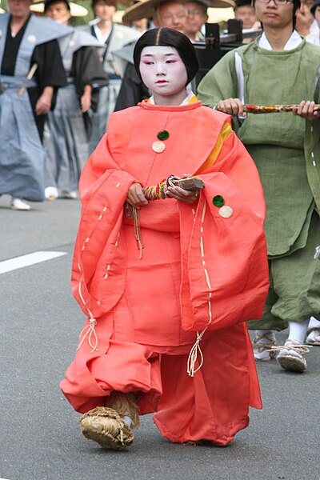

+++
date = 2025-01-24T00:09:59+09:00
lastmod = 2025-01-24T02:43:05+09:00
draft = false

title = "아쿠타가와 류노스케 - 라쇼 문(라쇼몽), 덤불 속"
summary = ""

isCJKLanguage = true

tags = ["essay", "literature", "rashomon", "ryunosuke akutagawa", "yabunonaka"]
categories = ["translations"]

references = [
    {title = "羅城門 - Wikipedia", link = "https://ja.wikipedia.org/wiki/%E7%BE%85%E5%9F%8E%E9%96%80"},
    {title = "養和の飢饉 - Wikipedia", link = "https://ja.wikipedia.org/wiki/%E9%A4%8A%E5%92%8C%E3%81%AE%E9%A3%A2%E9%A5%89"},
    {title = "곤자쿠 이야기집 - 위키백과, 우리 모두의 백과사전", link = "https://ko.wikipedia.org/wiki/%EA%B3%A4%EC%9E%90%EC%BF%A0_%EC%9D%B4%EC%95%BC%EA%B8%B0%EC%A7%91"},
]

+++

## 배경 및 후기

### 쿠로사와 아키라의 라쇼몽



&nbsp;

이 소설 원문과 마찬가지로, 라쇼몽 영화 또한 퍼블릭 도메인으로 풀려있기에 누구나 볼 수 있다. 구로사와 아키라 감독의 필모그래피를 떠올려보면, 물론 '칠인의 사무라이'처럼 후대에 엄청나게 변주된 영화를 꼽거나, 카게무샤와 같은 대작 영화를 꼽을 수 있겠지만, 그를 전 세계에 알린 작품은 바로 이 '라쇼몽'이다.

라쇼몽은 아쿠타가와 류노스케의 두 작품, **'라쇼 문'** 과 **'덤불 속'** 을 배경으로 하는데, 덤불 속의 등장인물이 '라쇼 문' 아래에서 만나는 것으로 시작하는 극중극의 형식을 띄고 있다. 이렇게 두 작품을 섞어서 만든 창작물이지만, 그저 원작의 재현에 그치지 않는다. 나름대로 원작을 충실히 따라가며 원작의 메시지를 담아내면서도, 그와 동시에 '덤불 속'의 내용을 조금 더 진행하여, 구로사와만의 시각과 메시지를 담아내었다.

&nbsp;

### 시대적 배경과 라죠문

#### 라죠문(羅城門)

일반적으로 라죠문(나성문羅城門, 라죠몬)이라고도 불린 이 문은 고대 일본 헤이안쿄의 남단 중앙에 정문으로 마련된 문을 뜻한다. 羅城이란, 그물을 뜻하기도 하는 한자 라羅와 성城을 합쳐서, 도성을 에워싼 성벽을 뜻하는 단어이다. 그러나 나성문이 하나만 있었기 때문에, 학계에선 일반적으로 헤이안 시대 때 도성을 둘러싼 나성이 축조되지 못했을 것으로 사료한다. 라죠문의 양익으로 나성이 다소 뻗어져있었을 것으로 추측하는 것 같지만, 견해에 따라선 라죠문 자체가 축조되지 않았을 가능성마저 제기된다.

문헌상으론 816년 폭풍우로 붕괴된 것으로 보인다. 콘쟈쿠 이야기집(今昔物語集) 등의 문헌에 따르면 붕괴되기 이전에 윗층에 시체들이 버려져 있었다고 한다. 이것이 라쇼문의 소재가 된다. 11세기 전반에는 초석만 남아있었던 것으로 보인다.

이름인 라죠문에서, 城은 일반적으로 죠, 세이, 혹은 쇼 라고 읽을 수 있다. 정확히 어떻게 읽었는지는 견해에 따라 다르지만, 중세 이후엔 점차 "쇼" 라고 부르는 방식이 굳어졌다고 한다. 콘쟈쿠 이야기집 등에서 또한 羅生門 등의 표기가 혼용되며 점차 羅生門 이 자리를 차지하게 된 것으로 보인다. 

이는 단순 오기일 수 있으나, 일반적으로 같은 소리를 가진 한자를 음차하여 쓰게 되었을 가능성도 있으며, 이 시기 근처에는 '라쇼'라는 발음이 주가 되었기에 그렇다는 주장이 존재한다. 이 근처엔 来生(라이쇼)墓 가 있다는 것도 이 주장을 뒷받침한다. 다만 찾아본 결과, 이 묘지는 현재 또 来世(라이세)墓가 되었는데, 生은 '세'로도 읽을수 있기 때문으로 보인다.

&nbsp;

#### 기근과 헤이안 시대

일반적으로 헤이안 시대가 특히 기근이 많았다고 하기보단, 일본 역사적으로 기록이 제대로 시작된 시기가 이 시기라고 할 수 있다. 특히 일본의 정사 여섯편을 육국사라고 부르는데, 이 중 다섯편이 이 시기에 편찬되었다. 기근이 이 시기에 서술 된 것은 이런 배경이 작용한다고 볼 수 있겠다. 

이 시대에 일반적으로 기근이 자주 일어났는지는 확실하지 않다. 일반적으로 헤이안 후기에 기근에 관련된 기록이 있으지만, 이 시기 문헌은 통계가 부족할 뿐 더러, 헤이안 후기의 정치적인 혼란 및 전쟁으로 인한 이미지일 수 있다. 실제로 1051년부터 일어난 '전9년의 역'이라는 전쟁이 있었으며, 라쇼문의 배경이 되는 콘쟈쿠 이야기집의 경우가 이 시기 후에 서술되었다고 추측된다.

다만 실제로 아주 큰 기근이 일어나긴 했다. 요와(養和) 기근이 바로 그 그것인데, 헤이안 말기 1180~1185년의 가마쿠라 막부가 수립되는 계기가 된 전쟁, 겐페이(源平) 합전 중 있던 일이다. 이 기근은 1181년에 일어났으며, 1180년의 극단적으로 적은 강수량으로 인한 가뭄, 전쟁으로 인한 사회 혼란이 겹친 결과이다. 

이에 카모노 쵸메이(鴨長明)의 일본 3대 수필, 호조키(方丈記,방장기)에는 다음과 같이 적혀있다.

> *또, 요와 무렵이었나, 오래되어서 확실하진 않지만. 그 2년간 세상이 기갈에 시달려 끔찍한 일이 있었다. 이를테면 봄・여름에는 가뭄이 들고, 가을・겨울에는 태풍이나 홍수 등 좋지 못한 일이 계속되어 오곡이 모조리 여물지 못했다.*
> 
> ...
>
> *교토란 곳은 무엇을 하던 본래 시골에 의지하는데, 올라오는 것이 없으면*
> 
> ...

이에 당시 교토의 구조가 지방의 농업 생산물에 의존하는데, 세수가 거의 없어 도시 사람들이 그것으로 인한 충격을 받았다는 시대상을 보여준다. 이 기록에는 교토 시내에서만 4만 2300명 가량의 사람이 죽었다고 한다.

&nbsp;

#### 콘쟈쿠 이야기집

앞서 종종 언급한 콘쟈쿠 이야기집은 헤이안 시대 말기에 성립된 것으로 보이는 이야기집이다. 연대와 작가는 모두 불분명하다. 이름의 어원은 모든 이야기가 콘쟈쿠(今昔)로 시작하기 때문이며, '이제는 옛날 이야기가 되었으나' 라는 뜻으로 해석된다. 

천축(인도)/진단(중국)/본조(일본)의 3부로 구성되어 있으며, 이 중 11권부터가 일본부로, 본조불법부(本朝仏法部) 11~20권, 본조세속부(本朝世俗部) 21권부터 31권까지가 있다. 다만 8,18,21권은 누락되어있다. 본조부는 '금석이야기집 일본부'라는 제목으로 세창출판사에서 총 9권 구성으로 번역되어 출간되었다.

아쿠타가와 류노스케가 콘쟈쿠 이야기집에서 영감을 얻어 쓴 소설로 '라쇼 문'과 '코'가 특히 잘 알려져 있으며, '덤불 속' 또한 이에 해당한다.  멋대로 '금석이야기집 일본부'의 번역을 차용하자면, 이 중 본조세속부 29권 제18화 '나성문羅城門 상층上層에 올라가 죽은 사람을 본 도적 이야기'(羅城門登上層見死人盗人語), 31권 제31화 '대도대大刀帶 집합소에 생선을 팔러 온 여자 이야기'(太刀帯陣売魚嫗語)를 배경으로 창작한 이야기가 바로 '라쇼 문'이다. 또한 29권 제 23화 '아내를 데리고 단바 지방丹波國으로 가던 남자가 오에 산大江山에서 도적에게 결박당한 이야기' (具妻行丹波国男 於大江山被縛語) 를 배경으로 창작한 이야기가 '덤불 속'이 되겠다.

&nbsp;

### 당시 의복 및 색상의 표현

> *비를 피하는 행인이 두셋은 있을 법도 하다.*
>
> *雨やみをする市女笠や揉烏帽子が、もう二三人はありそうなものである。*
>
> *직역) 비 피함을 하는 이치메가사나 모미에보시가, 더 이삼인은 있을 법한 것이다.*

- **市女笠/이치메가사 & 牟子/무시** \
  
  헤이안 시기에 여자들이 자주 쓰던 모자. \
  이 중, 늘어진 면사포를 [무시노타레기누(むしのたれ衣)](https://costume.iz2.or.jp/costume/546.html)라고 부르는데, \
  과거엔 牟子 라고 불렀던 듯 하다.

&nbsp;

- **烏帽子/에보시** \
  
  에보시란 일본 남성의 전통적인 모자로, 비단이나 마에 옻칠을 하여 검게 만들었다. 원래 귀족용이지만, 점차 서민들에게도 퍼져나갔다. 이름의 뜻은 까마귀 모자라는 뜻으로, 검은 모자라는 의미를 가지고 있다.
  - **揉烏帽子/모미에보시** \
    옻칠을 적게 하여, 부드러운 에보시
  - **さび烏帽子/사비에보시** \
    옻칠을 많이 하여, 주름을 특정 모양으로 잡은 에보시를 말한다. 이 부분에서 고민을 좀 했는데, 折烏帽子오리에보시는 나와도 사비에보시는 검색으로 나오지 않았기 때문이다. 그러나 오리에보시의 하위 분류로 접힌 모양이 큰지, 작은지를 大さび오오사비, 小さび치사비로 구분하는데, 이를 예전에 사비에보시로 부른 듯 하여 일단 이렇게 작성하였다.

&nbsp;

- **襖/아오**

같은 한자를 후스마로도 쓴다. 의복의 경우 아오라고 읽는다. 자주 쓰는 단어는 아닌 듯 하다.

&nbsp;

- **汗袗/카자미**

이에 대해서도 고민을 상당히 많이 했는데, 카자미는 주로 헤이안 시대 일본 여아가 입던 옷이라고 되어 있었기 때문이다. 이에 일웹을 뒤진 결과, 어떤 답변은 가난했기에 아무거나 주워입었다는 뉘양스였고, 다른 답변의 경우 카자미가 의복이 땀에 젖지 않도록 입는 내의라는 답변을 했다. 고민을 했는데, 아무래도 후자가 맞는 듯 하였다. 

추후 찾은 라쇼 문 연극의 경우에도, 황매화색 내의를 입고 있는 모습이 보였다.

&nbsp;

- **水干/스이칸**

헤이안 시대 도성의 평민들은 상당수 이런 의복을 입었다고 하는 듯 하다. 이 이미지는 상당히 치렁치렁한 편이며, 이 외에 구글 검색으로 상대적으로 많이 나오는 의복이다. (襖, 汗袗등은 잘 나오지 않았다.)

&nbsp;

> *하인은 목을 움츠리며, 개나리색 내의(汗袗카자미) 위에 걸친*
>
> *下人は、頸くびをちぢめながら、山吹の汗袗かざみに重ねた*

- **황매화山吹** \
  색을 번역함에 있어 가장 중시한 것은, 가능한 자연물의 색을 쓰자는 것이었다. 그런 점에서 황매화색은 개나리색으로 어느정도 대응이 되어서 다행이었다.

&nbsp;

> *갈색 옷을 입은, 키가 작고 야윈,*
>
> *檜皮色の着物を着た*

- **히와다이로檜皮色** \
  그러나 노송나무 껍질 색은, 도저히 대용단어를 생각해 낼 수 없었다. 고로 갈색이라고 번역을 하였으나, 아직까지도 마음이 들지 않는 부분이다. 특히 어떤 사람은 적갈색 이미지를 떠올릴 것이고, 어떤 사람은 조금 더 밤색에 가까운 어두운 색을 떠올릴 것이다.

&nbsp;

> *본 것은 그저 옷 색이 철쭉색이었다는 것 뿐입니다.*
>
> *見えたのはただ萩重ねらしい、衣の色ばかりでございます。*
>
> *직역) 보인 것은 그저 하기가사네 같은, 옷의 색 뿐입니다.*

- **하기가사네萩重ね** \
  아, 문제가 많았다. 重ね는 겹쳤다는 뜻인데, 이 萩重ね는 [두가지 색을 조합한 배합](http://www.so-bien.com/kimono/iro/hagigasane.html)을 얘기한다. 따라서 법사는 옷이 萩重ね 였던거같은데...? 라고 조금 더 상세한 정보에 대한 확신이 다소 떨어지는 얘기를 한 것인데, 도저히 이 색을 전달할 방법이 없었다. 결과적으로 重ね를 통째로 날렸다.

&nbsp;

### 번역에 관해

##### 라쇼 문

일반적으로 쿠로사와 아키라 감독의 라쇼몽으로 유명해졌으며, 영어를 한 번 거쳐서 들어온 번역명이다 보니 라쇼몽, 혹은 라쇼몬의 발음이 일반적으로 통용된다. 그러나 '라쇼'는 고유명사로 사용 가능한 데에 반해, 문은 일반명사임을 생각하여 굳이 '**라쇼 문**'이라는 이름으로 번역하였다. 적어도 '오사카 성'이 '오오사카죠'가 아니고, '스미다 강'이 '스미다가와' 가 아니고, '후지 산'이 '후지야마'가 아닌 관점으로 보자면 '라쇼 문'이 맞지 않나 싶다. 

&nbsp;

##### 덤불 속

藪の中야부노나카 는 일본어로 '당사자의 얘기가 엇갈려 진상(眞相) 불명임.' 을 뜻하는 말이기도 하다. 즉, 현재 라쇼몽 영화에서 따온 '라쇼몽 효과' 라는 것의 뿌리가 되는 속어이다. 덤불 속의 사건의 가장 중요한 배경은 '덤불 속'이며, 그와 동시에 당사자들의 진술이 '덤불 속' 인 것이다. 

덤불 속이야 여러모로 직독직해이므로, 할 말은 크게 없지만, 이를 알고 제목과 내용을 보는 것이 좋을 것 같아 특기했다.

&nbsp;

##### 단어의 선택

- **死人/死骸**
  
번역의 묘미가 드러나는 단어였다. 라쇼문에선 死人을 쓰는데, 이건 죽은 사람에 대한 전반적으로 통용되는 단어이다. 그러나 '죽은 사람'이라고 한다면, 한국어에선 좀 더 특정적이며, 좀 더 인물 그 자체를 지칭함과 동시에, 어떤 추상적인 개념으로 사용되는 단어이다. 그러나 死人의 경우, 시체라는 좀 더 물리적 실체를 가지고 드러나는 것이다. 물론 일본어의 뉘양스적으로도 어떤 물리적 실체가 더 있는 경우엔 死骸을 쓸 것이다. 따라서 死人은 시체라고 번역하였다.

라쇼 문과 덤불 속의 경우, 둘 다 死骸란 단어를 쓴다. 그러나 번역하면서 이 단어엔 무려 세가지 단어를 할당했다. 고유명사 번역을 어떻게 했는지 따로 메모장에 써놓고 번역하는 것에 비해 상당히 다채롭게 번역을 했는데, 다음 세가지 케이스가 있었다.

1. 라쇼 문에서, 死人을 쓰다가 死骸로 바뀌었을 때

상당히 어떤 시체의 실체가 드러나는 장면이었다. 이미 시체를 써 버린 이상, 사해, 송장, 주검, 사체, 유해, 등등 여러가지 단어가 있었는데, 이 중 가장 인간을 덧없게 그리며 동시에 충격적이고, 그로테스크하며 폭력적인 단어는 송장이었다. 

2. 덤불 속에서, 죽은 사무라이가 발견되었을 때

그야 여기선 일반적으로 가장 중립적인 단어를 사용하였다. 시체가 가장 중립적인 단어였다.

3. 여자의 진술에서 사무라이를 지칭할 때

> 시신
>
> *‘송장’을 점잖게 이르는 말. (표준국어대사전)*

여기서 살짝 꼬았는데, 비록 일본어에서 여러모로 단어를 쓸 수 있지만, 한국어에서 어느정도 죽은 시체를 지칭하면서 점잖은 뉘양스를 가질 수 있는 단어는 두 가지라고 생각한다. 시신과 유해. 여기서 유해라는 것은, 좀 더 원형을 유지하지 못한 시신을 일컫는 말이다. 유해 발굴 같은 단어에서 드러나듯이. 그러면 남은 것은, 방금 숨이 끊어진 남편을 어떻게 지칭할 지에 대한 문제이다. 여자의 실제 진상에서 남편에 대한 태도가 어땠는지는 사실 중요하지도 않으며, 알 수도 없다. 결국 남편에 대한 지칭에서 여자는 다소의 존중을-비록 어떤 충격을 받았을 지언정-표하는데, 이에 따라 가치 중립적이기보단 조금 더 겸양어를 담았다. 

왜냐하면, 그렇지않은가?

어머니의 시신/어머니의 시체

첫째가 조금 더 부드러운 뉘양스로 들어온다.

&nbsp;

- **사촌四寸=164cm?**

정말 오래 고민했다. 검색도 많이 했는데, 도당체 말의 키를 왜 4촌이라고 하는거지? 이게 말이 되나? 라고 고민을 했는데, 어떻게든 찾아본 결과 일반적으로 키에 대해 말할 때, 무조건 5척을 가정하고 잰다는 것을 몰랐기 때문이었다. 왜냐하면 5척\~6척의 경우 151.5cm\~181.8cm이 되기 때문에, 기본적으로 척을 생략하고 촌 단위만 말해도 큰 문제가 없기 때문이었다.

&nbsp;

> *여차하면 번드르르한 말 한마디로도 죽이지 않습니까.*
>
> *どうかするとおためごかしの言葉だけでも殺すでしょう。*

- **오타메고카시おためごかし**

원문의 경우 おためごかし라는 단어를 사용했는데, '남을 위하는 체하면서 자기 실속을 차림' 이라는 뜻이었다. 그런데, 아무리 생각해도 '체면치레'와 같은, 내 사회적 위신을 챙기는 위선같은 단어는 한국어에 있지만, 자신의 이득을 차리는 것 자체를 뜻하는 단어가 없는 것이다. 심지어 이 단어의 중요성은 '이득을 챙긴다' 는 부분에 있는데, 고민을 정말 많이 했다. 이런 경우 어떻게든 대응시키려다 풀어 쓸 수 있는 경우 풀어쓰지만, 이 단어는 도저히 앞의 운율에 맞추자면 풀어 쓸 수 가 없었다. 결국 어떻게든, 실이 없고 허만 있다는 뉘양스만 어떻게든 녹여내고자 '번드르르한 말 한마디' 라는 선택지를 골랐다.

&nbsp;

> *아이고, 물론 피 한 방울 안 흘리고*
>
> *なるほど血は流れない*
>
> *직역) 과연 피도 흐르지 않고,*

- **나루호도なるほど**

사실 상당히 관성적으로 '과연'이라고 번역해버리는 단어인데, 실제로 '과연'이라고 번역하면 대다수의 경우 오역이 되어 버리는 신묘한 단어이다. 기본적으론 맞장구-'그렇군, 어쩐지' 감탄사-'역시' 정도가 가장 자주 대용될 수 있다. 그러나 이 경우엔, 당신들을 꼬집는 타죠마루의 궤변에 쓰인 단어인 것이다. 그렇군 피도 흐르지 않아~ 라고 할 수는 없었다. 어떠한 Sarcasm을 담았어야 했는데, 조금 평소 밟는 어떠한 의역의 최전선보다 더 나아간 느낌이 있다. 

번역하고 나서 사전을 찾아보니, 아무렴 이라는 단어가 있었어서 이거다!하고 사실 조금 후회를 했다. 아무래도 맞장구, 감탄사 등만 생각하다가 좀 머리가 굳어있었던 것 같은데, 아무렴...아무렴...돈벌려고 하는 번역도 아닌데 아무렴 어때 하면서 그냥 '아이고 물론'을 내비두었다. 욕 먹을 짓이다.

&nbsp;

- **츠키게月毛, 호우시가미法師髪**
  
말을 표현한 단어이다. 일단 月毛는 Palomino종을 일본에서 뜻하는 말이라고 한다. 유전적으로 금색 털, 흰색 갈기라고 하는데, 밝은 갈색이라고도 표현해서 굳이 금색까지는 쓰지 않았다. 

호우시가미法師髪는 일본어 웹 사전에도 예문이 두개 밖에 안나온다. 심지어 [kotobank](https://kotobank.jp/word/%E6%B3%95%E5%B8%AB%E9%AB%AA-2081810) 에는 다음과 같이 써있다.

> 어원/의미 미상. 말의 갈기를 깎은 것?

이게 무슨...여튼 法師에는 승려라는 뜻이 있기에, 승려처럼 갈기를 바싹 깎아서 갈기가 일반 털과 구분이 안된다는 뜻이 아닐까? 하고 그저 넘겨짚기를 했다. 결론적으로 다음 문장이 되었다. *"말은 밝은 갈색 털의 ―― 확실히 갈기를 바싹 깎아둔 말이었던 것 같습니다."*

&nbsp;

---

## 라쇼 문

&nbsp;

어느 날 해질녘의 일이다. 한 하인이 라쇼 문 아래에서 비가 그치기를 기다리고 있었다.

넓은 문 아래엔, 이 남자 말고는 아무도 없다. 그저, 여기저기 붉은 칠이 벗겨진 커다란 둥근 기둥에, 귀뚜라미 한 마리가 앉아 있다. 라쇼문이 스자쿠 대로에 있는 이상, 이 남자 말고도 비를 피하는 행인이 두셋은 있을 법도 하다. 그런데도 이 남자 외엔 아무도 없다.

왜인즉슨, 이 근래 2~3년, 교토에는 지진이나 돌풍이나 화재나 기근 같은 재앙이 잇달아 일어났다. 그래서 도성의 스산함이 이만저만이 아니다. 기록에 따르면, 불상이나 불교용품을 부수어, 붉은 칠이 되어있다거나 금박 은박이 붙어있던 나무를 길에 쌓아두고 땔감으로 팔았다고 한다. 도성이 그 지경이니, 라쇼문의 수리 같은 건 애초에 아무도 신경 쓰는 자가 없었다. 그러자 폐허가 된 틈을 타 여우나 너구리가 터를 잡았다. 도둑이 터를 잡았다. 결국, 종래엔 연고자가 없는 시체를 이 문으로 가져와 버리고 가는 관습마저 생겼다. 그래서 해가 기울고 나면, 으스스해서 아무도 이 문의 근처에는 발을 들이지 않게 된 것이었다.

그 대신 어디에선가 까마귀가 잔뜩 모여들었다. 대낮에 보면 몇 마린지도 모를 까마귀들이 원을 그리며, 높은 치미(鴟尾) 근처를 울면서 빙빙 돌고 있다. 특히 문 위쪽 하늘이 석양에 붉게 물들 때면, 그것이 깨를 뿌린 것처럼 선명히 보였다. 까마귀는, 물론, 문 위에 있는 시체의 살점을 쪼아 먹으러 오는 것이다. ―― 그러나 오늘은 시간이 늦어서인지 한 마리도 보이지 않는다. 그저 여기저기 무너져 내린, 그리고 무너진 틈에 기다란 풀이 자라난 돌층계 위에 까마귀의 분변이 점점이 하얗게 달라붙어 있는 것이 보인다. 하인은 일곱단이 있는 계단의 가장 윗단에 빛바랜 감색 웃옷을 엉덩이에 깔고 앉아, 오른쪽 뺨에 생긴 커다란 여드름을 신경 쓰면서, 멍하니 비가 내리는 것을 바라보고 있다.

작가는 아까, "하인이 비가 그치기를 기다리고 있었다"고 썼다. 하지만, 하인은 비가 그쳐도 딱히 뭐라 할만한 목표가 있지 않다. 평소라면, 물론, 주인의 집으로 돌아가려 할 터였다. 그러나 그 주인한테 4,5일 전에 해고당했다. 앞에도 쓴 것처럼, 당시 교토의 거리는 쇠퇴함이 이만저만이 아니었다. 지금 이 하인이 오랜 세월 모시던 주인에게서 해고를 당한 것도, 실은 이 쇠퇴함의 작은 여파임이 틀림없다. 그러니까 "하인이 비가 그치기를 기다리고 있었다" 고 하기보단, "비에 갇힌 하인이 갈 곳도 없이 어찌할 바를 모르고 있었다"고 하는 편이 적당할 터이다. 거기다 오늘 날씨도 적잖이 이 헤이안 시대 하인의 센티멘탈리즘에 영향을 미쳤다. 네시경부터 내리기 시작한 비는, 아직도 그칠 기색이 없다. 그래서 하인은 무엇보다도 우선 내일의 생계를 어떻게든 하려고――말해봐야 어찌 되지 않을 일을 어떻게든 하려고 하면서, 걷잡을 수 없는 상념을 뒤쫓으며, 아까부터 스자쿠 대로에 내리는 빗소리를 한 귀로 흘리며 듣고 있던 것이다.

비는 라쇼문을 감싸고, 쏴아아하는 소리를 멀리서부터 그러모은다. 땅거미가 서서히 하늘을 낮추며, 올려다보면 문의 지붕이 비스듬히 튀어나온 용마루의 끝으로 무겁고 어둑한 구름을 떠받치고 있다.

어찌할 바가 없는 일을 어떻게든 하려면, 수단을 가릴 겨를이 없다. 수단을 가려봐야 흙더미 아래나 길가 흙바닥 위에서 굶어 죽을 뿐이다. 끝내야, 이 문 위로 끌려와 개처럼 내던져 버려질 뿐이다. 수단을 가리지 않는다면――하인의 생각은, 몇 번이고 같은 길을 서성인 끝에, 그제야 이 결론에 다다랐다. 하지만 이 '않는다면'은, 어디까지나 결국 '않는다면' 일 뿐이었다. 하인은 수단을 가리지 않아야 한다는 것은 인정하면서도, 이 '않는다면'의 결론으로 당연히 뒤따라올, '도둑이 될 수밖에 없다'고 하는 것은, 적극적으로 인정할 용기가 나지 않는 것이다.

하인은 크게 재채기를 하고나서, 내키지 않는 듯 일어섰다. 저녁의 쌀쌀함이 맴도는 교토는 이제 화로가 그리울 만큼 싸늘하다. 바람은 기둥 사이사이를 땅거미와 함께 거침없이 훑고 지나간다. 붉은 칠을 한 기둥에 앉아있던 귀뚜라미도, 이미 어디론가 사라져 버렸다.

하인은 목을 움츠리며, 개나리색 내의(汗袗카자미) 위에 걸친 감색 웃옷의 옷깃을 여미곤 문 근처를 둘러보았다. 비바람의 근심도, 사람의 눈에 띌 걱정도 없으며, 하룻밤 편히 지낼 곳이 있으면 일단 그곳에서 밤을 지새려 했기 때문이다. 때마침 다행히도 문 위의 누각으로 올라가는 널찍한 사다리가 눈에 들어왔다. 그 또한 붉은 칠이 되어 있다. 위라면 사람이 있더라도 어차피 시체들뿐일 터이다. 하인은 우선 허리에 찬 칼이 칼집에서 미끄러지지 않도록 주의하며, 짚신을 신은 발을 사다리의 맨 아랫단에 디뎠다.

그 후로 몇 분 뒤의 일이다. 라쇼문의 누각 위로 올라가는 널찍한 사다리의 중간 즈음에, 한 남자가 고양이처럼 몸을 웅크리고 숨을 죽여가며 위의 기색을 살피고 있다. 누각의 위에서 비추는 불빛이 어렴풋이 그 남자의 오른뺨을 적시고 있다. 짧은 수염 사이로, 붉게 부어오른 농이 찬 여드름이 있는 뺨이다. 하인은 애초에 이 위에 있는 것은, 시체뿐일 거라 대수롭지 않게 여기고 있었다. 그런데 사다리를 두세 단 올라보니, 위에서 누군가가 불을 켜놓곤, 심지어 그 불을 이곳저곳 움직이고 있는 듯하다. 그건 탁하고 누런빛이, 구석구석 거미줄이 쳐진 천장을 흔들거리며 비추었기 때문에 곧바로 알 수 있었던 것이다. 이 비 오는 밤에, 이 라쇼문의 위에서, 불을 밝히고 있다니, 어차피 보통 사람은 아니다.

하인은 도마뱀붙이처럼 발소리를 죽이고, 가파른 사다리를 기듯이 올라 겨우겨우 맨 윗단에 닿았다. 그리하여 몸을 최대한 납작하게 낮추고, 목을 최대한 앞으로 쭉 뺀 채, 조심조심 누각 안을 엿보았다.

보자 하니, 누각 안에는 소문대로 몇 구의 송장이 아무렇게나 버려져 있었으나, 불빛이 비치는 범위가 생각보다 좁아 그 수가 얼마나 되는지는 알 수 없다. 다만 어렴풋이나마 알 수 있는 건, 그 안에 벌거벗은 송장과 옷을 걸친 송장이 섞여있다는 것이다. 물론, 여자도 남자도 있는 듯하다. 그리고 그 송장은 모두 그것이 한 때 살아있던 인간이라고 하는 사실마저 의심스러울 만큼, 흙으로 빚은 인형처럼 입을 벌리거나 손을 뻗은채 이리저리 바닥에 나뒹굴고 있었다. 심지어 어깨나 가슴 같은 두드러진 부분에 희미한 불빛을 받아 홀쑥한 부분의 그림자를 한 층 짙게 하며, 영원토록 벙어리인 양 묵묵했다.

하인은 그 송장들의 썩어 짓물러진 악취에 무심코 코를 막았다. 그러나 그 손은, 바로 다음 순간, 코를 막아야 한다는 것을 잊고 있었다. 어떤 강렬한 감정이 거의 모조리 이 남자의 후각을 빼앗아 버렸기 때문이다.

하인의 눈에, 그때, 송장들 사이에 웅크리고 있는 인간이 비로소 들어왔다. 갈색 옷을 입은, 키가 작고 야윈, 백발의 원숭이 같은 노파이다. 그 노파는 오른손에 불붙은 소나무 조각을 들고, 송장의 얼굴을 뜯어보듯 살피고 있었다. 머리가 길다는 점에 미루어 보아, 아마 여성의 시체일 터이다.

하인은 육할의 공포와 사할의 호기심에 사로잡혀, 잠시 숨 쉬는 것마저 잊고 있었다. 온몸의 털이 곤두서는 느낌을 받았던 것이다. 그 사이 노파는 소나무 조각을 마룻바닥 틈 사이에 꽂고 나선, 지금까지 살펴보던 송장의 머리를 양손으로 붙잡곤, 마치, 원숭이 부모가 원숭이 새끼의 이를 골라내듯이, 그 기다란 머리카락을 한 올씩 뽑기 시작했다. 머리카락은 그 손짓에 따라 그대로 뽑히는 듯하다.

그 머리카락이, 한 올씩 뽑히는데 따라, 하인의 마음 속에서 공포가 서서히 사라져갔다. 그리고 동시에, 이 노파에 대한 격렬한 증오가 조금씩 꿈틀대기 시작했다. ――아니, 이 노파에 대한 증오라고 하기에는 어폐가 있을지도 모른다. 오히려 온갖 악에 대한 반감이, 매순간 조금씩 크기를 키우고 있는 것이다. 이 때 누군가가, 이 하인에게 아까 문의 아래에서 고민하고 있던, 굶어 죽을 것인지 도둑이 될 것인지에 대한 문제를 재차 가지고 나온다면, 십중팔구 아무 미련도 없이 굶어 죽는 것을 골랐으리라. 그만큼 이 남자의 악을 향한 증오는, 노파가 바닥에 꽂아둔 소나무 조각처럼 거세게 불타오르기 시작한 것이다.

하인은 물론, 어째서 노파가 죽은 이의 머리카락을 뽑고 있는지 알 수 없었다. 따라서 합리적으로는, 이를 선악 중 어느 쪽으로 분류해야 할지 몰랐다. 하지만 하인에게 있어선, 이 비오는 밤에, 이 라쇼문 위에서, 죽은 이의 머리카락을 뽑는단 것은 그 자체만으로도 충분히 용서할 수 없는 악이었다. 물론 하인은, 방금 전까지만 해도 자신이 도둑질을 하려고 마음 먹었던 것 따위, 진작에 잊어버린 것이다.

여기서 하인은 두 발에 힘을 담아 다짜고짜 사다리 위로 뛰어 올랐다. 그리고 칼자루에 손을 얹은 채 성큼성큼 노파 앞으로 걸어갔다. 노파가 놀란 것은 말할 것도 없다.

노파는 하인을 보자마자 마치 시위가 튕기듯이 뛰어올랐다.

"이놈, 어디를 가느냐."

하인은 송장에 발부리가 걸려가며 허둥지둥 도망치려는 노파를 막아서서 일갈했다. 노파는 하인을 밀쳐내며 지나가려 한다. 하인 역시 그걸 멈춰세우려 밀어붙였다. 두 사람은 송장들 사이에서 잠시간 아무 말도 없이 서로 얽혀있었다. 그러나 승부는 애초에 정해져있다. 하인은 마침내 노파의 팔을 붙잡곤 억지로 넘어뜨렸다. 마치 닭발처럼 뼈와 가죽만 남은 팔이다.

"무얼 하고 있었지? 말해라. 말하지 않으면 가만두지 않겠다."

하인은 노파를 밀쳐 넘어뜨리고는, 갑작스레 칼을 뽑아 하얀 강철빛을 그 눈 앞에 들이밀었다. 그런데도 노파는 입을 다물고 있다. 양손을 부들부들 떨며, 어깨로 거친 숨을 드러내며, 눈알이 눈꺼풀 밖으로 튀어나올 듯 눈을 크게 뜬 채, 벙어리처럼 집요하게 입을 다물고 있다. 이것을 보고 하인은 처음으로 명확하게, 이 노파의 생사가 오롯이 자신의 의지에 달려 있다는 것을 의식했다. 그리하여 이 의식은 지금까지 거칠게 타오르던 증오를 어느샌가 식혀 버렸다. 뒤에 남은 것은 그저 어떤 일을 원만히 해결했을 때의 흐뭇함과 만족감 뿐이었다. 그리하여 하인은 노파를 내려다보며, 조금 부드러워진 목소리로 말했다.

"나는 검비위사(헤이안 시대 경찰조직)의 관리가 아니다. 방금 전 이 문 아래를 지나가던 나그네다. 고로 너를 포박해서 어찌할 일은 없다. 그저 이 시간에 이 문 위에서 무엇을 하고 있었는지, 그것만 내게 얘기하면 될 일이다."

그러자 노파는, 크게 뜬 눈을 한층 더 부릅뜨곤, 가만히 하인의 얼굴을 지켜보았다. 눈가가 붉게 충혈된, 마치 육식조 같은 날카로운 눈으로 보는 것이다. 그리고는 얼굴이 쭈그러져 거의 코와 하나가된 입술을, 무언가를 씹듯이 오물거렸다. 가느다란 목에서 튀어나온 울대가 움틀거리는 것이 보인다. 그 때, 그 목에서 까마귀가 우는 듯한 소리가 헐떡이듯 새어나와 하인의 귀로 전해졌다.

"이 머리칼을 뽑아서, 이 머리칼을 뽑아서, 가발을 만들 셈이었지."

하인은 노파의 대답이 뜻밖에도 평범한 것에 실망했다. 그렇게 실망함과 동시에, 다시 그 전의 증오가 차가운 경멸과 함께 마음 속으로 파고들었다. 그러자 그 기색이 노파에게도 전해진 듯 하다. 노파는 아직도 송장의 머리에서 뽑은 긴 머리카락을 한 손에 쥔 채, 두꺼비가 꾸륵거리듯한 소리로 웅얼거리면서, 이렇게 말했다.

"죽은 자의 머리카락을 뽑는다는 것은, 어느 정도 나쁜 짓일지도 모르지. 그러나 여기에 있는 시체들은 모두 그 정도 일은 당해도 좋은 자밖에 없다오. 지금, 내가 머리카락을 뽑은 이 여자는 말이야, 뱀을 네 치쯤씩 잘라서 말린걸 말린 생선이라며 칼을 찬 무리들에게 팔러 다녔어. 병에 걸려서 죽지 않았다면 아직도 팔러 다니고 있었을게야. 게다가 말야, 이 여자가 파는 말린 생선은 맛이 좋다나, 칼을 찬 무리들이 꼬박꼬박 반찬으로 사갔다더구나. 나도 이 여자가 한 짓이 나쁜 일이라곤 생각 않네. 그렇게라도 하지않으면, 굶어 죽을 수밖에 없기 때문에 어쩔수 없는 일인 게야.  그런고로 지금 내가 하고 있는 일도 나쁜 일이라곤 생각 않네. 이거라도 하지 않으면, 굶어 죽을 수밖에 없기 때문에 어쩔 수 없는 일인 게야. 이런 어쩔수 없는 것을 잘 알고 있던 이 여자라면, 아마도 내가 한 일은 대강 너그러이 봐주겠지."

노파는 대체로 이런 취지의 말을 했다.

하인은 칼을 칼집에 꽂은 채 왼손으로 칼자루를 누르며, 냉담하게 이 이야기를 듣고 있었다. 물론 오른손으론 붉게 부어오른 농이 찬 커다란 여드름을 신경 쓰면서 듣고 있는 것이다. 그러나 이 이야기를 듣는 동안, 하인의 마음엔 어떤 용기가 솟아났다. 그것은 아까 문의 아래에서, 이 남자에겐 부족했던 용기였다. 그리고 방금 이 문의 위로 오르며 이 노파를 붙잡았을 때의 용기와는, 완전히 반대 방향으로 움직이려는 용기였다. 하인은, 굶어 죽을까 도둑이 될까 방황하지 않았다. 그 순간 이 남자의 마음 상태를 보자면, 굶어 죽는다는 것은 아예 생각조차 할 수 없을 정도로, 의식의 밖으로 쫓겨나 있었던 것이다.

"그렇단 말인가."

노파의 말이 끝나자, 하인은 비웃는 듯한 목소리로 확인했다. 그리하여 한 걸음 앞으로 나서더니, 갑자기 오른손을 여드름에서 떼어내 노파의 멱살을 잡으면서, 짓씹듯이 이렇게 말했다.

"그러면 내가 강도짓을 해도 원망 말아라. 나도 이렇게 하지 않으면 굶어 죽을 몸이니까."

하인은 재빠르게 노파의 옷을 벗겨냈다. 그리고 발에 매달리려는 노파를, 송장의 위로 거칠게 걷어 찼다. 사다리까진 겨우 다섯 걸음 남짓이었다. 하인은 벗겨낸 갈색 옷을 겨드랑이에 끼고, 순식간에 가파른 사다리를 타고 밤의 어둠 아래로 내려갔다. 

잠시 죽은 듯이 쓰러져 있던 노파가, 송장들 사이에서 벌거벗은 몸을 일으킨 것은 그로부터 오래 지나지 않은 때의 일이다. 노파는 중얼거리는 듯한, 신음하는 듯한 소리를 내며, 아직 타오르는 불빛에 의지해 사다리까지 기어갔다. 그곳에서 짧은 백발을 늘어뜨린 채, 문 아래를 들여다보았다. 밖에는 그저, 무저갱과 같은 밤이 있을 뿐이었다.

하인의 행방은 아무도 모른다.

&nbsp;



&nbsp;

---

## 덤불 속

&nbsp;

##### 케비이시(検非違使,헤이안 시대 경찰)에게 신문 당하는 나무꾼의 이야기

그렇습니다. 그 시체를 발견한 사람이 바로 저입니다. 저는 오늘 아침 평소대로 뒷산에 나무를 하러 가고 있었습니다. 그 와중 산 그늘 덤불 속에, 그 시체가 있었습니다. 어디에 있었냐는 말씀이십니까? 그건 야마시나(山科)의 큰길에서 네다섯 쵸(町,일본 길이단위. 약 109m*역주)정도 떨어진 곳이었습죠. 대나무 숲에 마른 삼나무가 섞여 있는, 인적이 드문 곳입니다. 

시체는 하늘색 스이칸(水干) 옷을 입고 도시풍의 사비에보시(さび烏帽子)를 머리에 쓴 채로, 위를 향해 쓰러져있었습니다. 단칼에 당했다고는 해도, 어쨌든 가슴을 찔린 상처이다 보니, 시체 주변 대나무 낙엽은 적갈색으로 물들인 것 같았습니다. 아뇨, 더 이상 피가 흐르지는 않았습니다. 상처가 말라있었습죠. 게다가 그곳에 말파리 한 마리가, 제 발소리에도 꿈쩍않고 찰싹 달라붙어 있었습니다.

칼 같은건 보지 못했냐구요? 아뇨, 아무것도 없었습죠. 다만 그 옆 삼나무 아래에 밧줄이 한 가닥 떨어져 있었습니다. 그리고――아 참, 밧줄 말고도 빗이 하나 있었습니다. 시체 주변에 있던 것은 이 둘 뿐입니다. 그런데 풀이나 대나무 낙엽이, 온통 밟혀 엉망이 되어 있었으니, 분명 그 남자가 살해당하기 전에 꽤나 격렬한 몸싸움이라도 있었던 게 틀림 없습니다. 예? 말은 없었냐굽쇼? 거긴 애초에 말 같은 게 들어갈 곳이 아닙니다. 어쨌든 말이 다니는 길과는 덤불 하나를 사이에 두고 떨어져 있으니까요. 

&nbsp;

##### 케비이시에게 신문 당하는 떠돌이 법사의 이야기

확실히 그 남자와 어제 만났습니다. 어제 ―― 아마, 오시 무렵이었을 겁니다. 세키야마(関山)에서 야마시나(山科)로 가던 길이었습니다. 그 남자는 말에 탄 여자와 함께, 세키야마(関山) 쪽으로 걸어가고 있었습니다. 여자는 모자에 달린 면사포를 내려쓰고 있어서, 얼굴은 제가 보지 못했습니다. 본 것은 그저 옷 색이 철쭉색이었다는 것 뿐입니다. 말은 밝은 갈색 털의 ―― 확실히 갈기를 바싹 깎아둔 말이었던 것 같습니다. 말의 키 말씀이십니까? 키는 한 5척 4촌쯤(*164cm) 되었을까요? ―― 뭐, 출가한 몸인지라 그런 것은 빠삭하지 않습니다만. 남자는 ―― 아뇨, 칼도 차고 있고, 활도 차고 있었습니다. 특히 검게 칠한 화살통엔, 스무 개 남짓의 전쟁용 화살을 꽂아둔 것이, 지금까지도 또렷이 기억납니다.
그 남자가 이렇게 될 줄이야 꿈에서도 몰랐습니다만, 참으로 사람 목숨이란게, 여로역여전(금강경-이슬과 같고 번개와 같다. *역주)임이 틀림없군요. 참...뭐라 말 할 수 없는 딱한 일입니다.

&nbsp;

##### 케비이시에게 신문 당하는 나졸의 이야기

제가 붙잡은 남자 말씀이십니까? 그야 확실히 타죠마루(多襄丸)라고 하는, 이름 높은 도둑이 맞습니다. 애초에 제가 붙잡았을 땐 말에서 떨어진 모양인지, 아와다구치(粟田口)의 돌다리 위에서 끙끙거리며 있었습니다. 시각 말씀이십니까? 시각은 어젯밤 초경(初更-하룻밤을 오경으로 나눈 첫째 부분. 19시~21시 *역주) 무렵이었습니다. 이전에 제가 놓쳤을 때도 바로 이 감색 스이칸 옷에, 금박 장식의 칼을 차고 있었습니다. 그렇지만 지금은 그 외에도 보시는 바 대로, 활까지 가지고 있습니다. 아, 그렇습니까? 그 죽은 남자가 가지고 있던 ―― 그러면 사람을 죽인건 이 타죠마루가 틀림 없습니다. 가죽을 감은 활, 검게 칠한 화살통, 매의 깃을 단 전쟁용 화살이 열 일곱 자루, ―― 이것들이 전부, 그 남자가 가지고 있었던 것이겠죠. 예. 말도 말씀하시는 대로, 갈기를 바싹 깎은 밝은 갈색 털입니다. 그 짐승에게 떨쳐졌다니, 무슨 업보임이 틀림 없습니다. 그 말은 돌다리 살짝 앞쪽에서, 길다란 고삐를 늘어뜨린 채 길가의 어린 참억새를 뜯고 있었습니다.

이 타죠마루라는 녀석은, 도성을 떠돌아다니는 도둑들 중에서도, 여자를 밝히는 놈입니다. 작년 가을 토리베(鳥部) 절의 빈두루상 뒷편의 산에서, 부녀자와 여자아이가 함께 살해당해 있었던 것이 이녀석 짓이라고하는 얘기가 있습니다. 그 말에 타고 있던 여자도, 이 녀석이 그 남자를 죽였다고 한다면, 어디에 어떻게 되어있을지 모릅니다. 외람되오나, 그 건에 대해서도 부디 조사해 주시길 부탁 드리겠습니다.

&nbsp;

##### 케비이시에게 신문 당하는 노파의 이야기

네, 그 죽은 남자는 제 딸과 연을 맺은 사내입니다. 하지만 도성 사람은 아닙니다. 와가사(若狭) 지방청의 사무라이입니다. 이름은 카나자와 타케히로(金沢武弘), 나이는 스물 여섯이었습다. 아니요, 성품이 온화해서 원한 같은 것을 살 리가 없습니다.

딸 말씀이십니까? 딸의 이름은 마사고(真砂), 나이는 열 아홉입니다. 남자에게도 지지 않을 정도로 기가 센 아이지만, 타케히로 외에 한 번도 다른 남자를 둔 적은 없습니다. 얼굴은 살짝 가무잡잡하고, 왼쪽 눈가에 점이 있는, 콧날이 오똑한 작고 갸르스름한 얼굴입니다.

타케히로는 어제 딸과 함께,와카사(若狹)로 떠났습니다만, 이런 일이 되리라곤, 어찌 이런 팔자인지요. 그러나 딸이 어떻게 되었을지, 사위는 어찌할 수 없더라도, 이것만은 걱정되서 견딜 수가 없습니다. 부디 이 늙은이가 일생의 소원을 부탁 드리오니, 온 산을 뒤져서라도 딸의 행방을 찾아 주십시오. 아무리 생각해도 그 타죠마루인지 뭔지 하는 도둑놈이 증오스럽습니다. 사위 뿐만 아니라, 딸까지......(이후는 울음에 잠겨 말을 잇지 못함.)

&nbsp;

##### 타죠마루의 자백

그 남자를 죽인건 저입니다. 하지만 여자는 죽이지 않았습니다. 그러면 어디갔냐구요? 그것은 저도 모릅니다. 자, 잠깐만요. 아무리 고문해도, 모르는 것은 말씀 드릴 수 없습니다. 게다가 저도 이 지경이 된 이상, 비겁하게 숨길 생각은 없습니다.

저는 어제 오시가 조금 지나서, 그 부부와 만났습니다. 그 때 바람이 불어 면사포가 들춰지는 그 순간, 여자의 얼굴이 얼핏 보였습니다. 얼핏, ――보았다 인지하는 순간 이미 보이지 않게 되었지만, 아마 그것도 한 이유였겠지요, 저에겐 그녀의 얼굴이, 마치 보살처럼 보인겁니다. 저는 그 순간, 설령 그 남자를 죽이더라도 여자를 빼앗자고 결심했습니다.

뭐, 남자를 죽이는 일 따윈, 당신들 생각처럼 대수로운 일이 아닙니다. 어차피 여자를 빼앗으려면, 남자는 반드시 죽여야겠지요. 다만 전 죽일 때 허리에 찬 칼을 사용했지만, 당신들은 칼 대신에 그저 권력으로 죽이고, 돈으로 죽이고, 여차하면 번드르르한 말 한마디로도 죽이지 않습니까. 아이고, 물론 피 한 방울 안 흘리고, 남자는 멀쩡히 살아있겠지――그래도 죽인건 마찬가지입니다. 죄의 깊이를 생각해 보면, 당신들이 나쁜지, 내가 나쁜지는 모를 일입니다.（비아냥거리는 미소）

하지만 남자를 죽이지 않아도 여자를 뺏을 수 있다면, 딱히 불만은 없습니다. 아니, 그때 전 가능하면 남자는 죽이지 않고 여자를 빼앗겠다고 결심했던 겁니다. 하지만 그 야마시나 쪽 큰길에선 도저히 그런 짓을 할 수 없었습니다. 그래서 전 산 속으로, 그 부부를 유인할 궁리를 했습니다.

이것도 별로 어려울 건 없습니다. 저는 그 부부와 길동무가 되려고, 저쪽 산에 고분이 있다, 그 고분을 파보니 거울이니 칼이니 잔뜩 나왔다, 난 그걸 아무도 모르게 산 그늘 덤불 속에 묻어뒀다, 혹시 원하는 사람이 있으면, 아무래도 싸게 넘기고 싶다 ―― 이런 말을 했습니다. 그 남자는 어느샌가 제 말에 점점 마음이 동하기 시작했습니다. 그리고 나서―― 어떻습니까. 욕심이란게 참 무섭지 않습니까? 그리고 나서 반 시진도 지나지 않아, 그 부부와 저는 함께 산길로 말을 몰았던 것입니다.

제가 덤불 앞에 이르러선, 보물은 이 안에 묻혀있다, 보러 와달라고 했습니다. 남자는 욕심에 눈이 멀어있으니, 반대를 할 리가 없지요. 그러나 여자는 말에서 내리지 않고 기다리겠다고 했습니다. 심지어 덤불이 그렇게 우거져있으니, 그렇게 말하는 것도 무리는 아니겠지요. 사실 그것도 제 계획대로 된 것이었기에, 저는 여자를 혼자 남긴채, 남자와 덤불 속으로 들어갔습니다.

덤불 지나서는 한동안 대나무밖에 없습니다. 하지만 반 쵸(*55m)정도 가면, 살짝 트인 삼나무 숲이 있는데―― 제 일을 마무리하기엔 이보다 좋은 장소가 없습니다. 저는 덤불을 헤치며, 보물은 삼나무 아래에 묻어뒀다, 하고 그럴싸한 거짓말을 했습니다. 남자는 제 말을 듣자마자, 가느다란 삼나무가 보이는 쪽으로 숫제 전력투구해서 들어가더군요. 그 사이에 대나무가 드문드문해지고, 삼나무가 몇 그루 늘어서 있는 곳이 나와 ―― 저는 그곳에 도착하자마자 단숨에 상대를 깔아눌렀습니다. 남자도 칼을 찰 정도니 힘이 상당했던 모양이지만, 불의의 기습에는 어쩔 수가 없지요. 순식간에 삼나무 아래쪽에 묶여버린겁니다. 밧줄 말입니까? 도둑한테 밧줄은 담을 언제 넘을지 모르니, 없어선 안될 물건인지라, 항상 허리에 달고 다녔습니다. 소리를 내지 못하게 하는건, 물론 대나무 낙엽을 볼이 미어지게 쑤셔넣으면 딱히 어려울 것도 없지요.

저는 남자를 처리한 뒤 이번엔 여자 쪽으로 가서, 남자가 갑자기 상태가 안좋다, 와서 봐달라고 했습니다. 이것도 딱 노림수였다는건 굳이 말할 필요도 없겠지요. 여자는 머리에 쓴 갓(市女笠)도 벗은 채, 제 손을 잡고 덤불 속으로 들어갔습니다. 그런데 막상 와보니, 남자는 삼나무에 묶여있었고 ―― 여자는 그걸 보자마자 어느새 품속에서 꺼냈는지, 반짝이는 단도를 뽑아 들었습니다. 저는 살면서 그렇게 성격이 사나운 여자는 한 명도 본 적이 없습니다. 만약 그때 방심했다면 순식간에 옆구리를 찔렸을겁니다. 아니, 그야 피하긴 했지만, 그렇게 죽기살기로 칼을 휘두르니, 어떤 부상을 당해도 이상할 게 없었지요. 하지만, 저도 바로 그 타죠마루인지라, 어찌저찌 칼을 뽑지 않고 결국 단도를 쳐서 떨구었습니다. 아무리 기가 센 여자여도, 무기가 없으면 어쩔 수 없죠. 저는 결국 생각한 대로, 남자의 목숨을 뺏지 않고 여자를 손에 넣을 수 있었습니다.

남자의 목숨을 뺏지 않고, ――그렇습니다. 저는 그 때, 남자를 죽일 생각이 없었습니다. 그런데 울고 있는 여자를 뒤로 한 채 덤불 밖으로 달아나려 하는데, 여자가 갑자기 제 팔에 미친 것처럼 메달렸습니다. 게다가 뜨문 뜨문 소리지르는 것을 듣자하니, 당신이 죽든지 남편이 죽든지, 어느 한명이 죽어달라, 두 명의 남자에게 수치를 보인건 죽는 것보다 괴롭다고 하는 겁니다. 아니, 어느쪽이든 살아남은 남자와 함께하고 싶다, ――그런 말까지 헐떡이며 토해내는 겁니다. 저는 그 순간, 맹렬하게, 남자를 죽이고 싶다고 생각했습니다. (음산한 흥분) 

이렇게 말하면 분명 제가 당신들보다 잔혹한 사람으로 보이겠죠. 하지만 그건 당신들이, 그 여자의 얼굴을 보지 않았기 때문입니다. 특히 그 단 한순간, 불타오르는 듯한 눈동자를 보지 않았기 때문입니다. 저는 여자와 눈이 마주친 순간, 설령 벼락을 맞는다고 해도 이 여자를 아내로 삼고 싶다고 생각했습니다. 아내로 삼고싶다, ―― 제 머릿속에는 오로지 이 생각뿐이었습니다. 이건 당신들이 생각하는 것처럼 천박한 색욕 따위가 아닙니다. 만일 그 때 색욕 외에 어떤 욕망이 없었다면, 저는 여자를 걷어차서 넘어뜨리곤 도망쳤겠죠. 그랬다면 제 칼에 그 남자의 피가 묻을 일도 없었을 겁니다. 그러나 어스름한 덤불 속에서, 가만히 여자의 얼굴을 본 찰나, 저는 여기서 남자를 죽이지 않고선 떠나지 않겠다고 각오했습니다.

하지만 남자를 죽인다 해도, 비겁한 방법으로는 죽이고 싶지 않았습니다. 저는 남자를 풀어준 뒤, 칼을 겨루자고 했습니다. (삼나무 아래에 떨어져 있던 건 그때 깜빡 잊어버린 밧줄입니다.) 남자는 낯빛을 붉히며, 굵은 칼을 뽑았습니다. 남자는 아무 말 없이, 분연히 저에게 달려들었습니다. ―― 그 싸움이 어떻게 되었는지는, 굳이 말하지 않아도 아시겠지요. 제 칼이 스물세 번째 합에 상대의 가슴을 찔렀습니다. 스물세 번째 합에, ―― 부디 그 점을 잊지 말아주십시오. 저는 지금도 그 점에 깊이 감탄하고 있습니다. 저와 스무 합 이상 겨룬 것은 천하에 그 남자 한 명 뿐이니까요. (쾌활한 미소)

남자가 쓰러지는 순간, 저는 피를 머금은 칼을 내리며 여자 쪽으로 돌아봤습니다. 그러자、――이 무슨, 그 여자가 어디에도 없는 일이 아니겠습니까? 저는 여자가 어디로 달아났는지, 삼나무 숲을 찾아보았습니다. 그러나 낙엽 위에는, 이렇다 할 흔적이 남아있지 않았습니다. 또 귀를 기울여봐도, 들리는것은 남자의 목에서 나는 단말마 뿐이었습니다.

어쩌면 이 여자가 싸움이 시작되자마자, 도움을 청하려고 덤불을 뚫고 도망쳤는지도 모른다. ――그런 생각이 드니까, 이번에는 제 목숨이 걸린 지라, 칼과 활을 뺏어서 다시 종전의 산길로 나왔습니다. 거기엔 아직 여자의 말이 조용히 풀을 뜯고 있었습니다. 그 뒤의 일은 말해봤자 쓸데 없겠지요. 다만 도성에 들어오기 전에 칼만은 이미 처분해 두었습니다. ――제 자백은 여기까집니다. 어차피 언젠가 형장의 이슬로 사라질 목숨. 부디 극형으로 다스려 주십시오. (의기양양한 태도)

&nbsp;

##### 키요미즈 절에 찾아온 찾아간 여자의 참회

――그 감색의 스이칸을 입은 남자는, 저를 마음껏 농락한 뒤, 묶인 제 남편을 바라보며 조롱하듯 웃었습니다. 남편은 얼마나 원통했을까요. 하지만, 아무리 몸부림을 쳐도 몸을 묶은 밧줄은, 더욱 바싹 조여질 뿐이었습니다. 저는 무심결에 남편에게 쓰러지듯 달려갔습니다. 아니, 달려가려 했습니다. 하지만 그 남자가 저를 부지불식간에 발로 차 넘어뜨렸습니다. 바로 그 순간이었습니다. 저는 남편의 눈동자 속에, 뭐라 형언 할 수 없는 빛이 깃든 것을 보았습니다. 뭐라 설명하기 어려운, ――저는 그 눈을 떠올리면, 지금도 몸서리가 쳐지지 않을 수 없습니다. 말 한마디도 할 수 없는 남편은, 그 찰나 눈동자로 모든 마음을 전한 것이지요. 하지만 거기에 번뜩였던 것은, 분노도 슬픔도 아닌, ――그저 저를 업신여기는 차가운 눈빛인게 아니겠습니까? 저는 남자에게 걷어 차인 것보다, 그 눈빛에 치인 것 같아 저도 모르게 소리를 지르며, 결국 정신을 놓고 말았습니다.

그러다 겨우 정신을 차려 보니, 감색 스이칸을 입은 그 남자는 이미 어디론가 사라진 뒤였습니다. 남은 건 오직 삼나무에 묶인 남편 뿐이었습니다. 저는 대나무 낙엽 위에서 겨우 몸을 일으켜, 남편의 얼굴을 바라보았습니다. 하지만 남편의 눈빛은 아까와 조금도 다르지 않았습니다. 여전히 차가운 멸시의 아래에, 증오의 색을 띠고 있었습니다. 부끄러움, 슬픔, 울화,―― 그 때 제 심정을 도무지 뭐라 해야 좋을지 모르겠습니다. 저는 비척비척 일어서며, 남편의 곁으로 다가갔습니다.

"여보. 이미 이렇게 된 이상, 당신과 함께 할 수 없어요. 저는 단번에 죽을 각오입니다. 그러니,―― 그러니 당신도 죽어 주세요. 당신은 제 치욕을 보았습니다. 저는 이대로 당신을 혼자 두고 갈 수 없어요."

저는 혼신을 다해, 겨우 이 말만 전했습니다. 그런데도 남편은 혐오스럽다는 듯, 저를 노려볼 뿐이었습니다. 저는 찢어질 것만 같은 가슴을 부여잡으며, 남편의 칼을 찾았습니다. 그러나 이미 그 도둑이 빼앗아 갔는지, 칼은 물론 활 마저 덤불 속 어디에도 없었습니다. 다행히 단도만은 제 발치에 떨어져 있었습니다. 저는 그 단도를 치켜들고, 다시 한번 남편에게 말했습니다.

"그러면 당신 숨을 거두겠습니다. 저도 곧 따르겠습니다."

남편은 이 말을 듣고서야, 비로소 입술을 움직였습니다. 물론 입에는 낙엽이 잔뜩 물려 있으니, 소리는 전혀 들리지 않았습니다. 그러나 저는 이내 그 말이 무엇인지 깨달았습니다. 남편은 저를 멸시한 채, "죽여라." 하고 한 마디 한 것입니다. 저는 혼미한 상태에서, 남편의 하늘색 스이칸 앞자락에, 푹 하고 단도를 찔러 넣었습니다.

저는 이때 또다시 정신을 잃었던 것 같습니다. 겨우 주위를 둘러 보았을 때, 남편은 여전히 묶인 채, 진즉에 숨이 끊겨 있었습니다. 그 새파래진 얼굴 위로, 대나무와 섞인 삼나무 숲의 하늘에서, 석양이 한가닥 비쳐 내리고 있었습니다. 저는 울음을 삼키며, 시신의 밧줄을 풀어 버렸습니다. 그리고,――그리고 제가 어찌하였냐고요? 그것만은 제가 더이상 말씀드릴 힘이 없습니다. 어쨌든 저는 도저히 명줄을 끊어낼 힘이 없었습니다. 단도로 목을 찌르고, 산 기슭의 연못에 몸을 던지고, 이러저러 시도를 해보았지만, 명줄이 질겨 이러고 있으니, 도저히 할 말이 없습니다.(처연한 미소) 저같이 기개가 없는 자는, 대자대비한 관세음보살님께서도 포기하셨을 지 모르겠습니다. 하지만 남편을 죽인 제가, 도둑에게 농락당한 제가, 대체 어찌해야 좋을까요? 대체 저는, ――저는, ―― (갑자기 격정 어린 흐느낌)

&nbsp;

##### 무녀의 입을 빌린 원령의 이야기

――도둑놈은 아내를 농락해 놓고, 그 자리에 주저앉아 아내를 이러쿵저러쿵 달래기 시작했다. 물론 나는 아무 말을 할 수 없었다. 몸도 삼나무에 묶여있었다. 그러나, 나는 그 사이에 몇번이고 아내한테 눈짓을 했다. 이 남자가 하는 말을 진지하게 받아들이지 마, 무슨 소릴 하든 거짓말이라고 생각해, ――나는 그런 의미를 전하고 싶었다. 그러나 아내는 초연하게 낙엽 위에 앉아, 그저 무릎만 보고 있었다. 그것이 어째 도둑놈의 말을 귀담아 듣는 것 같지 않은가? 나는 질투심에 몸부림쳤다. 그런데 그 도둑놈은 그 뒤에 연이어 교묘하게 말을 이어나갔다. 한 번이라도 몸이 더럽혀졌다면, 남편과도 화합하기 어렵겠지. 그런 남자와 함께 하느니, 내 아내가 되지 않겠느냐? 나는 너에게 반했기에 이런 엄청난 짓을 저지른 것이다, ――도둑놈은 끝내야 뻔뻔스럽게도, 이런 이야기까지 꺼냈다.

도둑놈이 이렇게 말하자, 아내는 황홀한 듯 고개를 들었다. 나는 한 번도 그때만큼 아름다운 아내를 본 적이 없었다. 그런데 그런 아름다운 아내가, 묵여있는 나를 앞에 두고, 도둑에게 뭐라고 대답했는가? 내가 중유(불교-사람이 죽은 뒤 49일간. 따라서 불교에선 49재를 한다. *역주)를 헤메고 있는 이 지경에도, 아내의 대답을 떠올릴 때마다, 격노가 치밀지 않은 적이 없었다. 아내는 분명 이렇게 말했다,――"그렇다면 어디든 데려가 주세요." (긴 침묵)

아내의 죄는 그뿐이 아니다. 그뿐이라면 지금 이 어둠 속에서, 나도 이처럼 괴로워하진 않았을 것이다. 그러나 아내는 꿈 꾸는 듯한 상태로, 도둑놈과 손을 잡고 덤불 밖으로 가려다가, 갑자기 얼굴이 하얗게 질려선, 삼나무에 묶인 나를 가리켰다. "저 사람을 죽여주세요. 저 사람이 살아있으면, 저는 당신과 함께 있을 수 없어요." ――아내는 미친 사람처럼, 몇 번이고 이렇게 외쳐댔다. "저 사람을 죽여주세요."――이 말은 폭풍처럼, 지금도 아득한 어둠 속으로 나를 곤두박질 치게 한다. 한번이라도 이런 증오스러운 말이, 인간의 입에서 나온 적이 있을까? 한번이라도 이런 저주받을 말이, 인간의 귀에 닿은 적이 있을까? 한번이라도,――(갑자기 터져나오는 조소) 그 말을 들었을 땐, 도둑놈마저 낯빛이 사라져 버렸다. "저 사람을 죽여주세요." ――아내는 이렇게 외치며, 도둑놈의 팔에 메달려 있었다. 도둑놈은 가만히 아내를 쳐다본 채, 죽인다고도 죽이지 않는다고도 대답하지 않았다. ――내가 어떤 생각을 하기도 전에, 아내는 대나무 낙엽 위로, 단 한번의 발길질에 쓰러졌다.(다시 터져나오는 조소) 도둑놈은 조용히 팔짱을 끼고, 내 쪽을 바라보았다. "저 여자를 어떻게 할까? 죽일까, 아니면 살려 줄까? 대답은 그저 고개를 끄덕이면 돼. 죽일까?"――나는 이 말 만으로도, 도둑놈의 죄를 용서해주고 싶다. (다시, 긴 침묵)

아내는 내가 주저하는 사이, 뭐라고 한 번 소리치고나선, 순식간에 덤불 속으로 달려나갔다. 도둑놈도 순간적으로 달려 들었지만, 소매조차 잡지 못한 듯 했다. 나는 그저 환영을 보듯, 그런 광경을 바라보고 있었다.

도둑놈은 아내가 달아난 뒤, 칼과 활을 거둬들이곤, 밧줄 한쪽을 잘랐다. "이번엔 내 목숨이 걸렸군." ――나는 도둑놈이 덤불 밖으로 모습이 사라져버릴 때, 그렇게 중얼거렸던 걸 기억한다. 그리고 나선 아주 고요했다. 아니, 여전히 누군가 우는 소리가 들린다. 나는 밧줄을 풀면서, 가만히 귀를 기울여 보았다. 그런데, 알고보니 그 소리는 나 자신의 울음소리였던게 아니겠는가? (세 번째, 긴 침묵)

나는 가까스로 삼나무 아래에서, 지칠대로 지친 몸을 일으켰다. 내 앞에는 아내가 떨어뜨린 단도 하나가 빛나고 있었다. 나는 그것을 손에 들고, 단숨에 내 가슴을 찔렀다. 무언가 비릿한 덩어리가 내 입으로 솟아 올랐다. 그러나 고통은 조금도 없다. 그저 가슴이 차가워지곤, 한층 더 주위가 조용해졌다. 아아, 이 얼마나 고요한가. 이 산그늘 덤불 사이의 하늘엔, 작은 새 한마리조차 지저귀러 오지 않는다. 다만 삼나무나 대나무의 끝에, 적적한 햇빛이 떠돌고 있었다. 햇빛이,――이마저 차차 희미해져간다. ――이제 삼나무나 대나무도 보이지 않는다. 나는 그곳에 쓰러진 채, 깊은 고요 속에 쌓여있다.

그때 누군가 살금살금, 내 곁에 다가왔던 것이다. 나는 그쪽을 보려 했다. 그러나 내 주위엔, 어느새 어스레한 어둠이 깔려 있다. 누군가, ――그 누군가는 보이지 않는 손으로, 살며시 가슴의 단도를 뽑았다. 동시에 내 입에서 다시금 피가 흘러나왔다. 나는 그것으로 영원히, 중유의 어둠으로 가라앉아 버렸다………

&nbsp;

